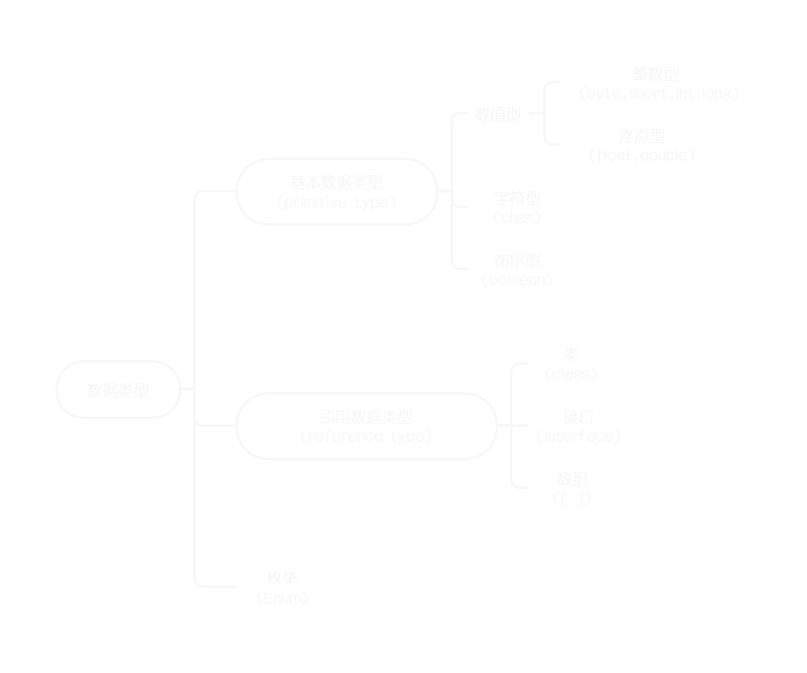
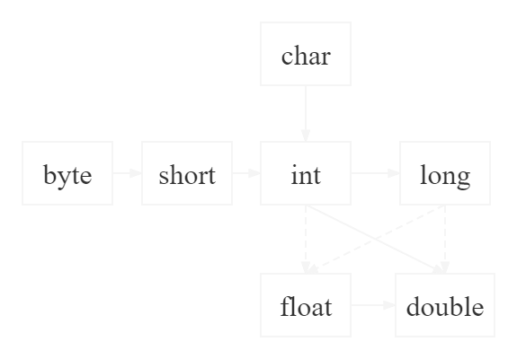
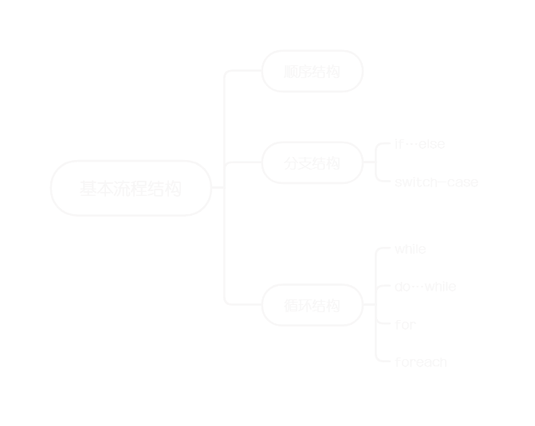

# 第一部分 Java基础语法

## 1.1 一些Java的名词的概念

###  1.1.1 标识符

​		标识符(Identifier)指Java对各种变量、方法和类等要素命名时使用的字符序列，可以说，凡是可以起名的都叫标识符。

####   1.1.1.1 定义标识符规则

​			由字母、数字、_或$组成。

​			不可以用数字开头。

​			不可以用关键字和保留字，但可以包含。

​			Java中严格区分大小写，长度无限制。

​			不能含空格。

####   1.1.1.2 Java中的名称命名规范

​			包名：xxxyyyzzz

​			类、接口名：XxxYyyZzz

​			变量、方法名：xxxYyyZzz

​			常量名：XXX_YYY_ZZZ

###  1.1.2  关键字

​		关键字(keyword)指被Java语言赋予了特殊含义，用做专门用途的字符串（单词），其所有字母都为小写。

###  1.1.3 保留字

​		保留字(reserved word)指现有Java版本尚未使用，但以后版本可能会作为关键字使用，故命名标识符时要避免使用这些保留字。

## 1.2 注释

​	.class文件中不会包含注释。

​	Java中的注释分为三种：

###  1.2.1 单行注释

​		语法：

```
// 注释内容
```

###  1.2.2 多行注释

​		语法：

```
/*
注释
内容
*/
```

###  1.2.3 文档注释

​		语法：

```
/**
注释
内容
*/
```

​	文档注释的内容可以被JDK的工具Javadoc解析，生成一套以网页文件形式体现的该程序的说明文档。

## 1.3 变量

### 1.3.1 声明变量

​		语法：

```
数据类型 变量名称;
```

​		示例：

```java
int var;
```

###  1.3.2 变量的赋值

​		语法：

```
变量名 = 初始化值;
```

###   1.3.3 变量的声明和赋值

​		语法：

```
数据类型 变量名 = 初始化值;
```

###   1.3.4 使用变量注意

​		Java中每个变量必须先声明，再赋值，后使用。

​		使用变量名来访问这块区域的数据。

​		变量的作用域：其定义所在的一对{ }内。

​		变量只有在其作用域内才有效。

###  1.3.5 常量

| 常量类型   | 说明                 |
| ---------- | -------------------- |
| 字符串常量 | 用双引号括起来的内容 |
| 整数常量   |                      |
| 小数常量   |                      |
| 字符常量   | 用单引号括起来的内容 |
| 布尔常量   |                      |
| 空常量     | 一个特殊的值，空值   |


## 1.4 数据类型



​	Java是强类型语言，对于每一种数据都定义了明确的具体数据类型，在内存中分配了不同大小的内存空间。

###   1.4.1 整数类型：byte、short、int、long

​		计算机存储设备的最小信息单元叫“位 （bit）”，又叫“比特位”，通常用小写的字母”b”表示。而计算机中最基本的存储单元叫“字节（byte）”，通常用大写字母”B”表示，字节是由连续的8个位组成。

​		Java各整数类型有固定的表数范围和字段长度。

| 类型  | 占用内存（字节） | 表数范围                                                     |
| ----- | ---------------- | ------------------------------------------------------------ |
| byte  | 1（=8bit）       | -128 ~ 127                                                   |
| short | 2                | -2^15^~2^15^-1                                               |
| int   | 4                | -2^31^ ~ 2^31^-1 (约21亿)<br />-2147483648~2147483647（10位数） |
| long  | 8                | -2^63^ ~ 2^63^-1<br />-9223372036854775808~9223372036854775807（19位数） |

​		整型常量默认为 int 型。

​		声明long型常量须后加‘l’或‘L’。若不加，但数不超过int的范围则不会报错，若超过则会。

​		示例：

```java
long a = 10000000L;
```

​		变量通常声明为int型。

###  1.4.2 浮点类型：float、double

​		浮点类型也有固定的表数范围和字段长度。

| 类型         | 占用内存（字节） | 表数范围                                                 |
| ------------ | ---------------- | -------------------------------------------------------- |
| 单精度float  | 4                | -3.403×10^38^~ 3.403×10^38^（尾数可以精确到7位有效数字） |
| 双精度double | 8                | -1.798×10^308^ ~ 1.798×10^308^ （精度是float的两倍）     |

​		浮点型常量默认为double型。

​		声明float型常量，须后加‘f’或‘F’，若不加，浮点数字默认为 double 类型。

​		浮点型常量有两种表示形式：

####   1.4.2.1 十进制数形式

​			示例：

```java
double d = 5.12;
double d1 = .512;
```

​			输出：

```
5.12
0.512
```

####   1.4.2.2 科学计数法形式

​			示例：

```java
double d2 = 5.12e3;       // e也可以用大写E
double d3= 100E-2;
```

​			输出：

```
5120.0
1.0
```

###  1.4.3 字符类型：char

​		char型数据用来表示通常意义上“字符”(2字节)

​		Java中的所有字符都使用Unicode编码，故一个字符可以存储一个字母，一个汉字，或其他书面语的一个字符。

​		char类型可以进行运算，因为它都对应有Unicode码。

​		字符型变量的三种表现形式：

​			·字符常量是用单引号(' ')括起来的单个字符。

​				示例：

```java
char c1 = '中'; 
char c2 = '9';
```

​			·Java中还允许用转义字符‘\’来将其后的字符转变为特殊字符型常量。

| 转义字符 | 说明   |
| -------- | ------ |
| \b       | 退格符 |
| \n       | 换行符 |
| \r       | 回车符 |
| \t       | 制表符 |
| \\"      | 双引号 |
| \\'      | 单引号 |
| \\\      | 反斜线 |

​				示例：

```java
char c3 = '\n'; 
```

​			·直接使用Unicode值'\uXXXX'来表示字符型常量，其中，XXXX代表一个十六进制整数。

​				示例：

```java
char c3 = '\u000a';    // \u000a表示\n。
```

###  1.4.4 布尔类型：boolean

​		boolean类型用来判断逻辑条件，一般用于流程控制。

​			示例：

```java
boolean b1 = true;    // 声明一个布尔型变量
```

​		boolean类型数据只允许取值true和false，无null。 不可以使用0或非0的整数替代false和true，这点和C语言不同。

​		JVM中没有任何供boolean值专用的字节码指令，Java语言表达所操作的boolean值，在编译后都用JVM中的int数据类型来代替：true用1表示，false用0。

###  1.4.5 字符串类型：String

​		String属于引用数据类型，不是基本数据类型，但使用方式与基本数据类型一致。

​		声明String类型变量时，使用一对""。

​		一个字符串可以串接另一个字符串，也可以直接串接其他类型的数据。

​			示例：

```java
String str = "a";
str = str + "b";
int n = 10;
str = str + n;
```

​			输出：

```
ab10
```

​		String可以和8种基本数据类型变量做运算，且运算只能是连接运算（+），结果仍然是String类型。

​			示例：

```java
int number = 1001;
String numberStr = "学号：";
String info = numberStr + number;
System.out.println(info);
```

​			输出：

```
学号：1001
```

​		注意区分+表示的是连接运算还是加号。

​			示例：

```java
char c = 'a';        // a的ASCII是97
int num = 10;
String str = " hello ";

System.out.println(c + num + str);
// 表示加号和连接运算
System.out.println(c + str + num);
// 表示连接运算
System.out.println(c + (num + str));
// 表示连接运算
System.out.println(str + num + c);
// 表示连接运算
```

​			输出：

```
107 hello 
a hello 10
a10 hello 
 hello 10a
```

​			示例：

```Java
System.out.println('*' + '\t' + '*');
// 第一个字符对应ASCII，故第一个+是加号
System.out.println('*' + "\t" + '*');
// "\t"表示String字符串，故+表示连接运算
System.out.println('*' + '\t' + "*");
// 第一个字符对应ASCII，故第一个+是加号。
// 第三个字符表示String字符串，故第二个+是连接运算
System.out.println('*' + ('\t' + "*"));
```

​			输出：

```
93
*	*
51*
*	*
```

###  1.4.6 类型转换

​		使用两个不同类型的数值进行二元操作时，要先将两个操作数转换为同一种类型。

####   1.4.6.1 自动类型转换

​			若两个操作数中有一个是double类型，另一个就会转换为double类型。

​			否则，若其中一个操作数是float类型，另一个将会转换为float类型。

​			否则，若其中一个操作数是long类型，另一个将会转换为long类型。

​			否则，两个操作数都将被转换为int类型。

​			byte、short、char型数据做运算后，结果是int型数据，此时进行了自动类型转换，即容量小的类型自动转换为容量大的数据类型。



​				数值类型之间的合法转换

​				其中，实线箭头，表示无信息丢失的转换；

​				虚线箭头， 表示可能有精度损失的转换。

####   1.4.6.2 强制类型转换

​			强制类型转换，即自动类型转换的逆过程，指将容量大的数据类型转换为容量小的数据类型，当然， 有可能造成精度降低或溢出而丢失一些信息。

​			通常，字符串不能直接转换为基本类型，但通过基本类型对应的包装类则可以实现把字符串转换成基本类型，使用时要加上强制转换符：()。

​			boolean类型不可以转换为其它的数据类型。

​				示例：

```Java
String a = "43"; 
int i = Integer.parseInt(a);
```

​				示例：

```Java
double d1 = 12.3;
int i1 = (int)d1;     // 截断操作
System.out.println(i1)
```

​				输出：

```
12
```

## 1.5 算术运算符

​	+-*/%运算同C语言。

###  1.5.1 自增自减

​		自增自减不会改变自身的数据类型。

| 运算符 | 运算                     | 示例（a=2） | 输出     |
| ------ | ------------------------ | ----------- | -------- |
| ++     | 自增（前）：先运算后取值 | b=++a;      | a=3  b=3 |
| ++     | 自增（后）：先取值后运算 | b=a++;      | a=3  b=2 |
| - -    | 自减（前）：先运算后取值 | b=--a       | a=1  b=1 |
| - -    | 自减（后）：先取值后运算 | b=a--       | a=1  b=2 |

​			示例：

```java
short s1 = 10;

s1 = (short)(s1 + 1);
// 若不强制类型转化则会报错
System.out.println(s1);

s1++;
System.out.println(s1);
```

​			输出：

```
11
12
```

###  1.5.2 小数和求模运算注意事项

​		（此处有疑问，回去看网课）示例：

```java
int n1 = 12;
int n2 = 5;

double r1 = n1/n2;
double r2 = n1/n2 + 0.0;    // 先除后加
double r3 = n1/(n2 + 0.0);
double r4 = (double)n1/n2;

System.out.println(r1);
System.out.println(r2);
System.out.println(r3);
System.out.println(r4);
```

​		输出：

```
2.0
2.0
2.4
2.4
```

​		进行求模运算时，结果的符号与被模数的符号相同。

​			示例：

```java
int m1 = -12;     // 被模数
int n1 = 5;
System.out.println("-12 % 5 = " + m1 % m1);

int m2 = 12;     // 被模数
int n2 = -5;
System.out.println("5 % -12 = " + m2 % m2);
```

​			输出：

```
-12 % 5 = -2
5 % -12 = 2
```

###  1.5.3 运算符

####    1.5.3.1 赋值运算符

​			符号：= 

​			当“=”两侧数据类型不一致时，可以使用自动类型转换或强制类型转换原则进行处理。

​			支持连续赋值。

​			扩展赋值运算符： +=, -=, *=, /=, %=

​			用拓展赋值运算符计算不会改变变量的数据类型。

​				示例：

```java
short s1 = 2;
// 相当于s1 = s1 + 2，其他符号类似
s1+=2
// 这个无法编译，因为s1的数据类型会改变
s1 = s1+2 
```

####   1.5.3.2 比较运算符（关系运算符）

​			==、!=、<、>、<=、>=的用法同C语言。

​			比较运算符的结果是boolean类型

####   1.5.3.3 逻辑运算符

|          | a      | T     | T     | F     | F     |
| -------- | ------ | ----- | ----- | ----- | ----- |
|          | **b**  | **T** | **F** | **T** | **F** |
| 逻辑与   | a&b    | T     | F     | F     | F     |
| 短路与   | a&&b   | T     | F     | F     | F     |
| 逻辑或   | a\|b   | T     | T     | T     | F     |
| 短路或   | a\|\|b | T     | T     | T     | F     |
| 逻辑非   | !a     | F     | F     | T     | T     |
| 逻辑异或 | a^b    | F     | T     | T     | F     |

​			&与&&的不同点：当符号左边是false时，&会继续执行符号右边的运算，&&则不会。

​			| 与 || 的不同点：当符号左边是true时，|会继续执行符号右边的运算，||则不会。

####   1.5.3.4 位运算符（先跳过这个的整理）

| 运算符 | 运算       |
| ------ | ---------- |
| <<     | 左移       |
| >>     | 右移       |
| >>>    | 无符号右移 |
| &      | 与运算     |
| \|     | 或运算     |
| ^      | 异或运算   |
| ~      | 取反运算   |

​			位运算符操作的都是整型的数据

​			<<：在一定范围内，每向左移1位，相当于 * 2。

​			\>>：在一定范围内，每向右移1位，相当于 / 2。

​				二进制示例：

| 0001 | 0101 |      | 21    |
| ---- | ---- | ---- | ----- |
| 0101 | 0100 |      | 21<<2 |
| 0000 | 0101 |      | 21>>2 |

​				代码示例：

```java
int i = 21;
System.out.println("i << 2 :" + (i << 2));
// 结果相当于21×2的平方
System.out.println("i << 3 :" + (i << 3));
// 结果相当于21×2的3次平方
System.out.println("i >> 2 :" + (i >> 2));
// 结果相当于21÷2的平方
```

​				输出：

```
i << 2 :84
i << 3 :168
i >> 2 :5
```

####   1.5.3.5 三元运算符

​			语法：

```
(条件表达式)?表达式1:表达式2;
```

​			若条件表达式为true，运算后的结果是表达式1；

​			为false，运算后的结果是表达式2；

​				示例：

```java
int m = 12;
int n = 12;
String maxStr = (m > n)? "m大" : ((m == n)? "m和n相等" : "n大");
System.out.println(maxStr);
```

​				输出：

```
m和n相等
```

​			若既可使用三元运算符，又可使用if-else结构，那么优先选前者，因为它简洁、执行效率高。

## 1.6 程序流程控制



​	流程控制语句是用来控制程序中各语句执行顺序的语句，可以把语句组合成能完成一定功能的小逻辑模块。

​	其流程控制方式采用结构化程序设计中规定的三种基本流程结构，即：顺序结构、分支结构、循环结构。

​	循环语句由初始化部分(init_statement)、循环条件部分(test_exp)、循环体部分(body_statement)、迭代部分(alter_statement)的四个组成部分。

###  1.6.1 块作用域

​		块（block），即复合语句，指由一对大括号括起来的若干条简单的 Java 语句。块确定了变量的作用域。一个块可以嵌套在另一个块中。

​			示例：

```java
public static void main(String[] args){
   int n;
   …
   {
      int k;   // k只定义到这里
      …
      }
}
```

​		但是，不能在嵌套的两个块中声明同名的变量，否则无法通过编译。

​			示例：

```java
public static void main(String[] args){
   int n;
   …
   {
      int k;
      int n;   // 不能在内部块中重新定义n
      …
      }
}
```

### 1.6.2 分支结构

###   1.6.2.1 if-else结构

​			语法：

```java
if(条件表达式){
   代码块;
} else {
   代码块;
}
```

```java
if(条件表达式1){
   代码块;
}else if (条件表达式2){
   代码块;
} ……
} else {
   代码块;
}
```

​			当多个条件是“互斥”关系时，条件判断语句及执行语句间顺序无所谓。

​			当多个条件是“包含”关系时，上小下大、上子下父。

​			else是可选的。在嵌套循环中，else遵循就近原则，与最近的if配对。

###   1.6.2.2 switch-case结构

​			语法：

```java
switch(表达式){
case 常量:
   语句;
   break;
case 常量:
   语句;
   break;
……
case 常量:
   语句;
   break;
default:           // default结构是可选的。
   语句;
   break;
}
```

​			switch结构中的表达式，只能是byte、short、char、int、String类型、枚举类型6种数据类型之一。

​				示例：

```java
String season = "summer";
switch (season) {
case "spring":
	System.out.println("春");
	break;
case "summer":
	System.out.println("夏");
	break;
case "autumn":
	System.out.println("秋");
	break;
case "winter":
	System.out.println("冬");
	break;
default:
	System.out.println("季节输入有误");
	break;
}
```

​				输出：

```
夏
```

###  1.6.3 循环结构

####   1.6.3.1 for循环

​			语法：

```java
for(初始化部分;循环条件;迭代部分){
   循环体;
}
```

​			迭代部分可以由多个语句构成。

​				示例：

```java
// System.out.print('c'),num++是迭代部分。
for(System.out.print('a');num <= 3;System.out.print('c'),num++){
	System.out.print('b');
}
```

​				输出：

```
abcbcbc
```

​				示例：

```java
// 变量i只在for循环内有效。
for(int i = 1;i < 3;i++){
	System.out.println("Hello World!");
}
```

​				输出：

```
Hello World!
Hello World!
```

​				题目：输入两个正整数m和n，求其最大公约数和最小公倍数。

​				比如：12和20的最大公约数是4，最小公倍数是60。

```java
import java.util.Scanner;
class ForTest{
   public static void main(String[] args){
      Scanner scan = new Scanner(System.in);
      System.out.println("第一个正整数：");
      int m = scan.nextInt();
      System.out.println("第二个正整数：");
      int n = scan.nextInt();

      // 获取最大公约数
      // 获取两个数中的较小值
      int min = (m <= n)? m : n;
      for(int i = min;i >= 1 ;i--){
         if(m % i == 0 && n % i == 0){
            System.out.println("最大公约数为：" + i);
            break;
         }
      }

      // 获取最小公倍数
      // 获取两个数中的较大值
      int max = (m >= n)? m : n;
      for(int i = max;i <= m * n;i++){
         if(i % m == 0 && i % n == 0){
            System.out.println("最小公倍数为：" + i);
            break;
         }
      }

   }
}
```

####   1.6.3.2 while循环

​			语法：

```java
①初始化部分
while(②循环条件){
	③循环体; 
	④迭代部分;
}
```

​			注意不要忘记声明④迭代部分，不然循环将变成死循环，无法结束。

​				示例：

```java
int result = 0;
int i = 1;
while (i <= 100) {
   result += i;
   i++;
}
```

####   1.6.3.3 do-while循环

​			语法：

```java
①初始化部分;
do{
   ③循环体
   ④迭代部分
}while(②循环条件);
```

​			do-while循环至少执行一次循环体。

​			while()的括号内可以只写一个true，让这个循环无限循环下去。

###  1.6.4 使用break和continue中断控制流程语句

|           | 使用范围              | 循环中使用的作用(不同点) |
| --------- | --------------------- | ------------------------ |
| break;    | switch-case循环结构中 | 结束当前循环             |
| continue; | 循环结构中            | 结束当次循环             |

​		在嵌套循环中，break默认跳出包裹此关键字最近的一层循环。

​		若要在嵌套循环中结束指定的一层循环，可以在要跳出的循环前加标签。

​			break指定结束示例：

```java
label:for(int i = 1;i <= 4;i++){
	for(int j = 1;j <= 10;j++){	
		if(j % 4 == 0){
			break label;
		}
		System.out.print(j);
	}
	System.out.println();
}
```

​			输出：

```
123
```

​			continue指定结束示例：

```java
label:for(int i = 1;i <= 4;i++){
	for(int j = 1;j <= 10;j++){	
		if(j % 4 == 0){
			continue label;
		}
		System.out.print(j);
	}
	System.out.println();
}
```

​			输出：

```
123123123123
```

## 1.7 输入输出

​	使用Scanner类从键盘获取不同类型的变量

​	实现步骤：

​	1.导包：import java.util.Scanner;

​	2.Scanner的实例化

​	3.调用Scanner类的相关方法

​		示例：

```java
import java.util.Scanner;                        // 1.导包：import java.util.Scanner;

class ScannerTest{
   public static void main(String[] args){
      Scanner scan = new Scanner(System.in);      // 2.Scanner的实例化
		
      System.out.println("请输入你的姓名：");
      String name = scan.next();                  // 3.调用Scanner类的相关方法
      System.out.println(name);

      System.out.println("请输入你的芳龄：");
      int age = scan.nextInt();
      System.out.println(age);

      // 对于char型的获取，Scanner没有提供相关的方法，只能获取一个字符。
      System.out.println("请输入你的性别(男/女)：");
      String gender = scan.next();              // "男"

      char genderChar = gender.charAt(0);       // 获取索引为0位置上的字符
      System.out.println(genderChar);
   }
}
```

​		输出：

```
请输入你的姓名：Tloitboair
Tloitboair
请输入你的芳龄：18
18
请输入你的性别(男/女)：男
男
```

## 1.8 数组

数组(Array)，是多个相同类型数据（即元素）按一定顺序排列的集合，并使用一个名字命名（即数组名），并通过编号（即索引、下标）的方式对这些数据进行统一管理。

数组本身属于引用数据类型的变量，而数组中的元素可以是任何数据类型，包括基本数据类型和引用数据类型。

创建数组对象会在内存中开辟一整块连续的空间，而数组名中引用的是这块连续空间的首地址。

数组是有序排列的，其长度一旦确定，就不能修改。

数组的分类：

1. 按维度：一维数组、…、多维数组

2. 按元素数据类型分：①基本数据类型元素的数组；②引用数据类型元素的数组（即对象数组）

### 1.8.1 一维数组

#### 1.8.1.1 一维数组的声明和初始化

静态初始化：数组的初始化和数组元素的赋值操作同时进行。

语法：

```java
数据类型[] 数组名;       // 声明数组的类型，其中[]永远是空的
数组名 = new 数据类型[]{元素,元素,……};
```

动态初始化：数组的初始化和数组元素的赋值操作分开进行。

语法：

```java
数据类型[] 数组名;       // 声明数组的类型，其中[]永远是空的
数组名 = new 数据类型[长度];
```

#### 1.8.1.2 调用数组的指定位置的元素

数组的索引从0开始的，到数组的长度-1结束。（只要不和数据库相关都是从0开始）

语法：

```java
数组名[索引] = "元素";
```

#### 1.8.1.3 获取数组的长度

语法：

```java
数组名.length
```

#### 1.8.1.4 使用for循环遍历数组

语法：

```java
for(int i = 0;i < 数组名.length;i++){
	  System.out.println(数组名[i]);
}
```

#### 1.8.1.5 数组元素的默认初始化值

| 数据类型               | 初始值               |
| ---------------------- | -------------------- |
| 整数型                 | 0                    |
| 浮点型                 | 0.0                  |
| char型                 | 0或'\u0000'，而非'0' |
| boolean型              | false                |
| 引用数据类型（String） | null                 |

### 1.8.2 多维数组

#### 1.8.2.1 二维数组（也称为矩阵）的初始化

对于二维数组的理解，可以看成是一维数组array1又作为另一个一维数组array2的元素而存在。从数组底层的运行机制来看，其实没有多维数组。

##### 1.8.2.1.1 静态初始化

语法：

```java
数据类型[][] 数组名 = {
   {元素,元素,……},
   {元素,元素,……},
   ……
}
```

```java
数据类型[][] 数组名 = new int[][]{
   {元素,元素,……},
   {元素,元素,……},
   ……
}
```

所有[]一定是空的，

示例：

```java
int arr1[][] = {
    {1,2,3},
    {4,5,6},
    {7,8,9},
};
for (int i = 0; i < arr1.length; i++) {
    for (int j = 0; j < arr1[i].length; j++) {
        System.out.print(arr1[i][j]);
    }
    System.out.print("\n");
}
```

输出：

```
123
456
789
```

##### 1.8.2.1.2 动态初始化

语法：

```java
数据类型[][] 数组名 = new 数据类型[i][j];
```

数组长度i不可省略，j可省略。

所有初始化语句=前面的\[]\[]也可以放在数组名后面，也可以一个放数据类型后面，一个放数组名后面。

示例：

```java
int[][] arr1 = new int[3][4];

for (int i = 0; i < arr1.length; i++) {
    for (int j = 0; j < arr1[i].length; j++) {
        System.out.print(arr1[i][j]);
    }
    System.out.print("\n");
}
```

输出：

```
0000
0000
0000
```

#### 1.8.2.2 调用二维数组的指定位置的元素

​			数组的索引从0开始的，到数组的长度-1结束。

​			语法：

```
数组名[i][j]
```

​				示例：

```java
System.out.print(arr1[0][1]);
```

#### 1.8.2.3 获取数组的长度

语法：

```java
数组名[i].length
```

[i]可以被省略。

#### 1.8.2.4 使用for循环遍历二维数组

语法：

```java
for(int i = 0;i < 数组名[i].length;i++){
	  System.out.println(数组名[i]);
}
```

#### 1.8.2.5 数组元素的默认初始化值

二维数组分为外层数组的元素，内层数组的元素。

示例：

```java
int[][] arr = new int[4][3];
// 外层元素：
arr[0],arr[1]等
// 内层元素
arr[0][0],arr[1][2]等
```

##### 1.8.2.5.1 初始化方式一

示例：

```
int[][] arr = new int[4][3];
```

外层元素的初始化值为：地址值

内层元素的初始化值为：与一维数组初始化情况相同。

示例：

```java
int[][] arr = new int[4][3];
// 输出的是外层元素的地址值
System.out.println(arr[0]);
System.out.println(arr[0][0]);
```

输出：

```
[I@15db9742
0
```

##### 1.8.2.5.2 初始化方式二

示例：

```java
int[][] arr = new int[4][];
```

外层元素的初始化值为：null

内层元素的初始化值为：不能调用，否则报错。

