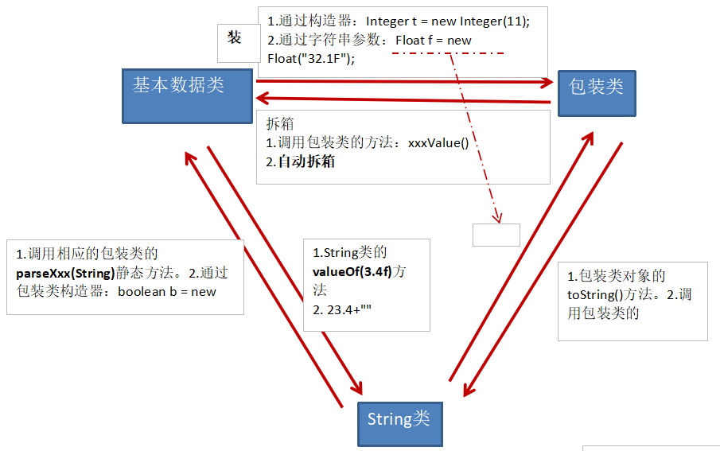

# 第二部分 面向对象编程

## 2.1  面向对象程序设计概述

​		Java 是完全面向对象的，面向对象程序设计（简称OOP）是当今主流的程序设计范型。

​		面向对象的三大特征：封装、继承、多态

### 2.1.1 类

​		类(Class)是对一类事物的描述，是抽象的、概念上的定义。由类构造(construct)对象的过程称为创建类的实例(instance)（也可以叫创建类的对象、类的实例化或实例化类）。

​		封装(encapsulation)，有时称为数据隐藏，就是将数据和行为组合在一个包中，并对对象的使用者隐藏了数据的实现方式。

​		对象中的数据称为实例域(instancefield)，操纵数据的过程称为方法(method)。对于每个特定的类实例（对象）都有一组特定的实例域值。这些值的集合就是这个对象的当前状态(state)。

​		实现封装的关键在于绝不能让类中的方法直接地访问其他类的实例域。程序仅通过对象的方法与对象数据进行交互。封装给对象赋予了“黑盒”特征，这是提高重用性和可靠性的关键。这意味着一个类可以全面地改变存储数据的方式，只要仍旧使用同样的方法操作数据，其他对象就不会知道或介意所发生的变化。

​		通过扩展一个类来建立另外一个类的过程称为继承(inheritance)。在扩展一个已有的类时，这个扩展后的新类具有所扩展的类的全部属性和方法。在新类中，只需提供适用于该新类的新方法和数据域即可。

### 2.1.2 对象

​		对象(Object)是实际存在的该类事物的每个个体，因而也称为实例(instance)。

​		对象的三个主要特性：

​		对象的行为(behavior)—可以对对象施加哪些操作，或可以对对象施加哪些方法？ 

​		对象的状态(state)—当施加那些方法时，对象如何响应？ 

​		对象标识(identity)—如何辨别具有相同行为与状态的不同对象？

​		创建Java自定义类步骤：

#### 2.1.2.1 定义类（考虑修饰符、类名）

​		语法：

```java
修饰符 class 类名 {
	属性声明;
	方法声明; 
}
```

​		说明：修饰符为public的类可以被任意访问

#### 2.1.2.2 创建类的对象

​		语法：

```java
类名 对象名 = new 类名();
```

#### 2.1.2.3 编写类的属性（考虑修饰符、属性类型、属性名、初始化值）

​		语法：

```
属性.方法
```

#### 2.1.2.4 编写类的方法（考虑修饰符、返回值类型、方法名、形参等）

​		语法：

```
对象.属性
```

#### 2.1.2.5 示例

​		示例：

```java
public class PersonTest {
	public static void main(String[] args) {
		// 创建Person类的对象
		Person p1 = new Person();
		
		// 调用对象的结构：属性、方法
		// 调用属性
		p1.name = "中国人";
		p1.isMale = true;
		System.out.println(p1.name);
		// 调用方法
		p1.eat();
		p1.talk("中文");
        
		//————————————————————————————————
		Person p2 = new Person();
		System.out.println(p2.name);//null
		System.out.println(p2.isMale);

		//————————————————————————————————
		// 将p1变量保存的对象地址值赋给p3,导致p1和p3指向了堆空间中的同一个对象实体。
		Person p3 = p1;
		System.out.println(p3.name);//Tom
		p3.age = 10;
		System.out.println(p1.age);// 10
	}
}

// 创建类，设计类的成员
class Person{
	// 属性
	String name;
	int age = 1;
	boolean isMale;
	
	// 方法
	public void eat(){
		System.out.println("人会吃饭");
	}
	public void talk(String language){
		System.out.println("人使用的语言是" + language);
	}
}
```

​		如果创建了一个类的多个对象，则每个对象都独立的拥有一套类的属性（非static的）。意味着，如果我们修改一个对象的属性a，不影响另外一个对象属性a的值。如上例中的p2。

​			示例：

```java
public class Zoo{
  public static void main(String args[]){
    //创建对象
    Animal xb=new Animal();
    xb.legs=4;               //访问属性
    System.out.println(xb.legs);
    xb.eat();                 //访问方法
    xb.move();               //访问方法
  }
}
```

​		访问对象成员

​		语法：

```
对象名.对象成员
```

​			示例：

```java
public class Zoo{
  public static void main(String args[]){
    //创建对象
    Animal xb=new Animal();
    xb.legs=4;               //访问属性
    System.out.println(xb.legs);
    xb.eat();                 //访问方法
    xb.move();               //访问方法
  }
}
```

#### 2.1.2.6 匿名对象

​		所创建的对象，没有显式的赋给一个变量名，即为匿名对象，匿名对象只能调用一次。

​		语法：

```java
new 类名()
```

​		示例：

```java
public class InstanceTest {
  public static void main(String[] args) {
    new Phone().price = 1999;
    new Phone().showPrice();
  }
}

class Phone{
  double price;

  public void showPrice(){
    System.out.println("手机价格为：" + price);
  }
}
```

​		输出：

```
手机价格为：0.0
```

### 2.1.3 类之间的关系

​		依赖（dependence）,即uses-a关系。一个类的方法操纵另一个类的对象，就说一个类依赖于另一个类。

​		例如，Order类使用Account类是因为Order对象需要访问Account对象查看信用状态。但是Item类不依赖于Account类，这是因为Item对象与客户账户无关。

​		应该尽可能地将相互依赖的类减至最少。

​		如果类A不知道B的存在，它就不会关心B的任何改变（这意味着B的改变不会导致A产生任何bug）。用软件工程的术语来说，就是让类之间的耦合度最小。

​		聚合（aggregation）,即has-a关系。

​		例如，一个Order对象包含一些Item对象。聚合关系意味着类A的对象包含类B的对象。

​		继承（inheritance）,即is-a关系，是一种用于表示特殊与一般关系的。

​		例如，RushOrder类由Order类继承而来。在具有特殊性的RushOrder类中包含了一些用于优先处理的特殊方法，以及一个计算运费的不同方法；而其他的方法，如添加商品、生成账单等都是从Order类继承来的。一般而言，如果类A扩展类B,类A不但包含从类B继承的方法，还会拥有一些额外的功能（下一章将详细讨论继承，其中会用较多的篇幅讲述这个重要的概念）。

## 2.2  属性(field)

​		又叫成员变量、域、字段。

​		语法：

```
修饰符 数据类型 属性名 = 初始化值;
```

​			常用的权限修饰符有：private、缺省、protected、public，默认为缺省

​			其他修饰符：static、final (暂不考虑) 

​			示例：

```java
public class Person{
	// 声明private变量 age
	private int age;
	// 声明public变量name
	public String name = "Lila"; 
}
```

​		属性的初始化值同数组的初始化值。

### 2.2.1 属性和局部变量对比

​		1.相同点

​			定义变量的格式：数据类型  变量名 = 变量值

​			先声明，后使用

​			变量都有其对应的作用域

​		2.不同点：

​			在类中声明的位置的不同

​				属性：直接定义在类的一对{}内

​				局部变量：声明在方法内、方法形参、代码块内、构造器形参、构造器内部的变量

​			关于权限修饰符的不同

​				属性：可以在声明属性时，指明其权限，使用权限修饰符。

​				局部变量：不可以使用权限修饰符。

​			默认初始化值的情况：

​				属性：类的属性，根据其类型，都有默认初始化值。

​				局部变量：没有默认初始化值。

​				意味着，我们在调用局部变量之前，一定要显式赋值。

​				特别地：形参在调用时，我们赋值即可。

​			在内存中加载的位置：

​				属性：加载到堆空间中（非static）

​				局部变量：加载到栈空间

## 2.3 方法(method)

​		又叫行为、函数、成员方法、过程。

​		声明语法：

```java
权限修饰符 返回值类型 方法名(参数类型 形参1,参数类型 形参2,…)｛
	方法体
    return 返回值;
｝
```

​		若方法有返回值，则必须在方法声明时，指定返回值的类型。同时，方法中，需要使用return关键字来返回指定类型的变量或常量：“return 数据”。

​		若方法没有返回值，则方法声明时，使用void来表示。通常，没有返回值的方法中，就不需要使用return.但是，如果使用的话，只能“return;”表示结束此方法的意思。

​		分类：

|            | 无返回值                | 有返回值                        |
| ---------- | ----------------------- | ------------------------------- |
| **无形参** | void 方法名(){}         | 返回值的类型 方法名(){}         |
| **有形参** | void 方法名(形参列表){} | 返回值的类型 方法名(形参列表){} |

​		在方法的使用中，可以调用当前类的属性或方法

​		特殊的：方法A中又调用了方法A，叫递归方法。

### 2.3.1 重载

​		在同一个类中，允许存在一个以上的同名方法，只要它们的参数个数或者参数类型不同即可。

​		特点：与权限修饰符、返回值类型、形参变量名、方法体无关，只看参数列表，且参数列表(参数的个数、类型、顺序)必须不同。调用时，根据方法参数列表的不同来区别。

​		示例：

```java
public void getSum(int i,int j){
	System.out.println("1");
}
public void getSum(double d1,double d2){
	System.out.println("2");
}
```

### 2.3.2 可变个数的形参

​		Varargs(variable number of arguments)机制允许直接定义能和多个实参相匹配的形参。从而，可以用一种更简单的方式，来传递个数可变的实参。可变个数形参在方法的形参中，必须声明在末尾，且最多只能声明一个可变形参。

​		可变个数形参的方法与本类中方法名相同，形参不同的方法之间构成重载

​		可变个数形参的方法与本类中方法名相同，形参类型也相同的数组之间不构成重载。换句话说，二者不能共存。

​		可变个数形参在方法的形参中，必须声明在末尾。

​		可变个数形参在方法的形参中，最多只能声明一个可变形参。

​			语法：

```java
方法名(数据类型 ... 参数名){}
```

​			或

```
方法名(数据类型[] 参数名){}
```

​		注意，二者不共存，使用后者形式并调用其方法时需new一个对象，前者则可以不用（new了也可以运行），一般用前者。并且，所传递的参数都必须是所指定的数据类型。

​				第一种方式示例：

```java
public class MethodArgsTest {
  public static void main(String[] args) {
    MethodArgsTest test = new MethodArgsTest();
    test.show("A");
    //调用show(String ... strs)
    test.show("A","B","C");
  }

  public void show(String s){
	System.out.println("1");
  }
  public void show(String ... strs){
    System.out.println("2");
  }
}
```

​				输出：

```
1
2
```

​				第二种方式示例：

```java
public class javatest4 {
  public static void main(String[] args) {
    javatest4 test = new javatest4();
    test.show(new String[]{"D","E","F"});
  }

  public void show(String[] strs){
    System.out.println("2");
  }
}
```

​				输出：

```
2
```

### 2.3.3 方法参数的值传递机制★

​			如果变量是基本数据类型，此时赋值的是变量所保存的数据值。

​			如果变量是引用数据类型，此时赋值的是变量所保存的数据的地址值。

​			示例：

```java
public class javatest {
	public static void main(String[] args) {
    	Order o1 = new Order();
		o1.orderId = 1001;
		Order o2 = o1;
        
		//赋值以后，o1和o2的地址值相同，都指向了堆空间中同一个对象实体。
		System.out.println("o1.orderId = " + o1.orderId + ",o2.orderId = " +o2.orderId);
		o2.orderId = 1002;
		System.out.println("o1.orderId = " + o1.orderId + ",o2.orderId = " +o2.orderId);
	}
}

class Order{
	int orderId;
}
```

​			输出：

```
o1.orderId = 1001,o2.orderId = 1001
o1.orderId = 1002,o2.orderId = 1002
```

### 2.3.4 方法形参的传递机制——值传递

​		如果参数是基本数据类型，此时实参赋给形参的是实参真实存储的数据值。

​		如果参数是引用数据类型，此时实参赋给形参的是实参存储数据的地址值。

### 2.3.5  递归方法

​		一个方法体内调用它自身。

​		方法递归包含了一种隐式的循环，它会重复执行某段代码，但这种重复执行无须循环控制。

​		递归一定要向已知方向递归，否则这种递归就变成了无穷递归，类似于死循环。

## 2.4 封装

​		我们程序设计追求“高内聚，低耦合”。

​		高内聚 ：类的内部数据操作细节自己完成，不允许外部干涉；

​		低耦合 ：仅对外暴露少量的方法用于使用。

### 2.4.1 封装性

​		隐藏对象内部的复杂性，只对外公开简单的接口。便于外界调用，从而提高系统的可扩展性、可维护性。

​		封装性的体现：

​		当我们创建一个类的对象以后，我们可以通过"对象.属性"的方式，对对象的属性进行赋值。这里，赋值操作要受到属性的数据类型和存储范围的制约。除此之外，没有其他制约条件。但是，在实际问题中，我们往往需要给属性赋值加入额外的限制条件。这个条件就不能在属性声明时体现，我们只能通过方法进行限制条件的添加（比如：setLegs()）。同时，我们需要避免用户再使用"对象.属性"的方式对属性进行赋值。则需要将属性声明为私有的(private)，此时，针对于属性就体现了封装性。

​		我们将类的属性xxx私有化(private)，同时，提供公共的(public)方法来获取(getXxx)和设置(setXxx)此属性的值

### 2.4.2 对成员属性进行封装

​		Java中的权限（从小到大）：private、缺省（default）、protected、public

| 修饰符    | 类内部 | 同一个包 | 不同包的子类 | 同一个工程 |
| --------- | ------ | -------- | ------------ | ---------- |
| private   | √      |          |              |            |
| 缺省      | √      | √        |              |            |
| protected | √      | √        | √            |            |
| public    | √      | √        | √            | √          |

​		4种权限可以用来修饰类的内部结构：属性、方法、构造器、内部类

​		对于class的权限修饰只可以用public和缺省。

## 2.5 构造器(constructor)

​		也叫构造方法。

​		一、构造器的作用：

​			1.创建对象

​			2.初始化对象的信息

​			示例：

```java
public class PersonTest {
    public static void main(String[] args) {
        //创建类的对象:new + 构造器
        Person p = new Person();
        Person p1 = new Person("Tom");
        System.out.println(p1.name);
    }
}

class Person{
    //属性
    String name;
    int age;

    //构造器
    public Person(){
        System.out.println("构造器1被执行");
    }
    //2.初始化对象信息
    //构造器的重载
    public Person(String n){
        name = n;
    }
}
```

​		输出：

```
构造器1被执行
Tom
```

​		二、说明：

​			1.如果没有显式的定义类的构造器的话，则系统默认提供一个空参的构造器

​				示例

```java
Person p = new Person()
```

​				其中的Person()即为构造器，其作用即为创造对象

​			2.定义构造器的格式：

```
权限修饰符 类名(形参列表){}
```

​				示例

```java
class Person{
	Public Person(){
    
	}
}
```

​			3.一个类中定义的多个构造器，彼此构成重载

​			4.一旦我们显式的定义了类的构造器之后，系统就不再提供默认的空参构造器

​			5.一个类中，至少会有一个构造器。

​			6.构造器的权限默认与类的权限相同

### 3.5.1 JavaBean

​		JavaBean指符合如下标准的Java类：

​			类是公共的

​			有一个无参的公共的构造器

​			有属性，且有对应的get、set方法

​		示例：

```java
public class Customer {
	private int id;
	private String name;
	
	public Customer(){
		
	}
	
	public void setId(int i){
		id = i;
	}
	public int getId(){
		return id;
	}
	public void setName(String n){
		name = n;
	}
	public String getName(){
		return name;
	}
}
```

## 2.6 this关键字

​		this理解为当前对象或当前正在创建的对象，它可以用来修饰、调用属性、方法、构造器。

### 2.6.1 this调用属性、方法

​		在类的方法中，我们可以使用"this.属性"或"this.方法"的方式，调用当前对象属性或方法。但通常都省略"this."。特殊情况下，如果方法的形参和类的属性同名时，我们必须显式的使用"this.变量"的方式，表明此变量是属性，而非形参。

​		示例：

```java
public class PersonTest {
	public static void main(String[] args) {
		Person p1 = new Person();
		p1.setAge(1);
		System.out.println(p1.getAge());
	}
}

class Person{
	private String name;
	private int age;
    
	public void setName(String name){
        //加了this.后，两个name就能区分开，前面的name指的是这个类中的属性，后一个name指的是这个方法中的形参。
		this.name = name;
	}
	public String getName(){
		return this.name;
	}
	public void setAge(int age){
		this.age = age;
	}
	public int getAge(){
		return this.age;
	}
}
```

### 2.6.2 this调用构造器

​		在类的构造器中，我们可以使用"this.属性"或"this.方法"的方式，调用当前正在创建的对象属性或方法。但通常都省略"this."。特殊情况下，如果构造器的形参和类的属性同名时，我们必须显式的使用"this.变量"的方式，表明此变量是属性，而非形参。

​			①我们在类的构造器中，可以显式的使用"this(形参列表)"方式，调用本类中指定的其他构造器

​			②构造器中不能通过"this(形参列表)"方式调用自己

​			③如果一个类中有n个构造器，则最多有n-1构造器中使用了"this(形参列表)"

​			④规定："this(形参列表)"必须声明在当前构造器的首行

​			⑤构造器内部，最多只能声明一个"this(形参列表)"，用来调用其他的构造器

​		示例：	

```java
public class PersonTest {
    public static void main(String[] args) {
        //1.Person("Jerry",20)先调用了public Person(String name,int age)这个构造器
        Person p2 = new Person("Jerry",20);
        System.out.println(p2.getAge());
    }
}

class Person{
    private String name;
    private int age;

    //4.这个构造器最后被调用，输出了info
    public Person(){
        //this();
        //↑不能这么做，不能自己调自己
        String info = "方法public Person()被执行";
        System.out.println(info);
    }
    public Person(int age){
        //3.this()调用了public Person()这个方法
        this();
        this.age = age;
    }
    public Person(String name,int age){
        //2.然后，this(age)调用了public Person(int age)这个方法
        this(age);
        this.name = name;
    }
    public int getAge() {
        return age;
    }
}
```

​		输出：

```
方法public Person()被执行
20
```

## 2.7 包

​		包(package)可以将类组织起来管理。

​		使用包的主要原因是确保类名的唯一性。假如两个程序员不约而同地建立了 Employee类，只要将这些类放置在不同的包中， 就不会产生冲突。

​		同一个包下，不能命名同名的接口、类，不同的包下才可以。

​		从编译器的角度来看， 嵌套的包之间没有任何关系。例如，java.utU 包与java.util.jar 包毫无关系，每一个都拥有独立的类集合。

### 2.7.1 类的导入

​		一个类可以使用所属包中的所有类，以及其他包中的公有类（public class），前者无需导入，而后者需要，访问另一个包中的公有类有两种方式：

​		1.在每个类名之前添加完整的包名

​		示例

```java
java.tiie.LocalDate today = java.tine.Local Date.now();
```

​		2.用import关键字导入

​		import 语句导人一个特定的类或者整个包。import 语句应该位于源文件的顶部(但位于 package 语句的后面)。

​		示例：

```java
import java.util.*;
```

​		其中星号（*）代表导入整个包

​		在发生命名冲突的时候，就不能不注意包的名字了。例如，java.util 和 java.sql 包都有日期（Date）类。如果在程序中导入了这两个包：

```java
import java.util.*;
import java.sql.*;
```

​		在程序使用 Date 类的时候， 就会出现一个编译错误：

```
Date today; // Error java.util .Date or java.sql .Date?
```

​		此时编译器无法确定程序使用的是哪一个 Date 类。可以增加一个特定的 import 语句来解决这个问题：

```java
import java.util .*;
import java.sql .*;
import java.util .Date;
```

​		如果这两个 Date 类都要用，则可以在每个类名前加完整的包名。

```java
java.util.Date deadline = new java.util.Date();
java.sql.Date today = new java.sql.Date(...);
```

 		在包中定位类是编译器（compiler）的工作。

​		类文件中的字节码肯定使用完整的包名来引用其他类。

### 2.7.2 静态导入

​		import 还可以导入静态方法和静态域的功能。

​		例如，如果在源文件的顶部， 添加一条指令：

```java
import static java.lang.System.*;
```

​		就可以使用 System 类的静态方法和静态域，而不必加类名前缀：

```Java
out.println("Goodbye, World!");
```


​		另外，还可以导入特定的方法或域：

```java
import static java.lang.System.out;
```

​		采用 System.out 的简写形式不利于代码的清晰度。不过，

```java
sqrt(pow(x, 2) + pow(y, 2))
```

​		看起来比

```java
Math.sqrt(Math.pow(x, 2) + Math.pow(y, 2))
```

​		清晰得多。

### 2.7.3 将类放入包中

​		要将一个类放入包中， 就必须将包的名字放在源文件的开头，用package关键字声明。如果没有在源文件中放置 package 语句， 这个源文件中的类就被放置在一个默认包( defaulf package ) 中，默认包是一个没有名字的包。

## 2.8 继承

​		利用继承，可以基于已存在的类构造一个新类。

### 2.8.1 定义子类

​		语法：

```
class 子类名 extends 父类名{}
```

​		已存在的类称为父类（parent class）、超类（super class）或 基类（base class），新类称为子类（subclass）或 派生类（derived class）。

​		一旦子类继承父类以后，子类中就获取了父类中声明的所有的属性和方法。

​		特别的，父类中声明为private的属性或方法，子类继承父类以后，仍然认为获取了父类中私有的结构，只是因为封装性的影响，使得子类不能直接调用父类的结构。

​		子类继承父类以后，还可以声明自己特有的属性或方法：实现功能的拓展。

​		子类和父类的关系，不同于子集和集合的关系。

​		一个类可以被多个子类继承，但只能有一个父类（单继承性）

​		子类直接继承的父类，称为：直接父类。间接继承的父类称为：间接父类

​		子类继承父类以后，就获取了直接父类以及所有间接父类中声明的属性和方法。

### 2.8.2 Object类

​		若没有显式的声明一个类的父类的话，则此类继承于java.lang.Object类，所有的java类（除java.lang.Object类之外）都直接或间接的继承于java.lang.Object类，意味着，所有的java类具有java.lang.Object类声明的功能。

### 2.8.3 方法的重写

​		在子类中可以根据需要对从父类中继承来的方法进行改造，也称为方法的重置、覆盖。在程序执行时，子类的方法将覆盖父类的方法。

​		方法的声明格式：

```
权限修饰符 返回值类型 方法名(形参列表) throws 异常的类型{
		方法体
}
```

​		约定俗称：子类中的叫重写的方法，父类中的叫被重写的方法

​		① 子类重写的方法的方法名和形参列表与父类被重写的方法的方法名和形参列表相同

​		② 子类重写的方法的权限修饰符不小于父类被重写的方法的权限修饰符

​			特殊情况：子类不能重写父类中声明为private权限的方法

​		③ 返回值类型：

​			父类被重写的方法的返回值类型是void，则子类的只能是void

​			父类被重写的方法的返回值类型是A类型，则子类的可以是A类或A类的子类

​			父类被重写的方法的返回值类型是基本数据类型，则子类的必须相同。

​		④ 子类重写的方法抛出的异常类型不大于父类被重写的方法抛出的异常类型（具体放到异常处理时候讲）

​		子类和父类中的同名同参数的方法要么都声明为非static的（考虑重写），要么都声明为static的（不是重写）。

### 2.8.4 super关键字

​		对super的理解可以类比this

#### 2.8.4.1 super调用属性、方法

​		我们可以在子类的方法或构造器中，通过使用"super.属性"或"super.方法"的方式，显式的调用父类中声明的属性或方法。但"super."一般被省略

​		特殊情况：当子类和父类中定义了同名的属性时，我们要想在子类中调用父类中声明的属性，则必须显式的使用"super.属性"的方式，表明调用的是父类中声明的属性。

​		特殊情况：当子类重写了父类中的方法以后，我们想在子类的方法中调用父类中被重写的方法时，则必须显式的使用"super.方法"的方式，表明调用的是父类中被重写的方法。

#### 2.8.4.1 super调用构造器

​		我们可以在子类的构造器中显式的使用"super(形参列表)"的方式，调用父类中声明的指定的构造器

​		"super(形参列表)"的使用，必须声明在子类构造器的首行！

​		在类的构造器中，针对于"this(形参列表)"或"super(形参列表)"只能二选一，不能同时出现

​		在构造器的首行，没有显式的声明"this(形参列表)"或"super(形参列表)"，则默认调用的是父类中空参的构造器：super()

​		在类的多个构造器中，至少有一个类的构造器中使用了"super(形参列表)"，调用父类中的构造器。

​		示例：

​			SuperTest.java

```java
public class SuperTest {
    public static void main(String[] args) {
        Student s = new Student();
        s.show();
        System.out.println("——————————————————");
        s.study();
        System.out.println("——————————————————");
        Student s1 = new Student("Tom", 21, "IT");
        s1.show();
        System.out.println("——————————————————");
        Student s2 = new Student();
    }
}
```

​			Student.java

```java
public class Student extends Person{
    String major;
    int id = 1002;

    public Student(){
        super();
    }

    public Student(String name,int age,String major){
        super(name,age);
        this.major = major;
    }

    public void eat() {
        System.out.println("子类标记1 - 学生：多吃有营养的食物");
    }

    public void study(){
        System.out.println("子类标记1 - 学生：学习知识");
        this.eat();
        super.eat();
    }

    public void show(){
        System.out.println("子类标记3 - id = " + this.id + "(此id为子类的id)");
        System.out.println("子类标记3 - id = " + super.id + "(此id为父类的id)");
    }
}
```

​			Person.java

```java
public class Person {
    String name;
    int age;
    int id = 1001;

    public Person(){
        System.out.println("父类标记1 - 我无处不在！");
    }

    public Person(String name){
        this.name = name;
    }

    public Person(String name,int age){
        this(name);
        this.age = age;
    }

    public void eat(){
        System.out.println("父类标记2 - 人：吃饭");
    }
}
```

​		输出：

```
父类标记1 - 我无处不在！
子类标记3 - id = 1002(此id为子类的id)
子类标记3 - id = 1001(此id为父类的id)
——————————————————
子类标记1 - 学生：学习知识
子类标记1 - 学生：多吃有营养的食物
父类标记2 - 人：吃饭
——————————————————
子类标记3 - id = 1002(此id为子类的id)
子类标记3 - id = 1001(此id为父类的id)
——————————————————
父类标记1 - 我无处不在！
```

### 2.8.5 子类对象实例化的全过程

​		1、从结果上来看：（继承性）

​			子类继承父类以后，就获取了父类中声明的属性或方法。

​			创建子类的对象，在堆空间中，就会加载所有父类中声明的属性。

​		2、从过程上来看：

​			当我们通过子类的构造器创建子类对象时，我们一定会直接或间接的调用其父类的构造器，进而调用父类的父类的构造器，...，直到调用了java.lang.Object类中空参的构造器为止。正因为加载过所有的父类的结构，所以才可以看到内存中有父类中的结构，子类对象才可以考虑进行调用。

​		明确：虽然创建子类对象时，调用了父类的构造器，但是自始至终就创建过一个对象，即为new的子类对象。

 ## 2.9 多态

​		多态性可以理解为一个事物的多种形态，它是运行时行为。在 Java 中，对象变量是多态的。 一个 Employee 变量既可以引用一个Employee 类对象， 也可以引用一个 Employee 类的任何一个子类的对象（例如， Manager、Executive、Secretary 等）。

​		示例：

```java
Employee Employee = new Manager();
```

 		对象的多态性：父类的引用指向子类的对象（或子类的对象赋给父类的引用）

​		子类中定义了与父类同名同参数的方法，在多态情况下，此父类的方法称为虚拟方法。

​		多态的使用：虚拟方法调用

​		有了对象的多态性以后，我们在编译期，只能调用父类中声明的方法，但在运行期，我们实际执行的是子类重写父类的方法。总结：编译，看左边；运行，看右边。

​		多态性的使用前提：①类的继承关系，②方法的重写

​		对象的多态性，只适用于方法，不适用于属性（编译和运行都看左边）

​		示例：

​		PersonTest.java

```java
public class PersonTest {
    public static void main(String[] args) {
        Person p = new Man();
        p.eat();
        p.walk();

        //p2.earnMoney();
        //虽然子类中有earnMoney()这个方法，但父类中没有，因此无法调用

        System.out.println(p.id); //1001
    }
}
```

​		Person.java

```java
public class Person {
    String name;
    int age;
    int id = 1001;

    public void eat(){
        System.out.println("人：吃饭");
    }
    public void walk(){
        System.out.println("人：走路");
    }
}
```

​		Man.java

```java
public class Man extends Person{
    boolean isSmoking;
    int id = 1002;

    public void earnMoney(){
        System.out.println("男人负责挣钱养家");
    }
    public void eat(){
        System.out.println("男人多吃肉，长肌肉");
    }
    public void walk(){
        System.out.println("男人霸气的走路");
    }
}
```

​		输出：

```
男人多吃肉，长肌肉
男人霸气的走路
1001
```

​		从编译和运行的角度看：

​			重载，是指允许存在多个同名方法，而这些方法的参数不同。编译器根据方法不同的参数表，对同名方法的名称做修饰。对于编译器而言，这些同名方法就成了不同的方法。它们的调用地址在编译期就绑定了。Java的重载是可以包括父类和子类的，即子类可以重载父类的同名不同参数的方法。

​			所以：对于重载而言，在方法调用之前，编译器就已经确定了所要调用的方法，这称为“早绑定”或“静态绑定”；

​			而对于多态，只有等到方法调用的那一刻，解释运行器才会确定所要调用的具体方法，这称为“晚绑定”或“动态绑定”。

### 2.9.1 instanceof 操作符 

​		语法：

```java
a instanceof A
```

​		判断对象a是否是类A的实例，如果是，返回true；如果不是，返回false。

​		使用情境：为了避免在向下转型时出现ClassCastException的异常，我们在向下转型之前，先进行instanceof的判断，一旦返回true，就进行向下转型。如果返回false，不进行向下转型。

​		如果 a instanceof A返回true,则 a instanceof B也返回true，其中，类B是类A的父类。

​		示例：

​		PersonTest.java

```java
public class PersonTest {
	public static void main(String[] args) {
		Person p2 = new Man();
		//有了对象的多态性以后，内存中实际上是加载了子类特有的属性和方法的，但是由于变量声明为父类类型，导致编译时，只能调用父类中声明的属性和方法。子类特有的属性和方法不能调用。
		//如何才能调用子类特有的属性和方法？
		//向下转型（父类→子类）：使用强制类型转换符。
		Man m1 = (Man)p2;
		m1.earnMoney();
		m1.isSmoking = true;
		
		//使用强转时，可能出现ClassCastException的异常，比如：
		//Woman w1 = (Woman)p2;
		//其中p2是Man类的，其父类是Person，和Woman类没有任何关系，这样强转就会出现异常
		//w1.goShopping();

		if(p2 instanceof Woman){
			Woman w1 = (Woman)p2;
			//因为p2 instanceof Woman返回false，所以下面不会被输出
			w1.goShopping();
			System.out.println("******Woman******");
		}
		
		if(p2 instanceof Man){
			Man m2 = (Man)p2;
			m2.earnMoney();
			System.out.println("******Man******");
		}
		if(p2 instanceof Person){
			System.out.println("******Person******");
		}
		if(p2 instanceof Object){
			//毕竟Object是类的父类嘛，所以也是返回true
			System.out.println("******Object******");
		}
	}
}
```

​		Person.java

```java
public class Person {
	String name;
	int age;

	public void eat(){
		System.out.println("人：吃饭");
	}
}
```

​		Man.java

```java
public class Man extends Person{
	boolean isSmoking;
	
	public void earnMoney(){
		System.out.println("男人负责挣钱养家");
	}
	public void eat(){
		System.out.println("男人多吃肉，长肌肉");
	}
}
```

​		Woman.java

```java
public class Woman extends Person{
	boolean isBeauty;
	
	public void goShopping(){
		System.out.println("执行了方法goShopping()");
	}
}
```

​		输出：

```
男人负责挣钱养家
男人负责挣钱养家
******Man******
******Person******
******Object******
```

## 2.10 常用类

### 2.10.1 Object类

#### 2.10.1.1 方法equals()

​			如果比较的是引用数据类型变量：比较两个对象的地址值是否相同.即两个引用是否指向同一个对象实体

​			补充： == 符号使用时，必须保证符号左右两边的变量类型一致。

​		二、equals()方法的使用：

​			只适用于引用数据类型

​			Object类中equals()的定义：

```java
public boolean equals(Object obj) {
    return (this == obj);
 }
```


​			说明Object类中定义的equals()和==的作用是相同的：比较两个对象的地址值是否相同

​			像String、Date、File、包装类等都重写了Object类中的equals()方法。重写以后，比较的不是两个引用的地址是否相同，而是比较两个对象的"实体内容"是否相同。

​			通常情况下，我们自定义的类如果使用equals()的话，也通常是比较两个对象的"实体内容"是否相同。那么，我们就需要对Object类中的equals()进行重写（一般通过IDE自动生成）。

​			重写的原则：比较两个对象的实体内容是否相同。

​				对称性：如果x.equals(y)返回是“true”，那么y.equals(x)也应该返回是“true”。

​				自反性：x.equals(x)必须返回是“true”。

​				传递性：如果x.equals(y)返回是“true”，而且y.equals(z)返回是“true”，那么z.equals(x)也应该返回是“true”。

​				一致性：如果x.equals(y)返回是“true”，只要x和y内容一直不变，不管重复x.equals(y)多少次，返回都是“true”。

​				任何情况下，x.equals(null)，永远返回是“false”；

​				x.equals(和x不同类型的对象)永远返回是“false”。

#### 2.10.1.2 方法toString()

​		当我们输出一个对象的引用时，实际上就是调用当前对象的toString()

​		Object类中toString()的定义：

```java
public String toString() {
	return getClass().getName() + "@" + Integer.toHexString(hashCode());
}
```

​		像String、Date、File、包装类等都重写了Object类中的toString()方法，使得在调用对象的toString()时，返回"实体内容"信息。

​		自定义类也可以重写toString()方法，当调用此方法时，返回对象的"实体内容"。

 ## 2.11 包装类(Wrapper)

​		Java提供了8种基本数据类型对应的包装类，使得基本数据类型的变量具有类的特征。

| 基本数据类型 | 包装类    |
| ------------ | --------- |
| byte         | Byte      |
| short        | Short     |
| int          | Integer   |
| long         | Long      |
| float        | Float     |
| double       | Double    |
| boolean      | Boolean   |
| char         | Character |

​		掌握的：基本数据类型、包装类、String三者之间的相互转换



### 2.11.1 基本数据类型转换为包装类

​		示例：

```java
	@Test
	public void test1(){
		int num1 = 10;
		//System.out.println(num1.toString());
		//在这里，方法toString()是不能使用的，因为int是基本数据类型而不是包装类，没有类的方法，下面示例则可以
		Integer in1 = new Integer(num1);
		System.out.println(in1.toString());           //输出为10
		Integer in2 = new Integer("123");
		System.out.println(in2.toString());           //输出为123
		
		//报异常
		//Integer in3 = new Integer("123abc");
		//System.out.println(in3.toString());
		//因为混入了数字以外的其他字符，所以会报异常

		Float f1 = new Float(12.3f);
		Float f2 = new Float("12.3");
		System.out.println(f1);
		System.out.println(f2);
        //以上输出均为12.3
		

		Boolean b1 = new Boolean("TrUe");
		System.out.println(b2);           //输出为true
		Boolean b2 = new Boolean("true123");
		System.out.println(b3);           //输出为false，即使是字符串也不能混入其他字符
		
		
		Order order = new Order();
		System.out.println(order.isMale);      //输出为false，因为isMale没有赋值
		System.out.println(order.isFemale);    //输出为null，因为Boolean是一个包装类
	}

class Order{
	boolean isMale;
	Boolean isFemale;
}
```

### 2.11.2 包装类转换为基本数据类型

​		包装类无法进行运算，所以可以通过调用包装类Xxx的方法xxxValue()转化为基本数据类型进行运算。

​		示例：

```java
	@Test
	public void test2(){
		Integer in1 = new Integer(12);
		int i1 = in1.intValue();
		System.out.println(i1 + 1);
		
		Float f1 = new Float(12.3);
		float f2 = f1.floatValue();
		System.out.println(f2 + 1);
	}
```

### 2.11.3 自动装箱与自动拆箱

​		自动装箱即基本数据类型自动转换为包装类，自动拆箱即反之。

​		示例：

```java
	@Test
	public void test3(){
		//自动装箱
		int num1 = 10;
		//实现了一个基本数据类型的变量赋值给了类
		Integer in1 = num1;    //自动装箱

		boolean b1 = true;
		Boolean b2 = b1;       //自动装箱
		
		//自动拆箱
		System.out.println(in1.toString());
		//实现了一个包装类的对象直接赋值给了一个基本数据类型的变量
		int num2 = in1;    //自动拆箱
	}
```

### 2.11.4 基本数据类型和包装类转换为String类型

​		调用String重载的valueOf(Xxx xxx)。

​		示例：

```java
	@Test
	public void test4(){
		int num1 = 10;
		//方式1：连接运算
		String str1 = num1 + "";
		//方式2：调用String的valueOf(Xxx xxx)
		float f1 = 12.3f;
		String str2 = String.valueOf(f1);//"12.3"
		
		Double d1 = new Double(12.4);
		String str3 = String.valueOf(d1);
		System.out.println(str2);
		System.out.println(str3);//"12.4"
		
	}
```

### 2.11.5 String类型转换为基本数据类型和包装类

​		调用包装类的parseXxx(String s)。

​		示例：

```java
	@Test
	public void test5(){
		String str1 = "123";
		//错误的情况：
		//int num1 = (int)str1;
		//Integer in1 = (Integer)str1;
		//可能会报NumberFormatException
		int num2 = Integer.parseInt(str1);
		System.out.println(num2 + 1);
		
		String str2 = "true1";
		boolean b1 = Boolean.parseBoolean(str2);
		System.out.println(b1);//输出为false
	}
```

## 2.12 static关键字

​		当我们编写一个类时，其实就是在描述其对象的属性和行为，而并没有产生实质上的对象，只有通过new关键字才会产生出对象，这时系统才会分配内存空间给对象，其方法才可以供外部调用。我们有时候希望无论是否产生了对象或无论产生了多少对象的情况下，某些特定的数据在内存空间里只有一份，例如所有的中国人都有个国家名称，每一个中国人都共享这个国家名称，不必在每一个中国人的实例对象中都单独分配一个用于代表国家名称的变量。

​		示例：

```java
public class StaticTest {
	public static void main(String[] args) {
		Chinese.nation = "中国";
		
		Chinese c1 = new Chinese();
		c1.name = "姚明";
		c1.age = 40;
		c1.nation = "CHINA";
		
		Chinese c2 = new Chinese();
		c2.name = "马龙";
		c2.age = 30;
		
		System.out.println(c2.nation);
        //输出是CHINA，因为c1已经定义了，在内存空间中，nation不会被和对象一样实例化多份，只有一份，一改全改
	}
}

class Chinese{
	String name;
	int age;
	static String nation;
}
```

### 2.12.1 使用static修饰属性：静态变量（或类变量）

​		属性，按是否使用static修饰，分为：静态属性、非静态属性(实例变量)

​			实例变量：我们创建了类的多个对象，每个对象都独立的拥有一套类中的非静态属性。当修改其中一个对象中的非静态属性时，不会导致其他对象中同样的属性值的修改。

​			静态变量：我们创建了类的多个对象，多个对象共享同一个静态变量。当通过某一个对象修改静态变量时，会导致其他对象调用此静态变量时，是修改过了的。

​		其他说明：

​			①静态变量随着类的加载而加载。可以通过"类.静态变量"的方式进行调用

​			②静态变量的加载要早于对象的创建。

​			③由于类只会加载一次，则静态变量在内存中也只会存在一份：存在方法区的静态域中。

### 2.12.2 使用static修饰方法

​		随着类的加载而加载，可以通过"类.静态方法"的方式进行调用

​			静态方法中，只能调用静态的方法或属性

​			非静态方法中，既可以调用非静态的方法或属性，也可以调用静态的方法或属性

​		注意点：

​			在静态的方法内，不能使用this关键字、super关键字

​			关于静态属性和静态方法的使用，从生命周期的角度去理解。

​		示例：

```java
public class StaticTest {
	public static void main(String[] args) {
		Chinese c1 = new Chinese();
		c1.eat();
        
		//编译通过，静态方法可以直接调用，无需通过对象
		Chinese.show();
		
		//编译不通过，无法调用非静态的
		//Chinese.eat();
		//Chinese.info();
	}
}

class Chinese{
	String name;
	int age;
	static String nation;
	
	public void eat(){
		System.out.println("中国人吃中餐");
		//调用非静态结构
		this.info();
		System.out.println("name :" +name);
		//调用静态结构
		walk();
		System.out.println("nation : " + nation);
	}
	
	public static void show(){
		System.out.println("我是一个中国人！");
		//不能调用非静态的结构
		//eat();
		//name = "Tom";
		//可以调用静态的结构
		System.out.println(Chinese.nation);
		walk();
	}
	
	public void info(){
		System.out.println("name :" + name +",age : " + age);
	}
	
	public static void walk(){
		
	}
}
```

​		开发中，如何确定一个属性是否要声明为static的？

​			\> 属性是可以被多个对象所共享的，不会随着对象的不同而不同的。

​			> 类中的常量也常常声明为static

​		开发中，如何确定一个方法是否要声明为static的？

​			> 操作静态属性的方法，通常设置为static的

​			> 工具类中的方法，习惯上声明为static的。 比如：Math、Arrays、Collections

### 2.12.3 设计模式

​		设计模式是在大量的实践中总结和理论化之后优选的代码结构、编程风格、以及解决问题的思考方式。设计模免去我们自己再思考和摸索。就像是经典的棋谱，不同的棋局，我们用不同的棋谱。

#### 2.12.3.1 单例设计模式

​		单例设计模式，就是采取一定的方法保证在整个的软件系统中，对某个类只能存在一个对象实例，并且该类只提供一个取得其对象实例的方法。如果我们要让类在一个虚拟机中只能产生一个对象，我们首先必须将类的构 造器的访问权限设置为private，这样，就不能用new操作符在类的外部产生类的对象了，但在类内部仍可以产生该类的对象。因为在类的外部开始还无法得到类的对象，只能调用该类的某个静态方法以返回类内部创建的对象，静态方法只能访问类中的静态成员变量，所以，指向类内部产生的该类对象的变量也必须定义成静态的。

​		优点：由于单例模式只生成一个实例，减少了系统性能开销，当一个对象的产生需要比较多的资源时，如读取配置、产生其他依赖对象时，则可以通过在应用启动时直接产生一个单例对象，然后永久驻留内存的方式来解决。

##### 2.12.3.1.1 饿汉式实现

​		示例：

```java
public class SingletonTest1 {
	public static void main(String[] args) {
        //构造器私有了，无法通过这种方式实例化
		//Bank bank1 = new Bank();
		//Bank bank2 = new Bank();
        
		//通过这种方法创建类的对象
		Bank bank1 = Bank.getInstance();
	}
}

//饿汉式
class Bank{
	
	//1.私有化类的构造器
	private Bank(){
		
	}
	
	//2.内部创建类的对象
	//4.要求此对象也必须声明为静态的
	private static Bank instance = new Bank();
	
	//3.提供公共的静态的方法，返回类的对象
	public static Bank getInstance(){
		return instance;
	}
}
```

##### 2.12.3.1.2 懒汉式实现

​		示例：

```java
public class SingletonTest2 {
	public static void main(String[] args) {
		Order order1 = Order.getInstance();
	}
}


class Order{
	//1.私有化类的构造器
	private Order(){
    }
	
	//2.声明当前类对象，没有初始化
	//4.此对象也必须声明为static的
	private static Order instance = null;
	
	//3.声明public、static的返回当前类对象的方法
	public static Order getInstance(){
		if(instance == null){
			instance = new Order();
		}
		return instance;
	}
	
}
```

##### 2.12.3.1.3 两种实现对比

​		饿汉式：    

​			坏处：对象加载时间过长。

​			好处：饿汉式是线程安全的

​		懒汉式：

​			好处：延迟对象的创建。

​			目前的写法坏处：线程不安全。--->到多线程内容时，再修改

## 2.13 代码块

​		代码块可以用来初始化类、对象，放在类当中，如果有修饰的话，只能使用static，因此可以分为静态代码块和非静态代码块

### 2.13.1 静态代码块

​		格式：

```
{

}
```

​		内部可以有输出语句

​		随着类的加载而执行,而且只执行一次

​		作用：初始化类的信息

​		如果一个类中定义了多个静态代码块，则按照声明的先后顺序执行

​		静态代码块的执行要优先于非静态代码块的执行

​		静态代码块内只能调用静态的属性、静态的方法，不能调用非静态的结构

### 2.13.2 非静态代码块

​		格式：

```
static{

}
```

​		内部可以有输出语句

​		随着对象的创建而执行

​		每创建一个对象，就执行一次非静态代码块

​		作用：可以在创建对象时，对对象的属性等进行初始化

​		如果一个类中定义了多个非静态代码块，则按照声明的先后顺序执行

​		非静态代码块内可以调用静态的属性、静态的方法，或非静态的属性、非静态的方法

### 2.13.3 拓展：对属性可以赋值
​		对属性可以赋值的位置：

​				①默认初始化

​				②显式初始化/⑤在代码块中赋值

​				③构造器中初始化

​				④有了对象以后，可以通过"对象.属性"或"对象.方法"的方式，进行赋值

​		执行的先后顺序：①-②/⑤-③-④

## 2.14 final 关键字

​		final可以用来修饰的结构：类、方法、变量

​		final 用来修饰一个类：此类不能被其他类所继承。

​				比如：String类、System类、StringBuffer类

​		示例：

```java
final class FinalA{
	
}

//class B extends FinalA{
//	
//}
//无法这么做
```

​		final 用来修饰方法：表明此方法不可以被重写

​				比如：Object类中getClass();

​		示例：

```java
class AA{
	public final void show(){
		
	}
}

class BB extends AA{
//	public void show(){
//		
//	}
//无法重写这个方法
}
```

​		final 用来修饰变量：此时的"变量"就称为是一个常量

​		示例：

```java
public class FinalTest {
	
	final int WIDTH = 0;
	final int LEFT;
	final int RIGHT;
	
	public void doWidth(){
//		width = 20;
	}

	public static void main(String[] args) {
		int num = 10;
		num = num + 5;
		FinalTest test = new FinalTest();
//		test.setDown(3);
	}
}
```

​		final修饰属性：可以考虑赋值的位置有：显式初始化、代码块中初始化、构造器中初始化

​		示例：

```java
public class FinalTest {
    //显式初始化
	final int WIDTH = 0;
	final int LEFT;
	final int RIGHT;
//	final int DOWN;
    
	//代码块中初始化
	{
		LEFT = 1;
	}
    
	//构造器中初始化
	public FinalTest(){
		RIGHT = 2;
	}
	//构造器中初始化
	public FinalTest(int n){
		RIGHT = n;
	}
	
	//public void setDown(int down){
	//	this.DOWN = down;
	//}
	//无法这么做
}
```

​		final修饰局部变量：尤其是使用final修饰形参时，表明此形参是一个常量。当我们调用此方法时，给常量形参赋一个实参。一旦赋值以后，就只能在方法体内使用此形参，但不能进行重新赋值。

​		示例：

```java
public class FinalTest {
	final int WIDTH = 0;

	public void show(){
		final int NUM = 10;//常量
		//NUM += 20;
		//常量无法运算
	}
	
	public void show(final int num){
		//num = 20;
		//编译不通过
		//main已经赋值为10了，又加了final，此时是个常量了，所以无法运算或赋值。
		System.out.println(num);
		//输出为10
	}
	
	
	public static void main(String[] args) {
		FinalTest test = new FinalTest();
		test.show(10);
	}
}
```

​		static final 用来修饰属性，该属性叫全局常量

## 2.15 抽象类和抽象方法

​		随着继承层次中一个个新子类的定义，类变得越来越具体，而父类则更一般，更通用。类的设计应该保证父类和子类能够共享特征。有时将一个父类设计得非常抽象，以至于它没有具体的实例，这样的类叫做抽象类。

### 2.15.1 abstract修饰类：抽象类

​		abstract修饰的类意味着此类不能实例化，只能被子类继承。

​		抽象类中一定有构造器，便于子类实例化时调用（涉及：子类对象实例化的全过程）。

​		开发中，都会提供抽象类的子类，让子类对象实例化，完成相关的操作。

​		示例：

```java
public class AbstractTest {
	public static void main(String[] args) {
		//Person类抽象了，不可实例化
		//Person p1 = new Person();
	}
}
abstract class Person{
	String name;
	int age;
    
	//构造器还是要有的，给子类用
	public Person(){}
	public Person(String name,int age){
		this.name = name;
		this.age = age;
	}
}
```

### 2.15.2 abstract修饰方法：抽象方法

​		抽象方法只有方法的声明，没有方法体。

​		包含抽象方法的类，一定是一个抽象类。反之，抽象类中可以没有抽象方法的。

​		若子类重写了父类中的所有的抽象方法后，此子类方可实例化。

​		若子类没有重写父类中的所有的抽象方法，则此子类也是一个抽象类，需要使用abstract修饰。

​		示例：

```java
abstract class Creature{
	public abstract void breath();
}

abstract class Person extends Creature{
	String name;
	int age;
	
	public Person(){}
	public Person(String name,int age){
		this.name = name;
		this.age = age;
	}
	
	//不是抽象方法
	//public void eat(){}
	//抽象方法
	public abstract void eat();
}


class Student extends Person{
	public Student(String name,int age){
		super(name,age);
	}
	public Student(){
	}
	
    //需要重写直接父类的抽象方法
	public void eat(){
		System.out.println("学生多吃有营养的食物");
	}
    
	//间接父类的抽象方法也需要重写
	@Override
	public void breath() {
		System.out.println("学生应该呼吸新鲜的没有雾霾的空气");
	}
}
```

### 2.15.3 abstract使用上的注意点

​		1.abstract不能用来修饰：属性、构造器等结构

​		2.abstract不能用来修饰私有方法、静态方法、final的类和方法

### 2.15.4 创建抽象类的匿名子类对象

​		示例：

```java
Person p = new Person(){
	@Override
	public void eat() {
		System.out.println("吃东西");
	}

	@Override
	public void breath() {
		System.out.println("好好呼吸");
	}
};
```

### 2.15.5 创建匿名子类的匿名对象

​		示例：

```java
method1(new Person(){
	@Override
	public void eat() {
		System.out.println("吃好吃东西");
	}

	@Override
	public void breath() {
		System.out.println("好好呼吸新鲜空气");
	}
});
```

## 2.16 接口（interface）

​		接口使用interface来定义，在Java中，接口和类是并列的两个结构，而接口中不能定义构造器的，意味着接口不可以实例化，在开发中，接口通过让类去实现(implements)的方式来使用（面向接口编程）。

​		接口就是规范，定义的是一组规则，体现了现实世界中“如果你是/要...则必须能...”的思想。继承是一个"是不是"的关系，而接口实现则是 "能不能"的关系。

​		接口的具体使用，体现了多态性。

​		语法：

```java
interface 接口名{

}
```

​		如何定义接口：定义接口中的成员

### 2.16.1 JDK7

​		JDK7及以前：只能定义全局常量和抽象方法

​			全局常量：public static final的，书写时，可以省略

​			抽象方法：public abstract的

​		JDK8：除了定义全局常量和抽象方法之外，还可以定义静态方法、默认方法（略）。

​		如果实现类覆盖了接口中的所有抽象方法，则此实现类就可以实例化。

​		如果实现类没有覆盖接口中所有的抽象方法，则此实现类仍为一个抽象类。

​		示例：

```java
public class InterfaceTest {
	public static void main(String[] args) {
		System.out.println(Flyable.MAX_SPEED);
		System.out.println(Flyable.MIN_SPEED);
		//通过这个例子可以证明，public static final是可以省略的
		//Flyable.MIN_SPEED = 2;
		
		Plane plane = new Plane();
		plane.fly();
	}
}

interface Flyable{
	//全局常量
	public static final int MAX_SPEED = 7900;
	int MIN_SPEED = 1;//public static final是可以省略的
	
	//抽象方法
	public abstract void fly();
	//省略了public abstract
	void stop();

	//接口无法定义构造器
	//public Flyable(){ }
}

interface Attackable{
	void attack();
}

//通过类来对接口进行实现，如这个Plane类实现了接口中的所有方法，则它可以被实例化
class Plane implements Flyable{
	@Override
	public void fly() {
		System.out.println("通过引擎起飞");
	}
	@Override
	public void stop() {
		System.out.println("驾驶员减速停止");
	}
}

//如果只实现了接口中的部分方法，则此类是一个抽象类，不能实例化
abstract class Kite implements Flyable{
	@Override
	public void fly() { }
}
```

​		Java类可以实现多个接口，这弥补了Java单继承性的局限性

​		语法：

```java
class AA extends BB implements CC,DD,EE
```

​		接口与接口之间可以继承，而且可以多继承

​		示例：

```java
interface AA{
	void method1();
}
interface BB{
	void method2();
}

interface CC extends AA,BB{

}
```

### 2.16.2 JDK8

​		在JDK8及以上的版本中，除了能定义全局常量和抽象方法之外，还可以定义静态方法、默认方法。

​		接口中定义的静态方法，只能通过接口来调用。

​		通过实现类的对象，可以调用接口中的默认方法。如果实现类重写了接口中的默认方法，调用时，仍然调用的是重写以后的方法。

​		示例：

​		SubClassTest.java

```java
public class SubClassTest {
	public static void main(String[] args) {
		SubClass s = new SubClass();
		//s.method1();
		//SubClass.method1();
		//知识点1：接口中定义的静态方法，只能通过接口来调用。
		CompareA.method1();
		//知识点2：通过实现类的对象，可以调用接口中的默认方法。
		//如果实现类重写了接口中的默认方法，调用时，仍然调用的是重写以后的方法
		s.method2();
		s.method3();
	}
}

class SubClass implements CompareA{
	public void method2(){
		System.out.println("SubClass：上海");
	}
}
```

​		CompareA.java

```java
public interface CompareA {
	//静态方法
	public static void method1(){
		System.out.println("CompareA:北京");
	}
	//默认方法
	public default void method2(){
		System.out.println("CompareA：上海");
	}
	//public可以被省略
	default void method3(){
		System.out.println("CompareA：上海");
	}
}
```

​		如果子类(或实现类)继承的父类和实现的接口中声明了同名同参数的默认方法，那么子类在没有重写此方法的情况下，默认调用的是父类中的同名同参数的方法。-->类优先原则。

​		如果实现类实现了多个接口，而这多个接口中定义了同名同参数的默认方法，那么在实现类没有重写此方法的情况下，报错。-->接口冲突。这就需要我们必须在实现类中重写此方法。

​		示例：

​		SubClassTest.java

```java
public class SubClassTest {
	public static void main(String[] args) {
		SubClass s = new SubClass();
		s.method3();
	}
}

//SubClass继承了SuperClass，并且实现了CompareA、CompareB两个接口，并且在父类，两个接口中都定义了同名同参方法method3()，因此就必须重写，否则报错
class SubClass extends SuperClass implements CompareA,CompareB{
	public void method3(){
		System.out.println("SubClass：深圳");
	}
	
	public void myMethod(){
		method3();                //调用自己定义的重写的方法
		super.method3();          //调用的是父类中声明的
		//调用接口中的默认方法
		CompareA.super.method3();
		CompareB.super.method3();
	}
}
```

​		SuperClass.java

```java
public class SuperClass {
	public void method3(){
		System.out.println("SuperClass:北京");
	}
}
```

​		CompareA.java

```java
public interface CompareA {
	default void method3(){
		System.out.println("CompareA：上海");
	}
}
```

​		CompareB.java

```java
public interface CompareB {
	default void method3(){
		System.out.println("CompareB：上海");
	}
}
```

### 2.16.3 创建接口匿名实现类的对象

​		示例：

```java
Computer com = new Computer();
//1.创建了接口的非匿名实现类的非匿名对象
Flash flash = new Flash();
com.transferData(flash);

//2. 创建了接口的非匿名实现类的匿名对象
com.transferData(new Printer());

//3. 创建了接口的匿名实现类的非匿名对象
USB phone = new USB(){

	@Override
	public void start() {
		System.out.println("手机开始工作");
	}

	@Override
	public void stop() {
		System.out.println("手机结束工作");
	}
	
};
com.transferData(phone);


//4. 创建了接口的匿名实现类的匿名对象

com.transferData(new USB(){
	@Override
	public void start() {
		System.out.println("mp3开始工作");
	}

	@Override
	public void stop() {
		System.out.println("mp3结束工作");
	}
});
```

## 2.17 内部类

​		Java中允许将一个类A声明在另一个类B中，则类A就是内部类，类B称为外部类。

### 2.17.1 定义内部类

​		内部类的分类：成员内部类（静态、非静态）

​								局部内部类(方法内、代码块内、构造器内)

​		成员内部类：

​				一方面，作为外部类的成员：

​					调用外部类的结构

​					可以被static修饰

​					可以被4种不同的权限修饰

​		另一方面，作为一个类：

​				类内可以定义属性、方法、构造器等

​				可以被final修饰，表示此类不能被继承，不使用final，就可以被继承

​				可以被abstract修饰

​		示例：

```java
class Person{
	String name = "小明";
	int age;
	
	public void eat(){
		System.out.println("人：吃饭");
	}
	
	//静态成员内部类
	static class Dog{
		String name;
		int age;
		
		public void show(){
			System.out.println("卡拉是条狗");
			//eat();
			//无法这么调用
		}
	}
    
	//非静态成员内部类
	class Bird{
		String name;
		
		public Bird(){}
		public void sing(){
			System.out.println("我是一只小小鸟");
			Person.this.eat();                        //调用外部类的非静态属性
			eat();
		}
	}
	
	public void method(){
		//局部内部类——方法内
		class AA{}
	}
	
	{
		//局部内部类——代码块内
		class BB{}
	}
	
	public Person(){
		//局部内部类——构造器内
		class CC{}
	}
}
```

### 2.17.2 实例化成员内部类的对象

​		示例：

```java
public class InnerClassTest {
	public static void main(String[] args) {
		//创建Dog实例(静态的成员内部类):
		Person.Dog dog = new Person.Dog();
		dog.show();
        
		//创建Bird实例(非静态的成员内部类):
//		Person.Bird bird = new Person.Bird();//错误的
		Person p = new Person();
		Person.Bird bird = p.new Bird();
		bird.sing();
	}
}
```

### 2.17.3 在成员内部类中区分调用外部类的结构

​		示例：

```java
public class InnerClassTest {
	public static void main(String[] args) {
		Person p = new Person();
		Person.Bird bird = p.new Bird();
		bird.display("黄鹂");
	}
}

class Person{
	String name = "小明";
	int age;

	class Bird{
		String name = "杜鹃";
		
		public void sing(){
			System.out.println(age);                  //没有重名的时候这样直接调就行
		}
		
		public void display(String name){
			System.out.println(name);                  //方法的形参
			System.out.println(this.name);             //内部类的属性
			System.out.println(Person.this.name);      //外部类的属性
		}
	}
}
```

​		输出：

```
黄鹂
杜鹃
小明
```

### 2.17.4 开发中局部内部类的使用

​		示例：

```java
public class InnerClassTest {
	//开发中很少见
	public void method(){
		//局部内部类
		class AA{}
	}
	
	//返回一个实现了Comparable接口的类的对象
	public Comparable getComparable(){
		//创建一个实现了Comparable接口的类:局部内部类
		//方式一：
		class MyComparable implements Comparable{
			@Override
			public int compareTo(Object o) {
				return 0;
			}
		}
		return new MyComparable();
		
		//方式二：
		return new Comparable(){
			@Override
			public int compareTo(Object o) {
				return 0;
			}
			
		};
	}
}
```

