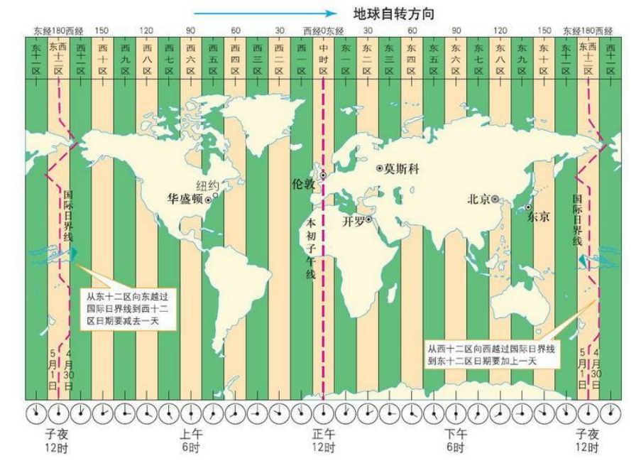

# 第四部分 常用类

## 4.1 String类

String类：代表字符串。

String 其实是一个类，一个对象，而非基本数据类型，但它不需要new，直接赋值即可使用。

```java
String str = "字符串";
```

String对象的字符内容是存储在一个字符数组value[]中的。

1.String声明为final的，不可被继承

2.String 实现了 Serializable接口：表示字符串是支持序列化的。

​    实现了 Comparable 接口：表示String可以比较大小

3.String内部定义了final char[] value用于存储字符串数据

4.String:代表不可变的字符序列。简称：不可变性。

体现：1.当对字符串重新赋值时，需重写指定内存区域赋值，不能使用原有的value进行赋值。

​			2.当对现有的字符串进行连接操作时，也需要重新指定内存区域赋值，不能使用原有的value进行赋值。

​			3.当调用String的replace()方法修改指定字符或字符串时，也需要重新指定内存区域赋值，不能使用原有的value进行赋值。

5.通过字面量的方式（区别于new）给一个字符串赋值，此时的字符串值声明在字符串常量池中。

```java
String s1 = "javaEE";
String s2 = "javaEE";
System.out.println(s1 == s2);//输出为true，意味着地址值相同
```

6.字符串常量池中是不会存储相同内容的字符串的。

 ### 4.1.1 String对象的创建

1、通过字面量定义

```java
String str = "hello";
```

2、通过new 构造器的方式

 ```java
//本质上this.value = new char[0];
String s1 = new String(); 

//this.value = original.value;
String s2 = new String(String original); 

//this.value = Arrays.copyOf(value, value.length);
String s3 = new String(char[] a); 
 ```

提取字符数组s4中第 startIndex 位置的字符开始，长度为count的字符串。

```java
String s4 = new String(char[] a,int startIndex,int count);
```

### 4.1.2 常用方法

| 方法                                                         | 功能                                                         |
| ------------------------------------------------------------ | ------------------------------------------------------------ |
| int length()                                                 | 返回字符串的长度：return value.length                        |
| char charAt(int index)                                       | 返回某索引处的字符：return value[index]                      |
| boolean isEmpty()                                            | 判断是否是空字符串：return value.length == 0                 |
| String toLowerCase()                                         | 使用默认语言环境，将 String 中的所有字符转换为小写           |
| String toUpperCase()                                         | 使用默认语言环境，将 String 中的所有字符转换为大写           |
| String trim()                                                | 返回字符串的副本，忽略前导空白和尾部空白                     |
| boolean equals(Object obj)                                   | 比较字符串的内容是否相同                                     |
| boolean equalsIgnoreCase(String anotherString)               | 与equals方法类似，忽略大小写                                 |
| String concat(String str)                                    | 将指定字符串连接到此字符串的结尾，等价于用“+”                |
| int compareTo(String anotherString)                          | 比较两个字符串的大小                                         |
| String substring(int beginIndex)                             | 返回一个新的字符串，它是此字符串的从beginIndex（包括）开始截取到最后的一个子字符串。<br />索引从0开始 |
| String substring(int beginIndex, int endIndex)               | 返回一个新字符串，它是此字符串从beginIndex（包括）开始截取到endIndex（不包含）的一个子字符串。 |
| boolean endsWith(String suffix)                              | 测试此字符串是否以指定的后缀结束                             |
| boolean startsWith(String prefix)                            | 测试此字符串是否以指定的前缀开始                             |
| boolean startsWith(String prefix, int toffset)               | 测试此字符串从指定索引开始的子字符串是否以指定前缀开始       |
| boolean contains(CharSequence s)                             | 当且仅当此字符串包含指定的 char 值序列时，返回 true          |
| int indexOf(String str)                                      | 返回指定子字符串在此字符串中第一次出现处的索引<br />索引从0开始<br />若找不到就返回-1 |
| int indexOf(String str, int fromIndex)                       | 返回指定子字符串在此字符串中第一次出现处的索引，从指定的索引开始 |
| int lastIndexOf(String str)                                  | 返回指定子字符串在此字符串中最右边出现处的索引               |
| int lastIndexOf(String str, int fromIndex)                   | 返回指定子字符串在此字符串中最后一次出现处的索引，从指定的索引开始反向搜索<br/>注：indexOf和lastIndexOf方法如果未找到都是返回-1 |
| String replace(char oldChar, char newChar)                   | 返回一个新的字符串，它是通过用 newChar 替换此字符串中出现的所有 oldChar 得到的。 |
| String replace(CharSequence target, CharSequence replacement) | 使用指定的字面值替换序列替换此字符串所有匹配字面值目标序列的子字符串。 |
| String replaceAll(String regex, String replacement)          | 使用给定的 replacement 替换此字符串所有匹配给定的正则表达式的子字符串。 |
| String replaceFirst(String regex, String replacement)        | 使用给定的 replacement 替换此字符串匹配给定的正则表达式的第一个子字符串。 |
| boolean matches(String regex)                                | 告知此字符串是否匹配给定的正则表达式。                       |
| String[] split(String regex)                                 | 根据给定正则表达式的匹配拆分此字符串。                       |
| String[] split(String regex, int limit)                      | 根据匹配给定的正则表达式来拆分此字符串，最多不超过limit个，如果超过了，剩下的全部都放到最后一个元素中。 |

### 4.1.3 String和基本数据类型的转换

#### 4.1.3.1 字符串 → 基本数据类型、包装类

Integer包装类的public static int parseInt(String s)：可以将由“数字”字符组成的字符串转换为整型。

类似地,使用java.lang包中的Byte、Short、Long、Float、Double类调相应的类方法可以将由“数字”字符组成的字符串，转化为相应的基本数据类型。

#### 4.1.3.2 基本数据类型、包装类 → 字符串

| 方法                         | 功能                 |
| ---------------------------- | -------------------- |
| public String valueOf(int n) | 将int型转换为字符串  |
| valueOf(byte b)              | 将byte型转换为字符串 |
| valueOf(long l)              |                      |
| valueOf(float f)             |                      |
| valueOf(double d)            |                      |
| valueOf(boolean b)           |                      |
| ……                           | 以此类推             |

### 4.1.4 String和字符数组的转换

#### 4.1.4.1 字符数组 → 字符串

String 类的构造器：String(char[]) 和 String(char[]，int offset，int length) 分别用字符数组中的全部字符和部分字符创建字符串对象。

```java
char[] arr = new char[]{'h','e','l','l','o'};
String str2 = new String(arr);
System.out.println(str2);          //hello
```

#### 4.1.4.2 字符串 → 字符数组

| 方法                                                         | 说明                                               |
| ------------------------------------------------------------ | -------------------------------------------------- |
| public char[] toCharArray()                                  | 将字符串中的全部字符存放在一个字符数组中的方法。   |
| public void getChars(int srcBegin, int srcEnd, char[] dst, int dstBegin) | 提供了将指定索引范围内的字符串存放到数组中的方法。 |

### 4.1.5 String与字节数组转换

#### 4.1.5.1 字节数组 → 字符串
| 方法                                   | 说明                                                         |
| -------------------------------------- | ------------------------------------------------------------ |
| String(byte[])                         | 通过使用平台的默认字符集解码指定的 byte 数组，构造一个新的 String。 |
| String(byte[]，int offset，int length) | 用指定的字节数组的一部分，即从数组起始位置offset开始取length个字节构造一个字符串对象。 |

#### 4.1.5.2 字符串 → 字节数组

| 方法                                       | 说明                                                         |
| ------------------------------------------ | ------------------------------------------------------------ |
| public byte[] getBytes()                   | 使用平台的默认字符集将此 String 编码为 byte 序列，并将结果存储到一个新的 byte 数组中。 |
| public byte[] getBytes(String charsetName) | 使用指定的字符集，将此 String 编码到 byte 序列，并将结果存储到新的 byte 数组。 |

```java
/**
 * String 与 byte[]之间的转换
 * 编码：String --> byte[]:调用String的getBytes()
 * 解码：byte[] --> String:调用String的构造器
 *
 * 编码：字符串 -->字节  (看得懂 --->看不懂的二进制数据)
 * 解码：编码的逆过程，字节 --> 字符串 （看不懂的二进制数据 ---> 看得懂）
 *
 * 说明：解码时，要求解码使用的字符集必须与编码时使用的字符集一致，否则会出现乱码。
 * 
 * @throws UnsupportedEncodingException
 */
@Test
public void test3() throws UnsupportedEncodingException {
    String str1 = "abc123中国";
  
    byte[] bytes = str1.getBytes();                 //使用默认的字符集，进行编码。
    System.out.println(Arrays.toString(bytes));     //输出：[97, 98, 99, 49, 50, 51, -28, -72, -83, -27, -101, -67]

    byte[] gbks = str1.getBytes("gbk");             //使用gbk字符集进行编码。
    System.out.println(Arrays.toString(gbks));      //输出：[97, 98, 99, 49, 50, 51, -42, -48, -71, -6]

    String str2 = new String(bytes);                //使用默认的字符集UTF-8进行解码。
    System.out.println(str2);                       //输出：abc123中国

    String str3 = new String(gbks);
    System.out.println(str3);                       //出现乱码。原因：编码集和解码集不一致！

    String str4 = new String(gbks, "gbk");
    System.out.println(str4);                       //没有出现乱码。原因：编码集和解码集一致！
}
```

### 4.1.6 一些问题

#### 4.1.6.1 String str1 = “abc”;**与**String str2 = new String(“abc”);的区别？


 ```java
//通过字面量定义的方式（图中str1）：此时的s1和s2的数据javaEE声明在方法区中的字符串常量池中。
String s1 = "javaEE";
String s2 = "javaEE";
//通过new + 构造器的方式（图中str2）：此时的s3和s4保存的地址值，是数据在堆空间中开辟空间以后对应的地址值。
String s3 = new String("javaEE");
String s4 = new String("javaEE");

System.out.println(s1 == s2);//true
System.out.println(s1 == s3);//false
System.out.println(s1 == s4);//false
System.out.println(s3 == s4);//false
 ```

#### 4.1.6.2 String不同拼接操作对比

 常量与常量的拼接结果在常量池，且常量池中不会存在相同内容的常量。

若只要其中有一个是变量，结果就在堆中。

若拼接的结果调用intern()方法，返回值就在常量池中。

```java
String s1 = "javaEE";
String s2 = "hadoop";

String s3 = "javaEEhadoop";
String s4 = "javaEE" + "hadoop";
String s5 = s1 + "hadoop";
String s6 = "javaEE" + s2;
String s7 = s1 + s2;

System.out.println(s3 == s4);//true
System.out.println(s3 == s5);//false
System.out.println(s3 == s6);//false
System.out.println(s3 == s7);//false
System.out.println(s5 == s6);//false
System.out.println(s5 == s7);//false
System.out.println(s6 == s7);//false

String s8 = s6.intern();//返回值得到的s8使用的常量值中已经存在的“javaEEhadoop”
System.out.println(s3 == s8);//true

//当String为final时，s9就是常量
final String s9 = "javaEE";
//此时即使是变量+常量，结果也是常量
String s10 = s9 + s2;
System.out.println(s3 == s10);//true
```

## 4.2 时间类

计算世界时间的主要标准有：

UTC(Coordinated Universal Time)

GMT(Greenwich Mean Time)

CST(Central Standard Time)



### 4.2.1 JDK8之前日期时间API


#### 4.2.1.1 java.lang.System类

| 方法                                   | 说明                                                         |
| -------------------------------------- | ------------------------------------------------------------ |
| public static long currentTimeMillis() | 返回当前时间与1970年1月1日0时0分0秒之间以毫秒为单位的时间差，称为时间戳。 |

#### 4.2.1.2 java.util.Data类

##### 4.2.1.2.1 构造器

| 构造器          | 说明                                           |
| --------------- | ---------------------------------------------- |
| Date()          | 使用无参构造器创建的对象可以获取本地当前时间。 |
| Date(long date) |                                                |

```java
Date date = new Date(155030620410L);
System.out.println(date2.toString());  //输出Sat Nov 30 16:03:40 CST 1974
```

##### 3.2.1.2.2 常用方法

| 方法       | 说明                                                         |
| ---------- | ------------------------------------------------------------ |
| getTime()  | 返回自 1970 年 1 月 1 日 00:00:00 GMT 以来此 Date 对象表示的毫秒数。 |
| toString() | 把此 Date 对象转换为以下形式的 String：dow mon dd hh:mm:ss zzz yyyy<br />其中：dow 是一周中的某一天 (Sun, Mon, Tue, Wed, Thu, Fri, Sat)，zzz是时间标准。 |

其它很多方法都过时了。

##### 4.2.1.2.3 java.util.Date 对象转换为 java.sql.Date 对象

```java
//情况一：
Date date4 = new java.sql.Date(2343243242323L);
java.sql.Date date5 = (java.sql.Date) date4;
//情况二：
Date date6 = new Date();
java.sql.Date date7 = new java.sql.Date(date6.getTime());
```

#### 4.2.1.3 java.text.SimpleDateFormat类

java.text.SimpleDateFormat 类是一个格式化和解析日期的具体类。

格式化：日期 → 文本

| 方法                                    | 说明                                                         |
| --------------------------------------- | ------------------------------------------------------------ |
| SimpleDateFormat()                      | 默认的模式和语言环境创建对象                                 |
| public SimpleDateFormat(String pattern) | 该构造方法可以用参数 pattern 指定的格式创建一个对象，该对象调用： |
| public String format(Date date)         | 方法格式化时间对象date                                       |

解析：文本 → 日期

| 方法                             | 说明                                         |
| -------------------------------- | -------------------------------------------- |
| public Date parse(String source) | 从给定字符串的开始解析文本，以生成一个日期。 |

##### 4.2.1.3.1 示例

使用默认的构造器

```java
SimpleDateFormat sdf = new SimpleDateFormat();

//格式化：日期 --->字符串
Date date = new Date();
System.out.println(date);    //输出：Tue Apr 05 20:20:07 CST 2022

String format = sdf.format(date);
System.out.println(format);  //输出：22-4-5 下午8:20（解析也要按这种格式）

//解析：格式化的逆过程，字符串 ---> 日期
String str = "19-12-18 上午11:43";
Date date1 = sdf.parse(str);
System.out.println(date1);     //输出：Wed Dec 18 11:43:00 CST 2019
```

使用带参的构造器

```java
Date date = new Date();

SimpleDateFormat sdf1 = new SimpleDateFormat("yyyy-MM-dd hh:mm:ss");

//格式化
String format1 = sdf1.format(date);
System.out.println(format1);                       //输出：2022-04-05 08:24:05

//解析：要求字符串必须是符合SimpleDateFormat识别的格式(通过构造器参数体现),即由于sdf1在上面对格式进行了限制，因此只认上面那种格式，否则，抛异常。
Date date2 = sdf1.parse("2020-02-18 11:48:27");
System.out.println(date2);                         //输出：Tue Feb 18 11:48:27 CST 2020
```

#### 4.2.1.4 java.util.Calendar类

Calendar是一个抽象基类，主用用于完成日期字段之间相互操作的功能。

获取Calendar实例的方法：

1、使用Calendar.getInstance()方法。

2、调用它的子类GregorianCalendar的构造器。

一个Calendar的实例是系统时间的抽象表示，通过get(int field)方法来取得想要的时间信息。比如YEAR、MONTH、DAY_OF_WEEK、HOUR_OF_DAY 、MINUTE、SECOND。

| 方法                                  | 功能 |
| ------------------------------------- | ---- |
| public void set(int field,int value)  |      |
| public void add(int field,int amount) |      |
| public final Date getTime()           |      |
| public final void setTime(Date date)  |      |

##### 4.2.1.4.1 示例

```java
//1.实例化
Calendar calendar = Calendar.getInstance();
//System.out.println(calendar.getClass());

//2.常用方法
//get()
int days = calendar.get(Calendar.DAY_OF_MONTH);           //获取“今天是这个月的第几天”
System.out.println(days);
System.out.println(calendar.get(Calendar.DAY_OF_YEAR));   //获取今天是今年的第几天

//set()
//calendar可变性
calendar.set(Calendar.DAY_OF_MONTH,22);                   //把“今天是这个月的第几天”强行改成是第22天
System.out.println(calendar.get(Calendar.DAY_OF_MONTH));

//add()
calendar.add(Calendar.DAY_OF_MONTH,-3);                   //把“今天是这个月的第几天”强行改成是第22天后，再减去三天
System.out.println(calendar.get(Calendar.DAY_OF_MONTH));

//getTime():日历类---> Date
Date date = calendar.getTime();
System.out.println(date);                                 //输出：Tue Apr 19 20:40:28 CST 2022

//setTime():Date ---> 日历类
Date date1 = new Date();
calendar.setTime(date1);
System.out.println(calendar.get(Calendar.DAY_OF_MONTH));   //四月五号这天测试这个代码时，输出：5
```

注意：

1、获取月份时：一月是0，二月是1，以此类推，12月是11。

2、获取星期时：周日是1，周二是2，…… 周六是7。

### 4.2.2 JDK8 中新日期时间 API

旧的 Data 类和 Calendar 类面临许多问题

1、可变性：像日期和时间这样的类应该是不可变的。

2、偏移性：Date中的年份是从1900开始的，而月份都从0开始。

```java
//实例化错误传参
Date date1 = new Date(2020,9,8);
System.out.println(date1);   //输出：Fri Oct 08 00:00:00 CST 3920

//实例化正确传参
Date date2 = new Date(2020 - 1900,9 - 1,8);
System.out.println(date2);   //输出：Tue Sep 08 00:00:00 CST 2020
```

3、格式化：格式化只对Date有用，Calendar则不行。

4、还有它们是非线程安全的，不能处理闰秒等。

Java 8 中新的 java.time 中包含了所有关于本地日期（LocalDate）、本地时间（LocalTime）、本地日期时间（LocalDateTime）、时区（ZonedDateTime）和持续时间（Duration）的类。Date 类新增了 toInstant() 方法，用于把 Date 转换成新的表示形式。

新时间日期API

java.time – 包含值对象的基础包

java.time.chrono – 提供对不同的日历系统的访问

java.time.format – 格式化和解析时间和日期

java.time.temporal – 包括底层框架和扩展特性

java.time.zone – 包含时区支持的类

#### 4.2.3.1 LocalDate、LocalTime、LocalDateTime

LocalDate、LocalTime、LocalDateTime 类的实例是不可变的对象，分别表示使用 ISO-8601日历系统的日期、时间、日期和时间。它们提供了简单的本地日期或时间，并不包含当前的时间信息，也不包含与时区相关的信息。

LocalDate 代表IOS格式（yyyy-MM-dd）的日期，可以存储 生日、纪念日等日期。

LocalTime 表示一个时间，而不是日期。

LocalDateTime 是用来表示日期和时间的，这是一个最常用的类之一。

LocalDateTime 相较于LocalDate、LocalTime，使用频率要高。

| 方法                                                         | 功能                                                         | 参数                                                         |
| ------------------------------------------------------------ | ------------------------------------------------------------ | ------------------------------------------------------------ |
| now() / * now(ZoneId zone)                                   | 静态方法，根据当前时间创建对象/指定时区的对象                |                                                              |
| of()                                                         | 静态方法，根据指定日期/时间创建对象                          |                                                              |
| getDayOfMonth()<br />getDayOfYear()                          | 获得月份天数(1-31) / 获得年份天数(1-366)                     |                                                              |
| getDayOfWeek()                                               | 获得星期几(返回一个 DayOfWeek 枚举值)                        |                                                              |
| getMonth()                                                   | 获得月份, 返回一个 Month 枚举值                              |                                                              |
| getMonthValue()<br />getYear()                               | 获得月份(1-12) /获得年份                                     |                                                              |
| getHour()/getMinute()<br />getSecond()                       | 获得当前对象对应的小时、分钟、秒                             |                                                              |
| withDayOfMonth()<br />withDayOfYear()<br/>withMonth()<br />withYear() | 将月份天数、年份天数、月份、年份修改为指定的值并返回新的对象 |                                                              |
| plusDays()<br/>plusWeeks()<br/>plusMonths()<br/>plusYears()<br/>plusHours() | 向当前对象添加几天、几周、几个月、几年、几小时               |                                                              |
| minusMonths()<br />minusWeeks()<br />minusDays()<br/>minusYears()<br/>minusHours() | 从当前对象减去几月、几周、几天、几年、几小时                 |                                                              |
|                                                              |                                                              |                                                              |
| ofEpochSecond(long epochSecond, int nanoOfSecond, ZoneOffset offset) | 使用从 1970-01-01T00:00:00Z 的时代开始的秒数获得一个LocalDateTime的实例。 | epochSecond - 从1970-01-01T00：00：00Z的时代开始的秒数 <br/>nanoOfSecond - 秒内的纳秒，从0到999,999,999 <br/>offset - 区域偏移，不为空 |

##### 4.2.3.1.1 now() / * now(ZoneId zone)

```java
//now():获取当前的日期、时间、日期+时间
LocalDate localDate = LocalDate.now();
LocalTime localTime = LocalTime.now();
LocalDateTime localDateTime = LocalDateTime.now();

System.out.println(localDate);           //输出：2022-04-06
System.out.println(localTime);           //输出：08:24:06.382
System.out.println(localDateTime);       //输出：2022-04-06T08:24:06.382
```

##### 4.2.3.1.2 of()

```java
//of():设置指定的年、月、日、时、分、秒。没有偏移量
LocalDateTime localDateTime1 = LocalDateTime.of(2020, 10, 6, 13, 23, 43);
System.out.println(localDateTime1);                        //输出：2020-10-06T13:23:43
```

##### 4.2.3.1.3 getXxx()

```java
//getXxx()：获取相关的属性
System.out.println(localDateTime.getDayOfMonth());        //输出：6
System.out.println(localDateTime.getDayOfWeek());         //输出：WEDNESDAY
System.out.println(localDateTime.getMonth());             //输出：APRIL
System.out.println(localDateTime.getMonthValue());        //输出：4
System.out.println(localDateTime.getMinute());            //输出：24
```

##### 4.2.3.1.4 withXxx()

```java
//体现不可变性
//withXxx():设置相关的属性
LocalDate localDate1 = localDate.withDayOfMonth(22);
System.out.println(localDate);                            //输出：2022-04-06
System.out.println(localDate1);                           //输出：2022-04-22

LocalDateTime localDateTime2 = localDateTime.withHour(4);
System.out.println(localDateTime);                        //输出：2022-04-06T08:24:06.382
System.out.println(localDateTime2);                       //输出：2022-04-06T04:24:06.382
```

##### 4.2.3.1.5 不可变性

```java
//加操作
LocalDateTime localDateTime3 = localDateTime.plusMonths(3);
System.out.println(localDateTime);                        //输出：2022-04-06T08:24:06.382
System.out.println(localDateTime3);                       //输出：2022-07-06T08:24:06.382

//减操作
LocalDateTime localDateTime4 = localDateTime.minusDays(6);
System.out.println(localDateTime);                        //输出：2022-04-06T08:24:06.382
System.out.println(localDateTime4);                       //输出：2022-03-31T08:24:06.382
```

#### 4.2.3.2 瞬时：Instant

Instant：时间线上的一个瞬时点。

在处理时间和日期时，面向机器的通用模型是连续的，在此模型中，时间线中的一个点表示为一个很大的数，这有利于计算机处理。在UNIX中，这个数从1970年开始，以秒为的单位；在Java中，也是从1970年开始，但以毫秒为单位。

java.time包通过值类型Instant提供机器视图，不提供处理人类意义上的时间单位。Instant表示时间线上的一点，而不需要任何上下文信息，例如，时区。

概念上讲，它只是简单的表示自1970年1月1日0时0分0秒（UTC）开始的秒数。因为java.time包是基于纳秒计算的，所以Instant的精度可以达到纳秒级。

(1 ns = 10<sup>-9</sup> s) 1秒 = 1000毫秒 =10<sup>6</sup>微秒=10<sup>9</sup>纳秒

| 方法                          | 功能                                                         |
| ----------------------------- | ------------------------------------------------------------ |
| now()                         | 静态方法，返回默认UTC时区的Instant类的对象                   |
| ofEpochMilli(long epochMilli) | 静态方法，返回在1970-01-01 00:00:00基础上加上指定毫秒数之后的Instant类的对象 |
| atOffset(ZoneOffset offset)   | 结合即时的偏移来创建一个 OffsetDateTime                      |
| toEpochMilli()                | 返回1970-01-01 00:00:00到当前时间的毫秒数，即为时间戳        |

时间戳是指格林威治时间1970年01月01日00时00分00秒(北京时间1970年01月01日08时00分00秒)起至现在的总秒数。

##### 4.2.3.2.1 now()

```java
//now():获取本初子午线对应的标准时间
//测试这个程序的时候是北京时间2022年4月6日09:06:06
Instant instant = Instant.now();
System.out.println(instant);                   //输出（GMT）：2022-04-06T01:00:16.090Z
```

##### 4.2.3.2.2 ofEpochMilli(long epochMilli)

```java
//ofEpochMilli():通过给定的毫秒数，获取Instant实例  -->Date(long millis)
Instant instant1 = Instant.ofEpochMilli(1649206816090L);
System.out.println(instant1);                  //输出：2022-04-06T01:00:16.090Z
```

##### 4.2.3.2.3 atOffset(ZoneOffset offset)

```java
//（继3.2.3.2.1后）添加时间的偏移量
OffsetDateTime offsetDateTime = instant.atOffset(ZoneOffset.ofHours(8));
System.out.println(offsetDateTime);            //输出：2022-04-06T09:00:16.090+08:00
```

##### 4.2.3.2.4 toEpochMilli()

```java
//获取自1970年1月1日0时0分0秒（UTC）开始的毫秒数  ---> Date类的getTime()
long milli = instant.toEpochMilli();
System.out.println(milli);                     //输出：1649206816090
```

#### 4.2.3.3 格式化与解析日期或时间

java.time.format.DateTimeFormatter 类提供了三种格式化方法：

1、预定义的标准格式。如：ISO_LOCAL_DATE_TIME;ISO_LOCAL_DATE;ISO_LOCAL_TIME

2、本地化相关的格式。如：ofLocalizedDateTime(FormatStyle.LONG)

3、自定义的格式。如：ofPattern(“yyyy-MM-dd hh:mm:ss”)

| 方法                       | 功能                                                |
| -------------------------- | --------------------------------------------------- |
| ofPattern(String pattern)  | 静态方法，返回一个指定字符串格式的DateTimeFormatter |
| format(TemporalAccessor t) | 格式化一个日期、时间，返回字符串                    |
| parse(CharSequence text)   | 将指定格式的字符序列解析为一个日期、时间            |

##### 4.2.3.3.1 预定义的标准格式。如：ISO_LOCAL_DATE_TIME;ISO_LOCAL_DATE;ISO_LOCAL_TIME

```java
//预定义的标准格式。如：ISO_LOCAL_DATE_TIME;ISO_LOCAL_DATE;ISO_LOCAL_TIME
DateTimeFormatter formatter = DateTimeFormatter.ISO_LOCAL_DATE_TIME;
//格式化:日期-->字符串
LocalDateTime localDateTime = LocalDateTime.now();
String str1 = formatter.format(localDateTime);
System.out.println(localDateTime);    //输出：2022-04-06T09:20:32.365
System.out.println(str1);             //输出：2022-04-06T09:20:32.365

//解析：字符串 --> 日期
TemporalAccessor parse = formatter.parse("2022-04-06T09:20:32.365");
System.out.println(parse);            //输出：{},ISO resolved to 2022-04-06T09:20:32.365
```

##### 4.2.3.3.2 本地化相关的格式。如：ofLocalizedDateTime(FormatStyle.LONG)

```java
//本地化相关的格式。如：ofLocalizedDateTime()
//FormatStyle.LONG / FormatStyle.MEDIUM / FormatStyle.SHORT：适用于LocalDateTime
DateTimeFormatter formatter1 = DateTimeFormatter.ofLocalizedDateTime(FormatStyle.LONG);
//格式化
String str2 = formatter1.format(localDateTime);
System.out.println(str2);              //输出：2022年4月6日 上午09时21分18秒

//本地化相关的格式。如：ofLocalizedDate()
//FormatStyle.FULL / FormatStyle.LONG / FormatStyle.MEDIUM / FormatStyle.SHORT：适用于LocalDate
DateTimeFormatter formatter2 = DateTimeFormatter.ofLocalizedDate(FormatStyle.MEDIUM);
//格式化
String str3 = formatter2.format(LocalDate.now());
System.out.println(str3);              //输出：2022-4-6
```

##### 4.2.3.3.3 （重点）自定义的格式。如：ofPattern(“yyyy-MM-dd hh:mm:ss”)

```java
//自定义的格式。如：ofPattern(“yyyy-MM-dd hh:mm:ss”)
DateTimeFormatter formatter3 = DateTimeFormatter.ofPattern("yyyy-MM-dd hh:mm:ss");
//格式化
String str4 = formatter3.format(LocalDateTime.now());
System.out.println(str4);             //输出：2022-04-06 09:21:18

//解析
TemporalAccessor accessor = formatter3.parse("2022-04-06 09:21:18");
System.out.println(accessor);         //输出：{MicroOfSecond=0, SecondOfMinute=9, MilliOfSecond=0, NanoOfSecond=0, MinuteOfHour=52, HourOfAmPm=3},ISO resolved to 2019-02-18
```

### 4.2.3 其他API

时间类的API众多，这里再列一些常用的API

| 方法              | 功能                                                         |
| ----------------- | ------------------------------------------------------------ |
| ZoneId            | 该类中包含了所有的时区信息，一个时区的ID，如 Europe/Paris    |
| ZonedDateTime     | 一个在ISO-8601日历系统时区的日期时间，如 2007-12-03T10:15:30+01:00 Europe/Paris。<br />其中每个时区都对应着ID，地区ID都为“{区域}/{城市}”的格式，例如：Asia/Shanghai等 |
| Clock             | 使用时区提供对当前即时、日期和时间的访问的时钟。             |
| Duration          | 持续时间，用于计算两个“时间”间隔                             |
| Period            | 日期间隔，用于计算两个“日期”间隔                             |
| TemporalAdjuster  | 时间校正器。有时我们可能需要获取。例如：将日期调整到“下一个工作日”等操作。 |
| TemporalAdjusters | 该类通过静态方法 (firstDayOfXxx() / lastDayOfXxx() / nextXxx()) 提供了大量的常用TemporalAdjuster 的实现。 |

## 4.3 大数操作（BigInteger、BigDecimal）

操作整型：BigInteger

操作小数：BigDecimal

当然了，这些大数都会以字符串的形式传入。

### 4.3.1 BigInteger


### 4.3.2 代码示例

```java
import java.math.BigInteger;

public class BigIntegerDemo1 {
	public static void main(String[] args) {
		BigInteger bi1 = new BigInteger("123456789") ;	      // 声明BigInteger对象
		BigInteger bi2 = new BigInteger("987654321") ;	      // 声明BigInteger对象
		System.out.println("加法操作：" + bi2.add(bi1)) ;	    // 加法操作
		System.out.println("减法操作：" + bi2.subtract(bi1)) ;	// 减法操作
		System.out.println("乘法操作：" + bi2.multiply(bi1)) ;	// 乘法操作
		System.out.println("除法操作：" + bi2.divide(bi1)) ;	  // 除法操作
		System.out.println("最大数：" + bi2.max(bi1)) ;	       // 求出最大数
		System.out.println("最小数：" + bi2.min(bi1)) ;	       // 求出最小数
		BigInteger result[] = bi2.divideAndRemainder(bi1) ;   // 求出余数的除法操作
		System.out.println("商是：" + result[0] + "；余数是：" + result[1]) ;
	}
}
```