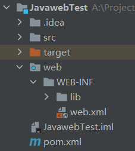

# 第一章 Javaweb概述

Javaweb 是指所有通过 Java 编写可以通过浏览器访问的程序的总称。

web包括web服务端和web客户端两部分。Java在客户端的应用有Java Applet，不过使用得很少，在服务器端的应用非常的丰富，比如Servlet，JSP、第三方框架等。

Javaweb三大组件：Servlet 程序、Filter 过滤器、Listener 监听器。

## 1.1 静态资源和动态资源

Internet上供外界访问的Web资源分为：

静态web资源（如html 页面）

​		指web页面中供人们浏览的数据始终是不变。

​		开发技术：HTML、CSS。

动态web资源

​		指web页面中供人们浏览的数据是由程序产生的，不同时间点访问web页面看到的内容各不相同。

​		开发技术：JavaScript、JSP/Servlet、ASP、PHP等。

​		在Java中，动态web资源开发技术统称为Java Web。

## 1.2 请求和响应

请求是指客户端给服务器发送数据，叫请求 Request。

响应是指服务器给客户端回传数据，叫响应 Response。

请求和响应是成对出现的。

## 1.3 动态Web项目结构（由Maven构建）

| 文件/文件夹 | 说明                                                         |
| ----------- | ------------------------------------------------------------ |
| .idea       | 存放项目配置信息、版本历史等的目录。                         |
| src         | 存放自己编写的java源代码                                     |
| target      | 存放项目构建后的文件和目录、jar包、war包、编译的class文件    |
| web         | 存放web工程的资源文件，比如html页面，css文件，js文件等       |
| WEB-INF     | 一个受服务器保护的目录，浏览器无法直接访问此目录的内容       |
| lib         | 存放第三行jar包（在Maven中则无需此文件夹）                   |
| web.xml     | 整个动态web工程的配置部署描述文件，可以在这里配置很多web工程的组件，比如：Servlet程序，Filter过滤器等等 |
| 项目名.iml  | intellij idea的工程配置文件，里面是当前project的一些配置信息。 |
| pom.xml     | 主要描述了项目的maven坐标，依赖关系，开发者需要遵循的规则，缺陷管理系统，组织和licenses，以及其他所有的项目相关因素，是项目级别的配置文件。 |

