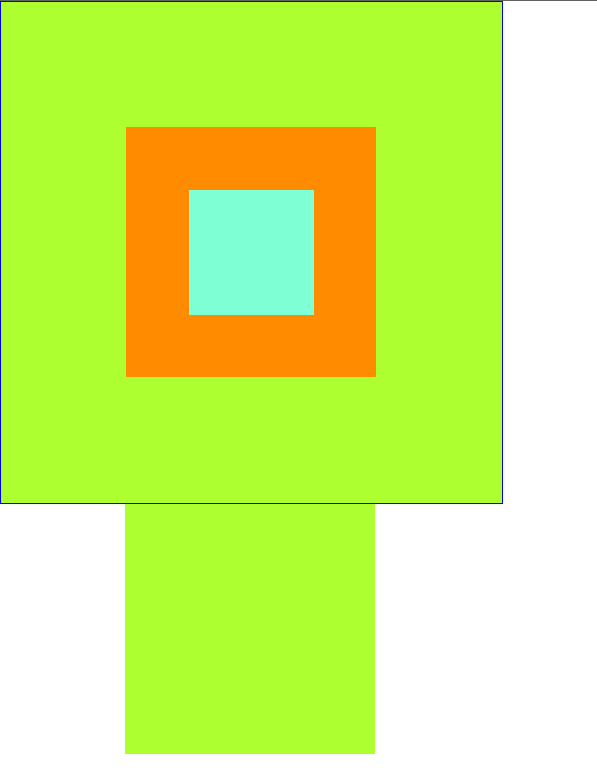

# 第二章 基础的HTML CSS JavaScript

## 1.1 HTML

HTML是Hyper Text Markup Language的缩写。意思是『超文本标记语言』，它是解释型语言，不是编译型的，浏览器是容错的。

### 1.1.1 HTML标签

html页面中由一对标签组成

```html
<html>
    
</html>
```

<html> 称之为 开始标签，</html>称之为 结束标签。

#### 1.1.1.1 编码方式

meta标签中可以设置编码方式

```html
<meta charset="编码">
```

#### 1.1.1.2 标题标签

网页的标题

```html
<title>网页标题</title>
```

段落的标题

```html
<h1>一级标题</h1>
<h2>二级标题</h2>
<h3>三级标题</h3>
<h4>四级标题</h4>
<h5>五级标题</h5>
<h6>六级标题</h6>
```

示例：

```html
<html>
<head>
    <meta charset="UTF-8">
    <title>网页标题</title>
</head>
<body>
    <h1>这是一级标题</h1>
    <h2>这是二级标题</h2>
    <h3>这是三级标题</h3>
    <h4>这是四级标题</h4>
    <h5>这是五级标题</h5>
    <h6>这是六级标题</h6>
</body>
</html>
```

页面显示效果：


#### 1.1.1.3 换行标签和段落标签

换行标签

```html
内容<br/>
```

这是一个单标签，开始标签和结束标签是同一个，斜杠放在单词后面

段落标签

```html
<p> </p>
```

示例：

```html
<html>
<head>
    <meta charset="UTF-8">
    <title>网页的标题</title>
</head>
<body>
    Hello World<br/>
    你好，HTML!
    <p>段落1</p>
</body>
</html>
```

页面显示效果：


#### 1.1.1.4 图片标签

```html

```

还可以增添width和height两个属性来设置图片的大小，alt可以设置图片的提示。

图片文件的路径分为

##### 1.1.1.4.1 相对路径

​		示例：

```html
src="images/image.png"
```

##### 1.1.1.4.2 绝对路径

​		示例：

```html
src="D:\Project\images\image.png"
```

示例：

```html

```

#### 1.1.1.5 列表标签

##### 1.1.1.5.1 有序列表标签

```html
<ol></ol>
```

​		type 可以设置显示的序号类型：A、a、I、i、1(默认)，start 表示从设定的数字开始排序

##### 1.1.1.5.1 无序列表标签

```html
<ul></ul>
```

​		type 可以设置文字前的点，类型有disc(默认) , circle , square

示例：

```html
<html>
<head>
    <meta charset="UTF-8">
    <title>网页的标题</title>
</head>
<body>
    <!-- 表示一个有序列表，序号是大写字母，从第三个字母C开始排序 -->
    <ol type="A" start="3">
        <li>第一名</li>
        <li>第二名</li>
        <li>第三名</li>
        <li>第四名</li>
        <li>第五名</li>
    </ol>

    <!-- 表示一个无序列表，没有序号 -->
    <ul>
        <li>乔峰</li>
        <li>马夫人</li>
        <li>李白</li>
    </ul>
</body>
</html>
```

页面显示效果：


#### 1.1.1.6 注释标签

```html
<!-- 注释的内容 -->
```

#### 1.1.1.7 上下标、下划线、粗体、斜体

上标标签

```html
<sup></sup>
```

下标标签

```html
<sub></sub>
```

下划线标签

```html
<u></u>
```

粗体标签

```html
<b></b>
```

斜体标签

```html
<i></i>
```

示例：

```html
<html>
<head>
    <meta charset="UTF-8">
    <title>网页的标题</title>
</head>
<body>
    你是<b><i><u>喜欢</u></i></b>是<b>甜</b>月饼还是<i>咸</i><u>月饼</u>？<br/>

    水分子的化学式： H<sub>2</sub>O <br/>
    氧气的化学式： O<sup>2</sup><br/>
</body>
</html>
```

页面显示效果：


#### 1.1.1.8 HTML字符实体（用的时候百度查就行）

示例：

```html
<html>
<head>
    <meta charset="UTF-8">
    <title></title>
</head>
<body>
    5&lt;10</br>
    10&gt;5</br>
    5&le;10</br>
    10&ge;5</br>
    注册商标 &reg;</br>
    版权符号 &copy;
</body>
</html>
```

页面显示效果：


#### 1.1.1.9 超链接

```html
<a href="链接"></a>
```

属性：target="__self（在本窗口打开）、_blank （在一个新窗口打开）、_parent （在父窗口打开）、_top （在顶层窗口打开）"

示例：

```html
<a href="http://www.baidu.com" target="_self">百度一下</a>
```

#### 1.1.1.10 表格

| 标签            | 功能   | 标签中的属性                                                 |
| --------------- | ------ | ------------------------------------------------------------ |
| <table></table> | 表格   | border：表格边框的粗细<br />width:表格的宽度<br />cellspacing：单元格间距<br />cellpadding：单元格填充<br />（table中的这些属性已淘汰，了解即可） |
| <tr></tr>       | 行     | align="center / left / right"                                |
| <td></td>       | 列     | rowspan : 行合并<br />colspan : 列合并                       |
| <th></th>       | 表头列 |                                                              |

示例：

```html
<html>
	<head>
		<title>表格标签的学习</title>
		<meta charset="UTF-8">
	</head>
	<body>
		<table border="1" width="600" cellspacing="0" cellpadding="4">
			<tr align="center">
				<th>姓名</th>
				<th>门派</th>
				<th>成名绝技</th>
				<th>内功值</th>
			</tr>
			<tr align="center">
				<td>乔峰</td>
				<td>丐帮</td>
				<td>少林长拳</td>
				<td>5000</td>
			</tr>
			<tr align="center">
				<td>虚竹</td>
				<td>灵鹫宫</td>
				<td>北冥神功</td>
				<td>15000</td>
			</tr>
			<tr align="center">
				<td>扫地僧</td>
				<td>少林寺</td>
				<td>七十二绝技</td>
				<td>未知</td>
			</tr>
		</table>
		<hr/>
		<table border="1" cellspacing="0" cellpadding="4" width="600">
			<tr>
				<th>名称</th>
				<th>单价</th>
				<th>数量</th>
				<th>小计</th>
				<th>操作</th>
			</tr>
			<tr align="center">
				<td>苹果</td>
				<td rowspan="2">5</td>
				<td>20</td>
				<td>100</td>
				<td></td>
			</tr>
			<tr align="center">
				<td>菠萝</td>
				<td>15</td>
				<td>45</td>
				<td></td>
			</tr>
			<tr align="center">
				<td>西瓜</td>
				<td>6</td>
				<td>6</td>
				<td>36</td>
				<td></td>
			</tr>
			<tr align="center">
				<td>总计</td>
				<td colspan="4">181</td>
			</tr>
		</table>
	</body>
</html>
```

页面显示效果：


#### 1.1.1.11 div 层

#### 1.1.1.12 不换行的块标记

```html
<span></span>
```

#### 1.1.1.13 表单

| 标签                  | 说明                                                         | 属性                                                    |
| --------------------- | ------------------------------------------------------------ | ------------------------------------------------------- |
| <form></form>         | 表单                                                         | action<br />method                                      |
| <textarea></textarea> | 多行文本框（或称文本域），它的value值就是开始结束标签之间的内容 |                                                         |
| <select></select>     | 下拉列表框                                                   |                                                         |
| <option></option>     | 下拉列表框的选项                                             | value：发送给服务器的值<br />selected：表示默认选中的项 |

<input type="">

| type内的值 | 文本框说明 | 属性                                                         |
| ---------- | ---------- | ------------------------------------------------------------ |
| text       | 文本框     | name：name属性必须要指定，否则这个文本框的数据将来是不会发送给服务器的 |
| password   | 密码框     |                                                              |
| radio      | 单选按钮   | checked可以设置默认选中的项<br />name属性值保持一致，这样才会有互斥的效果 |
| checkbox   | 复选框     | name属性值建议保持一致，这样将来我们服务器端获取值的时候获取的是一个数组 |
| submit     | 提交按钮   |                                                              |
| reset      | 重置按钮   |                                                              |
| button     | 普通按钮   |                                                              |

示例：

```html
<html>
	<head>
		<title>表单标签的学习</title>
		<meta charset="UTF-8">
	</head>
	<body>
		<form action="demo04.html" method="post">
			昵称：<input type="text" value="请输入你的昵称"/><br/>
			密码：<input type="password" name="pwd"/><br/>
			性别：<input type="radio" name="gender" value="male"/>男
	  			  <input type="radio" name="gender" value="female" checked/>女<br/>
			爱好：<input type="checkbox" name="hobby" value="basketball"/>篮球
				  <input type="checkbox" name="hobby" value="football" checked/>足球
				  <input type="checkbox" name="hobby" value="earth" checked/>地球<br/>
			星座：<select name="star">
					<option value="1">白羊座</option>
					<option value="2" selected>金牛座</option>
					<option value="3">双子座</option>
					<option value="4">天蝎座</option>
					<option value="5">天秤座</option>
				  </select><br/>
			备注：<textarea name="remark" rows="4" cols="50"></textarea><br/>
			<input type="submit" value=" 注 册 "/>
			<input type="reset" value="重置"/>
			<input type="button" value="这是一个普通按钮"/>
		</form>
	</body>
</html>
```

页面显示效果：


#### 1.1.1.14 base标签

```html
<base href="这里写相对路径的参照路径/">
```

base一般放在\<head>标签中

若没有base标签，在页面跳转时的相对路径将会参照当前浏览器地址栏中的地址来跳转

比如原地址：http://localhost:8080/07_servlet/a/b/c.html，跳转回去的a标签的路径是：../../index.html，这参照后跳转的地址应该是http://localhost:8080/07_servlet/index.html

有了base标签后，就会忽略浏览器地址栏中的地址，只以base中的地址作为参照。

注意，base标签中的相对地址最后一个字符一定要是/

#### 1.1.1.15 页面框架标签（过时的标签，了解）

<frameset>标签可以将网页按照比例进行划分，并在划分好的区域内载入网页

示例：

```html
<html>
	<head></head>
	<frameset rows="20%,*" > <!-- frameborder="no" -->
		<frame src="frames/top.html"/>
		<frameset cols="15%,*">
			<frame src="frames/left.html"/>
			<frameset rows="80%,*">
				<frame src="frames/main.html"/>
				<frame src="frames/bottom.html"/>
			</frameset>
		</frameset>
	</frameset>
</html>
```

页面显示效果：


## 1.2 CSS

CSS的最基本的分类：

​		标签样式表

```css
标签{

}
```

​		标签可以组合成组合样式，用空格隔开两个标签名

​		示例：这个示例代表着所设置的样式是这个<p>标签是在<div>内的文本信息

```css
div p{

}
```

​		类样式表

```css
.样式名{

}
```

​		ID样式表

```css
#ID{

}
```

CSS从位置上的分类：嵌入式样式表、内部样式表、外部样式表

其中所需要的属性写的时候去查就行

示例：

Demo.html

```html
<html>
	<head>
		<meta charset="utf-8">
		<!-- 内部样式表 -->
		<style type="text/css">
			/* 被style标签包围的范围是CSS环境，可以写CSS代码 */
			/* 标签样式表 */
			p{
				color:red;
			}

			/* 类样式 */
			.f20{
				font-size:20px;
			}
		</style>
		<!-- 引用外部的CSS样式表文件 -->
		<link rel="stylesheet" href="css/demo01.css">
	</head>
	<body>
		<!--
		<p><font color="red">这里是段落一</font></p>
		<p><font color="red">这里是段落二</font></p>
		-->
		<p>这里是段落一</p>
		<p>这里是段落二</p>
		<p class="f20">这里是段落三</p>
		<!-- id属性在整个HTML文档中，尽量保持唯一（虽然重复也不会报错） -->
		<p id="p4">这里是段落四</p>

		<div>
			<p><span style="font-size:60px;font-weight:bolder;color:yellow;">HELLO</span></p>
			<span class="f32">World</span>
			<p class="f32">!!!</p>
		</div>
        
	</body>
</html>
```

css/demo01.css

```css
/* ID样式 */
#p4{
	background-color:pink;
	font-size:24px;
	font-weight:bolder;
	font-style:italic;
	font-family:"华文彩云";
}
/* 组合样式 */
div p{
	color:blue;
}

div .f32{
	font-size:32px;
	font-family:"黑体";
}
```

### 1.2.1 盒子模型

| 属性    | 说明 |
| ------- | ---- |
| border  | 边框 |
| margin  | 间距 |
| padding | 填充 |

示例：

```html
<html>
	<head>
		<meta charset="utf-8">
		<style type="text/css">
			#div1{
				width:400px;
				height:400px;
				background-color:greenyellow;

				/* 1. border 边框样式 */
				border-width:1px;			/*边框粗细*/
				border-style:solid;		    /*边框样式：solid(实线) , dotted(点状线) ... */
				border-color:blue;			/*边框颜色*/
				/* 可以进行细分也可以合在一起 */
				/* border:4px double blue;*/
				/* 还可以只设置上边框 */
				/* border-top : 4px dotted blue;*/
			}
			#div2{
				width:150px;
				height:150px;
				background-color:darkorange;
				
				margin-top:100px;
				margin-left:100px;
				
				/*margin:100px 100px 50px 150px;*/
				/* 一个值，四个方向统一；两个值：上下、左右；三个值：上、左右、下；四个值：上右下左 */
			
				/* padding : 填充 */
				padding-top:50px;
				padding-left:50px;
			}
			#div3{
				width:100px;
				height:100px;
				background-color:aquamarine;
				/*
				margin-top:50px;
				margin-left:50px;
				*/
			}
			#div4{
				width:200px;
				height:200px;
				margin-left:100px;
				background-color:greenyellow;
			}
			/* 让边框贴近上边和左边，不留空隙 */
			body{
				margin:0;
				padding:0;
			}
		</style>
	</head>
	<body>
        <!-- 三个div嵌套 -->
		<div id="div1">
			<div id="div2">
				<div id="div3">&nbsp;</div>
			</div>
		</div>
		<!-- div4是用来和上面对比的 -->
		<div id="div4">&nbsp;</div>
	</body>
</html>
```

页面显示效果：



### 1.2.2 CSS布局

看不太明白，笔记先不记了

Javascript : 客户端的一个脚本语言

js是一门弱类型的语言 , 变量的数据类型由后面赋的值的类型决定

## 1.3 JavaScript

### 1.3.1 变量的声明和使用

#### 1.3.1.1 基本数据类型

数值型：JavaScript不区分整数、小数

字符串：JavaScript不区分字符、字符串；单引号、双引号意思一样。

布尔型：true、false

​		在JavaScript中，其他类型和布尔类型的自动转换。

​		true：非零的数值，非空字符串，非空对象

​		false：零，空字符串，null，undefined

​		例如："false"放在if判断中

#### 1.3.1.2 引用类型

1.所有new出来的对象

示例：

```javascript
var person = new Object();
person.pid = "p001";
person.pname="鸠摩智";

alert(person.pid+"_"+person.pname);
```

2.用[]声明的数组

3.用{}声明的对象

### 1.3.2 变量

定义变量格式：

```javascript
var 变量名="值";
```

变量使用规则

如果使用了一个没有声明的变量，那么会在运行时报错

Uncaught ReferenceError: b is not defined

如果声明一个变量没有初始化，那么这个变量的值就是undefined

### 1.3.3 HTML DOM

每个载入浏览器的 HTML 文档都会成为 Document 对象。

Document 对象使我们可以从脚本中对 HTML 页面中的所有元素进行访问。

提示：Document 对象是 Window 对象的一部分，可通过 window.document 属性对其进行访问。

### 1.3.4 函数

#### 1.3.4.1 声明函数

定义函数格式写法1：

```javascript
//在js中，形参不需要声明数据类型
function 函数名(变量,…){
    函数体;
}
```

写法2：

```javascript
var total = function() {
	return a+b;
};
```

示例：

```javascript
<script language="javascript">
	function hello(num1 , num2 , name){
		if(num1>num2){
			return "hello to" + name ;
		}else{
			alert("HELLO");
		}
	}
</script>
```

#### 1.3.4.2 内置函数

系统已经声明好了可以直接使用的函数。

##### 1.3.4.2.1 弹出警告窗

```javascript
alert("警告框内容");
```

##### 1.3.4.2.2 弹出确认框

```javascript
var result = confirm("老板，你真的不加个钟吗？");
if(result) {
	console.log("老板点了确定，表示要加钟");
}else{
	console.log("老板点了确定，表示不加钟");
}
```

##### 1.3.4.2.3 在控制台打印日志

```javascript
console.log("日志内容");
```

