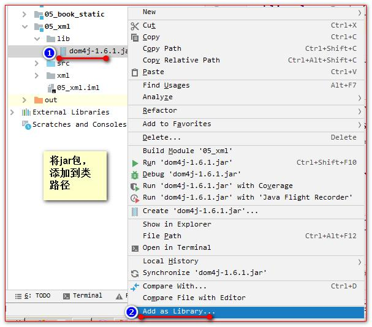

# 第三章 XML

## 2.1 XML

xml 是可扩展的标记性语言，主要用于： 

1、用来保存数据，而且这些数据具有自我描述性。

2、做为项目或模块的配置文件 。

3、做为网络传输数据的格式（现在 JSON 为主）。

### 2.1.1 XML语法

#### 2.1.1.1 语法规则

1、所有 XML 元素都须有关闭标签

​		示例：

```xml
<p>This is another paragraph</p>
```

声明不属于XML本身的组成部分。它不是 XML 元素，也不需要关闭标签。

2、XML 标签对大小写敏感

3、XML 必须正确地嵌套

​		在 HTML 中，常会看到没有正确嵌套的元素：

```html
<b><i>This text is bold and italic</b></i>
```

​		在 XML 中，所有元素都必须彼此正确地嵌套

4、XML 文档必须有根元素

XML 文档必须有一个元素是所有其他元素的父元素。该元素称为根元素，该标签没有父标签的元素，因此又叫顶级元素，而且是唯一一个才行。

​		示例：

```xml
<root>
  <child>
    <subchild>.....</subchild>
  </child>
</root>
```

5、XML 的属性值须加引号

#### 2.1.1.2 文档声明

示例：

```xml
<?xml version="1.0" encoding="UTF-8"?>
```

其中，

| 属性                | 解释                                   |
| ------------------- | -------------------------------------- |
| version             | 版本号                                 |
| encoding            | xml 的文件编码                         |
| standalone="yes/no" | 表示这个 xml 文件是否是独立的 xml 文件 |

#### 2.1.1.3 XML 注释

语法：

```xml
<!-- 注释内容  -->
```

#### 2.1.1.4 实体引用

在 XML 中，一些字符拥有特殊的意义。

如果你把字符 "<" 放在 XML 元素中，会发生错误，这是因为解析器会把它当作新元素的开始。

这样会产生 XML 错误：

```xml
<message>if salary < 1000 then</message>
```

为了避免这个错误，请用一个实体引用来代替 "<" 字符：

```xml
<message>if salary &lt; 1000 then</message> 
```

在 XML 中，有 5 个预定义的实体引用：


注释：在 XML 中，只有字符 "<" 和 "&" 确实是非法的。大于号是合法的，但是用实体引用来代替它是一个好习惯。

除此之外，还可以通过CDATA

#### 2.1.1.5 CDATA

语法：

```xml
<![CDATA[
	文本内容
]]>
```

CDATA 内部的所有东西都会被解析器忽略。

#### 2.1.1.6 示例

```xml
<?xml version="1.0" encoding="utf-8" ?>
<!-- xml声明 version是版本的意思   encoding是编码  -->
<books> <!-- 这是xml注释 -->
	<book id="SN123123413241"> <!-- book标签描述一本图书   id属性描述 的是图书 的编号  -->
		<name>java编程思想</name> <!-- name标签描述 的是图书 的信息 -->
		<author>华仔</author>		<!-- author单词是作者的意思 ，描述图书作者 -->
		<price>9.9</price>		<!-- price单词是价格，描述的是图书 的价格 -->
	</book>
	<book id="SN12341235123">	<!-- book标签描述一本图书   id属性描述 的是图书 的编号  -->
		<name>葵花宝典</name>	<!-- name标签描述 的是图书 的信息 -->
		<author>班长</author>	<!-- author单词是作者的意思 ，描述图书作者 -->
		<price>5.5</price>	<!-- price单词是价格，描述的是图书 的价格 -->
	</book>
</books>
```

### 2.1.2 XML 树结构

XML 文档形成了一种树结构，它从“根部”开始，然后扩展到“枝叶”。


XML 文档必须包含根元素。该元素是所有其他元素的父元素。

父、子以及同胞等术语用于描述元素之间的关系。父元素拥有子元素。相同层级上的子元素成为同胞（兄弟或姐妹）。

所有元素均可拥有子元素。

所有元素均可拥有文本内容和属性（类似 HTML 中）。

示例：

```xml
<!-- 第一行是 XML 声明。它定义 XML 的版本 (1.0) 和所使用的编码 (ISO-8859-1 = Latin-1/西欧字符集)。 -->
<?xml version="1.0" encoding="ISO-8859-1"?>
<!-- 下一行描述文档的根元素 -->
<note>
  <!-- 接下来 4 行描述根的 4 个子元素 -->
	<to>George</to>
	<from>John</from>
	<heading>Reminder</heading>
	<body>Don't forget the meeting!</body>
<!-- 最后一行定义根元素的结尾 -->
</note>
```

### 2.1.2 XML 元素

XML 元素指的是从（且包括）开始标签直到（且包括）结束标签的部分。

#### 2.1.2.1 XML 命名规则

名称可以含字母、数字以及其他的字符 

名称不能以数字或者标点符号开始 

名称不能以字符 “xml”（或者 XML、Xml）开始 

名称不能包含空格

可使用任何名称，没有保留的字词。

#### 2.1.2.2 XML 中的元素（标签）也 分成 单标签和双标签

单标签

```
<标签名 属性=”值” 属性=”值” ...... />
```

 双标签

```
< 标签名 属性=”值” 属性=”值” ......>文本数据或子标签</标签名>
```

示例：


### 2.1.3 XML解析技术——dom4j（重点）

dom4j是一个Java的XML API，用来读写XML文件。

#### 2.1.3.1 dom4j常用目录

| 目录 | 说明                |
| ---- | ------------------- |
| docs | dom4j的文档的目录   |
| lib  | dom4j依赖的第三方库 |
| src  | dom4j的源码         |

#### 2.1.3.2 dom4j 操作 XML 文档过程

第一步，先加载 xml 文件创建 Document 对象

第二步，通过 Document 对象拿到根元素对象

第三步，通过根元素.elelemts(标签名); 可以返回一个集合，这个集合里放着。所有你指定的标签名的元素对象

第四步，找到你想要修改、删除的子元素，进行相应在的操作

第五步，保存到硬盘上

#### 2.1.3.3 示例

##### 2.1.3.3.1 准备

1、创建一个 lib 目录，并添加 dom4j 的 jar 包。并添加到类路径。



2、然后再创建一个Book类，与Book标签形成对应。

##### 2.1.3.3.2 解析获取 Document 对象的代码，遍历标签，获取所有标签中的内容

需要分四步操作:

第一步，通过创建 SAXReader 对象。来读取 xml 文件，获取 Document 对象

第二步，通过 Document 对象。拿到 XML 的根元素对象

第三步，通过根元素对象。获取所有的 book 标签对象

第四小，遍历每个 book 标签对象。然后获取到 book 标签对象内的每一个元素，再通过 getText() 方法拿到起始标签和结 束标签之间的文本内容

其中

Document 对象代表整个 XML 文档。Document 对象是一棵文档树的根，可为我们提供对文档数据的最初（或最顶层）的访问入口。用于元素节点、文本节点、注释、处理指令等均无法存在于 document 之外，document 对象同样提供了创建这些对象的方法。

##### 2.1.3.3.3 示例

需解析的 books.xml 文件内容

```xml
<?xml version="1.0" encoding="UTF-8"?>
<books>
    <book sn="SN12341232">
        <name>辟邪剑谱</name>
        <price>9.9</price>
        <author>班主任</author>
    </book>
    <book sn="SN12341231">
        <name>葵花宝典</name>
        <price>99.99</price>
        <author>班长</author>
    </book>
</books>
```

Book.java

```java
package com.atnibamaitay.pojo;

import java.math.BigDecimal;

public class Book {
    private String sn;
    private String name;
    private BigDecimal price;
    private String author;

    public Book(String sn, String name, BigDecimal price, String author) {
        this.sn = sn;
        this.name = name;
        this.price = price;
        this.author = author;
    }

    public Book() {
    }

    public String getSn() {
        return sn;
    }

    public void setSn(String sn) {
        this.sn = sn;
    }

    public String getName() {
        return name;
    }

    public void setName(String name) {
        this.name = name;
    }

    public BigDecimal getPrice() {
        return price;
    }

    public void setPrice(BigDecimal price) {
        this.price = price;
    }

    public String getAuthor() {
        return author;
    }

    public void setAuthor(String author) {
        this.author = author;
    }

    @Override
    public String toString() {
        return "Book{" +
                "sn='" + sn + '\'' +
                ", name='" + name + '\'' +
                ", price=" + price +
                ", author='" + author + '\'' +
                '}';
    }
}
```

Dom4jTest.java

```java
package com.atnibamaitay.pojo;

import org.dom4j.Document;
import org.dom4j.DocumentException;
import org.dom4j.Element;
import org.dom4j.io.SAXReader;
import org.junit.Test;

import java.util.List;

public class Dom4jTest {
    /** 读取 xml 文件中的内容 */
    @Test
    public void readXML() throws DocumentException {
        // 需要分四步操作:
      
        // 第一步，通过创建 SAXReader 对象。来读取 xml 文件，获取 Document 对象
        SAXReader reader = new SAXReader();
        Document document = reader.read("src/books.xml");

        // 第二步，通过 Document 对象。拿到 XML 的根元素对象
        Element root = document.getRootElement();
        // 打印测试
        // Element.asXML() 它将当前元素转换成为 String 对象
        System.out.println( root.asXML() );
        System.out.println("1.——————————————————————————————————————");

        // 第三步，通过根元素对象。获取所有的 book 标签对象 
        // Element.elements(标签名)它可以拿到当前元素下的指定的子元素的集合
        List<Element> books = root.elements("book");
      
        // 第四步，遍历每个 book 标签对象。然后获取到 book 标签对象内的每一个元素，
        for (Element book : books) {
            // 测试
            System.out.println(book.asXML());
            // 拿到 book 下面的 name 元素对象
            Element nameElement = book.element("name");
            // 拿到 book 下面的 price 元素对象
            Element priceElement = book.element("price");
            // 拿到 book 下面的 author 元素对象
            Element authorElement = book.element("author");
            // 再通过 getText() 方法拿到起始标签和结束标签之间的文本内容
            System.out.println("书名:《" + nameElement.getText() + "》, 价格:" + priceElement.getText() + ", 作者：" + authorElement.getText());
            System.out.println("2.——————————————————————————————————————");
        }
    }
}
```

输出：

```
<books>
    <book sn="SN12341232">
        <name>辟邪剑谱</name>
        <price>9.9</price>
        <author>班主任</author>
    </book>
    <book sn="SN12341231">
        <name>葵花宝典</name>
        <price>99.99</price>
        <author>班长</author>
    </book>
</books>
1.——————————————————————————————————————
<book sn="SN12341232">
        <name>辟邪剑谱</name>
        <price>9.9</price>
        <author>班主任</author>
    </book>
书名:《辟邪剑谱》, 价格:9.9, 作者：班主任
2.——————————————————————————————————————
<book sn="SN12341231">
        <name>葵花宝典</name>
        <price>99.99</price>
        <author>班长</author>
    </book>
书名:《葵花宝典》, 价格:99.99, 作者：班长
2.——————————————————————————————————————
```
