# 第五章 Servlet

Servlet 是运行在 Web 服务器中的小型 Java 程序，它可以通常通过 HTTP 接收客户端发送过来的请求，并响应数据给客户端。

Servlet 是 JavaEE 规范之一（规范就是接口）。

## 5.1 手动实现 Servlet 程序

1、编写一个类去实现 Servlet 中的五个接口

示例：HelloServlet.java

```java
package com.atnibamaitay.servlet;

import javax.servlet.*;
import java.io.IOException;

public class HelloServlet implements Servlet {
    @Override
    public void init(ServletConfig servletConfig) throws ServletException {

    }

    @Override
    public ServletConfig getServletConfig() {
        return null;
    }

    @Override
    public void service(ServletRequest servletRequest, ServletResponse servletResponse) throws ServletException, IOException {
      
    }

    @Override
    public String getServletInfo() {
        return null;
    }

    @Override
    public void destroy() {

    }
}
```

2、实现 service 方法，处理请求，并响应数据 

3、到 web.xml 中配置 servlet 程序的访问地址

示例：

```xml
<!-- servlet标签给Tomcat配置Servlet程序 -->
<servlet>
    <!--servlet-name标签 Servlet程序起一个别名（一般是类名） -->
    <servlet-name>HelloServlet</servlet-name>
    <!--servlet-class是Servlet程序的全类名-->
    <servlet-class>com.atnibamaitay.servlet.HelloServlet</servlet-class>
</servlet>
<!--servlet-mapping标签给servlet程序配置访问地址-->
<servlet-mapping>
    <!--servlet-name标签的作用是告诉服务器，我当前配置的地址给哪个Servlet程序使用-->
    <servlet-name>HelloServlet</servlet-name>
    <!--
        url-pattern标签配置访问地址
           /        斜杠在服务器解析的时候，表示地址为：http://ip:port/工程路径
           /hello   表示地址为：http://ip:port/工程路径/hello
    -->
    <url-pattern>/hello</url-pattern>
</servlet-mapping>
```

然后才能通过 http://ip:port/工程路径/hello 来调用这个servlet。


## 5.2 url 地址到 Servlet 程序的访问

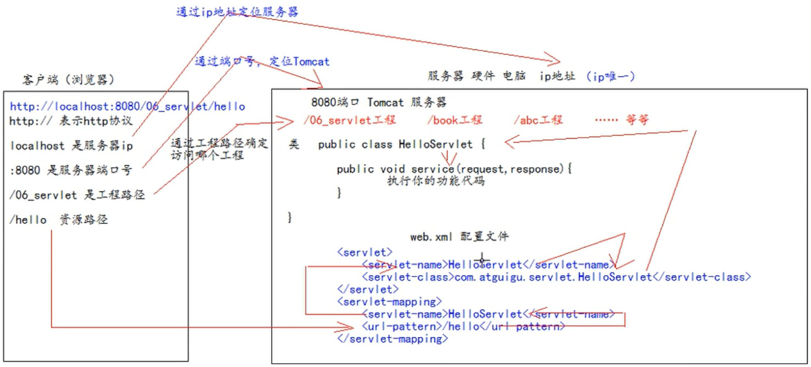


## 5.3 Servlet的生命周期

### 5.3.1 步骤

1. 执行 Servlet 构造器方法

2. 执行 init 初始化方法

   1 和 2 是在第一次访问时创建 Servlet 程序会调用。

3. 执行 service 方法

   第三步，每次访问都会调用。

4. 执行 destroy 销毁方法

   4 是在 web 工程停止的时候才调用。

### 5.3.2 写Servlet的三种方式

#### 5.3.2.1 实现Servlet接口

#####  5.3.2.1.1 代码

servlet.java

```java
import javax.servlet.*;
import javax.servlet.http.HttpServletRequest;
import java.io.IOException;

public class HelloServlet implements Servlet {

    public HelloServlet() {
        System.out.println("1 构造器方法");
    }

    @Override
    public void init(ServletConfig servletConfig) throws ServletException {
        System.out.println("2 init初始化方法");
    }

    @Override
    public ServletConfig getServletConfig() {
        return null;
    }

    /**
     * service方法是专门用来处理请求和响应的
     * @param servletRequest
     * @param servletResponse
     * @throws ServletException
     * @throws IOException
     */
    @Override
    public void service(ServletRequest servletRequest, ServletResponse servletResponse) throws ServletException, IOException {
        System.out.println("3 service === Hello Servlet 被访问了");

        //servletRequest无法直接使用getMethod()方法，因为它此时是ServletRequest类型的，只有ServletRequest的HttpServletRequest才有getMethod()方法，因此需要进行强制转换类型，转为HttpServletRequest，才能调用getMethod()来获取客户端发送的请求的方式是get还是post还是啥。
        HttpServletRequest httpServletRequest = (HttpServletRequest) servletRequest;
        // 获取请求的方式
        String method = httpServletRequest.getMethod();

        //service方法只有一个，但请求方式有多个，比如GET和POST，这时可以加个判断条件分别执行。
        if ("GET".equals(method)) {
            doGet();
        } else if ("POST".equals(method)) {
           doPost();
        }
    }

    /**
     * 做get请求的操作
     */
    public void doGet(){
        System.out.println("  get请求");
        System.out.println("  get请求");
    }
    /**
     * 做post请求的操作
     */
    public void doPost(){
        System.out.println("  post请求");
        System.out.println("  post请求");
    }


    @Override
    public String getServletInfo() {
        return null;
    }

    @Override
    public void destroy() {
        System.out.println("4 . destroy销毁方法");
    }
}
```

web.xml

```xml
<servlet>
    <servlet-name>HelloServlet</servlet-name>
    <servlet-class>servlet.HelloServlet</servlet-class>
</servlet>
<servlet-mapping>
    <servlet-name>HelloServlet</servlet-name>
    <url-pattern>/hello</url-pattern>
</servlet-mapping>
```

输出：

```
1 构造器方法
2 init初始化方法
3 service === Hello Servlet 被访问了
  post请求
  post请求
4 . destroy销毁方法
```

#### 5.3.2.2 通过继承 HttpServlet 实现 Servlet 程序

在实际开发中，Servlet 其实应该这么写，而不是5.3的方式。

##### 5.3.2.2.1 思路

一般在实际项目开发中，都是使用继承 HttpServlet 类的方式去实现 Servlet 程序。

1、编写一个类去继承 HttpServlet 类

2、根据业务需要重写（快捷键：alt+Insert） doGet 或 doPost 方法

3、到 web.xml 中的配置 Servlet 程序的访问地址

##### 5.3.2.2.2 代码

HelloServlet2.java

```java
import javax.servlet.ServletConfig;
import javax.servlet.ServletException;
import javax.servlet.http.HttpServlet;
import javax.servlet.http.HttpServletRequest;
import javax.servlet.http.HttpServletResponse;
import java.io.IOException;

public class HelloServlet2 extends HttpServlet {

    @Override
    public void init(ServletConfig config) throws ServletException {
        super.init(config);
        System.out.println("重写了init初始化方法,做了一些工作");
    }

    /**
     * doGet（）在get请求的时候调用
     * @param req
     * @param resp
     * @throws ServletException
     * @throws IOException
     */
    @Override
    protected void doGet(HttpServletRequest req, HttpServletResponse resp) throws ServletException, IOException {
        //打开这个注释将会出现状态码为500的错误，代表内部代码错误。
        //int i =  12 / 0;

        System.out.println("HelloServlet2 的doGet方法");
        // 也可以使用.
        ServletConfig servletConfig = getServletConfig();
        System.out.println(servletConfig);

        // 2、获取初始化参数init-param
        System.out.println("初始化参数username的值是;" + servletConfig.getInitParameter("username"));
        System.out.println("初始化参数url的值是;" + servletConfig.getInitParameter("url"));
    }
  
    /**
     * doPost（）在post请求的时候调用
     * @param req
     * @param resp
     * @throws ServletException
     * @throws IOException
     */
    @Override
    protected void doPost(HttpServletRequest req, HttpServletResponse resp) throws ServletException, IOException {
        System.out.println("HelloServlet2 的doPost方法");
    }
}
```

web.xml

```xml
<servlet>
    <servlet-name>HelloServlet2</servlet-name>
    <servlet-class>servlet.HelloServlet2</servlet-class>
</servlet>
<servlet-mapping>
    <servlet-name>HelloServlet2</servlet-name>
    <url-pattern>/hello2</url-pattern>
</servlet-mapping>
```

输出：

```java
重写了init初始化方法,做了一些工作
HelloServlet2 的doPost方法
```

#### 5.3.2.3 使用 IDEA 创建 Servlet 程序

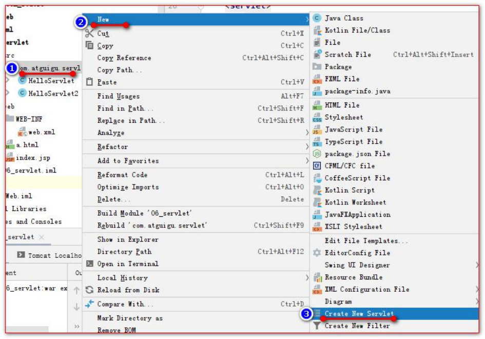


#### 5.3.2.4 附-测试代码

helloworld.html

```html
<!DOCTYPE html>
<html lang="zh_CN">
<head>
    <meta charset="UTF-8">
    <title>Title</title>
</head>
<body>
    <form action="/JavawebStudyTest/helloservlet" method="post">
        <input type="hidden" name="action" value="login" />
        <input type="hidden" name="username" value="root" />
        <input type="submit">
    </form>
</body>
</html>
```


## 5.4 Servlet的继承体系

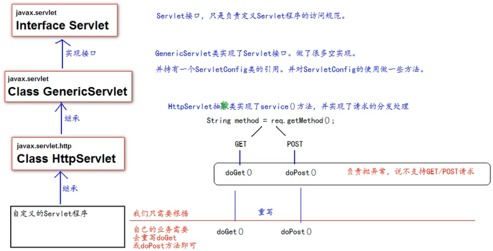


## 5.5 ServletConfig 类

ServletConfig 类是 Servlet 程序的配置信息类。 

Servlet 程序和 ServletConfig 对象都是由 Tomcat 负责创建，我们负责使用。 

Servlet 程序默认是第一次访问的时候创建，ServletConfig 是每个 Servlet 程序创建时，就创建一个对应的 ServletConfig 对象。

### 5.5.1 三大作用

1、可以获取 Servlet 程序的别名，即 servlet-name 的值

2、获取其自身的初始化参数 init-param，别的servlet 的初始化参数是无法获取的。

3、获取 ServletContext 对象

 ### 5.5.2 代码

HelloServlet.java

```java
public void init(ServletConfig servletConfig) throws ServletException {
    System.out.println("2 init初始化方法");

    //1、可以获取Servlet程序的别名servlet-name的值
    System.out.println("  HelloServlet程序的别名是：" + servletConfig.getServletName());
    //2、获取初始化参数init-param
    System.out.println("  初始化参数username的值是：" + servletConfig.getInitParameter("username"));
    System.out.println("  初始化参数url的值是：" + servletConfig.getInitParameter("url"));
    //3、获取ServletContext对象
    System.out.println("  "+servletConfig.getServletContext());
}
```

web.xml

```xml
<servlet>
    <!--servlet-name标签 Servlet程序起一个别名（一般是类名） -->
    <servlet-name>HelloServlet</servlet-name>
    <!--servlet-class是Servlet程序的全类名-->
    <servlet-class>servlet.HelloServlet</servlet-class>
    <!--init-param是初始化参数-->
    <!--每个servlet对应的参数别的servlet无法获取，只能配置自己-->
    <init-param>
        <!--是参数名-->
        <param-name>username</param-name>
        <!--是参数值-->
        <param-value>root</param-value>
    </init-param>
    <!--init-param是初始化参数-->
    <init-param>
        <!--是参数名-->
        <param-name>url</param-name>
        <!--是参数值-->
        <param-value>jdbc:mysql://localhost:3306/test</param-value>
    </init-param>
</servlet>
```

输出：

```
2 init初始化方法
  HelloServlet程序的别名是：HelloServlet
  初始化参数username的值是：root
  初始化参数url的值是：jdbc:mysql://localhost:3306/test
  org.apache.catalina.core.ApplicationContextFacade@aefb5e3
```

### 5.5.3 一个要注意的地方

重写init方法之后，一定要注意调用super.init(config)方法，否则会报空指针异常，因为当之类也有init父类也有init时，调用的是子类的，而父类写的则会丢失。

```java
@Override
public void init(ServletConfig config) throws ServletException {
    super.init(config);
    System.out.println("重写了init初始化方法,做了一些工作");
}
```


## 5.6 ServletContext 类

1、ServletContext 是一个接口，它表示 Servlet 上下文对象。

2、一个 web 工程，只有一个 ServletContext 对象实例。 

3、ServletContext 对象是一个域对象。 

域对象，是可以像 Map 一样存取数据的对象，叫域对象。 这里的域指的是存取数据的操作范围，整个 web 工程。

|        | 存数据         | 取数据         | 删除数据           |
| ------ | -------------- | -------------- | ------------------ |
| Map    | put()          | get()          | remove()           |
| 域对象 | setAttribute() | getAttribute() | removeAttribute(); |

4、ServletContext 是在 web 工程部署启动的时候创建，在 web 工程停止的时候销毁。 

### 5.6.1 作用

1、获取 web.xml 中配置的上下文参数 context-param 

2、获取当前的工程路径，格式：/工程路径 

3、获取工程部署后在服务器硬盘上的绝对路径，即web目录的路径

4、像 Map 一样存取数据

### 5.6.2 代码（作用1-3）

```java
public class ContextServlet extends HttpServlet {
    protected void doGet(HttpServletRequest request, HttpServletResponse response) throws ServletException, IOException {
        //1、获取web.xml中配置的上下文参数context-param
        ServletContext context = getServletConfig().getServletContext();

        String username = context.getInitParameter("username");
        System.out.println("context-param参数username的值是:" + username);
        System.out.println("context-param参数password的值是:" + context.getInitParameter("password"));
        //2、获取当前的工程路径，格式: /工程路径
        System.out.println( "当前工程路径:" + context.getContextPath() );
        //3、获取工程部署后在服务器硬盘上的绝对路径
        /**
         *  / 斜杠被服务器解析地址为:http://ip:port/工程名/  映射到IDEA代码的web目录<br/>
         */
        System.out.println("工程部署的路径是:" + context.getRealPath("/"));
        System.out.println("工程下css目录的绝对路径是:" + context.getRealPath("/css"));
        System.out.println("工程下imgs目录1.jpg的绝对路径是:" + context.getRealPath("/imgs/1.jpg"));
    }
}
```

web.xml

```xml
<!--context-param是上下文参数(它属于整个web工程)-->
<context-param>
    <param-name>username</param-name>
    <param-value>context</param-value>
</context-param>
  <!--context-param是上下文参数(它属于整个web工程)-->
<context-param>
    <param-name>password</param-name>
    <param-value>root</param-value>
</context-param>

<servlet>
    <servlet-name>ContextServlet</servlet-name>
    <servlet-class>com.atguigu.servlet.ContextServlet</servlet-class>
</servlet>
<servlet-mapping>
    <servlet-name>ContextServlet</servlet-name>
    <url-pattern>/contextServlet</url-pattern>
</servlet-mapping>
```

输出：

```
context-param参数username的值是:context
context-param参数password的值是:root
当前工程路径:/JavawebStudyTest
工程部署的路径是:A:\Project\Study\JavawebStudyTest\out\artifacts\JavawebStudyTest\
工程下css目录的绝对路径是:A:\Project\Study\JavawebStudyTest\out\artifacts\JavawebStudyTest\css
工程下imgs目录1.jpg的绝对路径是:A:\Project\Study\JavawebStudyTest\out\artifacts\JavawebStudyTest\imgs\1.jpg
```

### 5.6.3 代码（作用4）

ContextServlet1.java

```java
public class ContextServlet1 extends HttpServlet {
    protected void doGet(HttpServletRequest request, HttpServletResponse response) throws ServletException, IOException {
        // 获取ServletContext对象
        ServletContext context = getServletContext();
        System.out.println(context);
        System.out.println("保存之前: Context1 获取 key1的值是:"+ context.getAttribute("key1"));

        context.setAttribute("key1", "value1");

        System.out.println("Context1 中获取域数据key1的值是:"+ context.getAttribute("key1"));
    }
}
```

ContextServlet2.java

```java
public class ContextServlet2 extends HttpServlet {
    protected void doGet(HttpServletRequest request, HttpServletResponse response) throws ServletException, IOException {
        ServletContext context = getServletContext();
        System.out.println(context);
        System.out.println("Context2 中获取域数据key1的值是:"+ context.getAttribute("key1"));
    }
}
```

web.xml

```xml
<servlet>
    <servlet-name>ContextServlet1</servlet-name>
    <servlet-class>com.atnibamaitay.servlet.ContextServlet1</servlet-class>
</servlet>

<servlet>
    <servlet-name>ContextServlet2</servlet-name>
    <servlet-class>com.atnibamaitay.servlet.ContextServlet2</servlet-class>
</servlet>

<servlet-mapping>
    <servlet-name>ContextServlet1</servlet-name>
    <url-pattern>/context1</url-pattern>
</servlet-mapping>

<servlet-mapping>
    <servlet-name>ContextServlet2</servlet-name>
    <url-pattern>/context2</url-pattern>
</servlet-mapping>
```

输出：

先调用ContextServlet1（http://localhost:8080/JavawebStudyTest/context1）

```
org.apache.catalina.core.ApplicationContextFacade@1fd9e338
保存之前: Context1 获取 key1的值是:null
Context1 中获取域数据key1的值是:value1
```

然后再调用ContextServlet2

```
org.apache.catalina.core.ApplicationContextFacade@1fd9e338
Context2 中获取域数据key1的值是:value1
```

再调用ContextServlet1

```
org.apache.catalina.core.ApplicationContextFacade@1fd9e338
保存之前: Context1 获取 key1的值是:value1
Context1 中获取域数据key1的值是:value1
```

可以发现，①对象的地址是一样的，因为一个web工程只能有一个；②key1的值在ContextServlet2也可以获取到；③第一次调用ContextServlet1时，输出的key1先是null，之后创建成功后，再次调用ContextServlet1时，输出的key1就是value1了。


## 5.7 HTTP 协议

客户端和服务器之间通信时，发送的数据，需要遵守的规则，叫 HTTP 协议。 

HTTP 协议中的数据又叫报文。

### 5.7.1 请求的 HTTP 协议格式

客户端给服务器发送数据叫请求。 

服务器给客户端回传数据叫响应。 

请求又分为 GET 和 POST 请求两种

#### 5.7.1.1 GET

1、请求行 

(1) 请求的方式                                   GET 

(2) 请求的资源路径[+?+请求参数] 

(3) 请求的协议的版本号                      HTTP/1.1 

2、请求头 

key : value 组成，不同的键值对表示不同的含义。

##### 5.7.1.1.1 GET请求HTTP协议内容

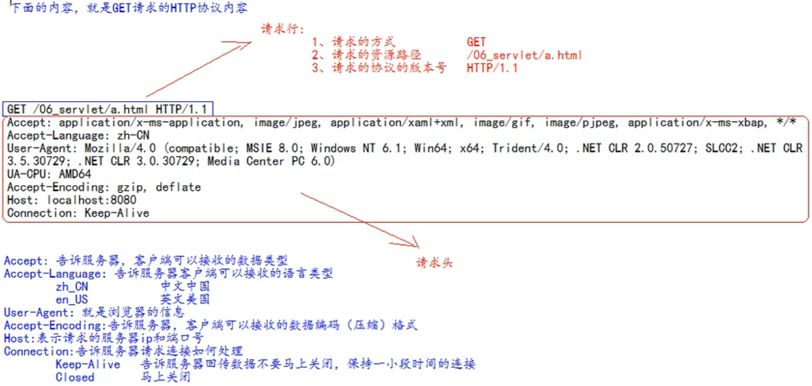

#### 5.7.1.2 POST

1、请求行

(1) 请求的方式                                  POST 

(2) 请求的资源路径[+?+请求参数] 

(3) 请求的协议的版本号                    HTTP/1.1 

2、请求头

key : value 不同的请求头有不同的含义

2和3中间通常有空行隔开

3、请求体

就是发送给服务器的数据

##### 5.7.1.2.1 POST请求HTTP协议内容

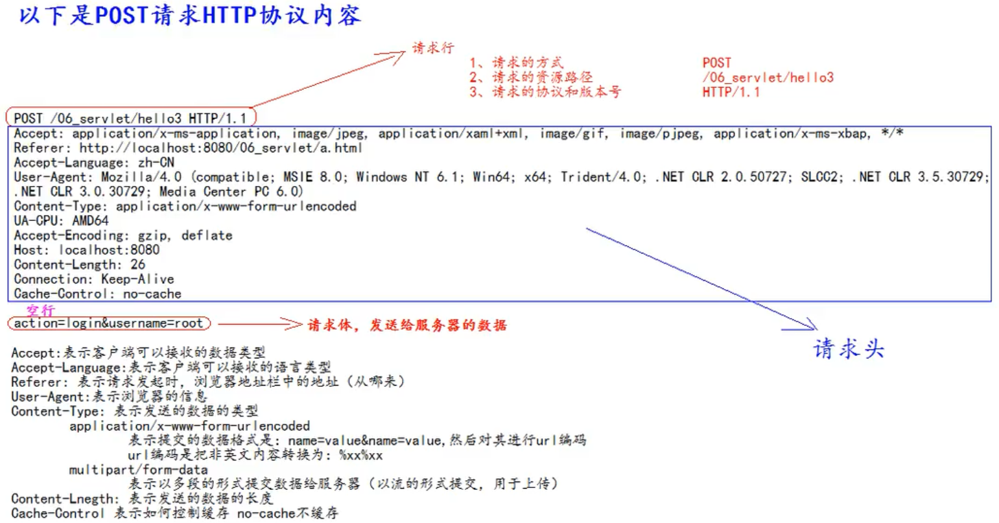

#### 5.7.1.3 常用请求头

Accept: 表示客户端可以接收的数据类型 

Accpet-Languege: 表示客户端可以接收的语言类型 

User-Agent: 表示客户端浏览器的信息 

Host： 表示请求时的服务器 ip 和端口号

#### 5.7.1.4 哪些是 GET 请求，哪些是 POST 请求

GET 请求有哪些： 

1、form 标签 method=get 

2、a 标签 

3、link 标签引入 css 

4、Script 标签引入 js 文件 

5、img 标签引入图片 

6、iframe 引入 html 页面 

7、在浏览器地址栏中输入地址后敲回车 

POST 请求有哪些： 

8、form 标签 method=post

### 5.7.2 响应的 HTTP 协议格式

1、响应行 

(1) 响应的协议和版本号 

(2) 响应状态码 

(3) 响应状态描述符 

2、响应头 

key : value ，不同的响应头，有其不同含义

2和3之间有个空行

3、响应体

就是回传给客户端的数据

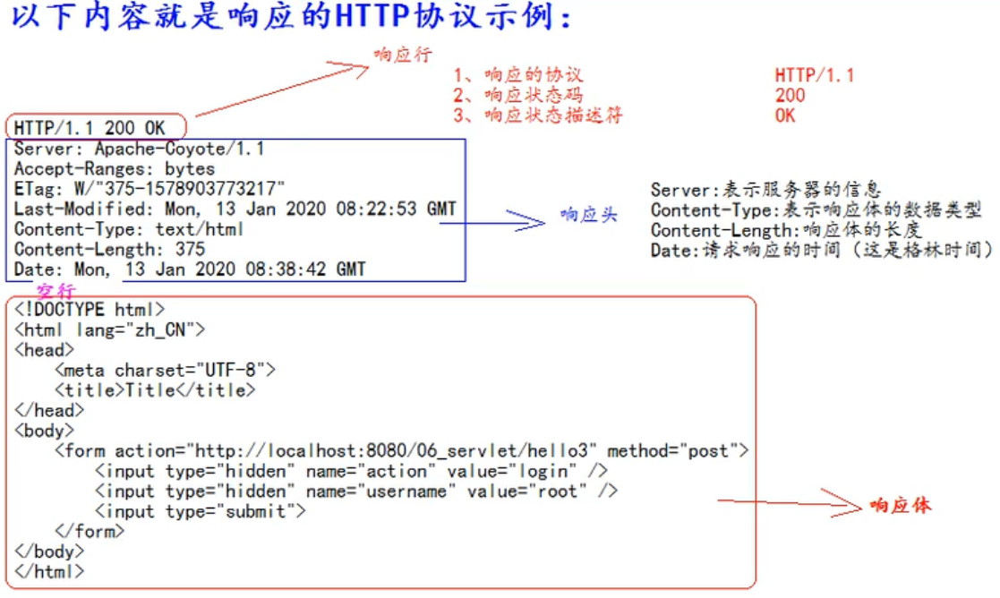

### 5.7.3 常用的响应码说明

| 状态码 | 说明                                                         |
| ------ | ------------------------------------------------------------ |
| 200    | 表示请求成功                                                 |
| 302    | 表示请求重定向（明天讲）                                     |
| 404    | 表示请求服务器已经收到了，但是你要的数据不存在（请求地址错误） |
| 500    | 表示服务器已经收到请求，但是服务器内部错误（代码错误）       |

### 5.7.4 MIME（Multipurpose Internet Mail Extensions） 类型说明

MIME 是 多功能 Internet 邮件扩充服务，是HTTP 协议中数据类型。MIME 类型的格式是“大类型/小类型”，并与某一种文件的扩展名相对应。

常见的 MIME 类型： 

| 文件               | MINE类型         | MINE类型 |
| ------------------ | ---------------- | ----------------------- |
| 超文本标记语言文本 | .html, .htm      | text/html               |
| 普通文本           | .txt       | text/plain              |
| RTF 文本           | .rtf       | application/rtf         |
| GIF 图形           | .gif       | image/gif               |
| JPEG 图形          | .jpeg,.jpg | image/jpeg              |
| au 声音文件        | .au        | audio/basic             |
| MIDI 音乐文件      | mid,.midi  | audio/midi,audio/x-midi |
| RealAudio 音乐文件 | .ra, .ram  | audio/x-pn-realaudio    |
| MPEG 文件          | .mpg,.mpeg | video/mpeg              |
| AVI 文件           | .avi       | video/x-msvideo         |
| GZIP 文件          | .gz        | application/x-gzip      |
| TAR 文件           | .tar             | application/x-tar       |

### 5.7.5 Chrome和Firefox如何查看HTTP协议

#### 5.7.5.1 Chrome查看方法

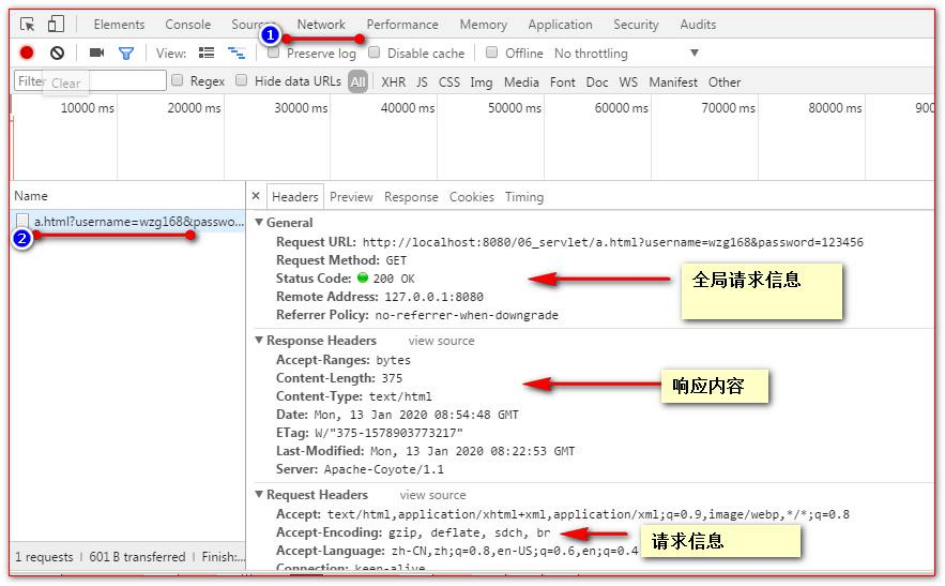

#### 5.7.5.2 Firefox查看方法

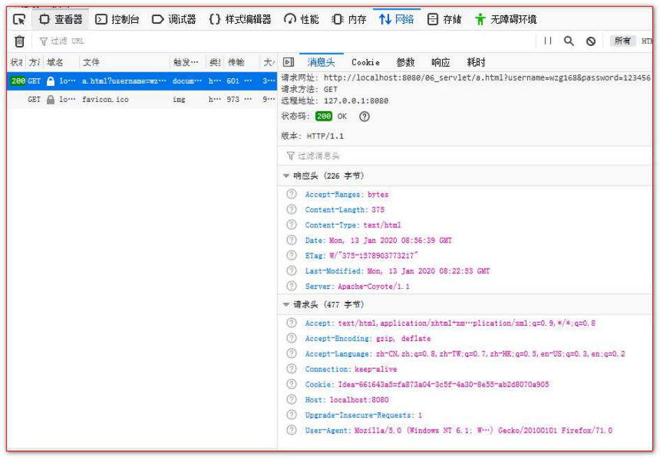


## 5.8 HttpServletRequest类

每次只要有请求进入 Tomcat 服务器，Tomcat 服务器就会把请求过来的 HTTP 协议信息解析好封装到 Request 对象中。 然后传递到 service 方法（doGet 和 doPost）中给我们使用。我们可以通过 HttpServletRequest 对象，获取到所有请求的 信息。

### 5.8.1 常用方法

| 方法                     | 作用                                 |
| ------------------------ | ------------------------------------ |
| getRequestURI()          | 获取请求的资源路径                   |
| getRequestURL()          | 获取请求的统一资源定位符（绝对路径） |
| getRemoteHost()          | 获取客户端的 ip 地址                 |
| getHeader()              | 获取请求头                           |
| getParameter()           | 获取请求的参数                       |
| getParameterValues()     | 获取请求的参数（多个值的时候使用）   |
| getMethod()              | 获取请求的方式 GET 或 POST           |
| setAttribute(key, value) | 设置域数据                           |
| getAttribute(key)        | 获取域数据                           |
| getRequestDispatcher()   | 获取请求转发对象                     |

#### 5.8.1.1 代码测试

```java
public class RequestAPIServlet extends HttpServlet {

    @Override
    protected void doGet(HttpServletRequest req, HttpServletResponse resp) throws ServletException, IOException {
        System.out.println("URI：" + req.getRequestURI());    //getRequestURI()	获取请求的资源路径
        System.out.println("URL：" + req.getRequestURL());    //getRequestURL()	获取请求的统一资源定位符（绝对路径）
        
        /**
         * 在IDEA中，使用localhost访问时，得到的客户端 ip 地址是 ===>>> 127.0.0.1<br/>
         * 在IDEA中，使用127.0.0.1访问时，得到的客户端 ip 地址是 ===>>> 127.0.0.1<br/>
         * 在IDEA中，使用 真实ip 访问时，得到的客户端 ip 地址是 ===>>> 真实的客户端 ip 地址<br/>
         */
        System.out.println("客户端 ip地址：" + req.getRemoteHost());           //getRemoteHost()	获取客户端的ip地址
        //所输出的0:0:0:0:0:0:0:1是IPV6地址，不是IPV4的，是有误的，百度可解决
        System.out.println("请求头User-Agent：" + req.getHeader("User-Agent"));  //getHeader()	获取请求头
        System.out.println( "请求的方式：" + req.getMethod() );              //getMethod()	获取请求的方式GET或POST
    }
}
```

web.xml配置省略

输出：

```
URI：/JavawebStudyTest/requestAPIServlet
URL：http://localhost:8080/JavawebStudyTest/requestAPIServlet
客户端 ip地址：0:0:0:0:0:0:0:1
请求头User-Agent：Mozilla/5.0 (Windows NT 10.0; Win64; x64) AppleWebKit/537.36 (KHTML, like Gecko) Chrome/97.0.4692.99 Safari/537.36
请求的方式：GET
```

### 5.8.2 获取客户端发送的参数

form.html - \<body>部分的代码（用于发送参数的测试页面）

```html
<body>
    <form action="/JavawebStudyTest/parameterServlet" method="post">
        用户名：<input type="text" name="username"><br/>
        密码：<input type="password" name="password"><br/>
        兴趣爱好：<input type="checkbox" name="hobby" value="cpp">C++
        <input type="checkbox" name="hobby" value="java">Java
        <input type="checkbox" name="hobby" value="js">JavaScript<br/>
        <input type="submit">
    </form>
</body>
```

页面效果

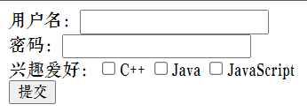

ParameterServlet.java

```java
public class ParameterServlet extends HttpServlet {

    @Override
    protected void doGet(HttpServletRequest req, HttpServletResponse resp) throws ServletException, IOException {
        System.out.println("-------------doGet------------");

        // 获取请求参数
        String username = req.getParameter("username");

        //1 先以iso8859-1进行编码
        //2 再以utf-8进行解码
        username = new String(username.getBytes("iso-8859-1"), "UTF-8");

        String password = req.getParameter("password");
        String[] hobby = req.getParameterValues("hobby");
        
        System.out.println("用户名：" + username);
        System.out.println("密码：" + password);
        System.out.println("兴趣爱好：" + Arrays.asList(hobby));
    }

    @Override
    protected void doPost(HttpServletRequest req, HttpServletResponse resp) throws ServletException, IOException {
        // 在POST请求中，如果用户名为中文，输出的值会乱码
        // 设置请求体的字符集为UTF-8，从而解决POST请求的中文乱码问题
        // 这个API要在获取请求参数之前调用才有效
        req.setCharacterEncoding("UTF-8");

        System.out.println("-------------doPost------------");
        
        // 获取请求参数
        String username = req.getParameter("username");
        String password = req.getParameter("password");
        String[] hobby = req.getParameterValues("hobby");

        System.out.println("用户名：" + username);
        System.out.println("密码：" + password);
        System.out.println("兴趣爱好：" + Arrays.asList(hobby));
    }
}
```

输出：

```
-------------doPost------------
用户名：atnibamaitay@foxmail.com
密码：123456
兴趣爱好：[cpp, java, js]
```

## 5.9 请求转发

请求转发指服务器收到请求后，从一次资源跳转到另一个资源的操作叫请求转发。

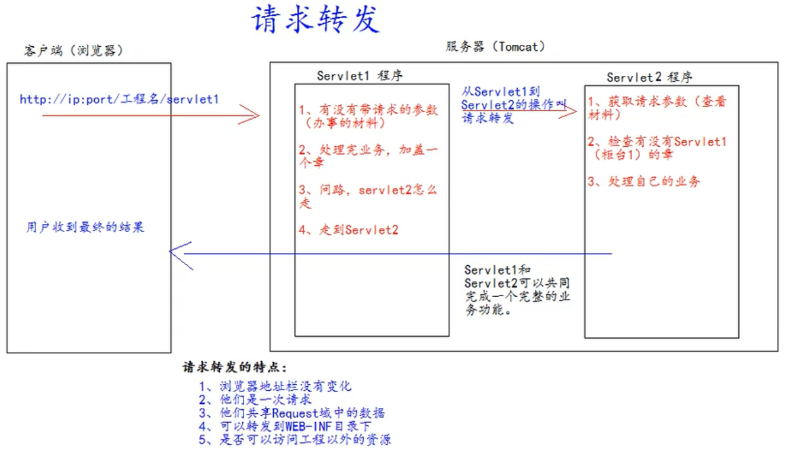

### 5.9.1 代码示例

Servlet1.java

```java
public class Servlet1 extends HttpServlet {
    @Override
    protected void doGet(HttpServletRequest req, HttpServletResponse resp) throws ServletException, IOException {

        // 获取请求的参数（办事的材料）查看
        String username = req.getParameter("username");
        System.out.println("在Servlet1（柜台1）中查看参数（材料）：" + username);

        // 给材料 盖一个章，并传递到Servlet2（柜台 2）去查看
        req.setAttribute("key1","柜台1的章");

        // 问路：Servlet2（柜台 2）怎么走
        /**
         * 请求转发必须要以斜杠打头，/ 斜杠表示地址为：http://ip:port/工程名/ , 映射到IDEA代码的web目录<br/>
         */
        RequestDispatcher requestDispatcher = req.getRequestDispatcher("/servlet2");
        //当html文件在WEB-INF目录下时，无法通过地址直接进入，但是可以通过servlet进入。
        //RequestDispatcher requestDispatcher = req.getRequestDispatcher("/WEB-INF/form.html");
        //实际是访问了 http://ip:port/工程名/http://www.baidu.com
        //RequestDispatcher requestDispatcher = req.getRequestDispatcher("http://www.baidu.com");

        // 走向Sevlet2（柜台 2）
        requestDispatcher.forward(req,resp);

    }
}
```

Servlet2.java

```java
public class Servlet2 extends HttpServlet {
    @Override
    protected void doGet(HttpServletRequest req, HttpServletResponse resp) throws ServletException, IOException {
        // 获取请求的参数（办事的材料）查看
        String username = req.getParameter("username");
        System.out.println("在Servlet2（柜台2）中查看参数（材料）：" + username);

        // 查看 柜台1 是否有盖章
        Object key1 = req.getAttribute("key1");
        System.out.println("柜台1是否有章：" + key1);

        // 处理自己的业务
        System.out.println("Servlet2 处理自己的业务 ");
    }
}
```

web.xml配置省略

访问http://localhost:8080/JavawebStudyTest/servlet1?username=atnibamaitay后，输出：

```
在Servlet1（柜台1）中查看参数（材料）：atnibamaitay
在Servlet2（柜台2）中查看参数（材料）：atnibamaitay
柜台1是否有章：柜台1的章
Servlet2 处理自己的业务 
```

## 5.10 web 中 / 斜杠的不同意义

在 web 中 / 斜杠 是一种绝对路径。

/ 斜杠 如果被浏览器解析，得到的地址是：http://ip:port/ 

```html
<a href="/">斜杠</a> 
```

点击后将会跳转到http://ip:port/

/ 斜杠 如果被服务器解析，得到的地址是：http://ip:port/工程路径 

在xml中

```xml
<url-pattern>/servlet1</url-pattern>
```

在java中

```java
servletContext.getRealPath(“/”);
request.getRequestDispatcher(“/”);
```

特殊情况： 

```java
response.sendRediect(“/”);
```

把斜杠发送给浏览器解析。得到 http://ip:port/

## 5.11 HttpServletResponse类

HttpServletResponse 类和 HttpServletRequest 类一样。每次请求进来，Tomcat 都会创建一个 Response 对象传递给 Servlet 程序去使用。HttpServletRequest 表示请求过来的信息，HttpServletResponse 表示所有响应的信息。若需要设置返回给客户端的信息，都可以通过 HttpServletResponse 对象来进行设置。

### 5.11.1 两个输出流

|        | 方法               | 说明                         |
| ------ | ------------------ | ---------------------------- |
| 字节流 | getOutputStream(); | 常用于下载（传递二进制数据） |
| 字符流 | getWriter();       | 常用于回传字符串（常用）     |

两个流同时只能使用一个。

使用了字节流，就不能再使用字符流，反之亦然，否则就会报错。

### 5.11.2 往客户端回传数据

#### 5.11.2.1 代码示例

ResponseIOServlet.java

```java
public class ResponseIOServlet extends HttpServlet {
    @Override
    protected void doGet(HttpServletRequest req, HttpServletResponse resp) throws ServletException, IOException {
        PrintWriter writer = resp.getWriter();
        writer.write("Hello World！");
    }
}
```

输出效果：

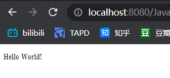

但是有个问题，默认的字符集是ISO-8859-1，因此若内容为中文则会乱码

### 5.11.3 响应的乱码解决

#### 5.11.3.1 方案一（不推荐）

```java
// 设置服务器字符集为UTF-8
resp.setCharacterEncoding("UTF-8");
// 通过响应头，设置浏览器也使用UTF-8字符集
resp.setHeader("Content-Type", "text/html; charset=UTF-8");
```

#### 5.11.3.2 方案二

```java
resp.setContentType("text/html; charset=UTF-8");
```

它会同时设置服务器和客户端都使用UTF-8字符集，还设置了响应头。

此方法一定要在获取流对象之前调用才有效。比如要写在 5.11.2.1 代码示例 中 PrintWriter writer = resp.getWriter(); 之前。

## 5.12 请求重定向

请求重定向，是指客户端给服务器发请求，然后服务器告诉客户端说。我给你一些地址。你去新地址访问。叫请求 重定向（因为之前的地址可能已经被废弃）。


特点：

1、浏览器地址栏会发生变化

2、两次请求

3、不共享Request域中数据

4、不能访问WEB-INF下的资源

5、可以访问工程外的资源

### 5.12.1 方案一

```java
// 设置响应状态码 302 ，表示重定向（已搬迁） 
resp.setStatus(302);
// 设置响应头，说明 新的地址在哪里
resp.setHeader("Location", "http://localhost:8080");
```

### 5.12.2 方案二（推荐）

```java
resp.sendRedirect("http://localhost:8080");
```

