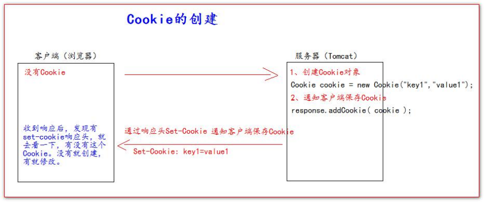
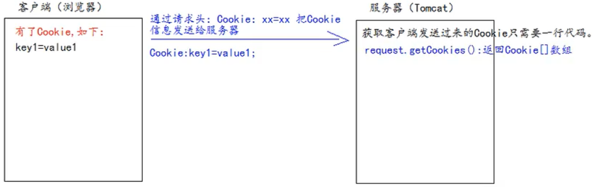
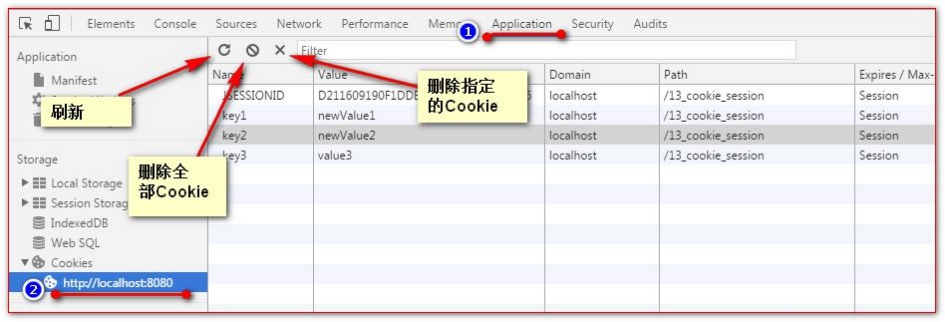
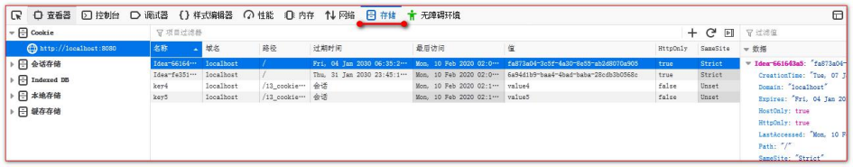
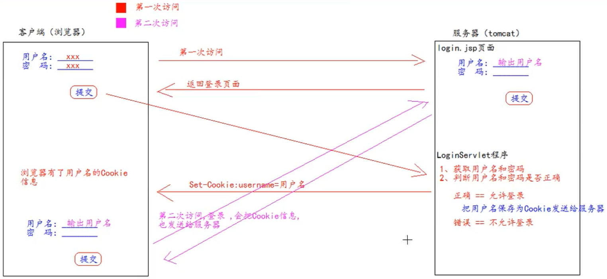
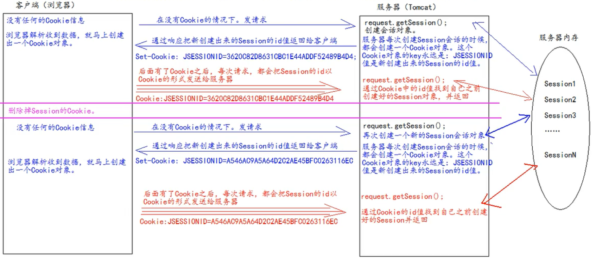

# 第七章 Cookie和Session

## 7.1 Cookie

cookie 是 servlet 发送到 Web 浏览器的少量信息，这些信息由浏览器保存，然后发送回服务器。cookie 的值可以唯一地标识客户端，因此  cookie 常用于会话管理。 

Cookie 是服务器通知客户端保存键值对的一种技术。

客户端有了 Cookie 后，每次请求都发送给服务器。

每个 Cookie 的大小不能超过 4KB。

### 7.1.1 创建Cookie



#### 7.1.1.1 代码实现

CookieServlet.java

```java
protected void createCookie(HttpServletRequest req, HttpServletResponse resp) throws ServletException, IOException {
    //1 创建Cookie对象
    Cookie cookie = new Cookie("key4", "value4");
    //2 通知客户端保存Cookie
    resp.addCookie(cookie);
    //3 同时创建多个Cookie对象
    Cookie cookie1 = new Cookie("key5", "value5");
    resp.addCookie(cookie1);

    resp.getWriter().write("Cookie创建成功");
}
```

##### 7.1.1.1.1 页面输出"Cookie创建成功"乱码问题

BaseServlet.java

```java
protected void doPost(HttpServletRequest req, HttpServletResponse resp) throws ServletException, IOException {
    // 解决响应中文乱码问题（一定要写在其他代码之前）
    resp.setContentType("text/html; charset=UTF-8");
  
    //……其他代码
}
```

### 7.1.2 服务器获取Cookie

服务器获取客户端的 Cookie 只需要一行代码

```java
req.getCookies():Cookie[]
```



#### 7.1.2.1 代码实现

servlet / CookieServlet.java

```java
public class CookieServlet extends BaseServlet {
  
    protected void getCookie(HttpServletRequest req, HttpServletResponse resp) throws ServletException, IOException {
        Cookie[] cookies = req.getCookies();

        //遍历输出Cookie
        for (Cookie cookie : cookies) {
            // getName方法返回Cookie的key（名）
            // getValue方法返回Cookie的value值
            resp.getWriter().write("Cookie[" + cookie.getName() + "=" + cookie.getValue() + "] <br/>");
        }


        Cookie iWantCookie = CookieUtils.findCookie("key1", cookies);

        // getCookies()只能得到全部的Cookie，无法只得到指定的Cookie
        // 解决办法是，加个if，判断是不是所需要的
        // 像这种遍历查找Cookie是非常常用的，因此可以写成一个工具类，而不写在这里
        //for (Cookie cookie : cookies) {
        //      if ("key2".equals(cookie.getName())) {
        //          iWantCookie = cookie;
        //          break;
        //      }
        //}
      
        // 如果不等于 null，说明赋过值，也就是找到了需要的 Cookie
        if (iWantCookie != null) {
            resp.getWriter().write("找到了需要的Cookie");
        }
    }
  
}
```

util / CookieUtils.java

```java
public class CookieUtils {
    /**
     * 查找指定名称的Cookie对象
     * @param name 要找的cookie
     * @param cookies 整个cookies
     * @return 找到就范围cookie，找不到就返回null
     */
    public static Cookie findCookie(String name , Cookie[] cookies){
        //先判断整个cookie是不是空的，如果是不用找了，直接返回
        if (name == null || cookies == null || cookies.length == 0) {
            return null;
        }
      
        //遍历查号，用if对比，看看需不需要
        for (Cookie cookie : cookies) {
            if (name.equals(cookie.getName())) {
                return cookie;
            }
        }
        return null;
    }
}
```

### 7.1.3 修改 Cookie 的值

#### 7.1.3.1 方案一

1、先创建一个要修改的同名（指的就是 key）的 Cookie 对象

2、在构造器，同时赋于新的 Cookie 值。

3、调用 response.addCookie( Cookie );

##### 7.1.3.1.1 代码实现

CookieServlet.java

```java
public class CookieServlet extends BaseServlet {
	protected void updateCookie(HttpServletRequest req, HttpServletResponse resp) throws ServletException, IOException {
        //1、先创建一个要修改的同名的Cookie对象
        //2、在构造器，同时赋于新的Cookie值。
        Cookie cookie = new Cookie("key1","newValue1");
        //3、调用response.addCookie( Cookie ); 通知 客户端 保存修改
        resp.addCookie(cookie);
    
        resp.getWriter().write("key1的Cookie已经修改好");
    }
}
```

#### 7.1.3.2 方案二

1、先查找到需要修改的 Cookie 对象

2、调用 setValue()方法赋于新的 Cookie 值。

3、调用 response.addCookie()通知客户端保存修改

##### 7.1.3.2.1 代码实现

CookieServlet.java

```java
public class CookieServlet extends BaseServlet {
    protected void updateCookie(HttpServletRequest req, HttpServletResponse resp) throws ServletException, IOException {
        //1、先查找到需要修改的Cookie对象
        Cookie cookie = CookieUtils.findCookie("key2", req.getCookies());
        if (cookie != null) {
            //2、调用setValue()方法赋于新的Cookie值。
            cookie.setValue("newValue2");
            //3、调用response.addCookie()通知客户端保存修改
            resp.addCookie(cookie);
        }
      
        resp.getWriter().write("key1的Cookie已经修改好");
    }
}
```

其中，函数public void setValue(String newValue) 是作用是：在创建 cookie 之后将新值分配给 cookie。

如果使用二进制值，则可能需要使用 BASE64 编码。 

对于 Version 0 cookie，值不应包含空格、方括号、圆括号、等号、逗号、双引号、斜杠、问号、at 符号、冒号和分号。空值在所有浏览器上的行为不一定相同。 

### 7.1.4 浏览器查看 Cookie

#### 7.1.4.1 Chrome



#### 7.1.4.2 Firefox



### 7.1.5 Cookie 生命控制

Cookie 的生命控制指的是如何管理 Cookie 什么时候被销毁（删除）

其中 setMaxAge(int expiry) 的作业的：设置 cookie 的最大生存时间，以秒为单位。 

正值表示 cookie 将在经过该值表示的秒数后过期。注意，该值是 cookie 过期的最大 生存时间，不是 cookie 的当前生存时间。 

负值表示浏览器一关，Cookie 就会被删除（默认值是-1）。

零值表示马上删除 Cookie。 

#### 7.1.5.1 存活指定时间（比如一个小时）

```java
public class CookieServlet extends BaseServlet {
    protected void life3600(HttpServletRequest req, HttpServletResponse resp) throws ServletException, IOException {
        Cookie cookie = new Cookie("life3600", "life3600");
        cookie.setMaxAge(60 * 60); // 设置Cookie一小时之后被删除。无效
        resp.addCookie(cookie);

        resp.getWriter().write("已经创建了一个存活一小时的Cookie");
    }
}
```

#### 7.1.5.2 默认存活（浏览器一关就删的cookie）

```java
public class CookieServlet extends BaseServlet {
   /**
     * 默认的会话级别的Cookie
     * @param req
     * @param resp
     * @throws ServletException
     * @throws IOException
     */
    protected void defaultLife(HttpServletRequest req, HttpServletResponse resp) throws ServletException, IOException {
        Cookie cookie = new Cookie("defalutLife","defaultLife");
        cookie.setMaxAge(-1);//设置存活时间
        resp.addCookie(cookie);
    }
}
```

#### 7.1.5.3 直接删除

```java
public class CookieServlet extends BaseServlet {
    protected void deleteNow(HttpServletRequest req, HttpServletResponse resp) throws ServletException, IOException {
        Cookie cookie = CookieUtils.findCookie("key4", req.getCookies());    // 先找到你要删除的Cookie对象
        if (cookie != null) {
            cookie.setMaxAge(0);         // 调用setMaxAge(0),表示马上删除，都不需要等待浏览器关闭
            resp.addCookie(cookie);      // 调用response.addCookie(cookie);

            resp.getWriter().write("key4的Cookie已经被删除");
        }
    }
}
```

### 7.1.6 设置 Cookie 有效路径 Path

Cookie 的 path 属性可以有效的过滤哪些 Cookie 可以发送给服务器。哪些不发。 

path 属性是通过请求的地址来进行有效的过滤。 


比如：假设现在创建了两个带有路径的cookie

CookieA      path=/工程路径 

CookieB      path=/工程路径/abc 

当请求地址为： http://ip:port/工程路径/a.html 时

CookieA 发送，CookieB 不发送 

当请求地址为：http://ip:port/工程路径/abc/a.html 时

CookieA 发送，CookieB 发送

#### 7.1.6.1 代码实现

```java
public class CookieServlet extends BaseServlet {
    protected void testPath(HttpServletRequest req, HttpServletResponse resp) throws ServletException, IOException {
        Cookie cookie = new Cookie("path1", "path1");
        // getContextPath() ===>>>>  得到工程路径
        cookie.setPath( req.getContextPath() + "/abc" ); // ===>>>>  /工程路径/abc
        resp.addCookie(cookie);

        resp.getWriter().write("创建了一个带有Path路径的Cookie");
    }
}
```

### 7.1.7 附 - 完整代码和其他测试使用的代码

#### 7.1.7.1 web / cookie.html

```html
<!DOCTYPE html PUBLIC "-//W3C//DTD HTML 4.01 Transitional//EN" "http://www.w3.org/TR/html4/loose.dtd">
<html>
<head>
<meta http-equiv="pragma" content="no-cache" />
<meta http-equiv="cache-control" content="no-cache" />
<meta http-equiv="Expires" content="0" />
<meta http-equiv="Content-Type" content="text/html; charset=UTF-8">
<title>Cookie</title>
	<base href="http://localhost:8080/JavawebStudyTest/">
<style type="text/css">

	ul li {
		list-style: none;
	}
	
</style>
</head>
<body>
	<iframe name="target" width="500" height="500" style="float: left;"></iframe>
	<div style="float: left;">
		<ul>
			<li><a href="cookieServlet?action=createCookie" target="target">Cookie的创建</a></li>
			<li><a href="cookieServlet?action=getCookie" target="target">Cookie的获取</a></li>
			<li><a href="cookieServlet?action=updateCookie" target="target">Cookie值的修改</a></li>
			<li>Cookie的存活周期</li>
			<li>
				<ul>
					<li><a href="cookieServlet?action=defaultLife" target="target">Cookie的默认存活时间（会话）</a></li>
					<li><a href="cookieServlet?action=deleteNow" target="target">Cookie立即删除</a></li>
					<li><a href="cookieServlet?action=life3600" target="target">Cookie存活3600秒（1小时）</a></li>
				</ul>
			</li>
			<li><a href="cookieServlet?action=testPath" target="target">Cookie的路径设置</a></li>
			<li><a href="" target="target">Cookie的用户免登录练习</a></li>
		</ul>
	</div>
</body>
</html>
```

#### 7.1.7.2 servlet / CookieServlet.java

```java
package servlet;

import util.CookieUtils;

import javax.servlet.ServletException;
import javax.servlet.http.Cookie;
import javax.servlet.http.HttpServletRequest;
import javax.servlet.http.HttpServletResponse;
import java.io.IOException;

public class CookieServlet extends BaseServlet {

    protected void testPath(HttpServletRequest req, HttpServletResponse resp) throws ServletException, IOException {
        Cookie cookie = new Cookie("path1", "path1");
        // getContextPath() ===>>>>  得到工程路径
        cookie.setPath( req.getContextPath() + "/abc" ); // ===>>>>  /工程路径/abc
        resp.addCookie(cookie);

        resp.getWriter().write("创建了一个带有Path路径的Cookie");
    }


    protected void updateCookie(HttpServletRequest req, HttpServletResponse resp) throws ServletException, IOException {
        //方案一：
        //1、先创建一个要修改的同名的Cookie对象
        //2、在构造器，同时赋于新的Cookie值。
        //Cookie cookie = new Cookie("key1","newValue1");
        //3、调用response.addCookie( Cookie ); 通知 客户端 保存修改
        //resp.addCookie(cookie);

        //方案二：
        //1、先查找到需要修改的Cookie对象
        Cookie cookie = CookieUtils.findCookie("key2", req.getCookies());
        if (cookie != null) {
            //2、调用setValue()方法赋于新的Cookie值。
            cookie.setValue("newValue2");
            //3、调用response.addCookie()通知客户端保存修改
            resp.addCookie(cookie);
        }
        resp.getWriter().write("key1的Cookie已经修改好");

    }

    /**
     * 设置存活1个小时的Cooie
     * @param req
     * @param resp
     * @throws ServletException
     * @throws IOException
     */
    protected void life3600(HttpServletRequest req, HttpServletResponse resp) throws ServletException, IOException {
        Cookie cookie = new Cookie("life3600", "life3600");
        cookie.setMaxAge(60 * 60); // 设置Cookie一小时之后被删除。无效
        resp.addCookie(cookie);

        resp.getWriter().write("已经创建了一个存活一小时的Cookie");
    }

    /**
     * 马上删除一个Cookie
     * @param req
     * @param resp
     * @throws ServletException
     * @throws IOException
     */
    protected void deleteNow(HttpServletRequest req, HttpServletResponse resp) throws ServletException, IOException {
        // 先找到你要删除的Cookie对象
        Cookie cookie = CookieUtils.findCookie("key4", req.getCookies());
        if (cookie != null) {
            // 调用setMaxAge(0);
            cookie.setMaxAge(0); // 表示马上删除，都不需要等待浏览器关闭
            // 调用response.addCookie(cookie);
            resp.addCookie(cookie);

            resp.getWriter().write("key4的Cookie已经被删除");
        }
    }

    /**
     * 默认的会话级别的Cookie
     * @param req
     * @param resp
     * @throws ServletException
     * @throws IOException
     */
    protected void defaultLife(HttpServletRequest req, HttpServletResponse resp) throws ServletException, IOException {
        Cookie cookie = new Cookie("defalutLife","defaultLife");
        cookie.setMaxAge(-1);//设置存活时间
        resp.addCookie(cookie);
    }

    protected void getCookie(HttpServletRequest req, HttpServletResponse resp) throws ServletException, IOException {
        Cookie[] cookies = req.getCookies();

        //遍历输出Cookie
        for (Cookie cookie : cookies) {
            // getName方法返回Cookie的key（名）
            // getValue方法返回Cookie的value值
            resp.getWriter().write("Cookie[" + cookie.getName() + "=" + cookie.getValue() + "] <br/>");
        }


        Cookie iWantCookie = CookieUtils.findCookie("key1", cookies);

        //getCookies()只能得到全部的Cookie，无法只得到指定的Cookie
        //解决办法是，加个if，判断是不是所需要的
        // 像这种遍历查找Cookie是非常常用的，因此可以写成一个工具类
//        for (Cookie cookie : cookies) {
//            if ("key2".equals(cookie.getName())) {
//                iWantCookie = cookie;
//                break;
//            }
//        }
        // 如果不等于 null，说明赋过值，也就是找到了需要的 Cookie
        if (iWantCookie != null) {
            resp.getWriter().write("找到了需要的Cookie");
        }
    }

    protected void createCookie(HttpServletRequest req, HttpServletResponse resp) throws ServletException, IOException {
        //1 创建Cookie对象
        Cookie cookie = new Cookie("key4", "value4");
        //2 通知客户端保存Cookie
        resp.addCookie(cookie);
        //3 同时创建多个Cookie对象
        Cookie cookie1 = new Cookie("key5", "value5");
        resp.addCookie(cookie1);

        resp.getWriter().write("Cookie创建成功");
    }
}
```

#### 7.1.7.3 util / CookieUtils.java

上面有完整的，省略

#### 7.1.7.4 WEB-INF / web.xml

省略

### 7.1.8 实例：免输入用户名登陆

#### 7.1.8.1 原理



#### 7.1.8.2 代码实现

servlet / LoginServlet.java

```java
package servlet;

import javax.servlet.ServletException;
import javax.servlet.http.Cookie;
import javax.servlet.http.HttpServlet;
import javax.servlet.http.HttpServletRequest;
import javax.servlet.http.HttpServletResponse;
import java.io.IOException;

public class LoginServlet extends HttpServlet {

    @Override
    protected void doGet(HttpServletRequest req, HttpServletResponse resp) throws ServletException, IOException {
        String username = req.getParameter("username");
        String password = req.getParameter("password");

        if ("wzg168".equals(username) && "123456".equals(password)) {
            //登录 成功
            //若登陆成功，把用户名保存为cookie，并设置时间，一周有效
            Cookie cookie = new Cookie("username", username);
            cookie.setMaxAge(60 * 60 * 24 * 7);//当前Cookie一周内有效
            resp.addCookie(cookie);
            System.out.println("登录 成功");
        } else {
            //登录 失败
            System.out.println("登录 失败");
        }

    }
}
```

web / login.jsp 部分代码

```jsp
<body>
    <form action="http://localhost:8080/13_cookie_session/loginServlet" method="get">
        用户名：<input type="text" name="username" value="${cookie.username.value}"> <br>
        密码：<input type="password" name="password"> <br>
        <input type="submit" value="登录">
    </form>
</body>
```


## 7.2 Session

1、Session 就一个接口（HttpSession）。 

2、Session 就是会话。它是用来维护一个客户端和服务器之间关联的一种技术。 

3、每个客户端都有自己的一个 Session 会话。 

4、Session 会话中，我们经常用来保存用户登录之后的信息。

### 7.2.1 创建 Session 和获取(id 号、是否为新)

如何创建和获取 Session。它们的 API 是一样的。 

| 函数                 | 说明                                                         | 备注                                                       |
| -------------------- | ------------------------------------------------------------ | ---------------------------------------------------------- |
| request.getSession() | 第一次调用是：创建 Session 会话 <br />之后调用都是：获取前面创建好的 Session 会话对象。 |                                                            |
| isNew()              | 判断到底是不是刚创建出来的（新的）                           | true 表示刚创建<br />false 表示获取之前创建                |
| getId()              | 得到 Session 的会话 id 值。                                  | 每个会话都有一个身份证号，即 ID 值。而且这个 ID 是唯一的。 |

#### 7.2.1.1 代码实现

```java
public class SessionServlet extends BaseServlet {
    protected void createOrGetSession(HttpServletRequest req, HttpServletResponse resp) throws ServletException, IOException {
        // 创建和获取Session会话对象
        HttpSession session = req.getSession();
        // 判断 当前Session会话，是否是新创建出来的
        boolean isNew = session.isNew();
        // 获取Session会话的唯一标识 id
        String id = session.getId();

        resp.getWriter().write("得到的Session，它的id是：" + id + " <br /> ");
        resp.getWriter().write("这个Session是否是新创建的：" + isNew + " <br /> ");
    }
}
```

### 7.2.2 Session 域数据的存取

```java
public class SessionServlet extends BaseServlet {
      //往session中存数据
      protected void setAttribute(HttpServletRequest req, HttpServletResponse resp) throws ServletException, IOException {
        req.getSession().setAttribute("key1", "value1");
        resp.getWriter().write("已经往Session中保存了数据"); 
    }
  
      //获取session域中的数据
      protected void getAttribute(HttpServletRequest req, HttpServletResponse resp) throws ServletException, IOException {
        Object attribute = req.getSession().getAttribute("key1");
        resp.getWriter().write("从Session中获取出key1的数据是：" + attribute);
    }
}
```

### 7.2.3 Session 生命周期控制

session 的超时指的是客户端两次请求的最大间隔时长。

| 方法                                             | 说明                                                         |
| ------------------------------------------------ | ------------------------------------------------------------ |
| public void setMaxInactiveInterval(int interval) | 设置 Session 的超时时间（以秒为单位），超过指定的时长，Session就会被销毁。<br />值为正数的时候，设定 Session 的超时时长。负数表示永不超时（极少使用）<br />Session 默认的超时时间长为 30 分钟。 |
| public int getMaxInactiveInterval()              | 就会被销毁。获取 Session 的超时时间                          |
| public void invalidate()                         | 让当前 Session 会话马上超时无效。                            |

Session 默认的超时时间长为 30 分钟。 

在 Tomcat 服务器的配置文件 web.xml中默认有以下的配置，它就表示配置了当前 Tomcat 服务器下所有的 Session 超时配置默认时长为：30 分钟。 

```xml
<session-config> 
	<session-timeout>30</session-timeout> 
</session-config>
```

若希望只改当前 web 工程的超时时长而不改 Tomcat 中的（一改全改），可以在 WEB-INF 中的 web.xml 中写和上面相同的配置，修改其中的 30 即可。

若只想修改个别 Session 的超时时长，可以用上面的 API setMaxInactiveInterval(int interval) 来进行单独的设置。

#### 7.2.3.1 代码实现

```java
public class SessionServlet extends BaseServlet {
      protected void defaultLife(HttpServletRequest req, HttpServletResponse resp) throws ServletException, IOException {
        // 获取了Session的默认超时时长
        int maxInactiveInterval = req.getSession().getMaxInactiveInterval();

        resp.getWriter().write("Session的默认超时时长为：" + maxInactiveInterval + " 秒 ");
    }
  
    // 单独设置个别 Session 的超时时长
    protected void life3(HttpServletRequest req, HttpServletResponse resp) throws ServletException, IOException {
        // 先获取Session对象
        HttpSession session = req.getSession();
        // 设置当前Session3秒后超时
        session.setMaxInactiveInterval(3);

        resp.getWriter().write("当前Session已经设置为3秒后超时");
    }
  
      protected void deleteNow(HttpServletRequest req, HttpServletResponse resp) throws ServletException, IOException {
        // 先获取Session对象
        HttpSession session = req.getSession();
        // 让Session会话马上超时
        session.invalidate();

        resp.getWriter().write("Session已经设置为超时（无效）");
    }
}
```

### 7.2.4 浏览器和Session之间关联的技术内幕

Session 技术，底层其实是基于 Cookie 技术来实现的。




## 7.3 附- 被继承的父类

BaseServlet.java

```java
public abstract class BaseServlet extends HttpServlet {

    @Override
    protected void doGet(HttpServletRequest req, HttpServletResponse resp) throws ServletException, IOException {
        doPost(req, resp);
    }

    protected void doPost(HttpServletRequest req, HttpServletResponse resp) throws ServletException, IOException {
        // 解决post请求中文乱码问题
        // 一定要在获取请求参数之前调用才有效
        req.setCharacterEncoding("UTF-8");
        // 解决响应中文乱码问题
        resp.setContentType("text/html; charset=UTF-8");

        String action = req.getParameter("action");
        try {
            // 获取action业务鉴别字符串，获取相应的业务 方法反射对象
            Method method = this.getClass().getDeclaredMethod(action, HttpServletRequest.class, HttpServletResponse.class);
            //System.out.println(method);
            // 调用目标业务 方法
            method.invoke(this, req, resp);
        } catch (Exception e) {
            e.printStackTrace();
        }
    }

}
```

