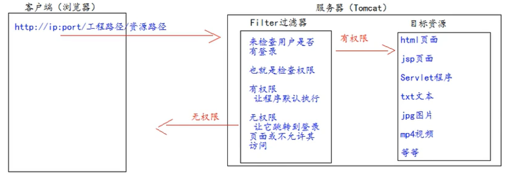
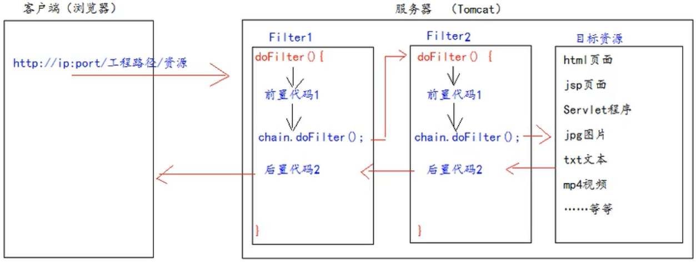

# 第八章 Filter

Filter 过滤器它是 JavaEE 的规范。也就是接口，它的作用是：拦截请求，过滤响应。

拦截请求常见的应用场景有：权限检查 、日记操作 、事务管理等等

## 8.1 原理




## 8.2 引入 - 一个示例

要求：在你的 web 工程下，有一个 admin 目录。这个 admin 目录下的所有资源（比如html 页面、jpg 图片、jsp 文件等等）都必须是用户登录之后才允许访问，如果没有登陆，然后通过网址直接访问admin目录下的内容，会自动跳到 login.jsp 中。

思考：用户登录之后都会把用户登录的信息保存到 Session 域中，所以要检查用户是否登录，可以判断 Session 中否包含有用户登录的信息即可。

login.jsp

```html
<form action="http://localhost:8080/JavawebStudyTest/loginServlet" method="get"> 
	用户名：<input type="text" name="username"/> <br> 
	密 码：<input type="password" name="password"/> <br> 
	<input type="submit" /> 
</form>
```

src / com / atnibamaitay / servlet / LoginServlet.java

```java
public class LoginServlet extends HttpServlet {
    @Override
    protected void doGet(HttpServletRequest req, HttpServletResponse resp) throws ServletException,
            IOException {
              
        resp.setContentType("text/html; charset=UTF-8");
        String username = req.getParameter("username");
        String password = req.getParameter("password");
        if ("wzg168".equals(username) && "123456".equals(password)) {
            req.getSession().setAttribute("user",username);
            resp.getWriter().write("登录 成功！！！");
        } else {
            req.getRequestDispatcher("/login.jsp").forward(req,resp);
        }
    }
  
}
```

src / com / atnibamaitay / filter / AdminFilter.java

```java
public class AdminFilter implements Filter {
    /**
     * doFilter 方法，专门用于拦截请求。可以做权限检查 
     */
    @Override
    public void doFilter(ServletRequest servletRequest, ServletResponse servletResponse, FilterChain
            filterChain) throws IOException, ServletException {
      
        HttpServletRequest httpServletRequest = (HttpServletRequest) servletRequest;
        HttpSession session = httpServletRequest.getSession();
        Object user = session.getAttribute("user");
        // 如果等于 null，说明还没有登录 
        if (user == null) {
            servletRequest.getRequestDispatcher("/login.jsp").forward(servletRequest,servletResponse);
            return;
        } else {
            // 让程序继续往下访问用户的目标资源 
            filterChain.doFilter(servletRequest,servletResponse);
        }
    }
  
}
```

WEB-INF / web.xml

```xml
<!--filter 标签用于配置一个 Filter 过滤器-->
<filter>
    <!--给 filter 起一个别名-->
    <filter-name>AdminFilter</filter-name>
    <!--配置 filter 的全类名-->
    <filter-class>com.atnibamaitay.filter.AdminFilter</filter-class>
</filter>
<!--filter 标签用于配置一个 Filter 过滤器-->
<filter>
    <!--给 filter 起一个别名-->
    <filter-name>AdminFilter</filter-name>
    <!--配置 filter 的全类名-->
    <filter-class>com.atnibamaitay.filter.AdminFilter</filter-class>
</filter>

<!-- LoginServlet的配置省略 -->
```


## 8.3 Filter使用步骤

1、编写一个类去实现Filter接口

2、实现过滤方法 doFilter()

3.到 web.xml 中去配置 Filter 的拦截路径


## 8.4 Filter的生命周期

Filter 的生命周期包含几个方法 

1、构造器方法 

2、init 初始化方法 

​	第 1，2 步，在 web 工程启动的时候执行（Filter 已经创建） 

3、doFilter 过滤方法 

​	第 3 步，每次拦截到请求，就会执行 

4、destroy 销毁 

​	第 4 步，停止 web 工程的时候，就会执行（停止 web 工程，也会销毁 Filter 过滤器）

 

## 8.5 FilterConfig类

即 Filter 过滤器的配置文件类。 

Tomcat 每次创建 Filter 的时候，也会同时创建一个 FilterConfig 类，这里包含了 Filter 配置文件的配置信息。 

FilterConfig 类的作用是获取 filter 过滤器的配置内容 

1、获取 Filter 的名称 filter-name 的内容 

2、获取在 web.xml 中配置的 init-param 初始化参数 

3、获取 ServletContext 对象

 ### 8.5.1 代码实现

```java
@Override
public void init(FilterConfig filterConfig) throws ServletException {
    System.out.println("2.Filter 的 init(FilterConfig filterConfig)初始化");
		// 1、获取 Filter 的名称 filter-name 的内容
    System.out.println("filter-name 的值是：" + filterConfig.getFilterName());
		// 2、获取在 web.xml 中配置的 init-param 初始化参数
    System.out.println("初始化参数 username 的值是：" + filterConfig.getInitParameter("username"));
    System.out.println("初始化参数 url 的值是：" + filterConfig.getInitParameter("url"));
		// 3、获取 ServletContext 对象
    System.out.println(filterConfig.getServletContext());
}
```

web.xml

```xml
<!--filter 标签用于配置一个 Filter 过滤器-->
<filter>
    <!--给 filter 起一个别名-->
    <filter-name>AdminFilter</filter-name>
    <!--配置 filter 的全类名-->
    <filter-class>com.atguigu.filter.AdminFilter</filter-class>
    <init-param>
        <param-name>username</param-name>
        <param-value>root</param-value>
    </init-param>
    <init-param>
        <param-name>url</param-name>
        <param-value>jdbc:mysql://localhost3306/test</param-value>
    </init-param>
</filter>
```

输出

```
2.Filter 的 init(FilterConfig filterConfig)初始化
filter-name 的值是：root
初始化参数 username 的值是：jdbc:mysql://localhost3306/test
org.apache.catalina.core.ApplicationContextFacade@444b839a
```

## 8.6 FilterChain 过滤器链

过滤器链就是多个过滤器一起工作

多个Filter过滤器执行的特点：

1、所有Filter和目标资源默认都执行在同一线程中

2、多个Filter共同执行的时候，它们都使用同一个Request对象。



FiltieChain.doFilter()方法的作用

1、执行下一个Filter过滤器（如果有Filter）

2、执行目标资源（没有Filter）

在多个Filter过滤器执行的时候，它们执行的优先顺序是由他们在web.xml中从上到下配置的顺序决定

## 8.7 Filter 的拦截路径

### 8.7.1 精确匹配 

```xml
<url-pattern>/target.jsp</url-pattern> 
```

以上配置的路径，表示请求地址必须为：http://ip:port/工程路径/target.jsp 

表示就target.jsp这个资源

### 8.7.2 目录匹配 

```xml
<url-pattern>/admin/*</url-pattern> 
```

以上配置的路径，表示请求地址必须为：http://ip:port/工程路径/admin/* 

表示这个目录下的所有资源

### 8.7.3 后缀名匹配 

```xml
<url-pattern>*.html</url-pattern> 
```

以上配置的路径，表示请求地址必须以.html 结尾才会拦截到 

```xml
<url-pattern>*.do</url-pattern> 
```

以上配置的路径，表示请求地址必须以.do 结尾才会拦截到 

```xml
<url-pattern>*.action</url-pattern> 
```

以上配置的路径，表示请求地址必须以.action 结尾才会拦截到 

Filter 过滤器它只关心请求的地址是否匹配，不关心请求的资源是否存在。