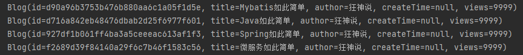

# 第十章 动态SQL

动态SQL指的是根据不同的查询条件 , 生成不同的Sql语句。本质还是SQL语句，只是在SQL层面去执行一个逻辑代码。

动态 SQL 元素和 JSTL 或基于类似 XML 的文本处理器相似。在 MyBatis 之前的版本中，有很多元素需要花时间了解。MyBatis 3 大大精简了元素种类，现在只需学习原来一半的元素便可。MyBatis 采用功能强大的基于 OGNL 的表达式来淘汰其它大部分元素。

  - if
  - choose (when, otherwise)
  - trim (where, set)
  - foreach

## 10.1 环境搭建

1、建要用的数据库、表

​		见附带

2、写核心配置文件

​		mybatis-config.xml

​		db.properties

3、写pojo、utils类

src \ main \ java \ com \ atnibamaitay \ pojo \ Blog.java

```java
@Data
public class Blog {
    private String id;
    private String title;
    private String author;
    private Date createTime;   //属性名和字段名不一致
    private int views;
}
```

com \ atnibamaitay \ utils \ IDUtils.java

```java
//用来生成UID
public class IDUtils {
    public static String getId(){
      	//replaceAll("-","")是将-替换成什么也没有
        return UUID.randomUUID().toString().replaceAll("-","");
    }
}
```

4、写mapper接口、xml文件

src \ main \ java \ com \ atnibamaitay \ dao \ BlogMapper.java

```java
public interface BlogMapper {
    int addBlog(Blog blog);
}
```

src \ main \ resources \ com \ atnibamaitay \ dao \ BlogMapper.xml

```xml
<?xml version="1.0" encoding="UTF-8" ?>
<!DOCTYPE mapper
        PUBLIC "-//mybatis.org//DTD Config 3.0//EN"
        "http://mybatis.org/dtd/mybatis-3-mapper.dtd">
<mapper namespace="com.atnibamaitay.dao.BlogMapper">
  
</mapper>
```

## 10.2 if

### 10.2.1 示例

src \ main \ java \ com \ atnibamaitay \ dao \ BlogMapper.java

```java
List<Blog> queryBlogIf(Map map);
```

src \ main \ resources \ com \ atnibamaitay \ dao \ BlogMapper.xml

```xml
<select id="queryBlogIf" parameterType="map" resultType="blog">
    select * from blog
    <where>
        <if test="title != null">
            title = #{title}
        </if>
        <if test="author != null">
            and author = #{author}
        </if>
    </where>
</select>
```

test / java / com / atnibamaitay / dao / blogTest.java

```java
SqlSession session = MybatisUtils.getSession();
BlogMapper mapper = session.getMapper(BlogMapper.class);
HashMap map = new HashMap();
List<Blog> blogs = mapper.queryBlogIf(map);
for (Blog blog : blogs) {
  	System.out.println(blog);
}
session.close();
```

结果

没有传参数的时候结果是全部



传递参数后

test / java / com / atnibamaitay / dao / blogTest.java

```java
HashMap map = new HashMap();
map.put("title","Java如此简单");
//其他省略
```

结果


## 10.3 choose、when、otherwise

有时我们不想使用所有的条件，只想从多个条件中选择一个使用，就可以使用 choose 元素，它有点像 Java 中的 switch 语句，此时 when 相当于 case。

在 choose 中，只会按顺序实现满足条件的第一个 when，否则就是 otherwise。

### 10.3.1 示例

src \ main \ java \ com \ atnibamaitay \ dao \ BlogMapper.java

```java
List<Blog> queryBlogChoose(Map map);
```

src \ main \ resources \ com \ atnibamaitay \ dao \ BlogMapper.xml

```xml
<select id="queryBlogChoose" parameterType="map" resultType="blog">
    select * from blog
    <where>
        <choose>
            <when test="title!=null">
                title = #{title}
            </when>
            <when test="author!=null">
                and author = #{author}
            </when>
            <otherwise>
                and views = #{views}
            </otherwise>
        </choose>
    </where>
</select>
```

## 10.4 Where

where 元素只会在子元素返回任何内容的情况下才插入 “WHERE” 子句。而且，若子句的开头为 “AND” 或 “OR”，where 元素也会将它们去除。

示例将“10.2.1 示例”第二段代码

## 10.5 set、trim

set 元素会动态地在行首插入 SET 关键字，并会删掉额外的逗号（这些逗号是在使用条件语句给列赋值时引入的）。

trim中的属性

| 属性            | 说明                                                         |
| --------------- | ------------------------------------------------------------ |
| prefix          | 前缀的意思                                                   |
| prefixOverrides | 作用是移除所有 prefixOverrides 属性中指定的内容，并且插入 prefix 属性中指定的内容。 |
| suffix          | 后缀的意思                                                   |
| suffixOverrides |                                                              |

不过trim已经不常用了，set就够了

### 10.5.1 示例

src \ main \ java \ com \ atnibamaitay \ dao \ BlogMapper.java

```java
int updateBlog(Map map);
```

src \ main \ resources \ com \ atnibamaitay \ dao \ BlogMapper.xml

```xml
<!--注意set是用的逗号隔开-->
<update id="updateBlog" parameterType="map">
    update blog
    <set>
        <if test="title != null">
            title = #{title},
        </if>
        <if test="author != null">
            author = #{author}
        </if>
    </set>
    where id = #{id};
</update>
```

test / java / com / atnibamaitay / dao / blogTest.java

```java
SqlSession session = MybatisUtils.getSession();
BlogMapper mapper = session.getMapper(BlogMapper.class);
HashMap map = new HashMap();
//map.put("views","9999");
map.put("title","Java如此简单2");
map.put("id","d90a96b3753b476b880aa6c1a05f1d5e");
mapper.updateBlog(map);
session.close();
```

更新后数据库


## 10.6 SQL片段

为了增加代码的重用性，简化代码，可以通过sql标签将需要复用的代码抽取出来，使用时通过 include 标签直接调用。

注意：

①最好基于 单表来定义 sql 片段，提高片段的可重用性

②在 sql 片段中不要包括 where

### 10.6.1 示例

```xml
<sql id="if-title-author">
    <if test="title != null">
        title = #{title}
    </if>
    <if test="author != null">
        and author = #{author}
    </if>
</sql>

<select id="queryBlogIf" parameterType="map" resultType="blog">
    select * from blog
    <where>
        <include refid="if-title-author"></include>
    </where>
</select>
```

## 10.7 Foreach

### 10.7.1 示例

src \ main \ java \ com \ atnibamaitay \ dao \ BlogMapper.java

```java
List<Blog> queryBlogForeach(Map map);
```

src \ main \ resources \ com \ atnibamaitay \ dao \ BlogMapper.xml

```xml
<select id="queryBlogForeach" parameterType="map" resultType="blog">
    select * from blog
    <where>
        <!--
        collection:指定输入对象中的集合属性
        item:每次遍历生成的对象
        open:开始遍历时的拼接字符串
        close:结束时拼接的字符串
        separator:遍历对象之间需要拼接的字符串
        select * from blog where 1=1 and (id=1 or id=2 or id=3)
      -->
        <foreach collection="ids" item="id" open="and (" close=")" separator="or">
            id=#{id}
        </foreach>
    </where>
</select>
```

test / java / com / atnibamaitay / dao / MyTest.java

```java
@Test
public void testQueryBlogForeach(){
    SqlSession session = MybatisUtils.getSession();
    BlogMapper mapper = session.getMapper(BlogMapper.class);
    HashMap map = new HashMap();
    List<Integer> ids = new ArrayList<Integer>();
    ids.add(1);
    ids.add(2);
    ids.add(3);
    map.put("ids",ids);
    List<Blog> blogs = mapper.queryBlogForeach(map);
    for (Blog blog : blogs) {
        System.out.println(blog);
    }
    session.close();
}
```

结果：


## 附带测试代码

数据库和表

```mysql
/*
 Navicat Premium Data Transfer

 Source Server         : AtnibamAitay
 Source Server Type    : MySQL
 Source Server Version : 80023
 Source Host           : localhost:3306
 Source Schema         : mybatis

 Target Server Type    : MySQL
 Target Server Version : 80023
 File Encoding         : 65001

 Date: 16/04/2022 11:45:58
*/

SET NAMES utf8mb4;
SET FOREIGN_KEY_CHECKS = 0;

-- ----------------------------
-- Table structure for blog
-- ----------------------------
DROP TABLE IF EXISTS `blog`;
CREATE TABLE `blog`  (
  `id` varchar(50) CHARACTER SET utf8 COLLATE utf8_general_ci NOT NULL COMMENT '博客id',
  `title` varchar(100) CHARACTER SET utf8 COLLATE utf8_general_ci NOT NULL COMMENT '博客标题',
  `author` varchar(30) CHARACTER SET utf8 COLLATE utf8_general_ci NOT NULL COMMENT '博客作者',
  `create_time` datetime(0) NOT NULL COMMENT '创建时间',
  `views` int(0) NOT NULL COMMENT '浏览量'
) ENGINE = InnoDB CHARACTER SET = utf8 COLLATE = utf8_general_ci ROW_FORMAT = Dynamic;

-- ----------------------------
-- Records of blog
-- ----------------------------
INSERT INTO `blog` VALUES ('d90a96b3753b476b880aa6c1a05f1d5e', 'Mybatis如此简单', '狂神说', '2022-04-16 11:43:48', 9999);
INSERT INTO `blog` VALUES ('d716a842eb48476dbab2d25f6977f601', 'Java如此简单', '狂神说', '2022-04-16 11:43:48', 9999);
INSERT INTO `blog` VALUES ('927df1b061ff4ba3a5ceeeac613af1f3', 'Spring如此简单', '狂神说', '2022-04-16 11:43:48', 9999);
INSERT INTO `blog` VALUES ('f2689d39f84140a29f6c7b46f1583c56', '微服务如此简单', '狂神说', '2022-04-16 11:43:48', 9999);

SET FOREIGN_KEY_CHECKS = 1;
```


