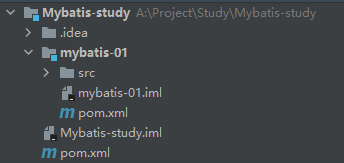

# 第一章 概述

MyBatis 是一款优秀的持久层框架，它支持自定义 SQL、存储过程以及高级映射。MyBatis 免除了几乎所有的 JDBC 代码以及设置参数和获取结果集的工作。MyBatis 可以通过简单的 XML 或注解来配置和映射原始类型、接口和 Java POJO（Plain Old Java Objects，普通老式 Java 对象）为数据库中的记录。

## 1.1 Maven

```xml
<!-- https://mvnrepository.com/artifact/org.mybatis/mybatis -->
<dependency>
    <groupId>org.mybatis</groupId>
    <artifactId>mybatis</artifactId>
    <version>3.5.6</version>
</dependency>
```

## 1.2 数据持久化

- 持久化就是将程序的数据在持久状态和瞬时状态转化的过程。
- 方式：数据库，IO文件持久化。

## 1.3 持久层

- 完成持久化工作的代码块。
- 层界限十分明显。

## 1.4 第一个Mybatis程序

搭建环境 --> 导入Mybatis --> 编写代码 --> 测试

### 1.4.1 创建项目

1. 新建一个Maven项目
2. 删除src目录
3. 导入Maven依赖

```xml
<dependencies>
    <!-- https://mvnrepository.com/artifact/org.mybatis/mybatis -->
    <dependency>
        <groupId>org.mybatis</groupId>
        <artifactId>mybatis</artifactId>
        <version>3.5.6</version>
    </dependency>
    <dependency>
        <groupId>mysql</groupId>
        <artifactId>mysql-connector-java</artifactId>
        <version>8.0.23</version>
    </dependency>
    <dependency>
        <groupId>junit</groupId>
        <artifactId>junit</artifactId>
        <version>4.12</version>
        <scope>test</scope>
    </dependency>
</dependencies>
```

配置pom.xml能够扫描到xml等配置文件

```xml
<build>
    <resources>
        <resource>
            <directory>src/main/java</directory>
            <includes>
                <include>**/*.properties</include>
                <include>**/*.xml</include>
            </includes>
            <filtering>false</filtering>
        </resource>
        <resource>
            <directory>src/main/resources</directory>
            <includes>
                <include>**/*.properties</include>
                <include>**/*.xml</include>
            </includes>
            <filtering>false</filtering>
        </resource>
    </resources>
</build>
```

### 1.4.2 创建模块

这样创建的好处是不用再每次都导包了，因为1.4.1创建的父项目已经导好了。



#### 1.4.2.1 编写 mybatis 的核心配置文件

创建 resources / mybatis-config.xml

```xml
<?xml version="1.0" encoding="UTF-8" ?>
<!DOCTYPE configuration
        PUBLIC "-//mybatis.org//DTD Config 3.0//EN"
        "http://mybatis.org/dtd/mybatis-3-config.dtd">
<configuration>
    <environments default="development">
        <environment id="development">
            <transactionManager type="JDBC"/>
            <dataSource type="POOLED">
                <property name="driver" value="com.mysql.cj.jdbc.Driver"/>
                <property name="url" value="jdbc:mysql://localhost:3306/mybatis?useSSL=true&amp;useUnicode=true&amp;characterEncoding=utf8"/>
                <property name="username" value="root"/>
                <property name="password" value="20010623"/>
            </dataSource>
        </environment>
    </environments>
    <mappers>
        <mapper resource = "com/atnibamaitay/dao/userMapper.xml" />
    </mappers>
</configuration>
```

#### 1.4.2.2 编写 mybatis 的工具类

com / atnibamaitay / utils / MybatisUtils.java

```java
package com.atnibamaitay.utils;

import org.apache.ibatis.io.Resources;
import org.apache.ibatis.session.SqlSession;
import org.apache.ibatis.session.SqlSessionFactory;
import org.apache.ibatis.session.SqlSessionFactoryBuilder;
import java.io.IOException;
import java.io.InputStream;

public class MybatisUtils {
    private static SqlSessionFactory sqlSessionFactory;

    static {
        try {
            String resource = "mybatis-config.xml";
            InputStream inputStream = Resources.getResourceAsStream(resource);
            sqlSessionFactory = new SqlSessionFactoryBuilder().build(inputStream);
        } catch (IOException e) {
            e.printStackTrace();
        }
    }

}
```

#### 1.4.2.3 从 SqlSessionFactory 中获取 SqlSession

有了 SqlSessionFactory，就可以从中获得 SqlSession 的实例。

SqlSession 提供了在数据库执行 SQL 命令所需的所有方法。

com / atnibamaitay / utils / MybatisUtils.java

```java
public class MybatisUtils {
    //省略1.4.2.2的其他代码

    public static SqlSession getSqlSession(){
        return sqlSessionFactory.openSession();
    }
}
```

### 1.4.3 编写代码

#### 1.4.3.1 编写一个实体类

com / atnibamaitay / pojo / User.java

```java
//实体类
public class User {
    private int id;
    private String name;
    private String pwd;
    //构造无参构造器、有参构造器、get和set方法、toString；
}
```

#### 1.4.3.2 编写Dao接口

com / atnibamaitay / dao / UserMapper.java

```java
package com.atnibamaitay.dao;

import com.atnibamaitay.pojo.User;
import java.util.List;

interface UserMapper {
    List<User> selectUser();
}
```

写接口实现类，它由原来的UserDaoImpl转变而来。

com / atnibamaitay / dao / UserMapper.xml

```xml
<?xml version="1.0" encoding="UTF-8" ?>
<!DOCTYPE mapper
        PUBLIC "-//mybatis.org//DTD Mapper 3.0//EN"
        "http://mybatis.org/dtd/mybatis-3-mapper.dtd">
<mapper namespace="com.atnibamaitay.dao.UserMapper">
  <select id="selectUser" resultType="com.atnibamaitay.pojo.User">
    select * from mybatis.user
  </select>
</mapper>
```

### 1.4.4 测试

注意点：每个 Mappers.xml 都需要在Mybatis核心配置文件中注册，详细见“1.7.6 mappers（映射器）”

```xml
<mappers>
    <mapper resource="com/atnibamaitay/dao/userMapper.xml"/>
</mappers>
```

junit 测试

test / java / com / atnibamaitay / dao / UserDaoTest.java

```java
package com.atnibamaitay.dao;

import com.atnibamaitay.pojo.User;
import com.atnibamaitay.utils.MybatisUtils;
import org.apache.ibatis.session.SqlSession;
import org.junit.Test;

import java.util.List;

public class UserDaoTest {
    @Test
    public void selectUser() {
        SqlSession session = MybatisUtils.getSession();
        //方法一:
        //List<User> users = session.selectList("com.atnibamaitay.mapper.UserMapper.selectUser");
        //方法二:
        UserMapper mapper = session.getMapper(UserMapper.class);
        List<User> users = mapper.selectUser();

        for (User user: users){
            System.out.println(user);
        }
        session.close();
    }
}
```

### 1.4.5 可能会遇到的问题

配置文件没有注册

绑定接口错误

方法名不对

返回类型不对

Maven导出资源问题

## 1.5 CRUD

### 1.5.1 namespace

1. 将上面案例中的 UserMapper 接口改名为 UserDao；

2. 将 UserMapper.xml 中的 namespace 改为为 UserDao 的路径；

3. 再次测试。

配置文件中 namespace 中的名称为对应 Mapper 接口或者 Dao 接口的完整包名,必须一致！

### 1.5.2 Select

com.atnibamaitay.dao.UserMapper.java

```xml
<mapper namespace="com.atnibamaitay.dao.UserMapper">
  <select id="selectUser" resultType="com.atnibamaitay.pojo.User">
    select * from mybatis.user
  </select>
</mapper>
```

选择，查询语句：

id：就是对应的 namespace 中的方法名；

parameterType：Sql语句执行的返回值！

resultType：参数类型


select 标签是 mybatis 中最常用的标签之一。

select 语句有很多属性可以详细配置每一条SQL语句。

SQL语句返回值类型。【完整的类名或者别名】

传入SQL语句的参数类型。【万能的Map，可以多尝试使用】

命名空间中唯一的标识符。

接口中的方法名与映射文件中的SQL语句ID一一对应。

### 1.5.3 代码示例

#### 1.5.3.1 Select

1、在UserMapper中添加对应方法

```java
public interface UserMapper {
   //其他代码省略
   //根据id查询用户
   User selectUserById(int id);
}
```

2、在UserMapper.xml中添加Select语句

```java
<select id="selectUserById" resultType="com.atnibamaitay.pojo.User">
	select * from user where id = #{id}
</select>
```

3、测试类中测试

```java
@Test
public void tsetSelectUserById() {
   //第一句是死的，直接复制粘贴进来即可
   SqlSession session = MybatisUtils.getSession();  //获取SqlSession连接
  
   //拿到这个对象
   UserMapper mapper = session.getMapper(UserMapper.class);
   //调用它的方法
   User user = mapper.selectUserById(1);
   System.out.println(user);
  
   //最后一句也是死的，直接复制粘贴进来即可
   session.close();
}
```

#### 1.5.3.2 Insert

1、在 UserMapper 接口中添加对应的方法

```java
//添加一个用户
int addUser(User user);
```

2、在 UserMapper.xml 中添加insert语句

```xml
<!-- 对象中的属性可直接取出 -->
<insert id="addUser" parameterType="com.atnibamaitay.pojo.User">
    insert into user (id,name,pwd) values (#{id},#{name},#{pwd})
</insert>
```

3、测试

```java
@Test
public void testAddUser() {
    SqlSession session = MybatisUtils.getSession();

    UserMapper mapper = session.getMapper(UserMapper.class);
    User user = new User(4,"王二","zxcvbn");
    int i = mapper.addUser(user);
    if(i>0){
        System.out.println("插入成功！");
    }
    session.commit();       //增删改要提交事务，重点！不写的话不会提交到数据库

    session.close();
}
```

#### 1.5.3.3 Update

1、同理，编写接口方法

```java
//修改一个用户
int updateUser(User user);
```

2、编写对应的配置文件SQL

```java
<update id="updateUser" parameterType="com.atnibamaitay.pojo.User">
  update user set name=#{name},pwd=#{pwd} where id = #{id}
</update>
```

3、测试

```java
@Test
public void testUpdateUser() {
   SqlSession session = MybatisUtils.getSession();

   UserMapper mapper = session.getMapper(UserMapper.class);
   mapper.updateUser(new User(4,"呵呵","12345"));
   session.commit();         //提交事务,重点!不写的话不会提交到数据库

   session.close();
}
```

#### 1.5.3.4 Delete

1、同理，编写接口方法

```java
//根据id删除用户
int deleteUser(int id);
```

2、编写对应的配置文件SQL

```java
<delete id="deleteUser" parameterType="int">
  delete from user where id = #{id}
</delete>
```

3、测试

```java
@Test
public void testDeleteUser() {
    SqlSession session = MybatisUtils.getSession();
    UserMapper mapper = session.getMapper(UserMapper.class);
    mapper.deleteUser(5);
    session.commit();                //提交事务,重点!不写的话不会提交到数据库
    session.close();
}
```

### 1.5.4 分析错误

标签不要匹配错

resource绑定mapper，需要使用路径！

程序配置文件必须符合规范！

NullPointerException，没有注册到资源！

输出的xml文件中存在中文乱码问题！

Maven资源没有导出问题！

## 1.6 万能 Map

这一部分的代码一直存在着运行通过但数据库没有变化的BUG没有解决。

假设实体类或数据库中的表，字段或者参数过多，我们应当考虑使用Map

UserMapper.java

```java
int addUser2(Map<String,Object> map);
```

UserMapper.xml

```xml
<insert id="addUser" parameterType="map">
  	insert into mybatis.user (id,pwd) values (#{userid},#{passWord});
</insert>
```

UserDaoTest.java

```java
@Test
Public void addUser2(){
    SqlSession session = MybatisUtils.getSession();
    UserMapper mapper = sqlSession.getMapper(UserMapper.class);
    Map<String,Object> map = new HashMap<String,Object>();
  
    map.put("userid",6);
    map.put("passWord","123456");
    mapper.addUser2(map);
    session.close();
  
}
```

Map传递参数，直接在sql中取出key即可！【parameterType="map"】

对象传递参数，直接在sql中取对象的属性即可！【parameterType="Object"】

只有一个基本类型参数的情况下，科研直接在sql中取到！

多个参数用Map，或者注解
