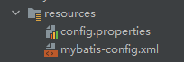

# 第二章 配置文件（mybatis-config.xml）解析

配置文件内容见“1.4.2.1 编写 mybatis 的核心配置文件”

## 2.1 核心配置文件的顶层结构 

configuration（配置）

properties（属性）

settings（设置）

typeAliases（类型别名）

environments（环境配置）

​	environment（环境变量）

​		transactionManager（事务管理器）

​		dataSource（数据源）

mappers（映射器）

其他了解即可，注意元素节点的顺序，顺序不对会报错。

## 2.2 properties（属性）

这些属性可以在 config.properties 中进行配置，而不必写在 mybatis-config.xml 中，然后进行动态替换即可。此时的项目结构为



config.properties

```properties
driver=com.mysql.cj.jdbc.Driver
url=jdbc:mysql://localhost:3306/mybatis?useSSL=true&amp;useUnicode=true&amp;characterEncoding=utf8
username=root
password=20010623
```

mybatis-config.xml

```xml
<!-- 前面代码省略 -->
<configuration>

    <!-- 引入外部配置文件 -->
    <properties resource="config.properties"/>

    <environments default="development">
        <environment id="development">
            <transactionManager type="JDBC"/>
            <dataSource type="POOLED">
                <!-- 改动此处 -->
                <property name="driver" value="${driver}"/>
                <property name="url" value="${url}"/>
                <property name="username" value="${username}"/>
                <property name="password" value="${password}"/>
            </dataSource>
        </environment>
    </environments>

    <!-- 其他省略 -->
</configuration>
```

还可以在其中增加属性，不过外部配置文件的优先级最高

```xml
<properties resource="config.properties">
    <!-- 正确密码是20010623，而config.properties中也配置了密码，以config.properties为优先，除非config.properties中没写才轮到这个 -->
    <property name="password" value="1111111"/>
</properties>
```

## 2.3 settings（设置）

| 设置名                   | 描述                                                         | 有效值                                                       | 默认值 |
| ------------------------ | ------------------------------------------------------------ | ------------------------------------------------------------ | ------ |
| cacheEnabled             | 全局性地开启或关闭所有映射器配置文件中已配置的任何缓存。     | true \| false                                                | true   |
| lazyLoadingEnabled       | 延迟加载的全局开关。当开启时，所有关联对象都会延迟加载。 特定关联关系中可通过设置 `fetchType` 属性来覆盖该项的开关状态。 | true \| false                                                | false  |
| mapUnderscoreToCamelCase | 是否开启驼峰命名自动映射，即从经典数据库列名 A_COLUMN 映射到经典 Java 属性名 aColumn。 | true \| false                                                | False  |
| logImpl                  | 指定 MyBatis 所用日志的具体实现，未指定时将自动查找。        | SLF4J \| LOG4J \| LOG4J2 \| JDK_LOGGING \| COMMONS_LOGGING \| STDOUT_LOGGING \| NO_LOGGING | 未设置 |

当然还有其他设置，一个配置完整的 settings 元素的示例如下：

```xml
<settings>
  <setting name="cacheEnabled" value="true"/>
  <setting name="lazyLoadingEnabled" value="true"/>
  <setting name="multipleResultSetsEnabled" value="true"/>
  <setting name="useColumnLabel" value="true"/>
  <setting name="useGeneratedKeys" value="false"/>
  <setting name="autoMappingBehavior" value="PARTIAL"/>
  <setting name="autoMappingUnknownColumnBehavior" value="WARNING"/>
  <setting name="defaultExecutorType" value="SIMPLE"/>
  <setting name="defaultStatementTimeout" value="25"/>
  <setting name="defaultFetchSize" value="100"/>
  <setting name="safeRowBoundsEnabled" value="false"/>
  <setting name="mapUnderscoreToCamelCase" value="false"/>
  <setting name="localCacheScope" value="SESSION"/>
  <setting name="jdbcTypeForNull" value="OTHER"/>
  <setting name="lazyLoadTriggerMethods" value="equals,clone,hashCode,toString"/>
</settings>
```

## 2.4 typeAliases（类型别名）

### 2.4.1 方式一

类型别名可为 Java 类型设置一个缩写名字。 它仅用于 XML 配置，意在降低冗余的全限定类名书写。

```xml
<typeAliases>
    <typeAlias alias="User" type="com.atnibamaitay.pojo.User"/>
</typeAliases>
```

当这样配置时，User 可以用在任何使用 com.atnibamaitay.pojo.User 的地方。

例如这里的 resultType="com.atnibamaitay.pojo.User" 可以改成 resultType="User"

```xml
<select id="getUserList" resultType="User">
    select * from mybatis.user
</select>
```

### 2.4.2 方式二

也可以指定一个包名，MyBatis 会在包名下面搜索需要的 Java Bean，比如：

```xml
<typeAliases>
    <package name="domain.blog"/>
</typeAliases>
```

每一个在包 `domain.blog` 中的 Java Bean，在没有注解的情况下，会使用 Bean 的首字母小写的非限定类名来作为它的别名。 比如 `domain.blog.Author` 的别名为 `author`；若有注解，则别名为其注解值。见下面的例子：

```java
@Alias("author")
public class Author {
    //...
}
```

在实体类少的时候用第一种方式，多的时候用第二种，但第二种不能自定义别名，不过可以通过注解来起。

## 2.5 环境配置（environment）

MyBatis 可以配置成适应多种环境，但每个 SqlSessionFactory 实例只能选择一种环境。

所以，如果你想连接两个数据库，就需要创建两个 SqlSessionFactory 实例，每个数据库对应一个。而如果是三个数据库，就需要三个实例，依此类推。

```xml
<environments default="development">           <!-- 默认只有一个 -->
  <environment id="development"></environment>
  <environment id="test"></environment>
</environments>
```

#### 2.5.1 事务管理器（transactionManager）

```xml
<transactionManager type="JDBC"/>
```

在 MyBatis 中有两种类型的事务管理器（也就是 type="[JDBC|MANAGED]"）：

JDBC（默认）

MANAGED

若正在使用 Spring + MyBatis，则没有必要配置事务管理器。

### 2.5.2 dataSource（数据源）

POOLED – 这种数据源的实现利用“池”（用完后回收）的概念将 JDBC 连接对象组织起来，避免了创建新的连接实例时所必需的初始化和认证时间。

poolMaximumActiveConnections – 在任意时间可存在的活动（正在使用）连接数量，默认值：10

poolMaximumIdleConnections – 任意时间可能存在的空闲连接数。

poolMaximumCheckoutTime – 在被强制返回之前，池中连接被检出（checked out）时间，默认值：20000 毫秒（即 20 秒）

poolTimeToWait – 这是一个底层设置，如果获取连接花费了相当长的时间，连接池会打印状态日志并重新尝试获取一个连接（避免在误配置的情况下一直失败且不打印日志），默认值：20000 毫秒（即 20 秒）。

poolMaximumLocalBadConnectionTolerance – 这是一个关于坏连接容忍度的底层设置， 作用于每一个尝试从缓存池获取连接的线程。 如果这个线程获取到的是一个坏的连接，那么这个数据源允许这个线程尝试重新获取一个新的连接，但是这个重新尝试的次数不应该超过 poolMaximumIdleConnections 与 poolMaximumLocalBadConnectionTolerance 之和。 默认值：3（新增于 3.4.5）

poolPingQuery – 发送到数据库的侦测查询，用来检验连接是否正常工作并准备接受请求。默认是“NO PING QUERY SET”，这会导致多数数据库驱动出错时返回恰当的错误消息。

poolPingEnabled – 是否启用侦测查询。若开启，需要设置 poolPingQuery 属性为一个可执行的 SQL 语句（最好是一个速度非常快的 SQL 语句），默认值：false。

poolPingConnectionsNotUsedFor – 配置 poolPingQuery 的频率。可以被设置为和数据库连接超时时间一样，来避免不必要的侦测，默认值：0（即所有连接每一时刻都被侦测 — 当然仅当 poolPingEnabled 为 true 时适用）。

除此之外还有 UNPOOLED 和 JNDI。

## 2.6 mappers（映射器）

### 2.6.1 方式一【推荐】

```xml
<!-- 使用相对于类路径的资源引用 -->
<mappers>
  <mapper resource="com/atnibamaitay/dao/userMapper.xml"/>
</mappers>
```

### 2.6.2 方式二

```xml
<!-- 将包内的映射器接口实现全部注册为映射器 -->
<mappers>
  <package name="com.atnibamaitay.dao"/>
</mappers>
```

### 2.6.3 方式三

```xml
<!-- 使用映射器接口实现类的完全限定类名 -->
<mappers>
  <mapper class="com.atnibamaitay.dao.UserMapper"/>
</mappers>
```

方式二和方式三注意点：接口和它的mapper配置文件必须同名，必须在同一个包下。