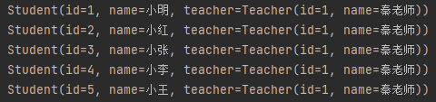
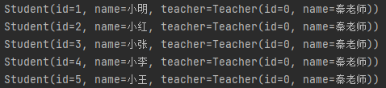
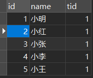
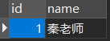

# 第九章 多对一 / 一对多处理

## 9.1 多对一处理

### 9.1.1 复杂查询环境搭建

1.导入lombok

2.新建实体类

3.建立Mapper接口

4.建立Mapper.xml文件

5.在核心配置文件中绑定注册 Mapper 接口或文件

6.测试

#### 9.1.1.1 示例

2、新建实体类

src \ main \ java \ com \ atnibamaitay \ pojo \ Teacher.java

```java
@Data
public class Teacher {
    private int id;
    private String name;
}
```

src \ main \ java \ com \ atnibamaitay \ pojo \ Student.java

```java
@Data
public class Student {
    private int id;
    private String name;

    //学生需要关联一个老师，而多个学生可以是同一个老师，所以是多对一
    private Teacher teacher;
}
```

3、建立Mapper接口

src \ main \ java \ com \ atnibamaitay \ dao \ TeacherMapper.java

```java
public interface TeacherMapper {
    @Select("select * from teacher where id = #{tid}")
    Teacher getTeacher(@Param("tid") int id);
}
```

src \ main \ java \ com \ atnibamaitay \ dao \ StudentMapper.java

```java
//无论有没有需求，都应该写上，以备后来之需！
public interface StudentMapper {
}
```

4、建立Mapper.xml文件

src \ main \ resources \ com \ atnibamaitay \ dao \ TeacherMapper.xml

```java
<?xml version="1.0" encoding="UTF-8" ?>
<!DOCTYPE mapper
        PUBLIC "-//mybatis.org//DTD Config 3.0//EN"
        "http://mybatis.org/dtd/mybatis-3-mapper.dtd">
<mapper namespace="com.atnibamaitay.dao.TeacherMapper">

</mapper>
```

src \ main \ resources \ com \ atnibamaitay \ dao \ StudentMapper.xml

```java
<?xml version="1.0" encoding="UTF-8" ?>
<!DOCTYPE mapper
        PUBLIC "-//mybatis.org//DTD Config 3.0//EN"
        "http://mybatis.org/dtd/mybatis-3-mapper.dtd">
<mapper namespace="com.atnibamaitay.dao.StudentMapper">

</mapper>
```

5.在核心配置文件中绑定注册 Mapper 接口或文件

src \ main \ resources \ mybatis-config.xml

```java
<mappers>
    <mapper class="com.atnibamaitay.dao.TeacherMapper"/>
    <mapper class="com.atnibamaitay.dao.StudentMapper"/>
</mappers>
```

6.测试

test \ java \ Mytest.java

```java
public class Mytest {
    public static void main(String[] args) {
        SqlSession sqlsession = MybatisUtils.getSession();
        TeacherMapper mapper = sqlsession.getMapper(TeacherMapper.class);
        Teacher teacher = mapper.getTeacher(1);
        System.out.println(teacher);
        sqlsession.close();
    }
}
```

### 9.1.2 查询多表信息

#### 9.1.2.1 按照查询嵌套处理

需求：获取所有学生及对应老师的信息

思路：
1. 获取所有学生的信息
2. 根据获取的学生信息的老师ID->获取该老师的信息

src \ main \ resources \ com \ atnibamaitay \ dao \ StudentMapper.xml

```xml
<select id="getStudent" resultMap="StudentTeacher">
    select *
    from student;
</select>

<resultMap id="StudentTeacher" type="Student">
    <result property="id" column="id"/>
    <result property="name" column="name"/>
    <!-- 复杂的属性，需要单独处理 对象：association 集合：collection
				javaType="" 指定属性的类型
				集合中的泛型信息用ofType获取
 		-->
    <association property="teacher" column="tid" javaType="Teacher" select="getTeacher"/>
</resultMap>

<select id="getTeacher" resultType="Teacher">
    select *
    from teacher
    where id = #{id};
</select>
```

src \ main \ java \ com \ atnibamaitay \ dao \ StudentMapper.java

```java
public List<Student> getStudent();
```

测试

test \ java \ Mytest.java

```java
@Test
public void testStudent(){
    SqlSession sqlSession = MybatisUtils.getSession();
    StudentMapper mapper = sqlSession.getMapper(StudentMapper.class);
    List<Student> studentList = mapper.getStudent();
    for (Student student : studentList) {
        System.out.println(student);
    }
    sqlSession.close();
}
```

结果：



#### 9.1.2.2 按照结果嵌套查询

src \ main \ resources \ com \ atnibamaitay \ dao \ StudentMapper.xml

```xml
<select id="getStudent1" resultMap="StudentTeacher2">
    select s.id sid,s.name sname,t.name tname
    from student s,teacher t
    where s.tid=t.id;
</select>
<resultMap id="StudentTeacher2" type="Student">
    <result property="id" column="sid"/>
    <result property="name" column="sname"/>
    <association property="teacher" javaType="Teacher">
        <result property="name" column="tname"/>
    </association>
</resultMap>
```

src \ main \ java \ com \ atnibamaitay \ dao \ StudentMapper.java

```java
public List<Student> getStudent1();
```

结果：



## 9.2 一对多处理

### 9.2.1 环境搭建

和9.1.1一样

2、新建实体类

src \ main \ java \ com \ atnibamaitay \ pojo \ Teacher.java

```java
@Data
public class Teacher {
    private int id;
    private String name;

    //一个老师有多个学生
    private List<Student> students;
}
```

src \ main \ java \ com \ atnibamaitay \ pojo \ Student.java

```java
@Data
public class Student {
    private int id;
    private String name;

    private int tid;
}
```

### 9.2.2 查询多表信息

#### 9.2.2.1 按照结果嵌套查询（推荐）

3、建立Mapper接口

src \ main \ java \ com \ atnibamaitay \ dao \ TeacherMapper.java

```java
List<Teacher> getTeacher();
```

4、建立Mapper.xml文件

src \ main \ resources \ com \ atnibamaitay \ dao \ TeacherMapper.xml

```xml
<!--  按结果嵌套查询  -->
<select id="getTeacher" resultMap="TeacherStudent">
    select s.id sid,s.name sname,t.name tname,t.id tid
    from student s,teacher t
    where s.tid = t.id and t.id = #{tid}
</select>

<!--  -->
<resultMap id="TeacherStudent" type="Teacher">
    <result  property="id" column="tid"/>
    <result  property="name" column="tname"/>
    <collection property="students" ofType="Student">
        <result property="id" column="sid"/>
        <result property="name" column="sname"/>
        <result property="tid" column="tid"/>
    </collection>
</resultMap>
```

5.测试

test \ java \ Mytest.java

```java
SqlSession session = MybatisUtils.getSession();
TeacherMapper mapper = session.getMapper(TeacherMapper.class);
Teacher teacher = mapper.getTeacher(1);
System.out.println(teacher);
session.close();
```

结果：

```
Teacher(id=1, name=秦老师, 
	students=[Student(id=1, name=小明, tid=1), 
					 Student(id=2, name=小红, tid=1), 
					 Student(id=3, name=小张, tid=1), 
					 Student(id=4, name=小李, tid=1), 
					 Student(id=5, name=小王, tid=1)])
```

#### 9.2.2.2 按照查询嵌套处理

3、建立Mapper接口

src \ main \ java \ com \ atnibamaitay \ dao \ TeacherMapper.java

```java
public Teacher getTeacher2(int id);
```

4、建立Mapper.xml文件

src \ main \ resources \ com \ atnibamaitay \ dao \ TeacherMapper.xml

```xml
<select id="getTeacher2" resultMap="TeacherStudent2">
    select * from teacher where id = #{id}
</select>

<resultMap id="TeacherStudent2" type="Teacher">
    <!--column是一对多的外键 , 写的是一的主键的列名-->
    <collection property="students" javaType="ArrayList" ofType="Student" column="id" select="getStudentByTeacherId"/>
</resultMap>

<select id="getStudentByTeacherId" resultType="Student">
    select * from student where tid = #{id}
</select>
```

5.测试

test \ java \ Mytest.java

```xml
SqlSession session = MybatisUtils.getSession();
TeacherMapper mapper = session.getMapper(TeacherMapper.class);
Teacher teacher = mapper.getTeacher2(1);
System.out.println(teacher.getName());
System.out.println(teacher.getStudents());
```

6.结果

```
秦老师
[Student(id=1, name=小明, tid=1), 
Student(id=2, name=小红, tid=1), 
Student(id=3, name=小张, tid=1), 
Student(id=4, name=小李, tid=1), 
Student(id=5, name=小王, tid=1)]
```

## 9.3 小结

1、关联-association

2、集合-collection

3、所以association是用于一对一和多对一，而collection是用于一对多的关系

4、JavaType和ofType都是用来指定对象类型的

JavaType是用来指定pojo中属性的类型

ofType指定的是映射到list集合属性中pojo的类型。

注意说明：

1、保证SQL的可读性，尽量通俗易懂

2、根据实际要求，尽量编写性能更高的SQL语句

3、注意属性名和字段不一致的问题

4、注意一对多和多对一 中：字段和属性对应的问题

5、尽量使用Log4j，通过日志来查看自己的错误

## 9.4 附带测试代码

### 9.4.1 数据库建表

```mysql
CREATE TABLE `teacher` (
`id` INT(10) NOT NULL,
`name` VARCHAR(30) DEFAULT NULL,
PRIMARY KEY (`id`)
) ENGINE=INNODB DEFAULT CHARSET=utf8

INSERT INTO teacher(`id`, `name`) VALUES (1, '秦老师');

CREATE TABLE `student` (
`id` INT(10) NOT NULL,
`name` VARCHAR(30) DEFAULT NULL,
`tid` INT(10) DEFAULT NULL,
PRIMARY KEY (`id`),
KEY `fktid` (`tid`),
CONSTRAINT `fktid` FOREIGN KEY (`tid`) REFERENCES `teacher` (`id`)
) ENGINE=INNODB DEFAULT CHARSET=utf8


INSERT INTO `student` (`id`, `name`, `tid`) VALUES ('1', '小明', '1');
INSERT INTO `student` (`id`, `name`, `tid`) VALUES ('2', '小红', '1');
INSERT INTO `student` (`id`, `name`, `tid`) VALUES ('3', '小张', '1');
INSERT INTO `student` (`id`, `name`, `tid`) VALUES ('4', '小李', '1');
INSERT INTO `student` (`id`, `name`, `tid`) VALUES ('5', '小王', '1');
```

结果：





