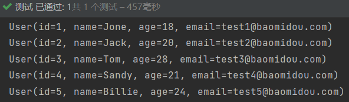
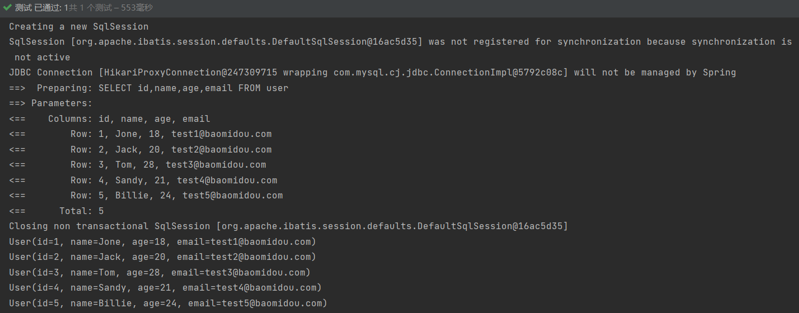

# 第一章 概述

MyBatis-Plus（简称 MP）是一个 MyBatis 的增强工具，在 MyBatis 的基础上只做增强不做改变，为简化开发、提高效率而生。

## 1.1 特性

无侵入：只做增强不做改变，引入它不会对现有工程产生影响，如丝般顺滑

损耗小：启动即会自动注入基本 CURD，性能基本无损耗，直接面向对象操作

强大的 CRUD 操作：内置通用 Mapper、通用 Service，仅仅通过少量配置即可实现单表大部分 CRUD 操作，更有强大的条件构造器，满足各类使用需求

支持 Lambda 形式调用：通过 Lambda 表达式，方便的编写各类查询条件，无需再担心字段写错

支持主键自动生成：支持多达 4 种主键策略（内含分布式唯一 ID 生成器 - Sequence），可自由配置，完美解决主键问题

支持 ActiveRecord 模式：支持 ActiveRecord 形式调用，实体类只需继承 Model 类即可进行强大的 CRUD 操作

支持自定义全局通用操作：支持全局通用方法注入（ Write once, use anywhere ）

内置代码生成器：采用代码或者 Maven 插件可快速生成 Mapper 、 Model 、 Service 、 Controller 层代码，支持模板引擎，更有超多自定义配置等您来使用

内置分页插件：基于 MyBatis 物理分页，开发者无需关心具体操作，配置好插件之后，写分页等同于普通 List 查询

分页插件支持多种数据库：支持 MySQL、MariaDB、Oracle、DB2、H2、HSQL、SQLite、Postgre、SQLServer 等多种数据库

内置性能分析插件：可输出 SQL 语句以及其执行时间，建议开发测试时启用该功能，能快速揪出慢查询

内置全局拦截插件：提供全表 delete 、 update 操作智能分析阻断，也可自定义拦截规则，预防误操作

## 1.2 快速开始

### 1.2.1 准备

创建一个数据库，并准备一张表

```sql
DROP TABLE IF EXISTS user;

CREATE TABLE user
(
    id BIGINT(20) NOT NULL COMMENT '主键ID',
    name VARCHAR(30) NULL DEFAULT NULL COMMENT '姓名',
    age INT(11) NULL DEFAULT NULL COMMENT '年龄',
    email VARCHAR(50) NULL DEFAULT NULL COMMENT '邮箱',
    PRIMARY KEY (id)
);
```

并插入数据

```sql
DELETE FROM user;

INSERT INTO user (id, name, age, email) VALUES
(1, 'Jone', 18, 'test1@baomidou.com'),
(2, 'Jack', 20, 'test2@baomidou.com'),
(3, 'Tom', 28, 'test3@baomidou.com'),
(4, 'Sandy', 21, 'test4@baomidou.com'),
(5, 'Billie', 24, 'test5@baomidou.com');
```

### 1.2.2 导入

MyBatis-Plus场景启动器

```xml
<dependency>
    <groupId>com.baomidou</groupId>
    <artifactId>mybatis-plus-boot-starter</artifactId>
    <version>3.0.5</version>
</dependency>
```

其他需要的依赖

```xml
<dependency>
    <groupId>mysql</groupId>
    <artifactId>mysql-connector-java</artifactId>
</dependency>

<dependency>
    <groupId>org.projectlombok</groupId>
    <artifactId>lombok</artifactId>
</dependency>
```

注意，尽量不要同时导入 MyBatis 和 MyBatis - Plus，可能会出问题。

### 1.2.3 连接数据库

```yml
spring:
  datasource:
    url: jdbc:mysql://localhost:3306/mybatis_plus_study?useSSL=false&useUnicode=true&characterEncoding=utf-8
    username: root
    password: 20010623
    driver-class-name: com.mysql.cj.jdbc.Driver
```

### 1.2.4 创建 pojo 和 mapper 接口

com.atnibamaitay.pojo.User

```java
@Data
@AllArgsConstructor
@NoArgsConstructor
public class User {
    private Long id;
    private String name;
    private Integer age;
    private String email;
}
```

使用 MyBatis - Plus 就不再需要写 UserMapper.xml 了，只需要在对应的Mapper上面实现基本的类 BaseMapper，此时所有的 CRUE 都已经编写好了，不需要像以前一样写一大堆文件。

```java
@Repository //代表持久层
public interface UserMapper extends BaseMapper<User> {
}
```

### 1.2.5 在主程序类中写扫描注解

```java
@MapperScan("com.atnibamaitay.mapper")
@SpringBootApplication
public class MybatisPlusStudyApplication {}
```

### 1.2.6 测试

```java
// 继承了BaseMapper，所有方法来自父类
// 但也可以自己编写拓展方法
@Autowired
private UserMapper userMapper;

@Test
void contextLoads() {
    // 查询全部用户
    // selectList()的参数是一个条件构造器 Wrapper，这里先不用
    List<User> users = userMapper.selectList(null);
    users.forEach(System.out::println);
}
```

### 1.2.7 结果



### 1.2.8 配置日志

```yaml
mybatis-plus:
  configuration:
    log-impl: org.apache.ibatis.logging.stdout.StdOutImpl
```

### 1.2.9 结果

