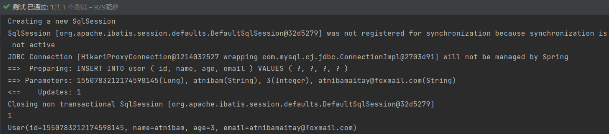
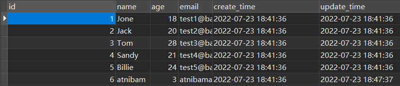
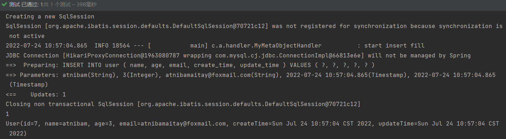

# 第二章

基于 1.2 的项目，继续测试

## 2.1 CRUD

### 2.1.1 插入

```java
//测试插入
@Test
public void testInsert(){
    User user = new User();
    user.setName("atnibam");
    user.setAge(3);
    user.setEmail("atnibamaitay@foxmail.com");
    int result = userMapper.insert(user);
    //数据库插入的id的默认值为全局的唯一id
    System.out.println(result);
    System.out.println(user);
}
```

结果：



在这个测试类中，没有设置id，但是自动生成了 id。id自动生成有以下几种办法

#### 2.1.1.1 ID_WORKER 生成全局唯一 ID（默认）

运用到的就是雪花算法，相当于在对应 pojo 类中，在属性 id 上注解

com.atnibamaitay.pojo.User

```java
@TableId(type = IdType.ID_WORKER)
private Long id;
```

雪花算法是Twitter开源的分布式ID生成算法，结果是一个long型的ID。

其核心思想是：使用41bit作为毫秒数，10bit作为机器的ID（5个bit是数据中心，5个bit的机器ID），12bit作为毫秒内的流水号，最后还有一个符号位，永远是0。可以保住几乎全球唯一。

#### 2.1.1.2 AUTO 主键自增

1、实体类字段上需要注解

```java
@TableId(type = IdType.AUTO)
private Long id;
```

2、数据库字段一定要自增

#### 2.1.1.3 其他

NONE：代表未设置主键

INPUT：手动输入

UUID：全局唯一id uuid

ID_WORKER_STR：ID_WORKER的字符串表示法

### 2.1.2 更新

```java
@Test
public void testUpdate(){
    User user = new User();
    user.setId(6L);  //因为Id是Long型的，所以末尾需要L
    user.setName("aitay");   //通过条件自动拼接动态SQL
    
    //updateById()的参数是一个对象
    int i = userMapper.updateById(user);
    System.out.println(i);
}
```

结果：将数据库中id=6的数据中的name字段atnibamaitay修改为了aitay

### 2.1.3 自动填充

比如：阿里巴巴开发手册有提到，几乎所有的所有数据库表都需要配置上 gmt_create（创建时间）、 gmt_modified（修改时间），且需要自动化。

#### 2.1.3.1 数据库级别

1、在表中新增字段 create_time，update_time

```mysql
ALTER TABLE `mybatis_plus_study`.`user` 
ADD COLUMN `create_time` datetime NULL DEFAULT CURRENT_TIMESTAMP COMMENT '创建时间' AFTER `email`,
ADD COLUMN `update_time` datetime NULL DEFAULT CURRENT_TIMESTAMP ON UPDATE CURRENT_TIMESTAMP COMMENT '更新时间' AFTER `create_time`
```

2、同步实体类

在对应的 pojo 类中增加两个属性

```java
private Date createTime;
private Date updataTime;
```

3、测试

随便修改东西，然后执行一下 2.1.2 的代码即可

4、结果



#### 2.1.3.2 代码级别

1、在表中新增字段 create_time，update_time

```mysql
ALTER TABLE `mybatis_plus_study`.`user` 
ADD COLUMN `create_time` datetime COMMENT '创建时间' AFTER `email`,
ADD COLUMN `update_time` datetime COMMENT '更新时间' AFTER `create_time`
```

2、同步实体类

在对应的 pojo 类中增加两个属性

```java
@TableField(fill = FieldFill.INSERT) //在插入的时候自动进行填充操作
private Date createTime;
@TableField(fill = FieldFill.INSERT_UPDATE) //在插入的时候自动进行填充操作
private Date updateTime;
```

3、写个处理器来处理这个注解

com.atnibamaitay.handler

```java
package com.atnibamaitay.handler;

import com.baomidou.mybatisplus.core.handlers.MetaObjectHandler;
import lombok.extern.slf4j.Slf4j;
import org.apache.ibatis.reflection.MetaObject;
import org.springframework.stereotype.Component;
import java.util.Date;

@Slf4j
@Component  // 一定不要忘记把处理器加到IOC容器中
public class MyMetaObjectHandler implements MetaObjectHandler {

    //插入时的填充策略
    @Override
    public void insertFill(MetaObject metaObject) {
        log.info("start insert fill");
        this.setFieldValByName("createTime",new Date(),metaObject);
        this.setFieldValByName("updataTime",new Date(),metaObject);
    }

    // 更新时的填充策略
    @Override
    public void updateFill(MetaObject metaObject) {
        log.info("start update fill");
        this.setFieldValByName("updataTime",new Date(),metaObject);
    }
}

```

4、测试

执行一下 2.1.1 的代码即可

5、结果



