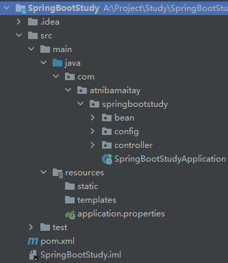

# 第一章 概述 - 基础入门

web三层架构

- 用户接口层{表示层}

- 业务逻辑层

- 持久化层{数据逻辑层、数据访问层}

## 1.1 时代背景

### 1.1.1 微服务

[James Lewis and Martin Fowler (2014)](https://martinfowler.com/articles/microservices.html)  提出微服务完整概念。https://martinfowler.com/microservices/

- 微服务是一种架构风格
- 一个应用拆分为一组小型服务
- 每个服务运行在自己的进程内，也就是可独立部署和升级
- 服务之间使用轻量级HTTP交互
- 服务围绕业务功能拆分
- 可以由全自动部署机制独立部署
- 去中心化，服务自治。服务可以使用不同的语言、不同的存储技术

### 1.1.2 分布式

分布式解决：SpringBoot + SpringCloud

### 1.1.3 云原生


## 1.2 Spring Boot 官方文档

文档地址：https://docs.spring.io/spring-boot/docs/current/reference/html/

### 1.2.1 文档结构

|                             | 介绍                                                         |
| --------------------------- | ------------------------------------------------------------ |
| 入门                        | 介绍 Spring Boot、系统要求、Servlet 容器、安装 Spring Boot 和开发您的第一个 Spring Boot 应用程序 |
| 升级 Spring Boot 应用程序   | 从 1.x 升级、升级到新功能版本以及升级 Spring Boot CLI。      |
| 使用 Spring Boot            | 构建系统、构建代码、配置、Spring Beans 和依赖注入、DevTools 等等。 |
| 核心功能                    | 配置文件、日志记录、安全性、缓存、Spring 集成、测试等。      |
| Web                         | Servlet Web、响应式 Web、嵌入式容器支持、优雅关闭等。        |
| 数据                        | SQL 和 NOSQL 数据访问。                                      |
| IO                          | 缓存、Quartz 调度程序、REST 客户端、发送电子邮件、Spring Web 服务等。 |
| 消息传递                    | JMS、AMQP、Apache Kafka、RSocket、WebSocket 和 Spring 集成。 |
| 容器图像                    | 高效的容器镜像和使用 Dockerfiles 和 Cloud Native Buildpacks 构建容器镜像。 |
| 生产就绪功能                | 监控、指标、审计等。                                         |
| 部署 Spring Boot 应用程序   | 部署到云端，并作为 Unix 应用程序安装。                       |
| Spring Boot CLI（没什么用） | 安装 CLI、使用 CLI、配置 CLI 等。                            |
| 构建工具插件                | Maven 插件、Gradle 插件、Antlib 等。                         |
| “操作方法”指南              | 应用程序开发、配置、嵌入式服务器、数据访问等等。             |

附录

|                  | 介绍                                                 |
| ---------------- | ---------------------------------------------------- |
| 应用程序属性     | 可用于配置应用程序的通用应用程序属性。               |
| 配置元数据       | 可用于描述配置属性的元数据。                         |
| 自动配置类       | Spring Boot 提供的自动配置类。                       |
| 测试自动配置注解 | 测试可用于测试应用程序切片的自动配置注解。           |
| 可执行的jar      | Spring Boot 的可执行 jar、它们的启动器和它们的格式。 |
| 依赖版本         | Spring Boot 管理的依赖项的详细信息。                 |


​	


## 1.3 HelloWorld!

### 1.3.1 方法一：通过Maven

#### 1 创建maven工程

#### 2 引入依赖

先导入父工程

pom.xml

```xml
<parent>
        <groupId>org.springframework.boot</groupId>
        <artifactId>spring-boot-starter-parent</artifactId>
        <version>2.3.4.RELEASE</version>
 </parent>
```

导入系统依赖（也叫场景启动器，以开发web应用为例）

pom.xml

```xml
<dependencies>
  	<dependency>
    	<groupId>org.springframework.boot</groupId>
    	<artifactId>spring-boot-starter-web</artifactId>
  	</dependency>
</dependencies>
```

#### 3 创建主程序

java\com\atnibamaitay\boot\MainApplication.java

```java
/**
 * 主程序类，所有启动的入口。
 * @SpringBootApplication：该注解告诉 springboot 这是一个SpringBoot应用
 */
@SpringBootApplication
public class MainApplication {
    public static void main(String[] args) {
        SpringApplication.run(MainApplication.class,args);
      
    }
}
```

### 1.3.2 方法二：Spring Initializr

#### 1 创建Spring项目


#### 2 删除多余的东西

.gitignore、HELP.md、mvnw、mvnw.cmd和文件夹.mvn都可以删除。

#### 3 项目结构



其中 resources / static 存放静态资源（CSS、JS啥的），templates 存放页面


#### 4 编写业务（示例）

java \ com \ atnibamaitay \ boot \ controller \ HelloController.java

```java
//4、RestController 合并了 @ResponseBody 和 @Controller 两个注解，说明它是一个控制器，用来处理请求

//@ResponseBody
//@Controller：1、这个注解说明这是一个控制器
@RestController
public class HelloController {
    @RequestMapping("/hello")   //2、映射请求，浏览器发送hello请求，然后服务器处理，执行方法handle01，返回一段话
    public String handle01(){
        //3、因为返回的话要以字符串的方式写给浏览器（处理请求），所以还需要注解 @ResponseBody
        return "Hello, Spring Boot 2!";
    }
}
```

#### 5 测试

直接运行main，然后进入localhost:8080/hello


#### 6 配置（示例）

可以在 src/main/resources 中的 application.properties 进行配置，比如 Tomcat 端口号等，可以通过官方文档查看可配置的东西。

```properties
server.port=8888
```

#### 7 部署

可以在pom.xml中设置（方式二不需要此步）

```xml
 <build>
        <plugins>
            <plugin>
                <groupId>org.springframework.boot</groupId>
                <artifactId>spring-boot-maven-plugin</artifactId>
            </plugin>
        </plugins>
 </build>
```

把项目打成jar包，直接在目标服务器执行即可。


#### 8 结果


