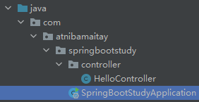
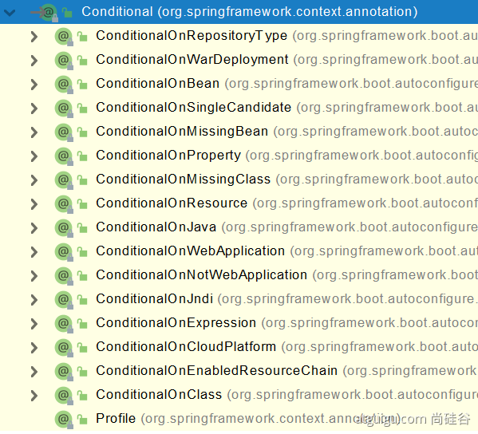
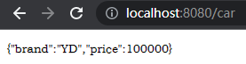

# 第二章 自动配置原理 - 基础入门

## 2.1 依赖管理

### 2.1.1 父项目做依赖管理

每个spring项目都有一个父项目

```xml
 <parent>
  	<groupId>org.springframework.boot</groupId>
  	<artifactId>spring-boot-starter-parent</artifactId>
  	<version>2.3.4.RELEASE</version>
</parent>
```

作用是依赖管理

#### 2.1.1.1 依赖管理——自动仲裁机制

父项目的父项目是

```xml
<parent>
  	<groupId>org.springframework.boot</groupId>
  	<artifactId>spring-boot-dependencies</artifactId>
  	<version>2.3.4.RELEASE</version>
</parent>
```

里面声明了几乎所有依赖的版本，自动版本仲裁机制，因此，在引入依赖时默认都可以不写版本，不过在引入非版本仲裁的jar包时，才要写版本号。

```xml
<properties>
  <activemq.version>5.16.4</activemq.version>
  <antlr2.version>2.7.7</antlr2.version>
  <appengine-sdk.version>1.9.95</appengine-sdk.version>
  <artemis.version>2.19.1</artemis.version>
  <aspectj.version>1.9.7</aspectj.version>
  <assertj.version>3.21.0</assertj.version>
  <atomikos.version>4.0.6</atomikos.version>
  <awaitility.version>4.1.1</awaitility.version>
  <!-- 等等，还有很多 -->
</properties>
```

比如说，在spring-boot-dependencies 2.3.4.RELEASE中所声明的mysql版本为8.0.21，若想使用其他版本的包，则需要在pom.xml中重写版本号

```xml
<properties>
        <mysql.version>5.1.43</mysql.version>
</properties>
```

自动制裁机制让我们无需再关注版本号。

### 2.1.2 starter场景启动器

#### 2.1.2.1 官方

只要引入一个Starter，整个开发场景的依赖就会全部导入

SpringBoot所有支持的场景，详见[官方文档](https://docs.spring.io/spring-boot/docs/current/reference/html/using-spring-boot.html#using-boot-starter) Using Spring Boot > 1.Build Systems > 1.5 Starters


spring 支持进行场景配置，配置不同的场景将会自动导入该场景所有常规的依赖，其中关键字为

```xml
spring-boot-starter-*
```

其中 * 就某种场景。


比如，在pom.xml中写

```xml
<dependency>
  <groupId>org.springframework.boot</groupId>
  <artifactId>spring-boot-starter-web</artifactId>
</dependency>
```

意味着这是一个web开发场景的项目，此时web开发依赖的包就会都自动导入。

#### 2.1.2.2 自定义

spring还支持自定义场景，此时关键字为

```
 *-spring-boot-starter
```

因此，见到该关键字意味着这是第三方提供的简化开发的场景启动器。

其中，所有场景启动器最底层的依赖（核心依赖）为

```xml
<dependency>
  <groupId>org.springframework.boot</groupId>
  <artifactId>spring-boot-starter</artifactId>
  <version>2.3.4.RELEASE</version>
  <scope>compile</scope>
</dependency>
```


## 2.2 自动配置

1. 自动配置好Tomcat
并引入了Tomcat的依赖
1. 自动配好SpringMVC
    引入SpringMVC全套组件
    自动配好SpringMVC常用组件（功能）
2. 自动配好Web常见功能，如：字符编码问题
    SpringBoot帮我们配置好了所有web开发的常见场景
3. 默认的包结构
    主程序所在包及其下面的所有子包里面的组件都会被默认扫描进来
    无需以前的包扫描配置



想要改变扫描路径，比如扫描范围扩大一级，可以

```java
@SpringBootApplication(scanBasePackages=**"com.atnibamaitay"**)   //由下面三个合并而来
```
或者 @ComponentScan 指定扫描路径，不过没法和上面那个同时出现

```java
@SpringBootConfiguration
@EnableAutoConfiguration
@ComponentScan("com.atnibamaitay")
```

5. 各种配置拥有默认值
   默认配置最终都是映射到某个类上，如：MultipartProperties
   配置文件的值最终会绑定某个类上，这个类会在容器中创建对象
6. 按需加载所有自动配置项
场景被引入了，这个场景的自动配置才会开启
   SpringBoot 所有的自动配置功能都在 spring-boot-autoconfigure 包里面
7. ……


## 2.3 容器功能

两个示例用的实体类

src \ main \ java \ com \ atnibamaitay \ springbootstudy \ bean \ Pet.java

```java
@ToString
@Data
@NoArgsConstructor  //无参构造器
@AllArgsConstructor  //全参构造器
public class Pet {
    private String name;
}
```

src \ main \ java \ com \ atnibamaitay \ springbootstudy \ bean \ Pet.java

```java
@NoArgsConstructor
@Data
@ToString
@EqualsAndHashCode
public class User {
    private String name;
    private Integer age;

    private Pet pet;

    public User(String name,Integer age){
        this.name = name;
        this.age = age;
    }
}
```

### 2.3.1 增添组件

在 spring 中注册组件，需要创建 beans.xml，并使用bean标签给各个组件注册，在 SpringBoot 中不再需要这么做。

SpringBoot 通过配置类 src \ main \ java \ com \ atnibamaitay \ springbootstudy \ config \ MyConfig.java 来注册

配置类里面使用 @Bean 标注在方法上给容器注册组件，默认也是单实例的

注意：配置类本身也是组件

#### 2.3.1.1 @Configuration

这个注解是告诉 SpringBoot 这是一个配置类，等同于 beans.xml

其中，该注解可以设定参数 proxyBeanMethods（意思是代理bean的方法），根据其值为真和假可分为 Full 和 Lite 两种模式

##### 2.3.1.1.1 Full (proxyBeanMethods = true)

①保证每个 @Bean 方法被调用多少次，返回的组件都是单实例的，都是容器中已注册的；

②每次调用都会检查容器中是不是有；

③若这个组件明显还会被调用，则调成true，能保证被调用的组件是容器中的。

##### 2.3.1.1.2 Lite (proxyBeanMethods = false)

①每个@Bean方法被调用多少次返回的组件都是新创建的；

②不会检查所调用的方法返回的值在容器中有无，此时SpringBoot运行就很快；

③若仅仅只是在容器中注册组件，别人也不依赖这些组件，则调成false。

组件依赖必须使用Full模式默认，其他默认是否Lite模式。

#### 2.3.1.2 @Bean

配置类里面使用 @Bean 标注在方法上给容器注册组件，默认也是单实例的。

##### 2.3.1.2.1 示例

src \ main \ java \ com \ atnibamaitay \ springbootstudy \ config \ MyConfig.java

```java
@Configuration(proxyBeanMethods = false)         //告诉SpringBoot这是一个配置类，等同于以前的配置文件xml
public class MyConfig {
    @Bean                                        //说明给容器中注册一个组件，组件的id默认是方法名。返回类型即组件类型，返回值，即组件在容器中的实例
    public User user01(){
        User zhangsan = new User("zhangsan", 18);
        return zhangsan;
    }

    @Bean("tom")                                 //自定义组件id可以加括号，写参数，就像这样，此时这个组件名叫tom
    public Pet tomcatPet(){
        return new Pet("tomcat");
    }
}
```

测试组件是否增添成功

com \ atnibamaitay \ springbootstudy \ MainApplication.java

```java
@SpringBootApplication
public class MainApplication {
    public static void main(String[] args) {
        //1、返回我们IOC容器
        ConfigurableApplicationContext run = SpringApplication.run(MainApplication.class, args);

        //2、查看容器里面的组件
        String[] names = run.getBeanDefinitionNames();
        for (String name : names) {
            System.out.println(name);
        }
    }
}
```

以前的 @Component、@Controller、@Service、@Repository 也都能用，只要写在默认扫描的包的范围内


2.3.1.1.1 和 2.3.1.1.2 的示例

src \ main \ java \ com \ atnibamaitay \ springbootstudy \ config \ MyConfig.java

```java
//此时proxyBeanMethods = true
@Bean
public User user01(){
    User zhangsan = new User("zhangsan", 18);
    zhangsan.setPet(tomcatPet()); //在full模式下，这里调用的tomcatPet()，就是容器中已经注册了的tomcatPet()，此时可以说，user组件依赖了Pet组件
    return zhangsan;
}

@Bean("tom22")
public Pet tomcatPet(){
    return new Pet("tomcat");
}
```

#### 2.3.1.3 @Import

@Import 可以将指定类型的组件导入，然后自动在容器中给组件创建无参构造器，默认组件的名字是全类名（如com.atnibamaitay.springbootstudy.bean.User）。

com / atnibamaitay / config / MyConfig.java

```java
@Import({User.class, DBHelper.class})
public class MyConfig {
		//省略其他代码
}
```

测试

MainApplication.java

```java
//5、获取容器中的所有组件
String[] beanNamesForType = run.getBeanNamesForType(User.class);
System.out.println("======");

//遍历出来
for (String s : beanNamesForType) {
  	System.out.println(s);
}

//查找指定类型的组件
DBHelper bean1 = run.getBean(DBHelper.class);
System.out.println(bean1);
```

#### 2.3.1.4 @Conditional

条件装配：满足 Conditional 指定的条件，则进行组件注入。



比如，@ConditionalOnBean 代表当容器中存在Bean时，才做某些事，其他以此类推。

##### 2.3.1.4.1 示例

user01 组件依赖于 tomcatPet，假设现在所希望达到的目的是，若容器中没有 tomcatPet 这个组件，user01 组件也不注册了，就可以使用@ConditionalOnBean(name = "tom")

com / atnibamaitay / config / MyConfig.java

```java
public class MyConfig {
  	@ConditionalOnBean(name = "tom")
 	  @Bean
    public User user01(){
        User zhangsan = new User("zhangsan", 18);
        zhangsan.setPet(tomcatPet());      //user组件依赖了Pet组件
        return zhangsan;
    }
  
  	//@Bean("tom")
    public Pet tomcatPet(){
        return new Pet("tomcat");
    }
}
```

此时，容器中没有注册tom组件，因此 user01 组件也不会被注册。

测试：

com \ atnibamaitay \ springbootstudy \ MainApplication.java

```java
//1、返回我们IOC容器
ConfigurableApplicationContext run = SpringApplication.run(SpringBootStudyApplication.class, args);
boolean user01 = run.containsBean("user01");
System.out.println("容器中user01组件："+user01);  //输出：容器中user01组件：false
```


## 2.4 原生配置文件引入

### 2.4.1 @ImportResource

意思是导入资源。

若想将xml中注册的组件

resources \ beans.xml

```xml
<bean id="haha" class="com.atnibamaitay.boot.bean.User">
    <property name="name" value="zhangsan"></property>
    <property name="age" value="18"></property>
</bean>

<bean id="hehe" class="com.atnibamaitay.boot.bean.Pet">
    <property name="name" value="tomcat"></property>
</bean>
```

导入，不改成 @bean 的方式，可以通过注解 @ImportResource("classpath:beans.xml") 来实现，里面传统的注册组件的方式就会被解析到容器中。

```java
@ImportResource("classpath:beans.xml")
public class MyConfig {
  //其他代码省略
}
```


## 2.5 配置绑定

传统的读取配置文件的方法需要先解析配置文件，再执行一系列操作，如果配置文件中内容太多还可能需要使用正则表达式，而SpringBoot简化了这个过程。

这样一来，读取数据库的配置等步骤就方便了许多。

### 2.5.1 方式一：@Component + @ConfigurationProperties

@Component：将组件加到容器中，因为只有容器中的组件才能进行配置绑定。只有在容器中的组件，才会拥有SpringBoot提供的强大功能

比如，将Car有关的配置放到配置文件中

resources / application.properties

```properties
mycar.brand=YD
mycar.price=100000
```

bean / Car.java

```java
@ToString
@Data
@Component
@ConfigurationProperties(prefix = "mycar")
public class Car {
    private String brand;
    private Integer price;
}
```

测试

java \ com \ atnibamaitay \ boot \ controller \ HelloController.java

```java
@Autowired               //自动注入，将Spring的car拿过来就行
Car car;
@RequestMapping("/car")
public Car car(){
  	return car;
}
```

结果：



### 2.5.2 方式二：@EnableConfigurationProperties + @ConfigurationProperties

@EnableConfigurationProperties：意思是开启属性配置功能，作用是：①开启Car配置绑定功能②把这个Car这个组件自动注册到容器中

如果此时使用的是第三方包的类，而该类非容器中的组件的时候，就可以

```java
@EnableConfigurationProperties(Car.class)
public class MyConfig {
}
```

bean / Car.java

```java
@ConfigurationProperties(prefix = "mycar")
public class Car {
  //代码省略
}
```


## 2.6 自动配置入门

### 2.6.1 引导加载自动配置类

从主程序中的 @SpringBootApplication 开始

@SpringBootApplication里面有

```java
@SpringBootConfiguration
@EnableAutoConfiguration
@ComponentScan(excludeFilters = { @Filter(type = FilterType.CUSTOM, classes = TypeExcludeFilter.class),
		@Filter(type = FilterType.CUSTOM, classes = AutoConfigurationExcludeFilter.class) })
public @interface SpringBootApplication{
}
```

#### 2.6.1.1 @SpringBootConfiguration

@Configuration 代表当前是一个配置类，说明 Main 程序也是 SpringBoot 里面的一个配置类

#### 2.6.1.2 @ComponentScan()

指定扫描哪些，其用法参考之前的 spring 注解

#### 2.6.1.3 @EnableAutoConfiguration

核心注解。

@EnableAutoConfiguration 里面有

```java
@AutoConfigurationPackage
@Import(AutoConfigurationImportSelector.class)
public @interface EnableAutoConfiguration {
}
```

##### 2.6.1.3.1 @AutoConfigurationPackage

自动配置包。

```java
@Import(AutoConfigurationPackages.Registrar.class)  //给容器中导入一个组件
public @interface AutoConfigurationPackage {
}

//利用 Registrar 给容器中批量导入一系列组件
//将 MainApplication 所在包下的所有组件导入进来
```

###### 2.6.1.3.1.1 @Import(AutoConfigurationImportSelector.class)

1、AutoConfigurationImportSelector 中有一个方法 getAutoConfigurationEntry(annotationMetadata) ，通过它可以给容器中批量导入一些组件。

2、调用 List\<String> configurations = getCandidateConfigurations(annotationMetadata, attributes) 获取到所有需要导入到容器中的配置类。

3、利用工厂加载 Map<String, List\<String> loadSpringFactories(@Nullable ClassLoader classLoader)；得到所有的组件

4、从 META-INF/spring.factories 位置来加载一个文件。

​		4.1、默认扫描我们当前系统里面所有 META-INF/spring.factories 位置的文件
​	
​		4.2、其中，spring-boot-autoconfigure-2.3.4.RELEASE.jar 包里的 META-INF/spring.factories 写死了 SpringBoot 一启动就要给容器中加载的所有（127个）配置类。

虽然加载了很多，但并非全部生效，这就是按需开启。

### 2.6.2 按需开启自动配置项

其实就是在配置类的包许多方法中都使用了 2.3.1.4 @Conditional 的条件装配规则，只有达到对应条件才能使用，实现按需配置。

## 2.7 最佳实践

- 引入场景依赖

  - https://docs.spring.io/spring-boot/docs/current/reference/html/using-spring-boot.html#using-boot-starter

- 查看自动配置了哪些（选做）

  - 自己分析，引入场景对应的自动配置一般都生效了
  - 配置文件中 debug=true 开启自动配置报告。Negative（不生效） \ Positive（生效）

- 是否需要修改

  - 参照文档修改配置项

    - https://docs.spring.io/spring-boot/docs/current/reference/html/appendix-application-properties.html#common-application-properties
  - 自己分析。xxxxProperties绑定了配置文件的哪些。

  - 自定义加入或者替换组件

    - @Bean、@Component…… 

  - 自定义器  **XXXXXCustomizer**；
  - ......

## 2.8 开发小技巧

### 2.8.1 dev-tools

按下 Ctrl + F9 可以让项目重新编译，无需重启服务器。

导入依赖

```xml
<dependency>
  	<groupId>org.springframework.boot</groupId>
  	<artifactId>spring-boot-devtools</artifactId>
  	<optional>true</optional>
</dependency>
```

