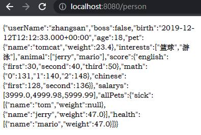

# 第三章 配置文件 - 核心功能

## 3.1 文件类型

优先级：properties > yaml

### 3.1 properties

同以前的properties用法

### 3.2 yaml

#### 3.2.1 简介

YAML 是 "YAML Ain't Markup Language"（YAML 不是一种标记语言）的递归缩写。在开发的这种语言时，YAML 的意思其实是："Yet Another Markup Language"（仍是一种标记语言）。 

非常适合用来做以数据为中心的配置文件

#### 3.2.2 基本语法

- key: value；
- kv之间有空格
- 大小写敏感
- 使用缩进表示层级关系
- 缩进不允许使用tab，只允许空格（用 idea 开发的话则可以）
- 缩进的空格数不重要，只要相同层级的元素左对齐即可
- '#'表示注释
- 字符串无需加引号。如果要加，单引号' '与双引号" "表示字符串内容 会被 转义/不转义
  - 在控制台中，单引号会将\n作为字符串输出，双引号会将\n作为换行符输出
  - 在网页中，单引号输出的是\\\n，双引号输出的是\n

#### 3.2.3 数据类型

- 字面量：单个的、不可再分的值。date、boolean、string、number、null

```yaml
k: v
```

- 对象：键值对的集合。map、hash、set、object 

```yaml
行内写法：  k: {k1:v1,k2:v2,k3:v3}
#或
k: 
	k1: v1
  k2: v2
  k3: v3
```

- 数组：一组按次序排列的值。array、list、queue

```yaml
行内写法：  k: [v1,v2,v3]
#或者
k:
 - v1
 - v2
 - v3
```

#### 3.2.4 示例

两个实体类

```java
@ConfigurationProperties(prefix = "person")
@Component
@ToString
@Data
public class Person {
    private String userName;
    private Boolean boss;
    private Date birth;
    private Integer age;
    private Pet pet;
    private String[] interests;
    private List<String> animal;
    private Map<String, Object> score;
    private Set<Double> salarys;
    private Map<String, List<Pet>> allPets;
}

@ConfigurationProperties(prefix = "pet")
@Component
@ToString
@Data
public class Pet {
    private String name;
    private Double weight;
}
```

resources / application.yml

```yaml
# yaml表示以上对象
person:
  userName: zhangsan
  boss: false
  birth: 2019/12/12 20:12:33
  age: 18
  pet: 
    name: tomcat
    weight: 23.4
  interests: [篮球,游泳]
  animal: 
    - jerry
    - mario
  score:
    english: 
      first: 30
      second: 40
      third: 50
    math: [131,140,148]
    chinese: {first: 128,second: 136}
  salarys: [3999,4999.98,5999.99]
  allPets:
    sick:
      - {name: tom}
      - {name: jerry,weight: 47}
    health: [{name: mario,weight: 47}]
```

测试：

HelloController.java

```java
@RestController
public class HelloController {
    @Autowired
    Person person;

    @RequestMapping("/person")
    public Person person(){
        return person;
    }
}
```

结果：



## 3.2 配置提示

自定义的类和配置文件绑定一般没有提示，需要导入依赖

```xml
<dependency>
  <groupId>org.springframework.boot</groupId>
  <artifactId>spring-boot-configuration-processor</artifactId>
  <optional>true</optional>
</dependency>
```

下面这个可以删掉无用的包

```xml
<build>
  <plugins>
    <plugin>
      <groupId>org.springframework.boot</groupId>
      <artifactId>spring-boot-maven-plugin</artifactId>
      <configuration>
        <excludes>
          <exclude>
            <groupId>org.springframework.boot</groupId>
            <artifactId>spring-boot-configuration-processor</artifactId>
          </exclude>
        </excludes>
      </configuration>
    </plugin>
  </plugins>
</build>
```

