# 第四章 Web开发 - 核心功能

## 4.1 SpringMVC自动配置概览

Spring Boot为大多数应用程序提供了Spring MVC的自动配置

自动配置在Spring的默认值之上添加了以下特性：

- 内容协商视图解析器和 BeanName 视图解析器

- 支持静态资源（包括 webJars）

- 自动注册 Converter，GenericConverter，Formatter 

- 支持 HttpMessageConverters （后来我们配合内容协商理解原理）

- 自动注册 MessageCodesResolver （国际化用、不怎么会用到这个）

- 静态 index.html 页支持

- 支持自定义 Favicon

- 自动使用 ConfigurableWebBindingInitializer（DataBinder负责将请求数据绑定到JavaBean上）

> If you want to keep those Spring Boot MVC customizations and make more MVC customizations (interceptors, formatters, view controllers, and other features), you can add your own @Configuration class of type WebMvcConfigurer but without @EnableWebMvc.

不用@EnableWebMvc注解。使用 @Configuration + WebMvcConfigurer 自定义规则

> If you want to provide custom instances of RequestMappingHandlerMapping, RequestMappingHandlerAdapter, or ExceptionHandlerExceptionResolver, and still keep the Spring Boot MVC customizations, you can declare a bean of type WebMvcRegistrations and use it to provide custom instances of those components.

声明 WebMvcRegistrations 改变默认底层组件

> If you want to take complete control of Spring MVC, you can add your own @Configuration annotated with @EnableWebMvc, or alternatively add your own @Configuration-annotated DelegatingWebMvcConfiguration as described in the Javadoc of @EnableWebMvc.

使用 @EnableWebMvc+@Configuration+DelegatingWebMvcConfiguration 全面接管SpringMVC


## 4.2 简单功能分析

### 4.2.1 静态资源访问

静态资源指HTML、CSS、JS、图片等。

#### 4.2.1.1 静态资源目录

只要静态资源放在类路径： called `/static` (or `/public` or `/resources` or `/META-INF/resources` 下

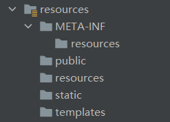

访问 ： 当前项目根路径/ + 静态资源名 

原理： 静态映射/**。

请求进来，先去找 Controller 看能不能处理。不能处理的所有请求又都交给静态资源处理器。静态资源也找不到则响应404页面。

##### 4.2.1.1.1 自定义静态资源目录

改变默认的静态资源存放的目录

先写一个配置类

com \ atnibamaitay \ springbootstudy \ config \ WebMvcConfig.java

```java
@Configuration
public class WebMvcConfig extends WebMvcConfigurerAdapter {
    @Override
    public void addResourceHandlers(ResourceHandlerRegistry registry) {
        //将所有/自定义的目录名/** 访问都映射到classpath:/自定义的目录名/ 目录下
        registry.addResourceHandler("/自定义的目录名/**").addResourceLocations("classpath:/自定义的目录名/");
    }
}
```

application.yml

```yaml
spring:
  web:
    resources:
      static-locations:
        {classpath:/自定义的目录名/}
```

改变之后，默认的静态资源目录就都无法访问其中的静态资源了。


#### 4.2.1.2 静态资源访问前缀

默认无前缀

为了让拦截器不拦截静态资源，可以在/**前面加一个前缀，让拦截器放行这个前缀。

示例：给静态资源加上前缀/res，之后访问的路径就是localhost:8080/res/**

```yaml
spring:
  mvc:
    static-path-pattern: /res/**
```

当前项目 + static-path-pattern + 静态资源名 = 静态资源文件夹下找


//==这部分内容待验证==

#### 4.2.1.3 webJar

//==这部分内容待验证==


### 4.2.3 欢迎页

Spring Boot支持静态和模板化的欢迎页。它先在静态资源目录中查找 index.html 文件。若没有找到，就会查找 index 模板。若找到其中任何一个，则自动将其用作应用程序的欢迎页面，此时，打开 `localhost:8080` 就会默认打开欢迎页。

可以配置静态资源路径，但是不可以同时配置静态资源的访问前缀，否则导致 index.html 不能被默认访问。

```yaml
spring:
#  mvc:
#    static-path-pattern: /res/**   这个会导致欢迎页功能失效

  resources:
    static-locations: [classpath:/haha/]
```

controller 能处理 /index


### 4.2.3 自定义 Favicon

favicon.ico 的文件名只能叫这个，不可改变，并且存放在静态资源目录中，SpringBoot会自动识别。

4.2.1.2 静态资源访问前缀会导致 favicon.ico 的失效


### 4.2.4 静态资源配置原理（搁置）

SpringBoot 启动默认加载 xxxAutoConfiguration 类（自动配置类）

从 SpringMVC 功能的自动配置类 WebMvcAutoConfiguration 开始，它是生效的

```java
@Configuration(proxyBeanMethods = false)
@ConditionalOnWebApplication(type = Type.SERVLET)
@ConditionalOnClass({ Servlet.class, DispatcherServlet.class, WebMvcConfigurer.class })
@ConditionalOnMissingBean(WebMvcConfigurationSupport.class)
@AutoConfigureOrder(Ordered.HIGHEST_PRECEDENCE + 10)
@AutoConfigureAfter({ DispatcherServletAutoConfiguration.class, TaskExecutionAutoConfiguration.class,
		ValidationAutoConfiguration.class })
public class WebMvcAutoConfiguration {}
```

它给容器中配了

```java
@Configuration(proxyBeanMethods = false)
@Import(EnableWebMvcConfiguration.class)
@EnableConfigurationProperties({ WebMvcProperties.class, ResourceProperties.class })
@Order(0)
public static class WebMvcAutoConfigurationAdapter implements WebMvcConfigurer {}
```

配置文件的相关属性和xxx进行了绑定。

WebMvcProperties \== spring.mvc、

```java
@ConfigurationProperties(prefix = "spring.mvc")
public class WebMvcProperties {}
```

ResourceProperties \== spring.resources

```java
@ConfigurationProperties("spring.web")
public class WebProperties {}
```

1、配置类只有一个有参构造器

```java
//有参构造器所有参数的值都会从容器中确定
//ResourceProperties resourceProperties；获取和spring.resources绑定的所有的值的对象
//WebMvcProperties mvcProperties 获取和spring.mvc绑定的所有的值的对象
//ListableBeanFactory beanFactory Spring的beanFactory
//HttpMessageConverters 找到所有的HttpMessageConverters
//ResourceHandlerRegistrationCustomizer 找到 资源处理器的自定义器。=========
//DispatcherServletPath  
//ServletRegistrationBean   给应用注册Servlet、Filter....
public WebMvcAutoConfigurationAdapter(ResourceProperties resourceProperties, WebMvcProperties mvcProperties,
				ListableBeanFactory beanFactory, ObjectProvider<HttpMessageConverters> messageConvertersProvider,
				ObjectProvider<ResourceHandlerRegistrationCustomizer> resourceHandlerRegistrationCustomizerProvider,
				ObjectProvider<DispatcherServletPath> dispatcherServletPath,
				ObjectProvider<ServletRegistrationBean<?>> servletRegistrations) {
			this.resourceProperties = resourceProperties;
			this.mvcProperties = mvcProperties;
			this.beanFactory = beanFactory;
			this.messageConvertersProvider = messageConvertersProvider;
			this.resourceHandlerRegistrationCustomizer = resourceHandlerRegistrationCustomizerProvider.getIfAvailable();
			this.dispatcherServletPath = dispatcherServletPath;
			this.servletRegistrations = servletRegistrations;
}
```

2、资源处理的默认规则

```java
@Override
		public void addResourceHandlers(ResourceHandlerRegistry registry) {
			if (!this.resourceProperties.isAddMappings()) {
				logger.debug("Default resource handling disabled");
				return;
			}
			Duration cachePeriod = this.resourceProperties.getCache().getPeriod();
			CacheControl cacheControl = this.resourceProperties.getCache().getCachecontrol().toHttpCacheControl();
			//webjars的规则
            if (!registry.hasMappingForPattern("/webjars/**")) {
				customizeResourceHandlerRegistration(registry.addResourceHandler("/webjars/**")
						.addResourceLocations("classpath:/META-INF/resources/webjars/")
						.setCachePeriod(getSeconds(cachePeriod)).setCacheControl(cacheControl));
			}
            
            //
			String staticPathPattern = this.mvcProperties.getStaticPathPattern();
			if (!registry.hasMappingForPattern(staticPathPattern)) {
				customizeResourceHandlerRegistration(registry.addResourceHandler(staticPathPattern)
						.addResourceLocations(getResourceLocations(this.resourceProperties.getStaticLocations()))
						.setCachePeriod(getSeconds(cachePeriod)).setCacheControl(cacheControl));
			}
		}
```

```yaml
spring:
#  mvc:
#    static-path-pattern: /res/**

  resources:
    add-mappings: false   禁用所有静态资源规则
```

```java
@ConfigurationProperties(prefix = "spring.resources", ignoreUnknownFields = false)
public class ResourceProperties {

	private static final String[] CLASSPATH_RESOURCE_LOCATIONS = { "classpath:/META-INF/resources/",
			"classpath:/resources/", "classpath:/static/", "classpath:/public/" };

	/**
	 * Locations of static resources. Defaults to classpath:[/META-INF/resources/,
	 * /resources/, /static/, /public/].
	 */
	private String[] staticLocations = CLASSPATH_RESOURCE_LOCATIONS;
```

3、欢迎页的处理规则

```java
	HandlerMapping：处理器映射。保存了每一个Handler能处理哪些请求。	

	@Bean
		public WelcomePageHandlerMapping welcomePageHandlerMapping(ApplicationContext applicationContext,
				FormattingConversionService mvcConversionService, ResourceUrlProvider mvcResourceUrlProvider) {
			WelcomePageHandlerMapping welcomePageHandlerMapping = new WelcomePageHandlerMapping(
					new TemplateAvailabilityProviders(applicationContext), applicationContext, getWelcomePage(),
					this.mvcProperties.getStaticPathPattern());
			welcomePageHandlerMapping.setInterceptors(getInterceptors(mvcConversionService, mvcResourceUrlProvider));
			welcomePageHandlerMapping.setCorsConfigurations(getCorsConfigurations());
			return welcomePageHandlerMapping;
		}

	WelcomePageHandlerMapping(TemplateAvailabilityProviders templateAvailabilityProviders,
			ApplicationContext applicationContext, Optional<Resource> welcomePage, String staticPathPattern) {
		if (welcomePage.isPresent() && "/**".equals(staticPathPattern)) {
            //要用欢迎页功能，必须是/**
			logger.info("Adding welcome page: " + welcomePage.get());
			setRootViewName("forward:index.html");
		}
		else if (welcomeTemplateExists(templateAvailabilityProviders, applicationContext)) {
            // 调用Controller  /index
			logger.info("Adding welcome page template: index");
			setRootViewName("index");
		}
	}
```

4、favicon

## 4.3 请求参数处理

首先写的是 SpringBoot 使用 SpringMVC 进行外部处理的整个细节。

### 4.3.1 请求映射

@xxxMapping；

如 1.3.2 方法二：Spring Initializr 中的 4 编写业务（示例），就是请求映射。

#### 4.3.1.1 Rest使用

Rest 风格，即使用 HTTP 请求方式动词来表示对资源的操作。

以前：/getUser  获取用户   /deleteUser 删除用户   /editUser  修改用户    /saveUser 保存用户

现在：/user      GET-获取用户   DELETE-删除用户   PUT-修改用户    POST-保存用户

示例：java \ com \ atnibamaitay \ boot \ controller \ HelloController.java

```java
//@RequestMapping(value = "/user",method = RequestMethod.GET)
@GetMapping("/user")            //这种方式等同于上面被注释掉的
public String getUser(){
    return "GET-张三";
}

//@RequestMapping(value = "/user",method = RequestMethod.POST)
@PostMapping("/user")
public String saveUser(){
    return "POST-张三";
}

//@RequestMapping(value = "/user",method = RequestMethod.PUT)
@PutMapping("/user")
public String putUser(){
    return "PUT-张三";
}

//@RequestMapping(value = "/user",method = RequestMethod.DELETE)
@DeleteMapping("/user")
public String deleteUser(){
    return "DELETE-张三";
}
```

要完成这个的核心，需要一个核心 Filter，即 HiddenHttpMethodFilter。

但表单只能发送 POST 和 GET 两种方式的请求，如果不处理，其他 method 都会被当成 get 方式。

```html
<form action="/user" method="get">
    <input value="REST-GET 提交" type="submit"/>
</form>
<form action="/user" method="post">
    <input value="REST-POST 提交" type="submit"/>
</form>
```

解决办法是：给 SpringMVC 配一个 HiddenHttpMethodFilter，但 SpringBoot 已经配好了，默认能用 Rest 风格

使用时需要先手动开启，因为在底层代码中

```java
@Bean
@ConditionalOnMissingBean(HiddenHttpMethodFilter.class)
@ConditionalOnProperty(prefix = "spring.mvc.hiddenmethod.filter", name = "enabled", matchIfMissing = false)
public OrderedHiddenHttpMethodFilter hiddenHttpMethodFilter(){
  	return new OrderedHiddenHttpMethodFilter();
}
```

其中，matchIfMissing = false

使用方法是：先自己手动开启这个功能

resources / application.yml

```yaml
spring:
  mvc:
    hiddenmethod:
      filter:
        enabled: true      #开启页面表单的Rest功能
```

然后，表单 method = post，隐藏域 _method = put

即在 \<input> 标签中加入属性 name="_method"，此时表单的提交方式写 POST，而 value 写提交方式

然后表单提交时就会带上 _method = PUT / delete

示例：

```html
<form action="/user" method="post">
    <input name="_method" type="hidden" value="delete"/>
    <input name="_m" type="hidden" value="delete"/>
    <input value="REST-DELETE 提交" type="submit"/>
</form>
<form action="/user" method="post">
    <input name="_method" type="hidden" value="PUT"/>
    <input value="REST-PUT 提交" type="submit"/>
</form>
```

这样一来，在 /user 路径下，GET-获取用户、DELETE-删除用户、PUT-修改用户、POST-保存用户四种不同的提交方式就调用了相应的方法，实现了其不同的功能。


```java
//自定义 filter
@Bean
public HiddenHttpMethodFilter hiddenHttpMethodFilter(){
  	HiddenHttpMethodFilter methodFilter = new HiddenHttpMethodFilter();
  	methodFilter.setMethodParam("_m");
  	return methodFilter;
}
```

#### 4.3.1.2 Rest原理（表单提交要使用REST的时候）

表单提交时会带上 _method=PUT，请求过来时被 HiddenHttpMethodFilter 拦截

​		验证请求是否正常，请求方式是否为 POST

​				若通过，获取到 _method 的值。

​				它兼容以下请求：PUT、DELETE、PATCH

​				原生的 request 是 post，此时包装模式的 requesWrapper 重写了 getMethod 方法，返回的是传入的值。

​				过滤器链放行的时候用 wrapper，以后的方法调用 getMethod 是调用 requesWrapper 的。

#### 4.3.1.3 Rest使用客户端工具

如 PostMan 直接发送Put、delete等方式请求，无需Filter。

#### 4.3.1.4 自定义 _method

如改成 _m

```java
@Configuration(proxyBeanMethods = false)
public class WebConfig {
    @Bean
    public HiddenHttpMethodFilter hiddenHttpMethodFilter(){
        HiddenHttpMethodFilter methodFilter = new HiddenHttpMethodFilter();
        methodFilter.setMethodParam("_m");
        return methodFilter;
    }
}
```

#### 4.3.1.5 请求映射原理

继承结构：

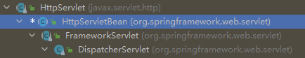

其中先从 HttpServlet 中 doGet 开始，再进入 FrameworkServlet 中的 processRequest 执行 doService，然后再进入 DispatchServlet 调用 doDispatch（每个请求都会调用）。因此，对 SpringMVC 功能分析都从 doDispatch 开始。

```java
protected void doDispatch(HttpServletRequest request, HttpServletResponse response) throws Exception {
		HttpServletRequest processedRequest = request;
		HandlerExecutionChain mappedHandler = null;
		boolean multipartRequestParsed = false;

		WebAsyncManager asyncManager = WebAsyncUtils.getAsyncManager(request);

		try {
			ModelAndView mv = null;
			Exception dispatchException = null;

			try {
				processedRequest = checkMultipart(request);
				multipartRequestParsed = (processedRequest != request);

				// 找到当前请求使用哪个Handler（Controller的方法）处理
				mappedHandler = getHandler(processedRequest);
                
                //HandlerMapping：处理器映射。/xxx->>xxxx
```


RequestMappingHandlerMapping：保存了所有 @RequestMapping 和 handler 的映射规则。


所有的请求映射都在HandlerMapping中。

 

● SpringBoot自动配置欢迎页的 WelcomePageHandlerMapping 。访问 /能访问到index.html；

● SpringBoot自动配置了默认 的 RequestMappingHandlerMapping

● 请求进来，挨个尝试所有的HandlerMapping看是否有请求信息。

 ○ 如果有就找到这个请求对应的handler

 ○ 如果没有就是下一个 HandlerMapping

● 我们需要一些自定义的映射处理，我们也可以自己给容器中放HandlerMapping。自定义 HandlerMapping

```java
	protected HandlerExecutionChain getHandler(HttpServletRequest request) throws Exception {
		if (this.handlerMappings != null) {
			for (HandlerMapping mapping : this.handlerMappings) {
				HandlerExecutionChain handler = mapping.getHandler(request);
				if (handler != null) {
					return handler;
				}
			}
		}
		return null;
	}
```

### 4.3.2 普通参数与基本注解

#### 4.3.2.1 注解

| 注解              | 介绍                                                         |
| ----------------- | ------------------------------------------------------------ |
| @PathVariable     | 路径变量                                                     |
| @RequestHeader    | 获取请求头                                                   |
| @RequestParam     | 获取请求参数                                                 |
| @CookieValue      | 获取cookie值                                                 |
| @RequestBody      | 获取请求体<br />只有 POST 请求才有请求体，因此就是获取整个表单的k:v |
| @requestAttribute | 获取 request 域属性                                          |
| @MatrixVariable   | 矩阵变量<br />矩阵变量应该绑定在路径变量中<br />方式一：/cars/{path}?xxx=xxx&aaa=ccc queryString<br />这种是查询字符串，使用注解@RequestParam<br />方式二：/cars/sell;low=34;brand=byd,audi,yd<br />              /boss/1/2 <br />              /boss/1;age=20/2;age=20<br />这种分号的写法称为矩阵变量<br />一个Key有多个value，用逗号分割<br />分号前是访问路径，分好后是真正的矩阵变量，多个变量又以分号区分 |

SpringBoot 默认禁止了矩阵变量的功能，使用前需手动开启。

方式一：使用@Bean的方式给容器中加入WebMvcConfigurer这个组件

```java
public class WebConfig {
  	@Bean
    public WebMvcConfigurer webMvcConfigurer(){
        return new WebMvcConfigurer() {
            @Override
            public void configurePathMatch(PathMatchConfigurer configurer) {
              UrlPathHelper urlPathHelper = new UrlPathHelper();
              // 不移除；后面的内容。矩阵变量功能就可以生效
              urlPathHelper.setRemoveSemicolonContent(false);
              configurer.setUrlPathHelper(urlPathHelper);
            }
        };
    }
}
```

方式二：让配置类实现WebMvcConfigurer，然后重写相应方法

```java
public class WebConfig implements WebMvcConfigurer {
    @Override
    public void configurePathMatch(PathMatchConfigurer configurer) {

        UrlPathHelper urlPathHelper = new UrlPathHelper();
        // 不移除；后面的内容。矩阵变量功能就可以生效
        urlPathHelper.setRemoveSemicolonContent(false);
        configurer.setUrlPathHelper(urlPathHelper);
    }
}
```

页面开发，cookie禁用了，session里面的内容怎么使用？

正常的步骤：给中保存了a,b（a的值为b）session.set(a,b)，而每个session都有一个jsessionid，jsessionid存在于cookie中，每次发请求携带。

被禁后的步骤：进行url重写：/abc;jsesssionid=xxxx 把cookie的值使用矩阵变量的方式进行传递.如果使用请求参数的方式进行传递，就和普通的请求参数没法区分了，而矩阵变量一般都是代表cookie中的k,v

##### 4.3.2.1.1 @PathVariable 示例

com \ atnibamaitay \ springbootstudy \ controller \ ParameterTestController.java

```java
//{id}是为了获取唯一的汽车信息，但可能有多个人拥有2号汽车，因此还可以再加一处变量，就是{username}指定拥有者的名字，这就构成了这串请求
@GetMapping("/car/{id}/owner/{username}")
public Map<String,Object> getCar(@PathVariable("id") Integer id,
                                 @PathVariable("username") String name,
                                 @PathVariable Map<String,String> pv){
    Map<String,Object> map = new HashMap<>();
    map.put("id",id);
    map.put("name",name);
    //除了明确发送指定id，指定username请求，向服务器要指定id，指定username的值外，也可以提取出所有路径变量的k:v，此时Map尖括号里面的k,v应该是String,String。
    map.put("pv",pv);
    return map;
}
```

结果：

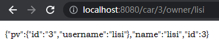

##### 4.3.2.1.2 @RequestHeader 示例

获取请求头的信息

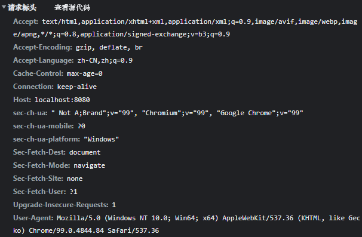

com \ atnibamaitay \ springbootstudy \ controller \ ParameterTestController.java

```java
@GetMapping("/car/{id}/owner/{username}")
public Map<String,Object> getCar(@RequestHeader("User-Agent") String userAgent,
                                 @RequestHeader Map<String,String> header){
    Map<String,Object> map = new HashMap<>();

    map.put("userAgent",userAgent);
    map.put("headers",header);
    return map;
}
```

结果：

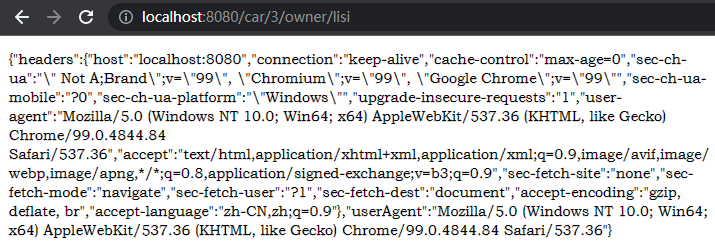

##### 4.3.2.1.3 @RequestParam 示例

本示例未测试成功

com \ atnibamaitay \ springbootstudy \ controller \ ParameterTestController.java

```java
@GetMapping("/car/{id}/owner/{username}")
public Map<String,Object> getCar(@RequestParam("age") Integer age,
                                 @RequestParam("inters") List<String> inters,
                                 @RequestParam Map<String,String> params){
    Map<String,Object> map = new HashMap<>();

    map.put("age",age);
    map.put("inters",inters);
    map.put("params",params);
    return map;
}
```

结果：

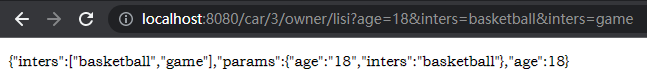

##### 4.3.2.1.4 @CookieValue 示例

由于没有 Cookie 信息，该实例未测试成功

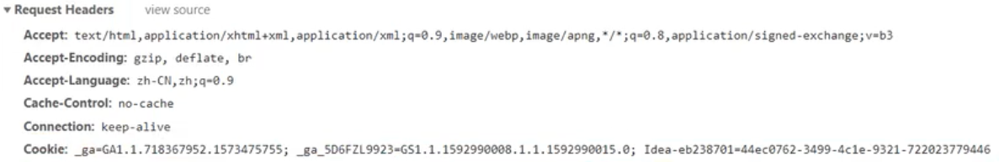

com \ atnibamaitay \ springbootstudy \ controller \ ParameterTestController.java

```java
@GetMapping("/car/{id}/owner/{username}")
public Map<String,Object> getCar(@PathVariable("id") Integer id,
                                 @PathVariable("username") String name,
                                 @PathVariable Map<String,String> pv,
                                 @CookieValue("_ga") String _ga,
                                 @CookieValue("_ga") Cookie cookie){
    Map<String,Object> map = new HashMap<>();

    map.put("id",id);
    map.put("name",name);
    map.put("pv",pv);
    map.put("_ga",_ga);
    System.out.println(cookie.getName()+"===>"+cookie.getValue());
    return map;
}
```

结果：

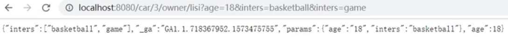

##### 4.3.2.1.5 @RequestBody 示例

com \ atnibamaitay \ springbootstudy \ controller \ ParameterTestController.java

```java
@PostMapping("/save")
public Map postMethod(@RequestBody String content){
    Map<String,Object> map = new HashMap<>();
    map.put("content",content);
    return map;
}
```

测试用的代码：

index.html

```html
<form action="/save" method="post">
    测试@RequestBody获取数据 <br/>
    用户名：<input name="userName"/> <br>
    邮箱：<input name="email"/>
    <input type="submit" value="提交"/>
</form>
```

结果：

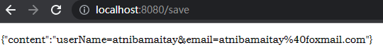

##### 4.3.2.1.6 @requestAttribute 示例

```java
@Controller
public class ParameterTestController {
    @RequestMapping("/fo1")
    public String fo1(HttpServletRequest request) {
       //在 request 中存储数据
        request.setAttribute("id", 001);
        request.setAttribute("name", "Test");
        request.setAttribute("age", 18);
        //转发到另一个 controller 中
        return "/fo2";
    }
    
    //@RequestAttribute("a") 该注解可以将request中的值直接赋值给方法中的参数
    @ResponseBody
    @RequestMapping("/fo2")
    public Object fo2(HttpServletRequest request,
                      @RequestAttribute("id") Integer id,
                      @RequestAttribute("name") String name,
                      @RequestAttribute("age") Integer age) {

        //从 request 中获取数据
        Object id1 = request.getAttribute("id");
        Object name1 = request.getAttribute("name");
        Object age1 = request.getAttribute("age");

        ArrayList<Object> list = new ArrayList<>();
        list.add(id1);
        list.add(name1);
        list.add(age1);

        ArrayList<Object> arrayList = new ArrayList<>();
        arrayList.add(list);

        return arrayList;
    }
}
```

结果：

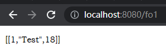

##### 4.3.2.1.7 @MatrixVariable 示例

```java
//这个代码未测试成功，这个方式可能被淘汰了，建议使用第二个
//1、语法： 请求路径：/cars/sell;low=34;brand=byd,audi,yd
//2、矩阵变量必须有url路径变量才能被解析
@GetMapping("/cars/{path}")
public Map carsSell(@MatrixVariable("low") Integer low,
                    @MatrixVariable("brand") List<String> brand,
                    @PathVariable("path") String path){
    Map<String,Object> map = new HashMap<>();

    map.put("low",low);
    map.put("brand",brand);
    map.put("path",path);
    return map;
}
//——————————————————————————————————————————————————————————————————————————————————————————————
//测试成功
// /boss/1;age=20/2;age=10
//因为每个路径变量上有相同的矩阵变量的名字，直接按照上面那种办法会有歧义
//因此可以 @MatrixVariable(value = "",pathVar = "")
@GetMapping("/boss/{bossId}/{empId}")
public Map boss(@MatrixVariable(value = "age",pathVar = "bossId") Integer bossAge,
                @MatrixVariable(value = "age",pathVar = "empId") Integer empAge){
    Map<String,Object> map = new HashMap<>();

    map.put("bossAge",bossAge);
    map.put("empAge",empAge);
    return map;
}
```

结果：

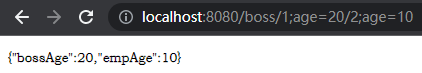

#### 4.3.2.2 Servlet API

WebRequest、ServletRequest、MultipartRequest、 HttpSession、javax.servlet.http.PushBuilder、Principal、InputStream、Reader、HttpMethod、Locale、TimeZone、ZoneId

 

ServletRequestMethodArgumentResolver  以上的部分参数

```java
@Override
	public boolean supportsParameter(MethodParameter parameter) {
		Class<?> paramType = parameter.getParameterType();
		return (WebRequest.class.isAssignableFrom(paramType) ||
				ServletRequest.class.isAssignableFrom(paramType) ||
				MultipartRequest.class.isAssignableFrom(paramType) ||
				HttpSession.class.isAssignableFrom(paramType) ||
				(pushBuilder != null && pushBuilder.isAssignableFrom(paramType)) ||
				Principal.class.isAssignableFrom(paramType) ||
				InputStream.class.isAssignableFrom(paramType) ||
				Reader.class.isAssignableFrom(paramType) ||
				HttpMethod.class == paramType ||
				Locale.class == paramType ||
				TimeZone.class == paramType ||
				ZoneId.class == paramType);
	}
```

#### 4.3.2.3 复杂参数

Map、Model（map、model里面的数据会被放在request的请求域  request.setAttribute）、Errors/BindingResult、RedirectAttributes（ 重定向携带数据）、ServletResponse（response）、SessionStatus、UriComponentsBuilder、ServletUriComponentsBuilder

```java
Map<String,Object> map,  Model model, HttpServletRequest request 都是可以给request域中放数据，
request.getAttribute();
```

Map、Model类型的参数，会返回 mavContainer.getModel（）；---> BindingAwareModelMap 是Model 也是Map

mavContainer.getModel(); 获取到值的


#### 4.3.2.4 自定义对象参数

可以自动类型转换与格式化，可以级联封装。

```java
/**
 *     姓名： <input name="userName"/> <br/>
 *     年龄： <input name="age"/> <br/>
 *     生日： <input name="birth"/> <br/>
 *     宠物姓名：<input name="pet.name"/><br/>
 *     宠物年龄：<input name="pet.age"/>
 */
@Data
public class Person {
    private String userName;
    private Integer age;
    private Date birth;
    private Pet pet;
}

@Data
public class Pet {
    private String name;
    private String age;
}

result
```

### 4.3.3 POJO封装过程

- ServletModelAttributeMethodProcessor


### 4.3.4 参数处理原理

- HandlerMapping中找到能处理请求的Handler（Controller.method()）
- 为当前Handler 找一个适配器 HandlerAdapter； **RequestMappingHandlerAdapter**
- 适配器执行目标方法并确定方法参数的每一个值


#### 4.3.4.1 HandlerAdapter


0 - 支持方法上标注@RequestMapping 

1 - 支持函数式编程的

xxxxxx

#### 4.3.4.2 执行目标方法

## 4.4 数据响应与内容协商

这部分内容暂时先搁置


## 4.5 视图解析与模板引擎

视图解析即SpringBoot处理完某个请求后跳转到某个页面的过程。

SpringBoot 默认不支持 JSP，需要引入第三方模板引擎技术实现页面渲染。

### 4.5.1 视图解析

视图处理方式：转发、重定向、自定义视图

### 4.5.2 模板引擎 - Thymeleaf

注意，Thymeleaf不适合高并发的情况下使用。

#### 4.5.2.1 基本语法

##### 4.5.2.1.1 表达式

| 表达式名字 | 语法   | 用途                               |
| ---------- | ------ | ---------------------------------- |
| 变量取值   | ${...} | 获取请求域、session域、对象等值    |
| 选择变量   | *{...} | 获取上下文对象值                   |
| 消息       | #{...} | 获取国际化等值                     |
| 链接       | @{...} | 生成链接                           |
| 片段表达式 | ~{...} | jsp:include 作用，引入公共页面片段 |

##### 4.5.2.1.2 字面量

文本值: 'one text' , 'Another one!' ,…数字: 0 , 34 , 3.0 , 12.3 ,…布尔值: true , false

空值: null

变量： one，two，.... 变量不能有空格

##### 4.5.2.1.3 文本操作

字符串拼接: +

变量替换: |The name is ${name}| 

##### 4.5.2.1.4 数学运算

运算符: + , - , * , / , %

##### 4.5.2.1.5 布尔运算

运算符:  and , or

一元运算: ! , not 

##### 4.5.2.1.6 比较运算

比较: > , < , >= , <= ( gt , lt , ge , le )等式: == , != ( eq , ne ) 

##### 4.5.2.1.7 条件运算

If-then: (if) ? (then)

If-then-else: (if) ? (then) : (else)

Default: (value) ?: (defaultvalue) 

##### 4.5.2.1.8 特殊操作

无操作： _

#### 4.5.2.2 设置属性值-th:attr

设置单个值

取值用的是th:attr=""，意思就是给某个属性赋值

```html
<form action="subscribe.html" th:attr="action=@{/subscribe}">
  <fieldset>
    <input type="text" name="email" />
    <input type="submit" value="Subscribe!" th:attr="value=#{subscribe.submit}"/>
  </fieldset>
</form>
```

设置多个值

```html

```

以上两个的代替写法 th:xxxx

th:value=""

```html
<input type="submit" value="Subscribe!" th:value="#{subscribe.submit}"/>
<form action="subscribe.html" th:action="@{/subscribe}">
```

#### 4.5.2.3 Thymeleaf 的使用

引入

```xml
<dependency>
  	<groupId>org.springframework.boot</groupId>
  	<artifactId>spring-boot-starter-thymeleaf</artifactId>
</dependency>
```

由

```java
@Configuration(proxyBeanMethods = false)
@EnableConfigurationProperties(ThymeleafProperties.class)
@ConditionalOnClass({ TemplateMode.class, SpringTemplateEngine.class })
@AutoConfigureAfter({ WebMvcAutoConfiguration.class, WebFluxAutoConfiguration.class })
public class ThymeleafAutoConfiguration { }
```

可知，SpringBoot 已经自动配好的策略

- 1、所有 thymeleaf 的配置值都在 ThymeleafProperties

- 2、配置好了 SpringTemplateEngine*

- 3、配好了 ThymeleafViewResolver*

我们只需要直接开发页面，由

```java
public static final String DEFAULT_PREFIX = "classpath:/templates/";
public static final String DEFAULT_SUFFIX = ".html";  //xxx.html
```

可知，页面默认应该放在 resources / templates 文件夹中

resources / templates / success.html

```html
<!DOCTYPE html>
<html lang="en" xmlns:th="http://www.thymeleaf.org">
<head>
    <meta charset="UTF-8">
    <title>Title</title>
</head>
<body>
<h1 th:text="${msg}">哈哈</h1>
<h2>
    <a href="www.baidu.com" th:href="${link}">去百度</a>  <br/>
    <a href="www.baidu.com" th:href="@{link}">去百度2</a>
</h2>
</body>
</html>
```

src \ main \ java \ com \ atnibamaitay \ SpringBootStudy \ controller \ ViewTestController.java

```java
@Controller
public class ViewTestController {
    @GetMapping("/atnibam")
    public String atnibam(Model model){
        //model中的数据会被放在请求域中 request.setAttribute("a",aa)
        model.addAttribute("msg","你好 Atnibam");
        model.addAttribute("link","http://www.baidu.com");
      	//写页面的名字即可
        return "success";
    }
}
```

还可以设置一下前缀地址

application.yml

```yaml
server:
  servlet:
    context-path: /world
```

结果：

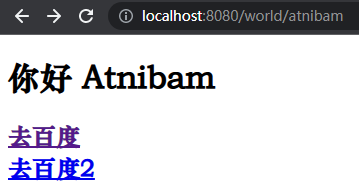

##### 4.5.2.3.1 抽取模板

对于一个页面中相同的部分，可以给其声明

templates / common.html

```html
<head th:fragment="commonheader">
    <link href="css/style.css" th:href="@{/css/style.css}" rel="stylesheet">
    <link href="css/style-responsive.css" th:href="@{/css/style-responsive.css}" rel="stylesheet">
</head>
```

，然后在其他地方引用时，使用

```html
<div th:insert="~{common :: commonheader}"></div>
```

或者

```html
<div th:include="common :: commonheader"></div>
```

插入即可。它们的意思是插入 common.html 页面的 commonheader 部分。

###### 4.5.2.3.1.1 th:insert和th:replace(和th:include)之间的区别

th:include 自 thymeleaf 3.0 起不推荐使用

例如，对于

```html
<footer th:fragment="copy">
    &copy; 2011 The Good Thymes Virtual Grocery
</footer>
```

然后

```html
<div th:insert="footer :: copy"></div>
<div th:replace="footer :: copy"></div>
<div th:include="footer :: copy"></div>
```

效果是

```html
<div>
  	<footer>
    	&copy; 2011 The Good Thymes Virtual Grocery
  	</footer>
</div>

<footer>
  	&copy; 2011 The Good Thymes Virtual Grocery
</footer>

<div>
  	&copy; 2011 The Good Thymes Virtual Grocery
</div>
```


## 4.6 拦截器

拦截器的底层接口是 HandlerInterceptor，其中定义了三个方法

| 方法            | 说明                           |
| --------------- | ------------------------------ |
| preHandle       | 预先处理<br />目标方法执行之前 |
| postHandle      | 目标方法执行完成以后           |
| afterCompletion | 页面渲染以后                   |

### 4.6.1 HandlerInterceptor 接口

src \ main \ java \ com \ atnibamaitay \ SpringBootStudy \ interceptor \ LoginInterceptor.java

```java
/**
 * 登录检查
 * 1、配置好拦截器要拦截哪些请求
 * 2、把这些配置放在容器中
 */
public class LoginInterceptor implements HandlerInterceptor {
    //目标方法执行之前
    @Override
    public boolean preHandle(HttpServletRequest request, HttpServletResponse response, Object handler) throws Exception {
        String requestURI = request.getRequestURI();

        //登录检查逻辑
        HttpSession session = request.getSession();

        Object loginUser = session.getAttribute("loginUser");

        if(loginUser != null){
            //放行
            return true;
        }

        //未登录的情况下，并成功拦截住时，应该跳转到登录页
        request.setAttribute("msg","请先登录");
        //转发请求到"/"下
        request.getRequestDispatcher("/").forward(request,response);
        return false;
    }

    //目标方法执行完成以后
    @Override
    public void postHandle(HttpServletRequest request, HttpServletResponse response, Object handler, ModelAndView modelAndView) throws Exception {}

    //页面渲染以后
    @Override
    public void afterCompletion(HttpServletRequest request, HttpServletResponse response, Object handler, Exception ex) throws Exception {}
}
```

### 4.6.2 配置拦截器

实现 WebMvcConfigurer 这个接口来定制化配置。

拦截器要工作，首先拦截器要在容器中，

src \ main \ java \ com \ atnibamaitay \ SpringBootStudy \ config \ AdminWebConfig.java

```java
/**
 * 1、编写一个拦截器实现HandlerInterceptor接口
 * 2、拦截器注册到容器中（即实现WebMvcConfigurer的addInterceptors）
 * 3、指定拦截规则【如果是拦截所有，静态资源也会被拦截】
 */
@Configuration
public class AdminWebConfig implements WebMvcConfigurer {
    @Override
    public void addInterceptors(InterceptorRegistry registry) {
        registry.addInterceptor(new LoginInterceptor())
                .addPathPatterns("/**")                                     //所有请求都被拦截包括静态资源
                .excludePathPatterns("/","/login","/css/**","/fonts/**",
                                     "/images/**","/js/**");                //放行的请求
    }
}
```

## 4.7 文件上传

一个测试用的文件上传表单

resources / templates / form_layouts.html

```html
<form role="form" th:action="@{/upload}" method="post" enctype="multipart/form-data">
    <div class="form-group">
        <label for="exampleInputEmail1">邮箱</label>
        <input type="email" name="email" class="form-control" id="exampleInputEmail1" placeholder="Enter email">
    </div>
    <div class="form-group">
        <label for="exampleInputPassword1">名字</label>
        <input type="text" name="username" class="form-control" id="exampleInputPassword1" placeholder="Password">
    </div>
    <!-- 单文件上传 -->
    <div class="form-group">
        <label for="exampleInputFile">头像</label>
        <input type="file" name="headerImg" id="exampleInputFile">
    </div>
    <!-- 加上multipart就可以多文件上传 -->
    <div class="form-group">
        <label for="exampleInputFile">生活照</label>
        <input type="file" name="photos" multiple>
    </div>
    <div class="checkbox">
        <label>
            <input type="checkbox"> Check me out
        </label>
    </div>
    <button type="submit" class="btn btn-primary">提交</button>
</form>
```

SpringBoot 默认可以上传的单个文件的最大大小为1MB，多个文件的最大总大小为10MB，可以通过配置修改

```properties
spring.servlet.multipart.max-file-size=10MB
spring.servlet.multipart.max-request-size=10MB
```

com \ atnibamaitay \ SpringBootStudy \ controller \ FormController.java

```java
@Slf4j
@Controller
public class FormController {
    @GetMapping("/form_layouts")
    public String form_layouts(){
        return "form/form_layouts";
    }

    /**
     * MultipartFile 自动封装上传过来的文件
     * @param email
     * @param username
     * @param headerImg
     * @param photos
     * @return
     */
    @PostMapping("/upload")
    public String upload(@RequestParam("email") String email,
                         @RequestParam("username") String username,
                         /* 单文件上传 */
                         @RequestPart("headerImg") MultipartFile headerImg,
                         /* 多文件上传 */
                         @RequestPart("photos") MultipartFile[] photos) throws IOException {
        //获取用户上传的文件的信息
        log.info("上传的信息：email={}，username={}，headerImg={}，photos={}",
                email,username,headerImg.getSize(),photos.length);
        //这里photos.length的意思是用户上传的照片的数量
      
        //保存到文件服务器或者是对象存储服务器
        if(!headerImg.isEmpty()){
            //拿到原始的文件名
            String originalFilename = headerImg.getOriginalFilename();
            headerImg.transferTo(new File("K:\\cache\\"+originalFilename));
        }

        if(photos.length > 0){
            for (MultipartFile photo : photos) {
                if(!photo.isEmpty()){
                    String originalFilename = photo.getOriginalFilename();
                    photo.transferTo(new File("K:\\cache\\"+originalFilename));
                }
            }
        }

        return "main";
    }
}
```

## 4.8 异常处理

默认情况下，Spring Boot 提供 /error 处理所有错误的映射。

对于机器客户端（如Postman），它将生成JSON响应，其中包含错误，HTTP状态和异常消息的详细信息。

对于浏览器客户端，响应一个“ whitelabel”错误视图，以HTML格式呈现相同的数据。

### 4.8.1 自定义错误页

错误页面应该放在

resources / public / error / 404.html

resources / templates / error / 5xx.ftlh

这些目录下的页面会被自动解析，其中文件名应该是状态码或序列掩码。

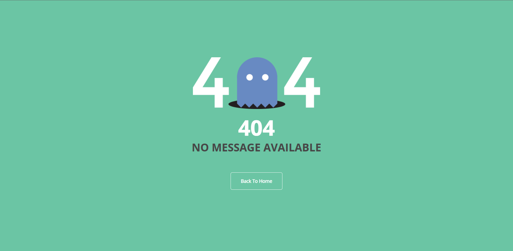

## 4.9 原生 Servlet 组件（Servlet、Filter、Listener）注入

### 4.9.1 方式一：Servlet API

#### 4.9.1.1 Servlet

首先需要在主程序类中增添一个注解，用于扫描指定目录下的 Servlet

```java
@ServletComponentScan(basePackages = "com.atnibamaitay.springbootstudywebproject")
```

com \ atnibamaitay \ SpringBootStudy \ servlet \ MyServlet.java

```java
//配置能够处理的请求
@WebServlet(urlPatterns = "/my")
public class MyServlet extends HttpServlet {
    @Override
    protected void doGet(HttpServletRequest req, HttpServletResponse resp) throws ServletException, IOException {
        resp.getWriter().write("66666");
    }
}
```

结果：

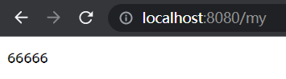

这个Servlet是不经过拦截器的，直接访问。

#### 4.9.1.2 Filter

com \ atnibamaitay \ SpringBootStudy \ servlet \ MyFilter.java

```java
@Slf4j
//这里注意，*是Servlet的写法，**是Spring的写法，这里配置的是要拦截的目录。
@WebFilter(urlPatterns={"/css/*","/images/*"})
public class MyFilter implements Filter {
    @Override
    public void init(FilterConfig filterConfig) throws ServletException {
        log.info("MyFilter初始化完成");
    }

    @Override
    public void doFilter(ServletRequest request, ServletResponse response, FilterChain chain) throws IOException, ServletException {
        log.info("MyFilter工作");
        chain.doFilter(request,response);
    }

    @Override
    public void destroy() {
        log.info("MyFilter销毁");
    }
}
```

#### 4.9.1.3 Listener

com \ atnibamaitay \ SpringBootStudy \ servlet \ MySwervletContextListener.java

```java
@Slf4j
@WebListener
public class MySwervletContextListener implements ServletContextListener {
    @Override
    public void contextInitialized(ServletContextEvent sce) {
        log.info("MySwervletContextListener 监听到项目初始化完成");
    }

    @Override
    public void contextDestroyed(ServletContextEvent sce) {
        log.info("MySwervletContextListener 监听到项目销毁");
    }
}
```

### 4.9.2 方式二：RegistrationBean

当方式一中的代码没有写 @WebServlet、@WebFilter、@WebListener，就变成了三个普通的类，不是组件，此时可以通过 RegistrationBean 来实现相同的效果。

com \ atnibamaitay \ SpringBootStudy \ servlet \ MyRegistConfig.java

```java
/**
 * 1、MyServlet --> /my
 * 2、DispatcherServlet --> /
 */
@Configuration(proxyBeanMethods = true)   // (proxyBeanMethods = true)：保证依赖的组件始终是单实例的
public class MyRegistConfig {
    @Bean
    public ServletRegistrationBean myServlet(){
        MyServlet myServlet = new MyServlet();
        return new ServletRegistrationBean(myServlet,"/my","/my02");
    }

    @Bean
    public FilterRegistrationBean myFilter(){
        MyFilter myFilter = new MyFilter();
        //第一种：拦截myServlet规定的路径
        //return new FilterRegistrationBean(myFilter,myServlet());
        //第二种：自定义拦截的路径
        FilterRegistrationBean filterRegistrationBean = new FilterRegistrationBean(myFilter);
        filterRegistrationBean.setUrlPatterns(Arrays.asList("/my","/css/*"));
        return filterRegistrationBean;
    }

    @Bean
    public ServletListenerRegistrationBean myListener(){
        MySwervletContextListener mySwervletContextListener = new MySwervletContextListener();
        return new ServletListenerRegistrationBean(mySwervletContextListener);
    }
}
```


## 4.10 嵌入式Web容器


## 4.11 定制化原理

