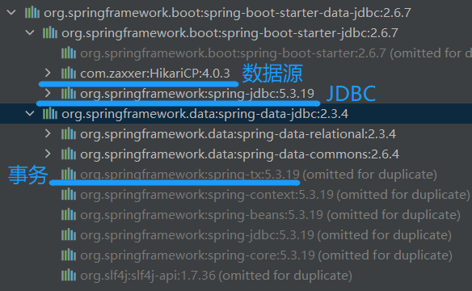
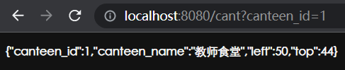
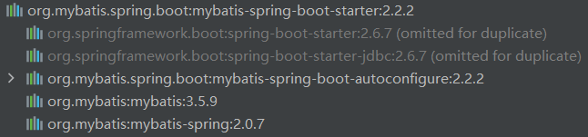
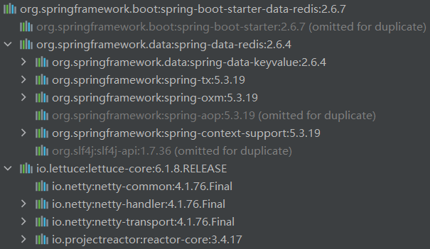

# 第五章 数据访问

## 5.1 SQL

### 5.1.1 准备

#### 5.1.1.1 导入

导入 Jdbc 场景

```xml
<dependency>
  	<groupId>org.springframework.boot</groupId>
  	<artifactId>spring-boot-starter-data-jdbc</artifactId>
</dependency>
```

导入数据库驱动。

此处导的是 MySQL 的驱动，SpringBoot 不会自动导驱动，需要自己去 Mave 中央仓库找，不过有对驱动进行版本仲裁。

```xml
<dependency>
  	<groupId>mysql</groupId>
  	<artifactId>mysql-connector-java</artifactId>
</dependency>
```

##### 5.1.1.2.1 注意

数据库的版本要和驱动的版本对应。

修改数据库驱动版本办法

1、直接依赖引入具体版本（Maven的就近依赖原则）

2、重新声明版本（Maven的属性的就近优先原则）

```xml
<properties>
  	<java.version>1.8</java.version>
  	<mysql.version>5.1.49</mysql.version>
</properties>
```

#### 5.1.1.2 配置

```yaml
spring:
  datasource:
    url: jdbc:mysql://localhost:3306/test
    username: root
    password: 20010623
    driver-class-name: com.mysql.cj.jdbc.Driver
```

还可以配置

##### 5.1.1.2.1 超时（单位：秒）

```yaml
  jdbc:
    template:
      query-timeout: 3
```

##### 5.1.1.2.2

#### 5.1.1.3 测试

```java
@Slf4j
@SpringBootTest
class Boot05WebAdminApplicationTests {
    # 自动配置已经往容器中放了一个jdbcTemplate，因此这里只需要自动注入即可。
    @Autowired
    JdbcTemplate jdbcTemplate;

    @Test
    void contextLoads() {
        # 然后就可以使用 jdbcTemplate 来做一些事情。
        Long aLong = jdbcTemplate.queryForObject("select count(*) from class", Long.class);
        log.info("记录总数：{}",aLong);
    }
}
```

### 5.1.2 自动配置分析

启动 Jdbc 的场景时，SpringBoot自动导入了：



#### 5.1.2.1 自动配置的类

DataSourceAutoConfiguration：数据源的自动配置，相对于配好了要用的数据库底层连接池。

- 修改数据源相关的配置：spring.datasource

因为这个类的注解 @EnableConfigurationProperties({DataSourceProperties.class}) 开启了配置文件绑定功能，使得跟数据源有关的配置都在 DataSourceProperties 中绑定。

```java
@ConfigurationProperties(prefix = "spring.datasource")
```

- 数据库连接池的配置，是自己容器中没有 DataSource 才自动配置的

```java
@Configuration(proxyBeanMethods = false)
@Conditional(PooledDataSourceCondition.class)
@ConditionalOnMissingBean({ DataSource.class, XADataSource.class })
@Import({ DataSourceConfiguration.Hikari.class, DataSourceConfiguration.Tomcat.class,
         DataSourceConfiguration.Dbcp2.class, DataSourceConfiguration.OracleUcp.class,
         DataSourceConfiguration.Generic.class, DataSourceJmxConfiguration.class })
protected static class PooledDataSourceConfiguration{}
```

- 底层配置好的连接池是：HikariDataSource

DataSourceTransactionManagerAutoConfiguration：事务管理器的自动配置

JdbcTemplateAutoConfiguration：JdbcTemplate 的自动配置，可以来对数据库进行 crud

- JdbcTemplate 是操作数据库的一个小组件
- 这个配置类往容器中增添了一个组件 JdbcTemplate。
- 可以修改这个配置项 @ConfigurationProperties(prefix = "spring.jdbc") 来修改 JdbcTemplate。
  - 比如增添一个查询超时属性，若3秒内没查出来则为查询超时。

```yaml
spring:
  jdbc:
    template:
      query-timeout: 3
```

JndiDataSourceAutoConfiguration：jndi的自动配置

XADataSourceAutoConfiguration：分布式事务相关的


## 5.2 使用 Druid 数据源

Hikari 是连接池目前公认是性能最高的数据库连接池，也是 SpringBoot 默认配置的数据源。当然也可以使用其他数据源，比如阿里的 Druid，它具有全方位监控、防止SQL注入攻击等对数据源的全套解决方案。

Druid Github：https://github.com/alibaba/druid

整合第三方技术有两种方式：①自定义；②找starter

### 5.2.1 自定义使用

这部分先搁置

### 5.2.2 starter 使用

#### 5.2.2.1 导入场景启动器

```xml
<dependency>
   <groupId>com.alibaba</groupId>
   <artifactId>druid-spring-boot-starter</artifactId>
   <version>1.1.17</version>
</dependency>
```

com \ atnibamaitay \ SpringBootStudy \ config \ MyDataSourceConfig.java

```java
@Configuration
public class MyDataSourceConfig {
  
    //默认的自动配置是：判断容器中没有自己配置的数据源，才会配 @ConditionalOnMissingBean(DataSource.class)
    //这个的意思是将 DataSource 这个组件中的属性和配置文件中的 "spring.datasource" 进行绑定
    @ConfigurationProperties("spring.datasource")
    @Bean
    public DataSource dataSource() /*throws SQLException*/ {
        DruidDataSource druidDataSource = new DruidDataSource();

        //在配置文件中已经配置了数据库的url、username、password等配置信息了
        //将配置信息直接写在代码中并不合适，要写在配置文件中
        //druidDataSource.setUrl();
        //druidDataSource.setUsername();
        //druidDataSource.setPassword();

        return druidDataSource;
    }
}
```

#### 5.2.2.2 配置

具体配置见官方文档

```yaml
spring:
  datasource:
    url: jdbc:mysql://localhost:3306/test
    username: root
    password: 20010623
    driver-class-name: com.mysql.cj.jdbc.Driver

    druid:
      aop-patterns: com.atnibamaitay.springbootstudywebproject.*  #监控SpringBean这个包下的所有组件
      filters: stat,wall        # 底层开启功能，stat（sql监控），wall（防火墙）

      stat-view-servlet:        # 配置监控页功能
        enabled: true
        login-username: admin   # 监控页登陆用户名
        login-password: admin   # 监控页登陆密码
        resetEnable: false      # 是否有重置按钮

      web-stat-filter:          # 和web-stat-filter有关的配置，监控web
        enabled: true           # 默认关闭，所以要开启
        urlPattern: /*          # 匹配的
        exclusions: '*.js,*.gif,*.jpg,*.png,*.css,*.ico,/druid/*'          # 排除的，没写也有默认值，因为是字符串所以需要单引号

      filter:                   # 对上面filters里面的stat的详细配置
        stat:
          enabled: true         # 先开启这个功能
          slow-sql-millis: 1000 # 设定慢查询的标准，超过1000毫秒的查询都是慢查询
          logSlowSql: true      # 日志是否记录慢查询
        wall:
          enabled: true         # 先开启防火墙功能
          config:
            drop-table-allow: false   # 拦截所有删除操作
```


### 5.2.3 场景启动器自动配置分析

mvn_resp \ com \ alibaba \ druid-spring-boot-starter \ 1.1.17 \ druid-spring-boot-starter-1.1.17.jar! \ com \ alibaba \ druid \ spring \ boot \ autoconfigure \ DruidDataSourceAutoConfigure.class

```java
@Configuration
@ConditionalOnClass({DruidDataSource.class})
# 如果SpringBoot默认的Hikari在前，下面的@ConditionalOnMissingBean就不生效了，因此只有容器中没有的时候整。也就是说，当我们自定义数据源的时候，就把默认的禁用了，自定义为先。
@AutoConfigureBefore({DataSourceAutoConfiguration.class})
# 在DataSourceProperties里面可以看到 @ConfigurationProperties(prefix = "spring.datasource")，即配置和spring.datasource进行绑定。
@EnableConfigurationProperties({DruidStatProperties.class, DataSourceProperties.class})
# 在导入的组件中，第一个是监控组件的，配置项：spring.datasource.druid.aop-patterns；
#                第二个是监控页的配置：spring.datasource.druid.stat-view-servlet；默认开启；
#                第三个是web监控配置：spring.datasource.druid.web-stat-filter；默认开启；
#                第四个是所有Druid自己filter的配置；
#                对于开发者来说，只需要配置到配置文件里即可。
@Import({DruidSpringAopConfiguration.class, DruidStatViewServletConfiguration.class, DruidWebStatFilterConfiguration.class, DruidFilterConfiguration.class})
public class DruidDataSourceAutoConfigure {
    private static final Logger LOGGER = LoggerFactory.getLogger(DruidDataSourceAutoConfigure.class);

    public DruidDataSourceAutoConfigure() {
    }

    @Bean(
        initMethod = "init"
    )
    @ConditionalOnMissingBean
    public DataSource dataSource() {
        LOGGER.info("Init DruidDataSource");
        return new DruidDataSourceWrapper();
    }
}
```

## 5.3 整合Mybatis

官方Github：https://github.com/mybatis

### 5.3.1 导入start场景启动器

```xml
<dependency>
    <groupId>org.mybatis.spring.boot</groupId>
    <artifactId>mybatis-spring-boot-starter</artifactId>
    <version>2.0.1</version>
</dependency>
```

### 5.3.2 写 mybatis 全局配置文件（不建议写）

配置见：https://mybatis.net.cn/configuration.html#settings

全局配置文件不一定要写，因为 mybatis 也可以在 application.properties（或yml）中配置，它的配置都放在 configuration: 中，此时就不应该出现

```yml
config-location: classpath:mybatis/mybatis-config.xml
```

resources / mybatis / mybatis-config.xml

```xml
<?xml version="1.0" encoding="UTF-8" ?>
<!DOCTYPE configuration
        PUBLIC "-//mybatis.org//DTD Config 3.0//EN"
        "http://mybatis.org/dtd/mybatis-3-config.dtd">
<configuration>
    <!--  在数据库中，属性名下划线后面的字母，在实体类中是大写的，因此得开启驼峰命名规则  
  				当然也可以写在yaml配置文件中，然后这里关掉，都可以生效
  				mybatis:
  					configuration:
    					map-underscore-to-camel-case: true
					不过，如果使用这种方式，config-location: classpath:mybatis/mybatis-config.xml 就得删掉-->
  
    <settings>
        <setting name="mapUnderscoreToCamelCase" value="true"/>
    </settings>
    
</configuration>
```

### 5.3.3 写 mybatis 的映射文件

示例：操作数据库 test 中的表 canteen

准备一个实体类

com \ atnibamaitay \ SpringBootStudy \ bean \ Canteen.java

```java
@Data
public class Canteen {
    private int canteen_id;
    private String canteen_name;
    private Integer left;
    private Integer top;
}
```

#### 5.3.3.1 xml 版本

创建一个接口，用于声明方法

com \ atnibamaitay \ SpringBootStudy \ mapper \ CanteenMapper.java

```java
@Mapper
public interface CanteenMapper {
    public Canteen getCant(int canteen_id);
}
```

准备一个 SQL 映射文件，用于实现方法

resources \ mybatis \ mapper \ CanteenMapper.xml

```xml
<?xml version="1.0" encoding="UTF-8" ?>
<!DOCTYPE mapper
        PUBLIC "-//mybatis.org//DTD Mapper 3.0//EN"
        "http://mybatis.org/dtd/mybatis-3-mapper.dtd">
<mapper namespace="com.atnibamaitay.springbootstudywebproject.mapper.CanteenMapper">
    <select id="getCant" resultType="com.atnibamaitay.springbootstudywebproject.bean.Canteen">
        select * from canteen where canteen_id = #{canteen_id}
    </select>
    <!--  useGeneratedKeys为true即使用自增的组件，自增组件的属性名keyProperty=canteen_id  -->
    <insert id="insert" useGeneratedKeys="true" keyProperty="canteen_id">
        insert into  canteen(`canteen_name`,`left`,`top`) values(#{canteen_name},#{left},#{top})
    </insert>
</mapper>
```

#### 5.3.3.2 注解版本

创建一个接口，用于声明方法

com \ atnibamaitay \ SpringBootStudy \ mapper \ CanteenMapper.java

```java
@Mapper
public interface CanteenMapper {
  	@Select("select * from canteen where canteen_id = #{canteen_id}")
    public Canteen getCant(int canteen_id);
  
    @Insert("insert into  canteen(`canteen_name`,`left`,`top`) values(#{canteen_name},#{left},#{top})")
    @Options(useGeneratedKeys = true,keyProperty = "canteen_id")  # xml版本中标签的配置可以写在这
    public void insert(Canteen canteen);
}
```

此时就不需要写xml了

#### 5.3.3.3 混合版本

就是 xml 和注解混合使用，都可以生效

##### 5.3.3.4 不在每个映射类前面写 @Mapper，直接扫描的方法

在主程序类上面使用注解@MapperScan即可扫描指定目录下的java映射类，就不需要在每个映射类上写 @Mapper，不过不建议这么使用

```java
@MapperScan("com.atnibamaitay.springbootstudywebproject.mapper")
//要扫描servlet的包
@ServletComponentScan(basePackages = "com.atnibamaitay.springbootstudywebproject")
@SpringBootApplication
public class SpringBootStudyWebProjectApplication {

    public static void main(String[] args) {
        SpringApplication.run(SpringBootStudyWebProjectApplication.class, args);
    }

}
```

### 5.3.4 配置

在 application.yml 中指定 mybatis 配置文件和 SQL 文件的位置

```yaml
# 配置mybatis规则。
mybatis:
  config-location: classpath:mybatis/mybatis-config.xml     # 指定全局配置文件位置
  mapper-locations: classpath:mybatis/mapper/*.xml          # 指定SQL映射文件位置
```

### 5.3.5 写一个 service

com \ atnibamaitay \ SpringBootStudy \ service \ CanteenService.java

```java
@Service
public class CanteenService {

    @Autowired
    CanteenMapper canteenMapper;

    public Canteen getCantByid(int canteen_id){
        return canteenMapper.getCant(canteen_id);
    }
}
```

### 5.3.6 测试

com \ atnibamaitay \ SpringBootStudy \ controller \ IndexController.java

```java
@Controller
public class IndexController {

    @Autowired
    JdbcTemplate jdbcTemplate;

    @Autowired
    CanteenService canteenService;

    @ResponseBody
    @GetMapping("/cant")
    public Canteen getByid(@RequestParam("canteen_id") int canteen_id){
        return canteenService.getCantByid(canteen_id);
    }

		# 其他代码省略
}
```

### 5.3.7 结果



### 5.3.8 Mybatis场景启动器分析

执行 5.3.1 后，场景启动器导入了以下文件



#### 5.3.8.1 自动配置类分析

MybatisAutoConfiguration

```java
@Configuration
@ConditionalOnClass({SqlSessionFactory.class, SqlSessionFactoryBean.class})
@ConditionalOnSingleCandidate(DataSource.class)
@EnableConfigurationProperties({MybatisProperties.class})        # MyBatis配置项绑定类
@AutoConfigureAfter({DataSourceAutoConfiguration.class, MybatisLanguageDriverAutoConfiguration.class})
public class MybatisAutoConfiguration implements InitializingBean {
  
    # 其他代码省略
    
    @Configuration
    # 自动配置还导入了 AutoConfiguredMapperScannerRegistrar，这个类中的方法 registerBeanDefinitions 会找到所有标注了 @Mapper 的接口，并认为是操作 Mybatis 的接口，它使得我们写的操作Mybatis的接口标注了@Mapper就会被自动扫描进来。
    @Import({MybatisAutoConfiguration.AutoConfiguredMapperScannerRegistrar.class})
    @ConditionalOnMissingBean({MapperFactoryBean.class, MapperScannerConfigurer.class})
    public static class MapperScannerRegistrarNotFoundConfiguration implements InitializingBean {
        public MapperScannerRegistrarNotFoundConfiguration() {
        }

        public void afterPropertiesSet() {
            MybatisAutoConfiguration.logger.debug("Not found configuration for registering mapper bean using @MapperScan, MapperFactoryBean and MapperScannerConfigurer.");
        }
    }
  
    # 其他代码省略
  
}
```

MybatisProperties

```java
# 这个注解说明Mybatis的配置的前缀都是mybatis
@ConfigurationProperties(
    prefix = "mybatis"
)
public class MybatisProperties {}
```

在其中，SqlSessionFactory 已经自动配置好了，通过这个可以得到 SqlSession，其中数据源用的是容器中的数据源。此外还自动配置了 SqlSessionTemplate，里边组合了SqlSession

## 5.4 整合 MyBatis-Plus

官网：https://baomidou.com/

Github：https://github.com/baomidou/mybatis-plus


## 5.5 NoSQL

Redis 是完全开源的，遵守 BSD 协议，是一个高性能的 key-value 数据库。

Redis 与其他 key - value 缓存产品有以下三个特点：

- Redis支持数据的持久化，可以将内存中的数据保存在磁盘中，重启的时候可以再次加载进行使用。
- Redis不仅仅支持简单的key-value类型的数据，同时还提供list，set，zset，hash等数据结构的存储。
- Redis支持数据的备份，即master-slave模式的数据备份。

### 5.2.1 引入

```xml
<dependency>
    <groupId>org.springframework.boot</groupId>
    <artifactId>spring-boot-starter-data-redis</artifactId>
</dependency>
```



### 5.2.2 自动配置类分析

RedisAutoConfiguration 是 Redis 的自动配置类，其中有个属性类 RedisProperties 当中，注解

```java
@ConfigurationProperties(prefix = "spring.redis")
```

说明 spring.redis.xxx 是对 redis 的配置。

连接工厂是准备好的。LettuceConnectionConfiguration、JedisConnectionConfiguration。

自动注入了 RedisTemplate<Object, Object>；

自动注入了 StringRedisTemplate，因此 k：v 都是 String

综上，底层只要使用 StringRedisTemplate、RedisTemplate 就可以操作 redis

### 5.2.3 redis环境搭建

1、在阿里云购买按量付费的 Redis，选经典网络

2、申请 Redis 的公网连接地址

3、修改白名单，允许 0.0.0.0/0 访问

然后就可以使用 redis 客户端 Redis Desktop Manager 进行访问了

### 5.2.4 在项目中配置

```yaml
spring:
  redis:
      host: r-bp1nc7reqesxisgxpipd.redis.rds.aliyuncs.com
      port: 6379
      password: lfy:Lfy123456
```

### 5.4.5 测试

```java
@Autowired
StringRedisTemplate redisTemplate;

@Test
void testRedis(){
    ValueOperations<String, String> operations = redisTemplate.opsForValue();

    operations.set("hello","world");   //测试能否往redis中写数据

    String hello = operations.get("hello");
    System.out.println(hello);
}
```

### 5.4.6 切换成 jedis

#### 5.4.6.1 引入

```xml
<dependency>
    <groupId>redis.clients</groupId>
    <artifactId>jedis</artifactId>
</dependency>
```

#### 5.4.6.2 配置

```yaml
spring:
  redis:
      host: r-bp1nc7reqesxisgxpipd.redis.rds.aliyuncs.com
      port: 6379
      password: lfy:Lfy123456
      client-type: jedis     # 使用jedis
      jedis:
        pool:
          max-active: 10
# 下面是对 lettuce 的配置
#      lettuce:
#        pool:
#          max-active: 10      # 最大连接数
#          min-idle: 5         # 最小连接数
```

#### 5.4.6.3 测试

```java
@Autowired
RedisConnectionFactory redisConnectionFactory;

@Test
void testRedis(){
    System.out.println(redisConnectionFactory.getClass());
}
```

