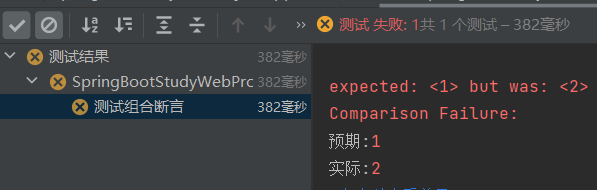

# 第六章 单元测试

JUnit 5 官方文档：https://junit.org/junit5/docs/current/user-guide/

Spring Boot 2.2.0 版本开始引入 JUnit 5 作为单元测试默认库

作为最新版本的JUnit框架，JUnit5与之前版本的Junit框架有很大的不同。由三个不同子项目的几个不同模块组成。

JUnit 5 = JUnit Platform + JUnit Jupiter + JUnit Vintage


JUnit Platform: Junit Platform是在JVM上启动测试框架的基础，不仅支持Junit自制的测试引擎，其他测试引擎也都可以接入。

JUnit Jupiter: JUnit Jupiter提供了JUnit5的新的编程模型，是JUnit5新特性的核心。内部 包含了一个测试引擎，用于在Junit Platform上运行。

JUnit Vintage: 由于JUint已经发展多年，为了照顾老的项目，JUnit Vintage提供了兼容JUnit4.x,Junit3.x的测试引擎。

## 6.1 新版本变化

SpringBoot 2.4 以上版本移除了默认对 Vintage 的依赖。如果需要兼容junit4需要自行引入（不能使用junit4的功能 @Test），如果需要继续兼容 junit4 需要自行引入vintage

```xml
<dependency>
    <groupId>org.junit.vintage</groupId>
    <artifactId>junit-vintage-engine</artifactId>
    <scope>test</scope>
    <exclusions>
        <exclusion>
            <groupId>org.hamcrest</groupId>
            <artifactId>hamcrest-core</artifactId>
        </exclusion>
    </exclusions>
</dependency>
```

## 6.2 引入

```xml
<dependency>
  <groupId>org.springframework.boot</groupId>
  <artifactId>spring-boot-starter-test</artifactId>
  <scope>test</scope>
</dependency>
```

## 6.3 JUnit5常用注解

JUnit5的注解与JUnit4的注解有所变化

- **@Test :**表示方法是测试方法。但是与JUnit4的@Test不同，他的职责非常单一不能声明任何属性，拓展的测试将会由Jupiter提供额外测试
- **@ParameterizedTest :**表示方法是参数化测试，下方会有详细介绍
- **@RepeatedTest() :**表示重复执行方法，括号内可直接写次数
- **@DisplayName :**为测试类或者测试方法设置展示名称
- **@BeforeEach :**表示在**每个**单元测试之前执行
- **@AfterEach :**表示在**每个**单元测试之后执行
- **@BeforeAll :**表示在**所有**单元测试之前执行，被标注的方法必须是静态方法 static
- **@AfterAll :**表示在**所有**单元测试之后执行，被标注的方法必须是静态方法 static
- **@Tag :**表示单元测试类别。类似于JUnit4中的@Categories
- **@Disabled :**表示测试类或测试方法不执行。类似于JUnit4中的@Ignore
- **@Timeout() :**表示测试方法运行如果超过了指定时间将会返回错误
- **@ExtendWith :**为测试类或测试方法提供扩展类引用（这个我不太懂）

```java
import org.junit.jupiter.api.Test;    //注意这里使用的是jupiter包下的Test注解！！下面所有的注解来源的包都需要是这个

public class TestDemo {

  @Test
  @DisplayName("第一次测试")
  @Timeout(value = 500,unit = TimeUnit.MILLISECONDS)      # 设定为500毫秒
  public void firstTest() throws InterruptedException {
      System.out.println("hello world");
  }
```

## 6.4 断言

断言（Assertions）是测试方法中的核心部分，用来对测试需要满足的条件进行验证。

断言方法都是 org.junit.jupiter.api.Assertions 的静态方法。

所有的测试运行结束以后，会有一个详细的测试报告；

### 6.4.1 简单断言

|            方法 | 说明                                 |
| --------------: | :----------------------------------- |
|    assertEquals | 判断两个对象或两个原始类型是否相等   |
| assertNotEquals | 判断两个对象或两个原始类型是否不相等 |
|      assertSame | 判断两个对象引用是否指向同一个对象   |
|   assertNotSame | 判断两个对象引用是否指向不同的对象   |
|      assertTrue | 判断给定的布尔值是否为 true          |
|     assertFalse | 判断给定的布尔值是否为 false         |
|      assertNull | 判断给定的对象引用是否为 null        |
|   assertNotNull | 判断给定的对象引用是否不为 null      |


#### 6.4.1.1 测试

```java
@DisplayName("测试简单断言")
@Test
void testSimpleAssertions(){
    int cal = 5;
    // 相等判断
    Assertions.assertEquals(6,cal);
    // 还可以自定义提示信息
    // 在同一个方法中，若前面的断言失败，后面所有的代码都不会执行。
  	// Assertions.assertEquals(6,cal,"业务逻辑对比失败");
}
```

结果：


### 6.4.2 数组断言

通过 assertArrayEquals 方法来判断两个对象或原始类型的数组是否相等

#### 6.4.2.1 测试

```java
@Test
@DisplayName("测试数组断言")
public void array() {
 		assertArrayEquals(new int[]{2, 1}, new int[] {1, 2});
}
```

结果：


### 6.4.3 组合断言

所有断言全部判定成功，组合断言才算成功。

#### 6.4.3.1 测试

```java
@Test
@DisplayName("测试组合断言")
public void all() {
    Assertions.assertAll("test",
            ()-> Assertions.assertTrue(true && true),
            ()-> Assertions.assertEquals(1,2));
    System.out.println("组合断言结束"); //这个不会被执行，因为上面组合断言中，一个失败，全部失败，就不往下走了
}
```

结果：



### 6.4.4 异常断言

#### 6.4.4.1 测试

```java
@DisplayName("异常断言")
@Test
void testException() {
    //断定业务逻辑一定出现异常
    Assertions.assertThrows(ArithmeticException.class, () -> {
        int i = 10 / 2;
    }, "业务逻辑居然正常运行？");
}
```

结果：

因为10/2的数学计算是正确的，因此异常断言失败。像10/0这样会抛出数学异常的计算，异常断言才算成功。


### 6.4.5 超时断言

#### 6.4.5.1 测试

```java
@Test
@DisplayName("超时测试")
public void timeoutTest() {
    //如果测试方法时间超过1s将会异常
    Assertions.assertTimeout(Duration.ofMillis(1000), () -> Thread.sleep(500));
}
```

### 6.4.6 快速失败

#### 6.4.6.1 测试

```java
@Test
@DisplayName("测试快速失败")
public void shouldFail() {
   // 执行这个时，直接失败，并结束测试。 
   fail("测试失败");
}
```

## 6.5 前置条件（assumptions）

前置条件（assumptions【假设】）类似于断言，不满足的前置条件会使得测试方法的执行终止。前置条件可以看成是测试方法执行的前提，当该前提不满足时，就没有继续执行的必要。

### 6.5.1 测试

```java
@DisplayName("测试前置条件")
@Test
void testassumptions(){
    Assumptions.assumeTrue(false,"结果不是true");
    System.out.println("111111");
}
```

结果：


## 6.6 嵌套测试

JUnit 5 可以通过 Java 中的内部类和@Nested 注解实现嵌套测试，从而可以更好的把相关的测试方法组织在一起。在内部类中可以使用@BeforeEach 和@AfterEach 注解，而且嵌套的层次没有限制。

```java
@DisplayName("嵌套测试")
public class TestingAStackDemo {

    Stack<Object> stack;

    //初始化一个栈
    @Test
    @DisplayName("new Stack()")
    void isInstantiatedWithNew() {
        new Stack<>();
        //嵌套测试情况下，外层的Test不能驱动内层的Before(After)Each/All之类的方法提前/之后运行
        assertNull(stack);
    }

    // 在最外层写这个注解，代表这个类是嵌套测试的
    @Nested
    @DisplayName("when new")
    class WhenNew {

        //判断栈是否为空
        @BeforeEach
        void createNewStack() {
            stack = new Stack<>();
        }

        @Test
        @DisplayName("is empty")
        void isEmpty() {
            assertTrue(stack.isEmpty());
        }

        @Test
        @DisplayName("throws EmptyStackException when popped")
        void throwsExceptionWhenPopped() {
            assertThrows(EmptyStackException.class, stack::pop);
        }

        @Test
        @DisplayName("throws EmptyStackException when peeked")
        void throwsExceptionWhenPeeked() {
            assertThrows(EmptyStackException.class, stack::peek);
        }

        @Nested
        @DisplayName("after pushing an element")
        class AfterPushing {

            String anElement = "an element";

            @BeforeEach
            void pushAnElement() {
                stack.push(anElement);
            }

            /**
             * 内层的Test可以驱动外层的Before(After)Each/All之类的方法提前/之后运行
             */
            @Test
            @DisplayName("it is no longer empty")
            void isNotEmpty() {
                assertFalse(stack.isEmpty());
            }

            @Test
            @DisplayName("returns the element when popped and is empty")
            void returnElementWhenPopped() {
                assertEquals(anElement, stack.pop());
                assertTrue(stack.isEmpty());
            }

            @Test
            @DisplayName("returns the element when peeked but remains not empty")
            void returnElementWhenPeeked() {
                assertEquals(anElement, stack.peek());
                assertFalse(stack.isEmpty());
            }
        }
    }
}
```


## 6.7 参数化测试

参数化测试是JUnit5很重要的一个新特性，它使得用不同的参数多次运行测试成为了可能，也为我们的单元测试带来许多便利。

利用**@ValueSource**等注解，指定入参，我们将可以使用不同的参数进行多次单元测试，而不需要每新增一个参数就新增一个单元测试，省去了很多冗余代码。

- **@ValueSource**: 为参数化测试指定入参来源，支持八大基础类以及String类型,Class类型
- **@NullSource**: 表示为参数化测试提供一个null的入参
- **@EnumSource**: 表示为参数化测试提供一个枚举入参
- **@CsvFileSource**：表示读取指定CSV文件内容作为参数化测试入参
- **@MethodSource**：表示读取指定方法的返回值作为参数化测试入参(注意方法返回需要是一个流)

当然如果参数化测试仅仅只能做到指定普通的入参还达不到让我觉得惊艳的地步。让我真正感到他的强大之处的地方在于他可以支持外部的各类入参。如:CSV,YML,JSON 文件甚至方法的返回值也可以作为入参。只需要去实现**ArgumentsProvider**接口，任何外部文件都可以作为它的入参。

### 6.7.1 测试1

```java
//这个注解代表这不是一个普通的测试类，而是一个参数化测试
@ParameterizedTest
@DisplayName("参数化测试")
@ValueSource(ints = {1,2,3,4,5})
void testParameterized(int i){
    System.out.println(i);
}
```

结果：


### 6.7.2 测试2

```java
@ParameterizedTest
@DisplayName("参数化测试")
//参数从方法来
@MethodSource("stringProvider")
void testParameterized2(String i){
    System.out.println(i);
}

static Stream<String> stringProvider() {
    return Stream.of("apple", "banana","watermelon");
}
```

结果：


