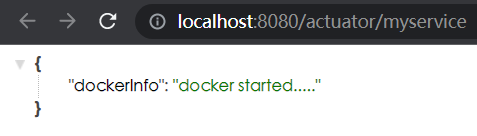

# 第七章 指标监控

## 7.1 SpringBoot Actuator

未来每一个微服务在云上部署以后，我们都需要对其进行监控、追踪、审计、控制等。SpringBoot就抽取了Actuator场景，使得我们每个微服务快速引用即可获得生产级别的应用监控、审计等功能。

### 7.1.1 引入

```xml
<dependency>
    <groupId>org.springframework.boot</groupId>
    <artifactId>spring-boot-starter-actuator</artifactId>
</dependency>
```

### 7.1.2 使用

引入后，访问：http://localhost:8080/actuator/**

暴露所有监控信息为HTTP


## 7.2 监控端点（Endpoints）

7.1.2 中的网站/**又叫监控端点（Endpoints），具体有哪些可以见[官方文档](https://docs.spring.io/spring-boot/docs/current/reference/html/actuator.html#actuator.endpoints)

### 7.2.1 常用的监控端点

| ID                 | 描述                                                         |
| ------------------ | ------------------------------------------------------------ |
| `auditevents`      | 暴露当前应用程序的审核事件信息。需要一个`AuditEventRepository组件`。 |
| `beans`            | 显示应用程序中所有Spring Bean的完整列表。                    |
| `caches`           | 暴露可用的缓存。                                             |
| `conditions`       | 显示自动配置的所有条件信息，包括匹配或不匹配的原因。         |
| `configprops`      | 显示所有`@ConfigurationProperties`。                         |
| `env`              | 暴露Spring的属性`ConfigurableEnvironment`                    |
| `flyway`           | 显示已应用的所有Flyway数据库迁移。<br />需要一个或多个`Flyway`组件。 |
| `health`           | 显示应用程序运行状况信息。                                   |
| `httptrace`        | 显示HTTP跟踪信息（默认情况下，最近100个HTTP请求-响应）。需要一个`HttpTraceRepository`组件。 |
| `info`             | 显示应用程序信息。                                           |
| `integrationgraph` | 显示Spring `integrationgraph` 。需要依赖`spring-integration-core`。 |
| `loggers`          | 显示和修改应用程序中日志的配置。                             |
| `liquibase`        | 显示已应用的所有Liquibase数据库迁移。需要一个或多个`Liquibase`组件。 |
| `metrics`          | 显示当前应用程序的“指标”信息。                               |
| `mappings`         | 显示所有`@RequestMapping`路径列表。                          |
| `scheduledtasks`   | 显示应用程序中的计划任务。                                   |
| `sessions`         | 允许从Spring Session支持的会话存储中检索和删除用户会话。需要使用Spring Session的基于Servlet的Web应用程序。 |
| `shutdown`         | 使应用程序正常关闭。默认禁用。                               |
| `startup`          | 显示由`ApplicationStartup`收集的启动步骤数据。需要使用`SpringApplication`进行配置`BufferingApplicationStartup`。 |
| `threaddump`       | 执行线程转储。                                               |

如果您的应用程序是Web应用程序（Spring MVC，Spring WebFlux或Jersey），则可以使用以下附加端点：

| ID           | 描述                                                         |
| ------------ | ------------------------------------------------------------ |
| `heapdump`   | 返回`hprof`堆转储文件。                                      |
| `jolokia`    | 通过HTTP暴露JMX bean（需要引入Jolokia，不适用于WebFlux）。需要引入依赖`jolokia-core`。 |
| `logfile`    | 返回日志文件的内容（如果已设置`logging.file.name`或`logging.file.path`属性）。支持使用HTTP`Range`标头来检索部分日志文件的内容。 |
| `prometheus` | 以Prometheus服务器可以抓取的格式公开指标。需要依赖`micrometer-registry-prometheus`。 |

#### 7.2.1.1 Health Endpoint

健康检查端点，我们一般用于在云平台，平台会定时的检查应用的健康状况，我们就需要Health Endpoint可以为平台返回当前应用的一系列组件健康状况的集合。

重要的几点：

- health endpoint 返回的结果，应该是一系列健康检查后的一个汇总报告
- 很多的健康检查默认已经自动配置好了，比如：数据库、redis等
- 可以很容易的添加自定义的健康检查机制


#### 7.2.1.2 Metrics Endpoint

提供详细的、层级的、空间指标信息，这些信息可以被pull（主动推送）或者push（被动获取）方式得到；

- 通过Metrics对接多种监控系统

- 简化核心Metrics开发

- 添加自定义Metrics或者扩展已有Metrics


进入某个的详细页


### 7.2.2 开启监控端点

有些端点默认开启，有些默认禁用，需要通过配置来开启。

```yaml
# management 是所有actuator的配置
# management.endpoint.端点名.xxxx  对某个端点的具体配置
management:
  endpoints:                      # endpoints是配置所有端点的
    enabled-by-default: true      # 默认开启所有监控端点
    web:
      exposure:
        include: '*'             # 以web方式暴露所有端点

  endpoint:                      # endpoint是对某个端点的具体配置
    health:
      show-details: always
      enabled: true

    info:
      enabled: true              # 也可以通过这种方式，只开启某些端点，而不用 enabled-by-default: true 来开启所有

    beans:
      enabled: true

    metrics:
      enabled: true
```

### 7.2.3 定制 Endpoint

#### 7.2.3.1 定制 Health 信息

定制 Health 信息只需要写一个子类去继承父类 AbstractHealthIndicator

com \ atnibamaitay \ SpringBootStudy \ health \ MyComHealthIndicator.java

```java
@Component
public class MyComHealthIndicator extends AbstractHealthIndicator {

    /**
     * 真实的检查方法
     * @param builder
     * @throws Exception
     */
    @Override
    protected void doHealthCheck(Health.Builder builder) throws Exception {
        //mongodb。  获取连接进行测试
        Map<String,Object> map = new HashMap<>();
        // 检查完成
        if(1 == 2){                     //模拟业务检查，如果通过就执行这些
            builder.status(Status.UP);  //设置状态
            map.put("count",1);         //附带一些自定义的信息
            map.put("ms",100);
        }else {                         //如果没有通过就执行这些
            builder.status(Status.OUT_OF_SERVICE);
            map.put("err","连接超时");
            map.put("ms",3000);
        }

        builder.withDetail("code",100)
                .withDetails(map);

    }
}
```

结果：


#### 7.2.3.2 定制info信息
##### 7.2.3.2.1 编写配置文件

未测试成功，有问题

```yml
info:
  appName: boot-admin
  appVersion: 1.0.0
  mavenProjectName: @project.artifactId@    # 获取pom.xml中artifactId的内容
  mavenProjectVersion: @project.version@
```

结果：


##### 7.2.3.2.2 编写InfoContributor

com \ atnibamaitay \ springbootstudywebproject \ acutuator \ info \ AppInfoInfoContributor.java

```java
@Component
public class AppInfoInfoContributor implements InfoContributor {

    @Override
    public void contribute(Info.Builder builder) {

        builder.withDetail("msg","你好")
                .withDetail("hello","atnibamaitay")
                .withDetails(Collections.singletonMap("world","666600"));
    }
}
```

结果：


#### 7.2.3.3 定制Metrics信息
##### 7.2.3.3.1 SpringBoot支持自动适配的Metrics

- JVM metrics, report utilization of:

- - Various memory and buffer pools
  - Statistics related to garbage collection
  - Threads utilization
  - Number of classes loaded/unloaded

- CPU metrics
- File descriptor metrics
- Kafka consumer and producer metrics
- Log4j2 metrics: record the number of events logged to Log4j2 at each level
- Logback metrics: record the number of events logged to Logback at each level
- Uptime metrics: report a gauge for uptime and a fixed gauge representing the application’s absolute start time
- Tomcat metrics (`server.tomcat.mbeanregistry.enabled` must be set to `true` for all Tomcat metrics to be registered)
- [Spring Integration](https://docs.spring.io/spring-integration/docs/5.4.1/reference/html/system-management.html#micrometer-integration) metrics


##### 7.2.3.3.2 增加定制Metrics

###### 7.2.3.3.1.1 示例

对请求 localhost:8080/city 的请求进行计数

```java
@Service
public class CityServiceImpl implements CityService {

    @Autowired
    CityMapper cityMapper;

    Counter counter;

    public CityServiceImpl(MeterRegistry meterRegistry){
        counter = meterRegistry.counter("cityService.saveCity.count");   //括号内为指标名
    }

    public City getById(Long id){
        return cityMapper.getById(id);
    }

    public void saveCity(City city) {
        counter.increment();   //写完 CityServiceImpl(MeterRegistry meterRegistry) 后，就可以在需要监控的功能上面放这个，意思是每调用一次增加一个次数
        cityMapper.insert(city);
    }
}
```

结果：


#### 7.2.3.4 自定义 Endpoint

比如，自定义一个叫myservice的监控端点，数据从读方法中来

com \ atnibamaitay \ springbootstudywebproject \ acutuator \ endpoint \ MyServiceEndPoint.java

```java
@Component
@Endpoint(id = "myservice")   //端点名
public class MyServiceEndPoint {
    
    @ReadOperation       //读方法
    public Map getDockerInfo(){
        //端点的读操作  http://localhost:8080/actuator/myservice
        return Collections.singletonMap("dockerInfo","docker started.....");
    }

    @WriteOperation     //操作方法
    public void stopDocker(){
        System.out.println("docker stopped.....");
    }
}
```

结果：




## 7.3 Spring Boot Admin（可视化）

Github：https://github.com/codecentric/spring-boot-admin

官方文档：https://codecentric.github.io/spring-boot-admin/2.5.1/

### 7.3.1 引入

在众多微服务的工程中新建一个模块，然后导入

```xml
<dependency>
    <groupId>de.codecentric</groupId>
    <artifactId>spring-boot-admin-starter-server</artifactId>
    <version>2.5.1</version>
</dependency>
```

然后在主程序类上面写注解 @EnableAdminServer 来开启可视化功能

为了避免端口号冲突，还可以将可视化面板的端口号设置一下

```yaml
server.port=8888
```

### 7.3.2 注册客户端

在每个微服务中引入

```xml
<dependency>
    <groupId>de.codecentric</groupId>
    <artifactId>spring-boot-admin-starter-client</artifactId>
    <version>2.5.1</version>
</dependency>
```

注意版本号要和上面的一致

然后在 application.yml 中配置

```yaml
spring:
  boot:
    admin:
      client:
        url: http://localhost:8888
        instance:
          prefer-ip: true             #使用ip注册进来
  application:
    name: SpringBootStudyWebProject   #整个项目的名称
```

### 7.3.3 使用

打开 http://localhost:8888


