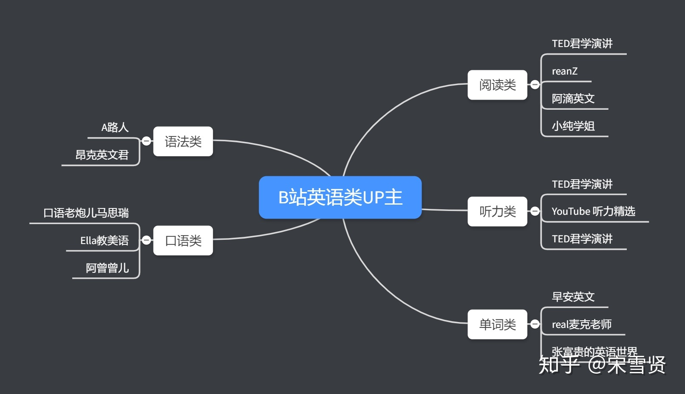

# 英语学习指南

指导思想+材料(库)+突破方向的选择+工具

## 1 语法

### 1.1 书籍参考

### 1.2 网课

### 1.3 经验

## 2 词汇

### 2.1 单词和透析阅读法

读和听是写和说的前提条件，要输出，就一定需要有输入。

要使习得最有效，输入材料需满足可理解、有趣或相关、非语法排序，以及大量的原则。

语言的出现，就是因为人们有交流的需求，而随着使用、交流，语言也就自然习得了，而且这样的过程肯定是愉悦的。

1、可理解

如果读的东西是不能理解的，那读进去跟接受到噪音没有什么区别。因此，所选的书或阅读材料，一定要符合 i + 1 的原则。即，所选材料必须只在你现有的水平上增加一级难度，太难是没有效果的。

透析法强调每两页只查一个生词，阅读中查太多词容易丧失兴趣。

当然对于任何一本书，都不可能从头到尾平均一个难度，比如描写一般会难一些，而叙事、对话则普遍简单一些，所以不必过分拘泥，只要保证大部分是 i + 1 的难度即可。

这样的方法看似进度缓慢，但实实在在是可以让人一直坚持下去的。

2、有趣或相关

外语学习受情绪机制影响，所选材料一定要是有趣的或者与自己生活、学习、工作等相关的，这样读的时候才能尽量关注内容，忘记是在用第二语言看书，进而减少抗拒感。

有趣和任何人无关，只关乎自己感不感兴趣。平时喜欢读什么书，英文原版就去读同样类型的；看到什么感兴趣的，就去找相关的书来读；对哪个作者的作品感兴趣，就去找该作者的书大量阅读。

3、大量

试图用少量阅读积累其中出现的所有生词及用法，无非还是想走捷径罢了。

### 2.3 经验

一边背单词一边在纸上写

## 3 口语

### 3.1 音标

### 3.2 影子训练

其实就是跟着读，大声跟读，读它两个小时，读到口干舌燥怀疑人生，坚持几个月。

原则：

- 有间隔，间隔逐渐拉长；有啥好处？锻炼听说能力啊！

- 
  全面模仿源语，发音、语调、语速；开始觉得模仿不来，外国人讲话好夸张！不要灰心，坚持！坚持！坚持着慢慢感觉就来了

- 为自己的跟读录音，并回听录音找差距。这一条非常重要！录下自己的声音去听，时长会发现，哦原来我以为自己是这样读的其实读出来不是诶！

#### 3.2.1 进阶练习步骤

1、小白入门(有基础的同学可以忽略这一条）

找一段中文的新闻，可以是新闻联播的音频。播放新闻，先整体听一遍。然后再从头播放新闻，播放开始后2秒后，开始跟读，一直与原音保持2秒的间隔。

如果觉得吃力，2秒间隔需要记忆的内容量太大，那就把间隔时间缩短成1秒或者同时跟读。

把这种练习掌握后，可以尝试间隔3秒。

这一阶段的目的主要是熟悉、体会有间隔跟读的过程，因为用的源语是母语，初学者更容易体会有间隔跟读是怎么一回事情，大脑如何更好地的处理这个过程。

觉得自己准备好之后，就可以解锁下一阶段了。

2、大众基础

与上一步类似，只是我们把源语变成英文，一开始可以用VOA慢速英语作为练习材料。然后过渡到VOA常速，然后呢可以用BBC的材料。

步骤还是一样，先整体听一遍材料，熟悉内容，一开始可以从简单的同时跟读开始，慢慢拉长时间间隔。可以对着同一个材料进行反复练习，把间隔拉长，1秒、2秒、3秒、10秒、20秒。最后可能你不知不觉的情况下，把材料都能背诵下来了。

如果你属于小白入门和大众基础阶段，自己练习口语又觉得很难很无聊，可以了解一下能够构建母语环境，帮助大家快速提高听力，且真正能用大脑组织语言表达自己观点的APP。

3、变态进阶

这一步开始有点变态，开始把源语材料的语速调节的快一些，1.1、1.2、1.3倍速进行播放。一开始可选择之前练习过的材料，你自己比较熟悉内容，练习起来相对简单一些。后面可以用一些新的材料，还是VOA、BBC即可。

这一阶段的难度会提高很多，速度提高10%，难度可不是提高10%这么简单。训练步骤和前面一样，逐渐拉长间隔。

4、地狱高阶

最变态的阶段。在你跟读的时候，请准备一张纸，一边跟读一边写1、2、3...99、100可以100为一个循环，也可以一直写下去。更变态的方法是倒着写，100、99、98。。。我自己练习的时候，只是顺着写。一开始可以选择简单的慢速材料，然后是常速，然后可以尝试一下倍速播放源语，真的真的非常的虐，练习一次，会觉得脑仁疼，这也算是通往大神的地狱式练习吧。

注意：在进行以上训练的时候，一定要把自己的跟读录下来，跟源语对比找到跟读的偏差，修正后再进行练习。推荐听源语用耳机，这样录音的时候只有自己跟读的声音。这样做，查找跟读偏差的时候，更容易一点。

如果你能走到第4步，哪怕只是尝试性的训练，你的听力和口语应该会有一个自己就能感觉到的长进！

## 4 听力

### 4.1 听力材料

公认好材料 Friends 和常速 VOA，

1、赖世雄精准美国英语音标发音指南

这本书内容虽然不多，配套音频全部听完也就不到两个小时，但其中每一个音标都会用非常易于理解和有趣的方式进行讲解。

2、“听VOA还不如学这些”系列

该系列内容较多，根据个人需求，我只学了下面几项。学完就一个感觉：泪流满面。

（1）American Pronunciation Workshop

（2）The American Accent Course

（3）Mastering the American Accent

（4）American Accent Training

上面几项课程难度逐渐递增，1和2是视频，可作为《赖世雄精准美国英语音标发音指南》之后继续深入学习音标及发音规则的过渡；3和4是书加配套讲解录音。2和3作者都是 Lisa Mojsin, 结构、内容相似，但后者讲解更加详细，提供的练习也更多，建议都看。

3、EnglishPod

在各类播讲类材料里，EnglishPod 可以说集有趣、可理解等各种优点于一身，绝对是由中级（慢速VOA、ESL Podcast 听起来太慢，常速材料听起来又太困难）向常速听力过渡的极佳选择。

## 5 资源

### 5.1 B站

#### 5.1.1 up主

## 6 经验谈

不要拿学中文的办法来学英语

单词和语法要一起学

学习切忌只想着长期目标，如听说读写样样精通，而忽略了循序渐进的过程。

长期目标最好与自己的需求相关，如学英语的目的就是为了读懂专业文献，那么就没有必要去下功夫练听力练口语。

定好短期细分目标，且目标最好：

1. 可控：确定目标可以实现，比如自己每天只有一个小时的学习时间，那么就不要定听说读写全面展开这样的目标；

2. 有意义：目标的实现会让人有在进步的感觉，如听听 ESL Podcast 的子栏目 English Café，从里面积累一些历史、文化相关的内容，而不是看剧学一堆 "I was like..., and she was like..."这样本来就是糟粕的东西；

3. 可量化：目标必须具体并规定时间，这样就可以确定是否完成了自己定的目标，如每天保证一万词的阅读量，十天读完一本10万词的书，而不是口语流利这种虚无缥缈的目标；

4. 有监控：如果没有超强的毅力，只是自己闷头学，坚持的确不是一件容易的事。虽然我也觉得还没开始学东西就到处喊着立志有如立 flag, 但如果可以的话，最好还是有人能时不时监督一下，家人也好，朋友也好，男女朋友也好，因为打破自己定的规矩没有任何后果。在给自己定的细分目标时间结束后，可以回顾一下是否按时完成了目标，完成的目标是不是有意义，完成后是否感觉到了进步，如果没有又是什么原因。接下来就可以根据监控的结果，对下一阶段的目标进行调整。而每一个阶段性目标完成后，都能很好地帮助建立自信，以便继续下一阶段的目标。

## 参考文章

[1] 你有什么相见恨晚的英语学习方法？ - 翘囤奶爸的回答 - 知乎 https://www.zhihu.com/question/26677313/answer/777772073

[2] 

[3] 

[4] 

[5] 

[6] 

[7] 

[8] 