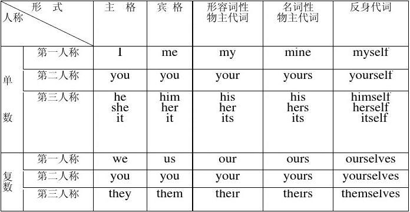
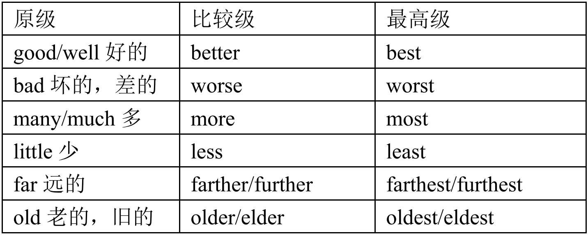

# 第二章 词类

## 2.1 名词

名词就是世间万物的名称。

名词分为普通名词和专有名词。

### 2.1.1 普通名词

普通名词又分为可数名词和不可数名词。

可数名词就是那些肉眼能分清数量的名词

> 比如：书，房子，手机，电脑等等。

不可数名词就是肉眼分不清数量的名词，

> 比如：水、牛奶、 酒、 茶、头发、砂、肉、大米等等。

> 使用英语名词的时候，要特别注意认清是可数还是不可数，它们的用法和变化区别很大。
>
> 有时可数不可数，跟中文不一样。中文里不可数的名词，在英文是可数的。
>
> 比如：“天空”，在中文里面是不可数，英文“sky”是可数的，复数形式是“skies”。“记忆”在中文是不可数的，英文“memory”是可数的，复数形式是：“memories”。同样是液体，“water”是不可数的，“眼泪 tear”却是可数的，复数形式是“tears”

复合名词是否可数取决于后面那个词，若后面那个单词可数，那么就是可数名词。并且前面那个名词不能变化，不能变复数。

> 比如：English book 英语书，变复数 English books 英语书，前面的单词不能变化

#### 2.1.1.1 可数名词

每个可数名词都有两种格式：单数的格式，复数的格式。

一个可数名词的单数是不能单独在句子或短语里面出现的，需要加限定词（形容词性物主代词，指示代词，’s 的所有格，数词等等），冠词，或者变复数。

> 比如，不可以说：“she is teacher”，在中文是没有错的，因为中文的名词是没有单复数的概念。但是英文是错的，“她是老师”，在英语里面，应该说：“she is a teacher.”

复数的格式都是由单数变化而成的。有规则的变化和无规则的变化。大部分名词单数变复数都是有规则的变化。

##### 2.1.1.1.1 可数名词单数变复数的规律

1.大部分可数名词变复数，在词尾+s。

> 比如：pen - pens 钢笔
>
> toy - toys 玩具

2.当可数名词是以字母 s 、sh 、x 、ch 结尾的单词，变复数要+es。

> 比如：bus - buses 汽车
>
> 例外：stomach - stomachs 胃

3.辅音字母（除了A、E、I、O、U以外的字母）+y 结尾的名词，去 y 变 i+es。

> 比如：baby - babies 婴儿

4.当可数名词是以字母 f 或 fe 结尾的单词，去 f 或 fe 变 v 再+es。

> 比如：Wife-wives 妻子
>
> 例外：roof - roofs 房顶 gulf - gulfs 海湾 cliff - cliffs 悬崖

5.辅音字母 +o 结尾的可数名词变复数也是+es。

> 比如：hero - heroes 英雄 tomato - tomatoes 西红柿 potato - potatoes 土豆 sweetpotato –sweetpotatoes 红薯
>
> 这类词语很少 ，常见的就是上面几个，可以通过下面的句子来记：
>
> Heroes like tomatoes and potatoes.（英雄喜欢西红柿和土豆）
>
> 例外：很多“元音字母+o”结尾的可数名词或者以“o”结尾的外来词、简写词都是直接加“s”,如：bamboo-bamboos 竹子 piano-pianos 钢琴 radio-radios 收音机 photo-photos 相片 video-videos 录像，视频 studio-studios 工作室，画室，播音室

##### 2.1.1.1.2 可数名词不规则变化

> 有一种误区，就是不规则的变化要死记硬背。这些不规则的变化，死记是没有什么效果的，因为如果不去运用这些名词的复数，是很难记住的，就算暂时记住了，过几天也会忘记。所以最有效的方法，就是拿这些名词的复数来造句。

Man - men 男人 mouse - mice 老鼠 goose - geese 鹅 ox - oxen 牛 child - children 小孩

有些可数名词，单复数都是相同：

Deer 鹿 sheep 绵羊 Chinese 中国人 Japanese 日本人 Vietnamese 越南人 Lebanese

黎巴嫩人 Portuguese 葡萄牙人

有些可数名词，只有复数的形式，没有单数的形式，称为复数名词，如：

People 人们 police 警察 public 公众 clothes 衣服（总称） cattle 牛（总称）

#### 2.1.1.2 不可数名词

不可数名词只有单数的格式，所以作主语的时候，后面的谓语动词要考虑变单数格式。

> 比如：water is important.不能说 water are important

表示不可数名词的数量，需要用一个量词。

> 比如“water（水）”，我们可以说“一杯水，一瓶水”。英文：“a glass of water. A bottle of water”.
>
> “A glass of ”，“a bottle of ”就相当于中文量词的作用。要表示“几杯水，几瓶水”的时候，要把“杯，瓶”变复数，但是“water”不能变复数。
>
> 比如：two glasses of water（两杯水）, three bottles of water（三瓶水）

量词的构成方式有两种

1.A/an/one + 可数名词单数 + of

> 比如：a cup of 一杯

2.数词 + 可数名词的复数 + of

> 比如：two bottles of 两瓶
>
> 注意 bottle 要变成复数

注意，量词里的“of”是没有意思的，不要跟后面的名词所有格里面的“of”混淆。

另外，量词其实也可以修饰可数名词的复数，但不能修饰单数。

> 比如：a basket of apples 一篮子苹果
>
> ​			a box of books 一箱书

使用英文量词要注意：

1.不是所有的可数名词，都能构成量词。只有那种有内部空间、或容器、或者一些符合逻辑的可数名词才可以构成量词。

> 比如：①bag/basket/truck（有内部空间）
>
> ​			②Cup/glass/bottle (容器) 
>
> ​			③Bar/piece/loaf (符合逻辑)

2.大部分的量词都是修饰不可数名词。而且不是每一个量词都能修饰每一个不可数名词，要注意逻辑问题。不能用中文的量词思维来判断英文的量词使用。

> 比如：一桌子菜，翻译成“A table of food”就是错的，table不满足1

3.英文的量词一定不能修饰可数名词的单数。

4.英文的量词虽然可以修饰可数名词的复数，但是不常见。而且要求非常严格，必须是可数的事物装到容器里面或者装到有空间的事物里面，才能使用量词。

符合上面规则，很多时候，还是不行的，最重要的是要注意逻辑问题，而且是按英文的逻辑，不能按中文的量词思维。

### 2.1.2 专有名词

专有名词主要指人名、地名及某些类人和事物专有的名称。

专有名词的第一个字母要大写。

### 2.1.3 名词的作用

1.作主语

> <u>The book</u> is new. 这本书是新的。

2.作表语

> This is a <u>cellphone</u>. 这是一台手机。

注意，名词作表语时，是说明主语的身份。乱用抽象名词作表语，会造出很多不符合逻辑的句子。

> 比如：I am happiness.这句话语法没有错，但是逻辑有问题。因为这句话的意思是：我的名字叫幸福，或者我是幸福。“我”是“人”，不是“幸福”这个抽象概念。如果要表达：我很快乐，我很幸福。应该用形容词作表语：I am happy.

3.作宾语

> I like <u>pears</u>. 我喜欢梨子。

4.作宾补

> I call him <u>Uncle Tom</u>. 我叫他汤姆叔叔。

5.作定语

名词作定语的情况不多，并且可以理解为一个复合名词

> <u>Room</u> number. 房间号码。

6.名词作介词宾语

7.名词作同位语

### 2.1.4 名词所有格

名词所有格是表示所属关系的一种格式.

> 比如：小明的书包。“小明的” 就是所有格。

如果是一个普通的可数名词，变成所有格时，要注意“可数名词单数不能单独使用”这个规则。

> 比如：“friend's”是不对的，friend是可数名词，加上限定词“My friend's”才对

英文的名词所有格有两种构成方式：

1.有生命的名词 + 's

这里的“’s”相当于“的”

> Nick’s 尼克的
>
> My friend's 我的朋友的
>
> Mother's 妈妈的（Mother在这里是称呼语，相对于专有名词，第一个字母必须大写，若是小写，就是可数名词单数，不能单独使用）

名词所有格作前置定语的时候可以修饰可数名词，也可以修饰不可数名词。

> Mother's hands 妈妈的手（修饰可数名词）

如果名词是“s”结尾的复数或名词本身是“s”结尾的，直接加“’”就可以了，当然也可以加“’s”

> teachers' day 教师节

虽然说，由“’s ”构成的名词所有格，必须是有生命的名词。但也有些例外，遇到了记下来。

> 比如：today's newspaper 今天的报纸

由“’s ”构成的名词所有格除了可以作前置定语，还可以作表语。

> A:Whose pen is it？这是谁的钢笔 B:It is <u>Tim's</u>. 是提姆的

2.无生命的名词用“of +无生命名词”

“of ”是“的”意思

被这种所有格修饰的名词，不管单复数，可数或不可数名词，都必须加定冠词“the.”，这也是定冠词的一种规则。

这种名词所有格比较难，因为作定语的时候，需要放在被修饰的名词后面，也就是作后置定语。

一定要注意，如果这个名词是一个可数名词，要考虑单复数问题或冠词问题

> 比如：of the city.的意思是城市的，
>
> the center of the city. 城市的中心。
>
> 这里“of the city” 才是正确的名词所有格，center 是被修饰的名词，因此需要定冠词the
>
> Of water 水的
>
> Of oil 油的

这种所有格作后置定语的时候，还要特别注意：所属关系。也就是这种名词所有格拿去修饰名词作后置定语的时候，必须考虑所属关系。如果没有所属关系，不能乱作后置定语，因为会产生逻辑问题。

> 比如：The water of the cup 错误
>
> ​			The water in the cup 正确
>
>  “杯子的水”，其实水是并不属于杯子的，杯子不能拥有水。

## 2.2 代词

代词是代替名词的，在句子中起名词的作用，可用作：

- 主语
- 宾语
- 表语
- 同位语

代词可以分为：

- 人称代词（Personal Pronouns）
- 物主代词（Possessive Pronouns）
- 反身代词（Self Pronouns）
- 相互代词（Reciprocal Pronouns）
- 指示代词（Demonstrative Pronouns）
- 不定代词（Indefinite Pronouns）
- 疑问代词（Interrogative Pronouns）
- 连接代词（Conjunctive Pronouns）
- 关系代词（Relative Pronouns）

### 2.2.1 人称代词

大多数人称代词就是代替表示人的名词的词语。

1、主格作主语，宾格作宾语

> <u>She</u> is very happy . 她很开心。
>
> I like <u>her</u>. 我喜欢她。

2、主格和宾格都可以作表语

>It is <u>me /I</u> 是我。

两个或者两个以上的人称代词主格的单数作并列主语的时候顺序为：you,he(she) and I ，如果是复数，顺序是：we,you and they

> <u>You</u> and <u>I</u> like music.我和你喜欢音乐。

3、it 和 they 可以指代事物

### 2.2.2 物主代词

表示所有关系的代词叫物主代词。

物主代词包括形容词性物主代词和名词性物主代词。

#### 2.2.2.1 形容词性物主代词的用法

形容词性物主代词只有一个作用，就是作前置定语，放在一个普通名词前面。

> This is <u>my</u> book.
>
> 这是<u>我的</u>书。

注意：形容词词性物主代词，作前置定语的时候，中间一般不能加数词和冠词。

> 像“My two books”，“My the book”，“My a book”这些都是错的。

#### 2.2.2.2 名词性物主代词用法

名词性物主代词就相当于一个名词，但是只能在前面提到或者避免重复的时候才能用。

> Your book is more expensive than <u>mine</u>.
>
> 你的书比<u>我的</u>贵

名词性物主代词不能作定语。

> 我的书= my book，如果说 “mine book” 就错了

注意，英语最忌重复，因此要尽量用名词性物主代词代替。

> A: my car is very good.我的车很好。
>
> B: <u>mine</u> is better 我的车更好。（名词性物主代词 mine 作主语，避免重复名词 my car，所以用 mine 代替 my car）

### 2.2.3 指示代词

指示代词也很容易掌握。只有两个，“this”和“that”，还有它们的复数：“these”和“those”

| 单数                             | 复数                               |
| -------------------------------- | ---------------------------------- |
| This 这个（作主语 be 动词用 is） | These 这些（作主语 be 动词用 are） |
| That 那个（作主语 be 动词用 is） | Those 那些（作主语 be 动词用 are） |

指示代词可以作：主语、宾语、表语、定语。

1.作定语（常见）

“This”和“that”作前置定语，专门修饰或限定单数的可数名词，不能修饰复数，不过可以修饰不可数名词。

> <u>This</u> computer 这台电脑

“These”，“those”作前置定语，修饰或限定可数名词复数，只能修饰可数名词复数，不能修饰单数，也不能修饰不可数名词。

> <u>Those</u> computers 那些电脑

2.作主语（常见）

“That”,“this” 作主语的时候是单数概念，如果是主系表结构，“be”动词用单数格式“is” 或“was”。

> <u>This</u> is my book. 这是我的书。

“These”,“those”作主语的时候是复数概念，如果是主系表结构，“Be”要用复数格式“are” 或“were”。

> <u>Those</u> are her pencils. 那些是她的铅笔。

3 作宾语

这种使用情况很少。

> I want <u>this</u>. 我要这个。

4 作表语

这种使用情况更少。

> It is <u>this</u>. 就是这个。

很多人，受中文影响，通常犯这样一个代词错误：“she brother”,“I mother”,“you father.”因为在中文的口语里面，我们经常说，“她哥”，“我妈”，“你爸”，就直接说，“she brother”,“I mother”,“you father”，这是很典型的错误，“she，I，you”是人称代词的主格，是不能作定语的，不能修饰名词（人称代词宾格也是不能作定语的，比如 “me mother”也是错的）。作定语，修饰名词，应该用形容词性物主代词：“Her brother”,“my mother”,“your father”。

## 2.3 形容词

形容词（adjective 简称 adj.或 a.）主要用来修饰名词或代词，表示人或事物的性质，状态，和特征的程度好坏与否。

形容词分为两种：普通形容词和复合形容词。

复合形容词就是由两个单词构成的一个新的单词，这个新词也属于形容词的词性。两个单词之间有一个符号“-”。

> man-made 人造的

### 2.3.1 用法

一般只可以作定语，表语和宾补。

1.作表语

大部分的形容词都可以作表语。

形容词作表语可以直接构成一个句型：主语 + be（系动词）+ 形容词（表语）

> You are <u>rich</u>.你是有钱的。

2.作前置定语

大部分的形容词都可以作前置定语，修饰普通名词，放在普通名词的前面。

> The <u>big</u> House 这个大房子。

注意，形容词作前置定语，只跟名词有关系，修饰一个普通名词，不能直接造句。所以形容词直接作定语只能构成一个短语。如果要用形容词作定语造句，必须考虑普通名词的问题。也就是说，先拿一个普通名词造句，然后在这个普通名词前面增加一个形容词或多个形容词作前置定语。

> 比如：I like the house. 我喜欢这个房子，然后再加个形容词作定语，I like the <u>big</u> house. 我喜欢这个大房子

3.作宾语补足语

形容词可以作宾补，但是只有部分特定的及物动词后面才可以跟形容词作宾补。

> 特定的及物动词比如：Make（使，让）, keep（保持）, prove （证明是）等等。

> I make you <u>busy.</u>我让你忙。

4.作定语

形容词也可以放在不定代词后面作定语，修饰或限制不定代词。

> 如：something new/interesting/special 新的/有趣的/特别的一些事情

### 2.3.2 位置

比较麻烦，不要纠结。

当出现几个形容词同时修饰名词作前置定语的时候，要考虑这几个形容词的位置。这些形容词的排序跟中文不一样的。

1.冠词(a,an,the 物主代词 my,数词 three,指示代词等)+2.描绘性的形容词 beautiful+3.表示形状(大小,长短,高矮)的形容词+4.表示年龄或者新旧的形容词+5.表示颜色+6 表示出处,来源,+7.表示材料,物质的形容词+8.表示用途

虽然冠词(a,an,the 物主代词 my,数词 three,指示代词) 不属于形容词，但是永远要放在作定语的形容词前面。

> <u>a</u> <u>beautiful</u>,<u>tall</u>,<u>young</u> girl 一个年轻漂亮，身材高挑的女孩子

这个顺序并不是特别重要，了解即可。

### 2.3.3 比较级和最高级

比较级就是相当于中文里面“更”的意思，最高级就相当于“最”。

> 比如：“漂亮的”是一个形容词，那么“更漂亮”就是比较级，“最漂亮” 就是最高级。

#### 2.3.3.1 变化规则

1、在单音节形容词后面或者以 er,ow,ure ,le 结尾的双音节形容词直接加-er,-est 或者-r,-st

>| 原级          | 比较级          | 最高级           |
>| ------------- | --------------- | ---------------- |
>| clever 聪明的 | cleverer 更聪明 | cleverest 最聪明 |

2、以一个辅音字母结尾的重读闭音节形容词，先双写辅音字母再加-er,-est

>| 原级      | 比较级       | 最高级        |
>| --------- | ------------ | ------------- |
>| thin 瘦的 | thinner 更瘦 | thinnest 最瘦 |

3、以“辅音字母+y”结尾的形容词改 y 为 i,再加-er,-est

>| 原级         | 比较级         | 最高级          |
>| ------------ | -------------- | --------------- |
>| happy 快乐的 | happier 更快乐 | happiest 最快乐 |

4、以 e 结尾的形容词后加-r,-st

>| 原级         | 比较级        | 最高级         |
>| ------------ | ------------- | -------------- |
>| brave 勇敢的 | braver 更勇敢 | bravest 最勇敢 |

5、大多数双音节和多音节的形容词，在前面加 more,most 变比较级和最高级。

> | 原级      | 比较级         | 最高级         |
> | --------- | -------------- | -------------- |
> | beautiful | more beautiful | most beautiful |

例外的情况：

（1）某些单音节形容词，加 more,most 构成比较级和最高级。

> 如 tired，pleased，right，real，glad 等
>
> | 原级       | 比较级          | 最高级          |
> | ---------- | --------------- | --------------- |
> | tired 累的 | more tired 更累 | most tired 最累 |

（2）复合形容词一般用 more，most 形式。

但是，如果复合形容词的第一个词是单音节形容词，也可以加-er,-est。

#### 2.3.3.2 不规则变化

除了有规则的变化，还有一些形容词变比较级和最高级是不规则的。

> 比如：
> 
>
> 注：elder，eldest 主要表达年长的，指排行高，不一定指年龄大。一般用来构成哥哥姐姐。
>
> 如：elder sister 姐姐 elder brother 哥哥
>
> ​		he is the eldest.他排行老大。
>
> ​		younger brother 弟弟 younger sister 妹妹

### 2.3.4 比较级和最高级的用法

形容词的比较级和最高级跟形容词的原级一样，可以作前置定语和表语，甚至宾补。

> 如：I have a <u>better</u> way 我有一个更好的办法（形容词比较级 better 作前置定语）
>
> Eating apples makes us <u>healthier</u> 吃苹果让我们更健康。(形容词比较级 healthier 作宾补)

#### 2.3.4.1 形容词的比较级和最高级作表语的情况（最常见）

1.A 超过 B

当表示 A 事物（人）比 B 事物（人）强的时候，用句型：A + be + 形容词的比较级 + than + B （than B 是比较状语）。

句型里的形容词一定要变成比较级的格式，than 是一个连接词，中文“比”的意思，than 跟后面的词语一起构成比较状语。

> I am taller <u>than</u> he/him. 我比他高。

2.A 不如 B

当表示 A 事物（人）不如 B 事物（人）强的时候，直接在上面的句型里面的“be”后面加否定词 not。

> I am not taller <u>than</u> he/him. 我没有他高。

3.A 和 B 一样

当表达表示 A 事物（人）和 B 事物（人）一样的时候，用句型：A + be + as + 形容词的原级 + as + B 

> I am as tall as him 我和他一样高。

注意，这里的形容词一定要用形容词的原级。“As….as”表示“和….一样”的意思。

4.A 是最什么的……

当表示在一定范围内，A 事物（人）是最厉害的，用下面的句型：A + be + the + 形容词的最高级 + 表示范围的词语

> He is the richest in Guangxi. 他在广西是最有钱的

这里的形容词一定要用最高级，并且前面一定要加定冠词“the.”，这个也是定冠词的一种用法。因为“人外有人，天外有天”，一个事物（人）只能在一定范围内是最强的，所以后面还要加一个表示范围的词语，一般是介词短语构成。

## 2.4 动词

动词即表示动作或者心理行为的词语。

> 中文跟英语不一样，一个词语在中文里面是动词，在英语里面不一定是动词。

从用法来分，可以分为谓语动词和非谓语动词。区别就是一个作谓语，另一个不能作谓语（作主语，表语，宾语等）。

### 2.4.1 谓语动词

谓语动词有四种：实义动词，系动词，助动词和情态动词。

#### 2.4.1.2 实义动词

实义动词，即有实际意义的动词，有些语法书也称为行为动词。

> 大部分动词都是有实际意义。但是也有少数动词是没有意义的，或者意义不完整的，比如系动词，助动词和情态动词。所以也可以这样理解实义动词：除了系动词，助动词和情态动词，剩下的就是实义动词了。

实义动词分为不及物动词和及物动词。

及物动词，就是后面一定要加宾语的动词，也就是加一个动作的对象或者承受者。

> 比如，“买（buy）” 这个动词，不可能只说：“我买”，或者“你买”。后面必须要加一个动作的对象，买什么东西。
>
> 这就是主谓宾结构，其中及物动词做谓语。

不及物动词就是后面不需要加宾语的实义动词。

> 比如“work”。“I work every day”（我每天工作），意思已经完整了，不能说“工作你，工作他”，这样说逻辑有问题。
>
> 再比如：“I live Beijing.”也是错的，因为“live”是不及物动词，不能跟宾语“Beijing”。不及物动词后面可以跟状语，所以“我在北京生活”应该是：“I live in Beijing.”这里是“in Beijing”是地点状语。

但后面可以跟状语。

不及物动词数量不多，大部分实义动词是及物动词。也有很多实义动词既可以作及物动词也可以作不及物动词。一个实义动词作及物动词和作不及物动词意思通常不一样，也就是说，通过意思去区分。慢慢积累即可。

> 比如，“run ”这个动词既可以作及物动词也可以作不及物动词。作不及物动词的时候表示“跑步”，后面没有宾语。例如：“I run every morning.”（我每天跑步）。当它作及物动词的时候，表示“经营，管理”的意思，例如：“I run a website.”（我经营一个网站）。

### 2.4.2 实义动词的五种形式

即原形，过去式，过去分词，现在分词，第三人称单数格式，五种格式是同一个意思。

不同的时态，使用不同的动词形式。这就是英语的一大特点：变化

一般来说，过去式，过去分词，现在分词和第三人称单数格式都是通过原型变化而成的。在原型的后面增加字母组合，这叫词尾变化。在有规则的情况下，过去式和过去分词是一样的，都是在后面加字母组合“ed”。

#### 2.4.2.1 有规律的变化规则

变过去式和过去分词在原型后面加“ed”；

变现在分词，在原型后面加“ing”；

变第三人称单数格式，在原型后面加“s”(和可数名词变复数的规则一样)。

> | 原型 | 过去式 | 过去分词 | 现在分词 | 第三人称单数 |
> | ---- | ------ | -------- | -------- | ------------ |
> | work | worked | worked   | working  | works        |

这是一般的规则，实际上，每个大规则下面还有小规则。下面分别介绍一下每种变化的小规则。

##### 2.4.2.1.1 动词原型变过去式和过去分词

1、大部分情况，在动词原型后面加 ed

2、结尾是 e 的动词加 d 

3、末尾只有一个辅音字母的重读闭音节的动词，先双写这个辅音字母，再加 ed

4、结尾是“辅音字母+y”的动词，改 y 为 i，再加 ed

##### 2.4.2.1.2 动词原型变现在分词

1、一般的动词词尾加 ing 

2、以不发音的 e 结尾的动词，去 e 再加 ing

3、以一个辅音字母结尾的重读闭音节的动词先双写此辅音字母，再加 ing

4、以 ie 结尾的动词把 ie 变为 ying

##### 2.4.2.1.3 动词原型变第三人称单数格式（跟可数名词变复数的规则一样）

1、一般动词词尾加 s 

2、以 s,x,o,ch,sh 结尾的动词，加 es

3、以“辅音字母+y”结尾的动词，变 y 为 i,再加 es

#### 2.4.2.2 不规则动词

见附件1

### 2.4.3 系动词

系动词也叫连系动词。系动词只有一个作用，就是跟表语构成“系表结构”作状态型谓语。

#### 2.4.3.1 be

最常用的系动词就是“be”，“be”有八种形式。分别是：

1.原型“be”用于助动词和情态动词后面，或者用在动词不定式里面。

> 如：she will be a nurse next month

2.第一人称 I 后面的“am” 

> 如：I am a teacher.我是老师。
>
> 注意，只有在一般现在时态里面 I 后面才能用“am.”

3.第三人称单数格式“is”

> 如：she is a student.她是学生。

4.You 和复数后面的“are”

> 如：you are great. 你很伟大。

5.单数的过去式格式“was”

> 如：he was a boss before.他以前是老板。

6.复数的过去式格式“were”

> 如：they were farmers before 他们以前是农民。

7.过去分词格式“been”

> 如： I have been a teacher for three years 我做老师三年了。（用于完成时态）

8.现在分词格式“being” 

> 如: a bridge is being built.一条桥正在建设中。（被动语态）

不管是哪一种格式，都是表示"是"的意思，有时候“be”的意思不用翻译出来，比如后面加形容词或介词短语作表语的时候。

> 比如：I am busy now. 我现在很忙

#### 2.4.3.2 特殊系动词

除了“be”，还有少数的实义动词可以充当系动词。这些系动词虽然是从实义动词借用过来的，但是作系动词的意思和作实义动词的意思是不同的。

> 比如，“look”作实义动词的时候是“看”的意思，表示一种动作，一般要变成动词短语“look at”。作系动词的时候，“look”变成了“看起来”的意思，一般在后面加形容词作表语。如：you look beautiful.(你看起来很漂亮)。

借过来的系动词三个特点：

1、这些系动词，是从实义动词里面借过来的。

2、借过来作系动词之后，意思马上发生变化。

3、一般来说，这些借过来的系动词，必须跟形容词作表语。所以通常可以看后面是否跟形容词来判断属于系动词还是实义动词。

> 因此，“You look beautiful.”属于主系表结构。

能充当系动词的实义动词有以下两类：

##### 2.4.3.2.1 表示状态

|          | 意思       | 例句                                          |
| -------- | ---------- | --------------------------------------------- |
| keep     | 保持       | <u>Keep</u> quiet! 保持安静。                 |
| stay     | 保持       |                                               |
| look     | 看起来     | You <u>look</u> tired.你看起来很疲倦。        |
| smell    | 闻起来     |                                               |
| taste    | 尝起来     | The tea <u>tastes</u> sweet. 这茶尝起来很甜。 |
| sound    | 听起来     | It <u>sounds</u> great. 听起来不错。          |
| feel     | 觉得/感觉  | I <u>feel</u> good 我感觉很好                 |
| appear   | 看来好像   |                                               |
| seem     | 好像是     |                                               |
| remain   | 仍然是     |                                               |
| continue | 仍旧，保持 |                                               |
| prove    | 证明是     |                                               |

##### 2.4.3.2.2 表示结果

|        | 意思            | 例句                                                         |
| ------ | --------------- | ------------------------------------------------------------ |
| Become | 成为            |                                                              |
| turn   | 变为            | His <u>face</u> turned red 他的脸变红了                      |
| get    | 变得            | He <u>got</u> angry 他生气了                                 |
| grow   | 变得            |                                                              |
| go     | 变成,进入…状态  | The milk will <u>go</u> bad 牛奶会变坏的                     |
| come   | 成为，证实为    | Your dream will <u>come</u> true one day 有一天，你的梦想会实现的。 |
| fall   | 变成            |                                                              |
| run    | 变成,进入某状态 |                                                              |

### 2.4.4 助动词

助动词是没有意思的，其作用是帮助实义动词或系动词构成复合谓语，或者构成疑问句，否定句，以及构成各种时态，语态和语气。

常用的助动词有： be、do、have、will、would、shall、should

注意，be (包括其他形式)、 do (did does)、 have (has,had) 是从系动词和实义动词那里借过来的，当助动词的时候是没有意思的。

助动词有三个特点:

1.没有意思。

2.不能单独用，必须帮助构成其他各种结构。

3.没有专门的助动词，都是从其他动词借过来的。

> I am working now. 我现在正在工作。
>
> 这是一个现在进行时态的句子。“am”属于助动词，不是系动词。如果是系动词，是完全不一样的，首先后面必须跟表语（比如，形容词，名词，介词短语等等），第二，作系动词时，“am”是有意思的。在这里，“am”没有意思，主要的作用是跟动词的现在分词构成现在进行时态。“am”符合助动词的三个特点

> Do you love me? 你爱我吗？
>
> “do”没有意思，帮助构成一般疑问句，是一个从实义动词借过来的助动词。
>
> I do not love you.我不爱你。
>
> “do”没有意思，帮助构成一般现在时态否定句。
>
> I did not love you.我以前不爱你。
>
> “did”没有意思，帮助构成一般过去时态否定句。

### 2.4.5 情态动词

情态动词的作用就是跟动词原型（包括动词短语原型，系动词 be）构成复合谓语。

情态动词本身有意义，也是多义词，但是不完整。

#### 2.4.5.1 情态动词的特点

1.情态动词必须跟动词原型构成复合谓语。

2.情态动词是有意义的，虽然意思不完整。

3.有专门的情态动词，不需要借用其他动词。

4.情态动词一般不能跟助动词连用。

#### 2.4.5.2 常见的情态动词

Can（能，会） 

could（can 的过去式） may（可以） 

might（may 过去式）

should（应该） 

must（必须） 

have to（不得不） 

dare（敢）Needn’t（不必） 

had better（最好） 

ought to（应该） 

Be able to=can

#### 2.4.5.3 情态动词使用情况

当我们需要表达情态动词的意义，比如“必须”“能”“应该”等等的时候，就可以加上一个相应的情态动词，构成复合谓语。

> I earn money every day.我每天赚钱。
>
> 这句话没有情态动词，仅仅表达“每天赚钱”。但如果我们需要表达“必须每天赚钱”，强调“必须”这个意义，就可以加情态动词 “must”：
>
> I <u>must</u> earn money every day.我每天必须赚钱。
>
>  这里的 “must earn”就是“情态动词+动词原型”构成复合谓语。

> I am happy every day.我每天开心。
>
> “Am happy”是一个状态型谓语。如果要表达“我必须开心，我一定要开心”，强调“必须”这个意义，就可以加一个情态动词“must”，变成：I <u>must am</u> happy every day.
>
> 但是这个句子是错的，因为，情态动词必须跟动词原型。而“Am”不是系动词 be 的原型，正确的句子应该是：I <u>must be</u> happy every day. 我必须每天开心。
>
> “must be happy”也是一个复合谓语，或者严格地说，是一个复合的状态型谓语。

## 2.5 冠词

冠词是一种虚词，没有词义，没有数和格的变化，不能单独使用，只能帮助名词或起名词作用的其他词类说明其意义。

冠词分为定冠词“the (这,这些)”和不定冠词“a , an（一）”两大类。

> a book 一本书
>
> a university 一所大学
>
> an hour 一个小时
>
> an egg 一个鸡蛋

元音开头的单词用 “an”，其他用 “a”

注意，这里说的辅音和元音，指音标里的发音，不是辅音字母和元音字母。

> 比如，上面的“a university”，这里“u”是元音字母，但是音标里面的发音是辅音开头[ju:nɪˈvɜ:səti]，所以还是用“a”，而不是“an”。“an hour”里面的“hour”，虽然是辅音字母“h”开头，但是“h”是不发音的。“hour”的音标是[ˈaʊə]，是元音开头，所以用“an”，不用“a”。

另外，如果名词前面有一个形容词或者名词作定语，而这个形容词或者名词的发音也是元音开头，那么也要用“an”

> an old man 一个老人

定冠词“the”有两种发音，当后面的名词是辅音（指发音）开头时，读[ðə] ，跟上面的内容一样，也是指发音，不指字母，

> 如：the house,the book

当后面的名词是元音（指发音）开头的时候，读[ði]。

> 如：the apple,in the end

### 2.5.1 不定冠词用法

一般表示“一”的意思。

> 简记：凡是表示一个人或事物，通通用a, an

1、首次提到某人或某物

当第一次提到某人某物，并非特指，用不定冠词“a ,an”起介绍作用。

> He is <u>a</u> doctor. 他是医生。

注意：a,an 只能跟可数名词的单数，不能跟不可数名词，也不能跟可数名词的复数。

> 像“A news, A water, a people”都是错的。

2、在单数普通名词前

在单数普通名词前指一类人或者事物，不必翻译。

> <u>A</u> dog is a cute animal. 狗是可爱的动物。

3.用在表示时间或者度量单位的可数名词单数的前面，表示"每一"的意思。注意，必须是表示时间或度量单位的名词，其他的名词，一般不能表达这个意义。

> 表示时间的名词大概有：
>
> - second 秒 
> - minute 分钟 
> - hour 小时 
> - morning 早上
> - noon 中午 
> - afternoon 下午 
> - evening 傍晚 
> - night 夜晚
> - day 天 /year 年 
> - week 周 
> - month 月 
> - season 季度
>
> 表示度量单位的名词大概有：
>
> - Centimeter 厘米 
> - Meter 米 
> - yard 码 
> - Kilogram 公斤
> - kilometer 千米 
> - Pound 磅 
> - inch 英寸 
> - Mile 英里

当 a, an 跟一个表示时间或度量单位的名词单数的时候，a,an 基本上等于 every 的用法。

> A month = every month 
>
> 每月

但是，只有作时间状语，才能表达“每一”的意思

> I teach English <u>a day</u>.=I teach English <u>every day</u>.
>
> 我每天教英语。

#### 2.5.1.1 其他用法

1.在少数特定的抽象名词前面

> Honesty is <u>a</u> virtue. 诚实是一种美德
>
> It is <u>an</u> honour for me to speak here. 我很荣幸在这里讲话。

2.人名前，表示说话人对此人不认识。

> Our teacher is <u>a</u> Miss White.我们的老师是一个姓怀特的小姐/女士
>
> <u>A</u> Mr.Chen came to see you this morning.一个姓陈的先生今天早上来看你。

3.固定短语里面的不定冠词

> - once upon <u>a</u> time 从前
> - <u>a</u> long time 很久
> - <u>a</u> little /a few 一些
> - have <u>a</u> look 看一看
> - have <u>a</u> walk 散步
> - have <u>a</u> smoke 抽一支烟

### 2.5.2 定冠词用法

1.在普通单数名词前指一类人或者事物，不必翻译，跟不定冠词的第二种用法一样

> <u>The</u> ear is an organ for listening. 耳朵是听的器官

另外，表达一类人或者事物，还可以名词的复数表达

> <u>Dogs</u> are cute animals. 狗是可爱的动物

2.在重新提及的人或事物前，含有“这，这些”的意思，可以修饰可数名词单数，复数，也可以修饰不可数名词

> I know a friend. <u>The</u> friend is a doctor 我认识一个朋友 ，这个朋友是一个医生。

3.在谈话双方都知道的人或物前面，同样可以修饰可数名词单数，复数，也可以修饰不可数名词。

> pass me <u>the</u> book, please！请把这本书递给我。

4.在有<u>限定性后置定语</u>修饰的名词前，此时被修饰的名词无论单复数都要加定冠词

> <u>the</u> people <u>in the park</u> 在公园里面的人
>
> <u>The</u> girl <u>dancing with my brother</u> is his sister 正在和我哥哥跳舞的女孩是他的妹妹。
>
> 这是动名词短语作限定性后置定语修饰名词“girl”，所以“girl”前面要加“the”。

第2，3，4种用法，可以总结为：凡是特指的名词，都加定冠词“the”，不管是可数名词单数，复数，还是不可数名词。

5.在序数词前面。

> the first 第一

6.在表示世界独一无二的事物的名词前。

> in the end 最后

7.在表示时间或其他情况的习惯用语前。

> in the end 最后
>
> in the morning /afternoon/evening 在早上/下午/晚上
>
> the same 同样

8.在形容词和副词的最高级前。

> the most important 最重要

9.在某些形容词前，变成名词。

> the old 老人

10.在姓氏复数前，表示一家人或者夫妇。

> The Smiths 史密斯一家人/史密斯夫妇

11.在西洋乐器的名称前。

> the piano 钢琴

12.在某些专用名词前，如：

1）由普通名词或形容词构成的专有名词前带 the

> the Great Wall 长城 
>
> “great”是一个形容词，“wall”是一个普通名词，“great wall”一起变成了一个专有名词“长城”，这样就要加定冠词“the”。 
>
> 建议：按固定搭配一样直接记住

2）由"普通名词+专有名词"或"专有名词+普通名词"构成的专有名词前带 the

3）报纸、书籍、杂志的专有名词

4）团体机构、学校、医院、公共建筑的名称前

5）江河、海洋、湖泊、山脉、森林、平原、沙漠等专有名称 

### 2.5.3 不使用冠词的情况

1.专有名词（人名、地名、国名、节日、月份、星期几、季节）前面。

不过存在某些节日前面加了冠词 the，直接记住就好。

2.可数名词复数或者不可数名词表示泛指意义而不是特指意义的时候。

> They are <u>teachers</u>, not <u>students</u>.
>
> 他们是老师，不是学生。

3.称呼语。

> Where is <u>Uncle</u> Tom?
>
> 汤姆叔叔在哪里？

4.表示职位、身份、头衔的名词前面。

> <u>President</u> Lincoln 林肯总统

5.物质名词或抽象名词前面。

> <u>Failure</u> is the mother of <u>success</u> 失败是成功之母。

6.表示学科、疾病、球类、游戏、颜色和感官名称的名词前。

注意，有些表示疾病的名词需要加不定冠词 a,an。

> 如：fever 发烧 headache 头疼 cough 咳嗽 cut 刀伤 wound 伤口 pain 痛 cold 感冒等

7.表示餐名的名词前不用冠词

> 如 breakfast 早餐，lunch 午餐 supper 晚餐 dinner 正餐

注意，如果具体指某顿饭时要用冠词

8.与 by 连用的表示交通工具的名词前

9.如果一个名词前面已经有形容词性物主代词,名词所有格(‘s),指示代词,疑问词以及some,little,both,each,either,few,a few,a little,any ,no,another,every,much ,many 等不定代词作定语的时候不可以用冠词

> Nick's book 尼克的书，不能说 Nick’s a book，如果要表达 Nick 的一本书，需用双重所有格：a book of Nick’s

### 2.5.4 用冠词和不用冠词的差异

在某些习惯用语中，用还是不用冠词，意义不同，有时候甚至差别很大，使用时要特别注意

> 1.at table 进餐
>
> at the table 在桌子旁边
>
> 2.in hospital 住院
>
> In the hospital 在医院里
>
> 3.by sea 乘船、由海路
>
> By the sea 在海边
>
> 4.go to sea 当水手
>
> go to the sea 去海边
>
> 5.in future 从今以后，将来
>
> In the future 未来
>
> 6.on earth 究竟
>
> On the earth 在地球上，在世上
>
> 7.go to school 上学（主语是学生）
>
> Go to the school 到学校去
>
> 8.take place 发生
>
> take the place of 代替...
>
> 9.two of us 我们当中的两个人
>
> the two of us 我们两人（只有两人）
>
> 10 out of question 毫无疑问，一定
>
> Out of the question 不可能
>
> 11.in front of (外部) 在….前面
>
> > the tree is in front of my house
> >
> > 这棵树在我家的前面。
>
> in the front of (内部) 在….前面
>
> > the blackboard is in the front of the classroom
> >
> > 黑板在教室的前面。
> >
> > 黑板还是在教室里面，所以用 in the front of

## 2.6 副词

副词是修饰动词，形容词，副词的词语，有时也可以修饰数词，介词，连词，名词或全句。副词是表示行为或状态特征的词，主要作状语，也可以作表语，定语，补足语或介词宾语。

> 这个定义理论性太强了，甚至有些笼统，可以忽略，不重要，副词数量不多，直接记住单词即可。

- 时间副词，地点副词和方式副词主要作状语；
- 程度副词用来修饰形容词和方式副词；
- 频度副词也是作状语，只是位置不同而已

### 2.6.1 时间副词

>  比如：Now，soon，ago，everyday，today， tomorrow yesterday，tonight，just now（刚才），early（早）， before ，finally等

时间副词数量很少，原因主要是，表示时间的词语大部分由介词短语构成。时间副词主要作时间状语，大部分情况下放在句尾(在文章中，可以放在开头，起强调作用，有时候也可以放在中间)。

时间副词作时间状语可放在主谓宾和主系表句型后面，句型如下：

1. 主语+谓语+宾语+时间副词（状语）（包括其他几个动作的句型）
2. 主语+be+表语+时间副词（状语）

此时要特别注意时态问题，有的时间副词不能用在特定的时态

1. Now 主要用在现在进行时态里面，不能乱用在其他时态里面，尤其不能乱用在一般现在时态主谓宾结构的句子里面，当然，特殊情况可以用在一般过去时或将来时态。如果 now 的意思，不是表示“现在此刻”，而是表示“目前”，那么就可以用在一般现在时态主谓宾结构。

2. Soon 主要用在一般将来时态。
   
>比如：
>
>I will go home <u>soon</u>. 我很快就回家。
>
>I will be rich <u>soon</u>. 我很快就有钱了。

3. ago 参考一般过去时的时间状语 4.2.2

4. Every day 用在一般现在时态，有时也可以用在一般将来和过去时态。严格讲， every day不算是时间副词，但是相当于时间副词的作用
   
> She does her homework every day. 她每天都做。

5. Today 和 Tonight 主要用在一般过去时或将来时态，一般不能用在一般现在时态主谓宾结构。

   > 比如：“I learn English today/Tonight”是错的。

   但是，可以用在一般现在时态主系表结构

   > It is fine today
   >
   > I am busy today
   >
   > I ate two apples today
   >
   > She will come here tonight. 她今晚会来这里。
   >
   > She bought a lot of clothes tonight. 今晚她买了很多衣服。

6. Tomorrow 用于一般将来时态， yesterday 用于般过去时态 

7. Early(早)和late(晚)可直接用在一般现在时态，一般过去时态和一般将来时态作时间状语，而且还可以在后面再加一个其他的时间状语。

   > 比如：
   >
   > He goes to school <u>early</u>. 他很早去上学。
   >
   > I get up <u>early</u> every morning. 我每天早上早起。
   >
   > I got up <u>early</u> this morning. 今天早上我起得早。
   >
   > I will get up <u>early</u> tomorrow morning. 明天早上我会早起。

8. Just now 用在一般过去时

   > I washed my face just now. 刚才我在洗脸。
   >
   > I was busy just now. 我刚才很忙。

少数的时间副词可以作后置定语，主要是 yesterday, today, tomorrow, tonight 等

> 如：
>
> The meeting today is very important.今天的会议很重要。
>
> The lesson tomorrow is easy. 明天的课很容易。

1. **“Every + 表示时间的名词的单数”**直接当作时间副词（对于初学者来说）。

   > every week，every month

   主要用在一般现在时态、但是，也可以用在一般过去时态

   > I was busy every day ten years ago

2. **“Last + 表时间的名词单数”**，这里“last”表示“上一个”的意思，这种结构最好当副词用，主要用在一般过去时作时间状语。

   > last year 去年

3. **“Next + 表示时间的名词单数”**，这里“next”表示“下一个”的意思。用在一般将来时态

   > next year 明年

4. **“This/that + 表示时间名词的单数”**

   > 比如：This morning 今天早上
>
   > that day 那天

   这种结构也可以当时间副词用。

   “This + 表示时间的名词单数”，一般用在一般过去或一般将来作时间状语，有时在“主系表”句型里面可以作一般现在时态的时间状语，和 today/tonight 一样。

   > 比如：
   >
   > I got up late this morning. 今天早上我起床晚了
   >
   > I will eat noodles this morning. 今天早上我要吃面条
   >
   > I am busy this morning. 今天早上我很忙

   “That + 表示时间的名词单数”，基本都是用在一般过去时作时间状语。

  > I was drunk that night. 那晚我喝醉了
  >
  > I was happy that night. 那晚我很开心
  >
  > drank a lot of beer that day. 那天我喝了很

​	另外，特别要注意：时间副词作状语，或“every+表示时间的名词单数”，“this/that+表示时间的名词单数”，“last+表示时间的名词单数”，“next+表示时间名词单数”，这些结构作状语的时候，千万不要乱加一个表时间的介词在前面，这是错的，也是多余的。

  > 比如：
  >
  > 不能说： I was busy **in** last week
  >
  > 不能说： I was busy **in** yesterday

另外， before 可以作介词，也可以作时间副词，之前的一般过去时态已经用过了。在正式英语里喜欢用在现在完成时和过去完成时。

### 2.6.2 地点副词

地点副词就更少了，因为表示地点，方位的词语主要都是由介词短语来表示。地点副词也是主要作地点状语，当然，也不是每一个地点副词，都是作地点状语的。

可直接作为地点状语的副词：here, there, downstairs, upstairs, nearby, outside, abroad, around, everywhere, indoors, outdoors等

地点副词作地点状语的时候通常不受时态影响，只要符合逻辑，基本大部分的时态都可以出现地点副词作状语。

“主+谓+宾”，“主+系+表”句型都可加上地点副词作地点状语。

> 比如：
>
> I am visiting a friend here. 我正在这里拜访一个朋友。
>
> I am happy here. 我在这里很开心

正常情况下，地点状语在前，时间状语在后。

少数地点副词可以做后置定语：

> 如：here, there, home, abroad, upstairs, downstairs, around, indoors, outdoors 等。

后置定语就是放在名词后面修饰前面名词的词语，之前学过一个结构作后置定语，就是名词所有格之一：“of +无生命名词”。这些地点副词作后置定语，跟这个所有格差不多，但是修饰名词的时候，要注意逻辑问题，而且定语仅仅是修饰名词而已，并不能造句，造句的时候主要看被修饰的名词。

> On his way home, he met his mother. 在他回家的路上，他遇到他的妈妈。
>
> Those buildings around are very high. 周围的那些大楼很高

少数表示位置的地点副词可以作表语

> 如：home, out, back, down, up, off, away, here, there 等等。

作表语的时候，直接放在系动词 be 后面，当然也要注意时态和逻辑问题。

> She is off = she is out = she is away. 她离开了，出去了。
>
> I am here. 我在这里。
>
> I was here last night. 昨晚我在这里。
>
> she will be here. 她会来这里的。

1. Down 作表语的时候，比较特殊，有时可以表示在下面，有时要跟其他词语构成固定结构，建议参考牛津词典的用法。

2. Home 作地点副词，一般不能做状语，都是做表语和后置定语。

3. 少数地点副词可以作宾语补足语。注意，不是所有的及物动词都可以加宾补，能加地点副词作宾补的及物动词就更少了，常用的有 let, Leave, keep, put 这几个，直接记住即可。

   > 比如：
   >
   > Let him out. 让他出去。
   >
   > Put it down. 把它放下。
   >
   > I put my money <u>here</u>. 我把我的钱放在这里。

3. 少数地点副词可以作介词的宾语：介词一般不能跟副词，但介词有时可以跟非常少数的地点副词构成介词短语。

   > 比如 there,here, abroad 这几个地点副词。

   当然，不是每个介词都可以跟地点副词构成介词短语的，只有特殊的介词可以跟少数特殊的地点副词。常见的只有 From 这个介词，可以跟少数地点副词构成介词短语，其他的介词不要乱用

   > He has just come back from abroad.
   >
   > How far is your school from here.

### 2.6.3 方式副词

表示动作的方式的词语称为方式副词。方式副词只能作方式状语，且只能修饰实义动词，所以方式副词只能用在动作的句子里。

方式副词不能乱做其他作用，有些人乱用方式副词作表语，这是错的.

> 比如： She is quickly中“quickly”是典型的方式副词，只能作状语，不能作表语，应该用形容词“quick”作表语，比如： She is quick

方式副词绝大部分放在句尾，少数特殊情况可以放中间或句首。

方式副词的数量比较多，因为大部分是由“形容词 + ly”构成的，也有部分是独立，所以不能单看“ly”来判断方式副词。

> 常见的方式副词：
>
> - Carefully 小心地
> - fast 快
> - angrily 生气地
> - warmly 热心地
> - suddenly 突然地
> - slowly 慢慢地
> - excitedly 兴奋地
> - quickly 很快的
> - happily 幸福地
> - beautifully 漂亮地
> - loudly 大声地
> - bravely 勇敢地
> - naturally 自然地
> - safely 安全地
> - patiently 耐心地
> - well / easily 好容易地
> - very much 非常
> - coldly 冷淡地
> - crossly = angrily
> - nervously 紧张地

基本上含有方式副词的句子大概由以下两个句型构成

1. 主语+及物动词（谓语）+宾语+方式副词（方式状语）
2. 主语+不及物动词（谓语）+方式副词（方式状语）

> I love you <u>very much</u>. 我非常爱你
>
> I like your book <u>very much</u>. 我非常喜欢你的书
>
> She cried <u>suddenly</u>. 她突然哭了

若同时出现时间副词，地点副词和方式副词作状语，或同时出现其中两个作状语，要按照以下顺序：

1、方式副词 - 2、地点副词 - 3、时间副词

> she did her homework **carefully** <u>upstairs</u> *last nigt*. 她昨晚在楼上认真地做作业
>
> He is working **hard outside** <u>now</u>. 他现在正在外面努力工作

介词短语经常充当时间状语和地点状语（有时还可以作方式状语），介词短语也可以跟副词一起作状语，顺序的规则都一样

> she finished her work **perfectly** <u>in the factory</u> <u>yesterday</u>. 她昨天在工厂里出色地完成了工作
>
> I met my friend **in front of the supermarket yesterday**. 昨天我在超市门口遇到我的朋友。

### 2.6.4 程度副词

> 程度副词比较容易掌握，通过中文就可以理解了。中文里表示某种程度的时候，就会用“很”“非常”“特别”等等这些词语。

程度副词相当于一种限定词的作用，主要修饰形容词和方式副词，放在被修饰的词前面。

> **very** good 非常好
> **so** good 很好
> **too** bad 太差，太糟糕

> 常见的程度副词：
>
> - Almost 几乎
> - nearly 几乎
> - very 非常
> - Rather
> - fairly 相当，很
> - so 如此
> - much... 很多
> - quite
> - pretty 很
> - extremely 非常，极其
> - too 太
> - super 超级
> - really 真正地
> - completely 完全地
> - extraordinary 格外地

Much 这个词特殊一点，做程度副词的时候，必须修饰形容词或方式副词的比较级，表示“...得多”。

> **much** better 好得多了
> **much** bigger 大得多

程度副词只跟被修饰的词有关系，跟句子关系不大。所以造句时只要有形容词或方式副词，都可以根据表达的需要加上程度副词。也就是说，程度副词的位置不固定，哪里有形容词或方式副词，哪里就可以跟一个程度副词。

> My book is **very good**
> A **very rich** man married her

个别程度副词还可以修饰动词或数词，甚至名词

> 比如：
>
> He **nearly** died four years ago. 四年前，他差点死了
>
> The man **almost** dropped his gun. 这个人差点把枪弄掉了。

注意，very 这个程度副词，不喜欢修饰动词。

> 所以“ I very like you”这个句子不地道，应该说：I like you very much 或 I quite like you

### 2.6.5 频度副词

频度副词也是作状语，只是位置不同。频度副词放在实义动词前，系动词，助动词，情态动词后。

> 常见的频度副词：
>
> - always 总是
> - often 经常
> - usually 通常
> - seldom 很少
> - Occasionally 偶尔 
> - Never 从不
> - sometimes 有时候

1. 主语 + [频度副词] + 及物动词 + 宾语

> I **often** eat rice. 我经常吃米饭。
>
> I **often** play basketball. 我经常打篮球。

2. 主语 + [频度副词] + 不及物动词+状语

> We often swim. 我们经常游泳。
>
> We don't often swim. 我们不经常游泳。

3. 主语 + be + [频度副词] + 表语

> I am always busy. 我总是很忙。
>
> I am often ate. 我经常迟到。

“Really”的位置和频度副词相同。

> I am <u>really</u> tired. 我真的很累。
>
> I <u>really</u> love her. 我真的爱她。

注意1：频度副词常用在一般现在时态，但也可以用在一般过去时，一般将来时态，甚至也可以用在现在进行时态

注意2：同一句话，其实可以跟两个或两个以上的时间状语，但是要注意逻辑和顺序。通常是短（小范围）的时间状语在前，长（大范围）的时间状语在后。

> I get up <u>early</u> <u>every morning</u>. 我每天早上早起。

注意3：Always,ofen 这两个频度副词尽量不要跟 every day, every week 这种时间副词一起用，因为容易出现逻辑问题

### 2.6.6 特殊副词

> 常见的特殊副词
>
> - high 高的，高
> - Deep 深的，深
> - hard 艰难的，努力地
> - early 早的，早
> - fast 快的，快
> - pretty 漂亮的，很
> - enough 足够的

上面这些副词有多种词性，有些既可作副词也可作形容词，有些还有其他词性

1.“High 高的，高 ”可以作形容词和方式副词：

> The mountain is <u>high</u>. 这座山高。（形容词）
>
> The kite is flying <u>high</u>. 这个风筝飞得高。（方式副词）

2.“Deep 深的，深”可以作形容词和方式副词

> The cave is <u>deep</u>. 这个洞很深。（形容词）
>
> Dive <u>deep</u>. 潜得深。（方式副词）
>
> 注意，Deeply 形容的是感情深

3.“hard”可以作形容词和方式副词，作方式副词时是“努力地”的意思，作形容词是“困难的，艰难的”的意思。

work 和 hard 都有两个词性

- “ Work hard ”的“ work ”是动词，“ hard ”是方式副词，意思是：努力工作。

- “ Hard work ”的“ work ”是名词，“ hard ”是形容词做前置定语，意思是：艰难的工作。

4.“ early 早的，早 ”可以作形容词和时间副词。

5.“ fast 快的，快 ”可以作形容词和方式副词。

6.“ pretty ”作形容词是“漂亮的”意思，作副词是程度副词，“很”的意思，等于“very”。

7.“ enough 足够的，够 ” 可以作形容词和方式副词。

“ enough ”还是可以修饰形容词和方式副词，相当于一个程度副词，但是要放在它们的后面。

> old enough 足够老 good enough 足够好

8.“ too...to... ”表示“ 太...而不能做某事 ”；“too”跟形容词或方式副词，“to”后面加动词原型。

> He box is too heavy to carry. 这箱子太重了，拿不动。

### 2.6.7 副词的比较级和最高级

一般情况下，只有方式副词才有比较级和最高级，其他副词一般没有，比较级和最高级的构成方式和形容词一样。

>| 方式副词原级   | 方式副词比较级+er/more | 方式副词最高级+est/most |
>| -------------- | ---------------------- | ----------------------- |
>| fast 快速地    | faster                 | fastest                 |
>| hard 努力地    | harder                 | hardest                 |
>| quickly 快速地 | more quickly           | most quickly            |

方式副词只能作状语，修饰动词，放在动作的句子后面，所以它的比较级和最高级也是修饰动词，放在句尾。

A+实义动词+[宾语]+方式副词的比较级+than+B

> I run faster than he. 我跑得比他快。
>
> He speaks more slowly than me. 他说得比我慢。

A+实义动词+[宾语]+(the)方式副词的最高级+表示范围的词语

> Who runs(the) fastest in your class? 你们班谁跑得最快。

## 2.7 介词

介词的定义与介词短语用来表明名词和代词与其他句子成分的关系的词叫介词。介词也叫前置词，是一种虚词，不能单独做句子成分，一般只能用在名词或者代词，数词和动名词的前面。介词跟这些词语一起构成个短语，这个短语称为介词短语。

比如：in的简单用法

1. In 在...地方

   > In Guangxi(介词+名词)在广西

2. In在...里面

   > In the school(介词+名词)在这所学校里面

3. in 表时间，在某年某月

   > in1998(介词+数词

4. In在...之后比如

   > In three days

5. In+颜色=穿什么衣服

   > In red

6. In用...语言

   > In English

### 2.7.1 动词短语和介词短语

动词和介词构成的动词短语也叫复合动词，属于实义动词的范畴。 也分及物和不及物动词

> 如：look at(看)-这就是一个及物动词，get up(不及物动词)

动词短语在句子里面一般充当谓语作用

> I **look at** him.
>
> 通过这个例子，可以看出“动词短语”里面的“介词"其实是放在“动词”后面的，而且根本没有意思，实际上不能単独看待，一定要把“动词短语”的“动词和介词”当作一个整体，当一个“实义动词”看待。

> 而“介词短语”的“介词”是放开头的，跟后面的“名词，代词，数词或动名词”一起构成一个短语，介词可以根据自身规则构成无数意义不同的介词短语
>
> 动词短语是一个固定的实义动词，有固定的意思和固定的作用。不属于短语，只是一个动词。但是，动词短语里的介词跟介词短语的介词看起来一样，所以不好区分。多积累一些动词短语就好了

#### 2.7.1.1 介词短语

>  常用介词：in,at, on with, for, from of
>
>  介词宾语：介词后的词语叫介词宾语：in **Bozhou**
>
>  介词宾语一般由名词，数词，人称代词的宾格，动名词，句子等充当，非常少数的特殊的动词不定式和少数的地点副词也可以作介词宾语
>
>  不能作介词宾语：动词原型，过去式，过去分词，第三人称单数，形容词，介词(一般情况下，介词后面不能跟介词)，大部分的副词，大部分动词不定式，人称代词主格等等。当然，凡事都有例外
>
>  介词+介词宾语=介词短语

1. 介词 +名词=介词短语
   1. 绝大部分介词后面都可以跟一个名词构成个介词短语，不管这个名词是专有名词还是普通名词，当然如果是普通名词，要注意可数名词单复数的问题
   2. in Beijing在北京
      under the tree在树下
      Under the big table
      behind my house在我家房子后
      beside the computer在电脑旁边

2. 介词 +人称代词宾格=介词短语

   1. 这种介词短语形式很简单，但是注意介词后面定要跟人称代词宾格，不能跟人称代词主格。(其实介词也可以跟其他代词构成介词短语，为了避免初学者混淆，这里暂不讲)
      ① Beside me在我旁边

      Before you在你前面

3. 介词+数词=介词短语
   很简单，但是不是每个介词后面都可以跟数词的，要根据介词的用法
   1. in 1998
   2. at 4:30
4. 介词+动名词=介词短语
   只有部分介词，可以跟动名词构成介词短语，但是这种“介词短语”出现的频率非常高。
   ① Before having dinner吃饭前
   ② About learning English关于学英语
   ③ By watching TV通过看电视

about

① about English(跟名词，“关于英语”的意思)，
② about six(加数词，“大概六点”的意思)，
③ About me(加代词的宾格，“关于我”)，
④ about having a party(加动名词，“关于举行个聚会”

`不是每一个介词，后面一定可以跟四种介词宾语构成一个介词短语的，基本上，每个介词后面都可以跟一个名词，构成一个介词短语，但是只有部分介词可以跟数词构成介词短语，只有特定的介词才可以跟数词，动名词构成介词短语`

##### 2.7.1.1.1 分类(不重要)

1. 简单介词（由一个单词组成的介词）
   
   > In after
   > about
   > with
> on at
   
2. 复合介词（由两个单词组成的介词）
   
   > inside
   > into
   > throughout
3. 分词介词（由分词充当的介词）
   
   > Including
   > following
4. 短语介词（由一个词组构成的介词）
   就是一个由几个单词构成的个很长的介词，但是不管多长，一定要当成个介词去理解，不能当成短语去理解。比如：“infront of"其实就是一个短语介词，相当于另外一个简单介词“ before”',所以“ before me”就等于“infront of me

##### 2.7.1.1.2 用法

###### 2.7.1.1.2.1 作状语

> 介词短语作地点状语，一般放在句尾，特殊情况可以放在句首或句中

1. 主语+系动词+表语+介词短语（地点状语）
   1. 注意，介词短语作地点状语的时候，先用主系表句型，并且根据时态的规则造一个正确的包子，再加上一个介词短语作地点状语，注意逻辑问题就可以了
   2. I am happy in Guangxi
       I was sad in Guangxi before
2. 主语+谓语+（宾语）+介词短语（地点状语）
   1. 介词短语在主谓宾句型里面充当地点状语的时候，同样要注意时态和名词的问题。
   2. I work in Guangxi我在广西工作
      I live in Guangxi我住在广西

介词短语做时间状语，也可以放在主谓宾或主系表句型的后面，同样要注意时态和名词问题

> I get up at six

少数的介词短语，还能表达动作的方式，作方式状语。

> Can you writ_ in English? 你能用英语写作吗？

###### 2.7.1.1.2.2 作后置定语

> 介词短语作后置定语的情况跟“of什无生命名词”的名词所有格作后置定语差不多，从某种意义上讲，“of什无生命名词”也属于介词短语。
>
> 在英语里面，表示**地点位置的介词短语**，基本上都可以放在一个**普通名词(可数和不可数)**后面作后置定语。一般不能修饰专有名词，除非用在标题
>
> 凡是有后置定语修饰的名词，多数要加一个定冠词“the“,这是冠词的规则，当然泛指的时候，可以不加the

The air **in Beijing**北京的空气
The table **under the tree**树下面的桌子

上面两个是“一个名词+后置定语”，最多算一个短语。这个也就是之前说的，定语是没有造句功能的

如何快速造句呢？将前面的名词拿出来作主语造句，然后再加后置定语。

第一步：The air  is dirty空气很浑浊(拿“ 'the air”作主语造句)I
第二步：The air **in Beiiing** is dirty北京的空气很浑浊

表示地点的介词短语作后置定语的时候，还可以修饰表示人的名词，比如：
The people in Guangxi广西的人民
The girls from Sichuan来自四川的女孩子

同上造句

1) The people **in Guangxi** are hard- working广西人民很勤劳
2) The girls **from Sichuan** are beautiful（来自）四川的女孩很漂亮

He likes the girls **from Sichuan**（the girls作宾语)

注意，表示地点的介词短语才可以作后置定语，**表示时间或方式的介词短语，一般不能作后置定语。**

`介词短语作后置定语与地点状语的区别`

> 如下所示：介词短语作后置定语修饰名词时，这个名词作宾语恰好放在句尾。此时这个介词短语到底是作地点状语还是后置定语呢？

  I         like 			the girl 		under the tree
主語    渭语			宾语				状语/后置定語？

通过翻译后用逻辑区分

1)作地点状语，翻译成中文：我在树下面喜欢这个女孩子———这个逻辑不对
2)作后置定语，翻译成中文：我喜欢树下面的女孩子

`介词短语难点`

> 很多时候英语一句话里会出现多个介词短语，有人分不清那个作状语，后置定语

In a room/at the back of the ship, Kiah watchedthe numbers on the computer /in front of him

这句话，总共出现了四个介词短语：

(1)in a room：作地点状语，地点状语在书面语里面可以放开头

(2 ) at the back of the ship：作后置定语修饰前面的名词a room

(3) on the computer：作后置定语修饰前面的名词the numbers

(4) in front of him：作后置定语修饰前面的名词the computer

整句话的意思：在船后面的一个房间里面，凯看着他前面那台电脑上面的数字

###### 2.7.1.1.2.3 作表语

>  大部分表示位置的介词短语，都可以作表语，有时候少数表示时间的介词短语也可以作表语。比如： My birthday is on Feb22我的生日是在22
>
>  介词短语作表语直接放在主系表句型里面的系动词后面就可以了

可以用一个句型来表示：主语 +be+介词短语（表语）

1) I am in Guangxi我在广西
2) I was in Beiiing before我以前在
3 I will be in Beiiing in the future

###### 2.7.1.1.2.4 作宾补

> 注意：一般只有特殊的及物动词意思不完整才需要宾补。
>
> 能作宾补的介词短语，大多数也是表示位置的介词短语

I put my coat **on the bed**

“keep”也是一个可以跟表示位置地点的介词短语作宾补的特殊及物动词，表示“把。。保存在位置”比如
① I keep my books in my box我把我的书放在箱子里保存

###### 2.7.1.1.2.5 作主补

My coat was put on the bed by me我的大衣被我放在床上。
“ on the bed”补充说明主语“ my coat”的情况，因此称为主语补足语。其实，主语补足语就是宾补，因为被动语态本来就是把宾语变成主语。它本质是一样的，意义也差不多，只是结构和作用不一样，所以叫法不一样

### 2.7.2 介词具体的用法

#### 2.7.2.1 in——地点，时间，表语后置，方式状语

1. (表示场所，地点)在...里，在......中，在...上

   1. 介词in加一个表示场所，地点的名词，就表在......里，在...中，在...上”或“在...”的意思...但是，in的这种用法有两种情况
      第一种：“in+大地方”，这个“大地方”主要是指“城市以上的地名”，也就是，表示“城市，省份国家，洲，世界”等地名，甚至比“世界”更大的地名都可以，比如：太阳系，银河系，宇宙.in 要翻译成：在....：in china在中国
   2. “In+大地方”这种介词短语在句子里面能作地点状语，后置定语，表语，有时还可以作宾补注意，一般情况下，凡是表示地点，地方，位置的介词短语，都可以作地点状语，后置定语和表语。因此，用“in 大地方”这种介词短语造句的时，可以直接拿去作地点状语，后置定语，表语
      1. 作地点状语：一般不用考虑时态。多数放在一个完整的句子后面。在书面语里，有时候为了强调或特殊原因，可以放在开头
      2. 后置定语：放在被修饰的名词的后面，这个被修饰的名词，基本上都加冠词the,然后再拿名词去造句，同样注意逻辑问题。
      3. 作表语：直接放在”主语+be“的后面，注意时态和逻辑
         1. The people in Asia are poor（作后置定语）
         2. We are in the world（作表语
   3. In+表示位置或场所的名词”
      1. 这个表示“位置或场所”的名词，也称为“小地方但是，什么样的名词オ算“小地方”呢？一般情况下，“有内部空间的，表示位置或场所的名词”都可以。这种情况下，“in表示“在...里面”，一定强调在里面，在内部
         1. In the factory在工厂里面
            In my bedroom在我的卧室里面
            In my pocket在我的口袋里面
            In the park在公园里面
         2. they will make shoes in the factory他们将会在这个工厂里面生产鞋子（地点状语）
            The girls in the factory are young这个工厂的女孩子年轻（后置定语）

2. in(表示时间）在…在。后”可以跟表示时间的一个名词或数词构成介词短语，也有两种情况

   1. 第一种情况：“in”加一个表示年份的数词，表示在某一年”，比如 in 2012，也可以跟月份，季度，世纪的名词构成介词短语：in may 在五月，in summer在夏天

      1. 大多数情况作时间状语，要注意时态问题
         1. I was poor in 2009. 
            I will be famous in 2030

      - “in 月份，季度，世纪”，经常表示经常性，规律性的时间概念，所以多数用在一般现在时态。当然也有特殊的情况，如果本身强调是过去或将来的情况，要注意使用相对应的时态
        - We are busy in summer
          People were poor in the 20th century

   2. 第二种情況，“in”加一个表示时间长度的词语，表示“在。，后”。所谓的时间长度的词语，也叫一段时间。一般用在将来时态

      1. in+a/an/one表示时间名词的单数”，比如
         in a weekー个星期之后
         in one year=in a yearー年之后
         in an hour
      2. in+数词+表示时间名词的复数
         in three minutes三分钟之后
         in a few minutes几分钟之后
         in three months三个月之后

3. 表示状态，情况，服饰，强调“在。之中，处于状态”的意义。

   1. 第一种情况：“In+表示颜色的名词”，注意，这个表示颜色的名词，不能加冠词，也不能变复数。主要表示“穿什么颜色的衣服”的意义，基本上只能做表语和后置定语，一般不作状语
      1. he was in black他穿黑色的衣服。
         The girl in red is my student.穿红色衣服的女孩是我的学生
   2. 第二种情况：“In+衣服的名词”，这种情况，也是指“穿什么衣服”的意义，也是作后置定语和表语，但是“表示衣服的名词”必须考虑加限定词或冠词，或变复数
      1. The girl in **a** red(形容词) **coat** is my student穿一件红色大衣的女孩是我的学生
   3. 第三种情况：有一些由in构成的固定介词短语，也表示“处于。。状态”。固定介词短语，有固定的用法和意义
      1. his ife is in danger他的生命处在危险当中
         You are in trouble你有麻烦。（处在麻烦当中

4. 表示方式，方法。“In+表示语言，包括方言，或者表示语调，笔墨颜色的名词”表示“用...方式，用....语言”。这种情况下，“in”构成的介词短语，主要作方式状语，

   1. he wrote the composition in English他用英语写这篇作文

5. in+表示范围，领域，关系的名词”构成的介词短语，表示“在…方面”的意思。这种情况用得不多，基本上都是作状语，要特别注意逻辑问题，不能乱用

   1. that country is rich in natural resources那个国家天然资源丰富

6. 表示运动或者动作的方向）进，入，朝。In的这种用法，主要跟一些特殊的动词搭配，有时作宾补。有时是固定搭配

   1. he put a pen in his bag
      I keep my books in the box
   2. 大多数情况下，in表达“进，入，朝”的意义的时候，都属于动词短语，属于动词的范畴了，
      比如：① Come in ，get in，go in

in的固定介词短语

1. in class在课堂上
   in bed在床上，睡觉，生病
   in the street在街上
   in the train在火车上

注意，一般情况下，如果一个表示人身份的名词含有一个前置定语，这个前置定语是形容词词性物主代词my,your, her.his, their,our等等，那么，这个名词一般不带后置定语，因为一般不符合逻辑，不通顺

1) My wife in Guangxi is very beautiful这句话的意思是：在广西的我的老婆很漂亮。意思是，这个老婆是在广西那个，在其他地方可能还有老婆，这显然不符合实际情况

#### 2.7.2.2 at——地点，时间

1. 表示地点）在....

   1. 介词at可以表示地点，一般情况下，“At+ 表地方的名词”表示“在......地方，在....附近”。at喜欢跟一个表示建筑物的名词或专有名词

      1. at the hotel在这个酒店
         at the cinema在电影院

   2. 注意，“at+小地方”容易跟in+小地方”混淆，但是at强调的是“在....地方或在.....附近”而in强调的是“在里面，在内部”

      1. in the hotel在酒店里面，强调“在里面”
         at the hotel在这个酒店，强调“在。。地方，在。。位置，表示一个点

   3. 因此，at最重要的是强调“在某一个点的位置有时也可以理解为“At+没有内部空间一个场所”，

      1.  at the bus stop在公共汽车站牌。( bus stop是一个点，没有内部空间)
         at the door在门口（门口是一个点，没有内部空

   4. 注意；at不能跟大地方，特别是城市以上的地方，除非是表达特殊意义——北京大学

   5. 根据介词用法规则，表示地点的可以作地点状语，后置定语和表语

      1. they met me **at the station**他们在车站遇见我(地点状语）
         they are **at the balcony**他们在阳台（表语）

         The flowers at the balcony are beautiful（后置定语

2. 表示时间）在时刻

   1. At都是加一个基数词，表示在几点钟
      ①At 21:29在21点29分②At 6:00 o'clock/ At six o'clock在六点整
   2. “At+基数词”构成的介词短语一般只能作时间状语，但是可以用在**一般现在时态，一般过去时态和一般将来时态**
      1. i got up at six this morning
   3. at的固定介词短语：at dawn拂晓时② at night在晚上③ at midnight 在午夜④ at noon在中午⑤ at Christmas在圣诞节⑥ at the moment此刻

3. 表示状态或从事于）在，正在

   1. they are at meeting他们正在开会。——这种用法基本是都是固定的介词短语，记住常用的就行
   2. 固定介词短语：① at table在进餐② at war在打仗③ at work在工作，在运作④ at school在上课，在求学⑤at breakfast在吃早餐⑥ at play在玩 at rest在休息③ at peace处于和平状态

4. 表示速度价格等）以，按
   I bought it **at a low price**我以低价收购了它
   the pen was sold **at three dollars**这支笔卖3美元。
   He drove his car **at 60 miles an hour**他以每小时60英里的速度开车

5. 表示动作方向）朝，向

   1. 表示这种意义的时候，基本上都是at放在动词后面构成动词短语。动词短语是固定的，记住常用的就可以
   2. don' t laugh at him不要嘲笑他
      look at看 aim at瞄准 smile at对。微笑
      shoot at向，，射击
      the girl is smiling at me这个女孩在对我微笑

6. 习惯用语

   1. be good at擅长于... be bad at不擅长... be expert at精通于....= be very good at
   2. 另外，at还可以跟表示集体性活动的名词构成一个介词短语，比如:wedding婚礼 party聚会 meeting会议 funeral葬礼——这种介词短语主要作状语，偶尔也可以作其他作用
      1. She met a handsome man **at her friends birthday party**.她在她朋友的生日聚会上遇到一个帅哥

#### 2.7.2.3 on——地点，时间

1. (位置）在……上面

   1. On一般加一个表示“物体的名词或代词”构成一个介词短语，表示“在这个物体的上面，并且必须强调跟物体的表面接触”，比如

      1. ① on the roof在房顶② on the floor在地板上③ on the wall在墙壁上面④ on the keyboard在键盘上面⑤ on the playground在操场上⑥ on the moon在月球上

   2. 根据介词用法规则，表示地点的可以作地点状语，后置定语和表语

      1. Children are playing a game on the floor..孩子们正在地板上玩游戏（作地点状语）
         The picture on the wall is expensive墙上的画很贵（作后置定语）

         My book is on the bed我的书在床上（作表语）

2. 时间）在…时候

   1. “On 表时间的名词”构成介词短语的时候，一般是指一天之内的时间，表示“在某日，星期几，日期或者在某日的上午，下午，中午，晚上等等”。比如：On+星期几，on +日期(月日年)，on + 具体某一天(morning,noon,afternoon,evening,night)——这个具体的某一天指星期几或具体的日期
      1. on sunday在星期六(没变复数表泛指)
      2. on July15在七月十五号，on November 28,2013  在2003年11月28日，on May first在五一那天
      3. On Sunday morning在星期天的早上，On Friday night在星期五的晩上
   2. 如果是具体某一天的早上，中午，下午，晚上，可以用下面的构成方式：On the morning/noon/afternoon/evening/night+ of+日期
      1. On the noon of May 1st 在五月一日的中午
         on the morning of November 28,2013   在2013年11月28日的早上
   3. 根据介词用法规则，表时间的介词短语，主要作时间状语，“on+时间的词语”可以用在**一般现在时态般将来时态和一般过去时(常用)。当然“on+时间的词语”偶尔也可以作表语**
      1. My birthday is bn February22我的生日是二月十二日（表语）
         We will have a party on July15我们将在七月十五号举行一个聚会（时间状语）
   4. 另外， In the morning, at noon, in theafternoon, In the evening, at night这些属于固定介词短语，泛指每天的情况。多数用于一般现在时态，偶尔也可以用在其他时态(加额外的时间状语)

3. 表示状态）处于…状态

   1. 这种用法基本是都是固定的介词短语，记住常用的就行
      1. who is **on duty** today?今天谁值日？
         the house is **on fire**这个房子着火了
         my father went to Guangzhou **on business**我爸爸去广州出差

4. 表示关系）关于，有关论及

   1. 表示这种意思的时候on眼 about是同义词。区别就是on是正式用语，书面语会出现， about是普通用语，口语和书面语都很常见。
      I bought a book **on/ about** health我买了一本关于健康的书

### about——后置，表语

1. 有关，关于
   1. About最常用的意思就是“关于”。但是，只有跟“名词，代词宾格，动名词短语或特殊动词不定式短语”オ能表达“关于，有关”的意思，比如
      1. About+名词：about Guang Xi关于广西	about my book关于我的书		about English关于英语
      2. about+代词的宾格：about me关于我 	about her关于她
      3. about+动名词短语：about having a party关于举行一次聚会	about buying a ship关于买一艘船
      4. About+带疑问词的特殊动词不定式短语：about how to improve English关于如何提高英语
   2.  about 名词，代词，动名词短语”表示“关于有关”这个意思的时候，只能作后置定语和表语般不能作状语。而且要注意逻辑问题，作后置定语的时候一般不能乱修饰表示人的名词，作表语的时候，主语也不能是表示人的词语，具体跟什么词语呢？这个主要看逻辑
      1. 1) the news about Nick is not true.关于尼克的新闻不是真的（作后置定语）
         2) The story about Pandora and me is not true.关于潘多拉和我的故事不是真的（作后置定语）
         3) The book is about Jeff and Pandora这本书是关于杰夫和潘多拉的（作表语）
2. 在。。附近
   1. About有时可以表示“在。，。附近”，用法跟around,near差不多，可以作状语，不过不常见，也喜欢跟固定的动词搭配
      1. we walked about the town我们在镇的附近散步
3. 在身边，大概
   1. About表示“在身边”的时候，一般用在固定结构里面，比如：Have+sth+ about+sb也就是：主语+have+sth+ about+sb(人称代词宾格)(跟主语是同位语关系，表示某人身上带着什么东西
      1. I have a cellphone about me我身上带着手机
         Jack had a gun about him杰克身上带了一把枪
4. About+数词，就是表示“大概，大约
   1. about可以跟表示凢点钟的数词，比如
      1. About 3:00 p.m,大概下午三点
   2. 这种介词短语可以直接作时间状语，用在一般现在时态，或者一般将来时态和一般过去时态。
      1) we begin our class(at) about20:00我们大概晩上八点钟开始我们的课程
   3. about表示“大概”的时候，作为副词主要修饰数词。不作句子成分只是作一个限定词，专门修饰和限定数词，表示“大概”的意思。造句的时候，不受时态影响或其他词语影响，只要有数词，主要是基数词，就可以在数词前面加上“ about”表示“大概”的意思
      1. I have about 20 students我有大概20个学生
5. 固定搭配
   1. “ be about to”表示“将要”，跟“ be going to”一样，是一个助动词，用在一般将来时态，不过，“be about to”强调“马上，立刻”，一般不需要时间状语
      1. the train **is about to** arrive火车就要到了
   2. how about.怎么样/what about.怎么样
      1. how about和 what about差不多一样，一般用来提出建议，请求，或者反问。
      2. 这两直接跟一个名词，代词或动名词短语构成一个特殊的句子。比如
         1. How/what about **these red shoes**?这些红色的鞋子怎么样？
         2. How/what about **me**?我怎么样？
            How/what about **going to the cinema tonight**? 今天晚上去看电影怎么样？（建议）

### after——时间，表语

1. 时间，顺序）在，之后
   1. 第一种情况： After可以跟表示具体的时间或一个时间点的词语构成一个介词短语，表示“在。。之后”
      1. 第一种方式： After+表示几点钟的数词：after 10:30
      2. 第二种方式： After+表示具体的时间或具体时间点的词语：after school(一般放学都是规定好的时间)，after work，after the meeting散会之后
      3. 第三种方式： after+表示几岁的词语后面：After 18 years old18岁之后
      4. 第四种方式： after+表示年份的数词：after 1999=1999年
      5. 第五种方式： after+星期几，节日：after sunday
      6. After+时间点”这种介词短语主要是作时间状语，可以用在一般过去时态，一般将来时态。有前提的情况下，也可以用在一般现在时态
         1. I sleep after 12: 00 every day
         2. I will retire after 35 years old
   2. 第二种情况： After+一段时间
      1. After可以跟表示时间段的词语，表示“。。。之后”。这个内容在一般将来时态里面已经讲过
         1. 第一种： after+a/an/one+表示时间的名词单数： after a second一秒钟之后	② after an hour一个小时之后
         2. 第二种： after+数词+表示时间的名词复数：after three years三年之后
      2. “ after+一段时间”还是作时间状语，但是只能用过去时态，不能用将来时态
         1. He came back after a week一个星期后，他回来了
   3. 第三种情况： After+动名词短语
      1. 动名词短语是一个非谓语动词短语。“ After+动名词短语”同样作时间状语，也可以用在一般将来时态，一般过去时态或一般现在时态
         1. After getting up every morning, I turn on my computer.每天早上起床之后，我打开我的电脑
            After finishing my homework,I played basketball yesterday昨天完成作业之后，我去打篮球
   4. 第四种情况：“ after+句子”也可以表示“在。。之后”这个属于时间状语从句的内容了
2. 由于，鉴于
   1. After有时根据语境可以表示“由于，鉴于”，作原因状语，但是不常见，暂不详解。
      1. after failing in the test he decided to work hard ET考试不及格，他决定努力学习
3. 追赶追求，追寻
   1. “ After+名词或人称代词宾格”可以表示“追赶，追求，追寻”，注意，这种用法虽然表达动作的意义，但是这个是介词短语，不能当动词用，不能直接作谓语，只有作表语的时候才有这个意思
      1. the police are after the thief警察在追小偷。
         The cat is after a mouse这只猫在追一只老鼠
4. 依照，仿照
   在特定语境下，“ after +名词/代词宾格”可以表示“依照，仿照”的意义，但是很少用。read after me跟我读。
5. 习惯用语
   英语有很多 after构成的习惯用语或固定介词短语
   1. after all毕竟
   2. he is a child after all他毕竞是个孩子。

### as——状语

> as当作，作为
>
> as"是一个很常见的词语，而且不仅可以作介词还可以作副词和连词。比如之前形容词比较级的句型：A+be+as+形容词的原级as+B
>
> 这里第一个as是副词，第二个是连词。

1. “as”做介词用的时候，意思是“作为，当作”，一般情况下，as跟“一个表示人的名词”构成一个介词短语，作状语为主，并且喜欢放开头，还需要加逗号。另外，造句的时候要特别注意逻辑问题
   1. As a student, you must finish your homework ontime作为一个学生，你必须按时完成作业。
      As an English teacher, am happy作为一个英语老师，我很快乐
   2. “As+名词”也可以放句尾作状语，但是一般跟比较固定的动词搭配，而且这个时候as后面的名词不一定要求是表示人的名词，比如：
      1. I eat rice gruel as breakfast_我早餐吃稀饭（把稀饭当早餐
      2. I chose he novel as my textbook.我选择这本小说当作我的教材。
      3. She treats me as a fool她把我当一个傻子看待
2. 习惯用语
   1. 英语有一些as构成的习惯用语，更多内容请参考牛津词典。下面用 as for作为代表，简单了解一下。
      as for至于，关于
   2. as for me,don' t mind going there on foot至于我，我不介意走路去那里。

### before(参考after)

1. （时间）在。以前

   1. Before可以跟具体的时间或时间点的词语构成个介词短语，表示“在之前/以前”。这个表示具体时间点的词语跟“ after'”后面的词语一样。比如
      1. 第一： before+表示几点钟的数词
         ① before10:00十点之前
      2. 第二： before+表示具体的时间或具体时间点的词语
         before class上课前
      3. 第三： before+表示几岁的词语
      4. 第四： before+表示年份的数词
      5. 第五： before+星期几，节日
   2. before+表示具体时间或时间点”构成的介词短语主要作时间状语，用在一般过去时，一般将来时态或般现在时态
      1. I get up before 7:00 every day我每天7点之前起床
      2.  We must finish our lessons before this year 我们必须在今年之前完成我们的课
   3. Before表示“在。。之前”的时候，也可以跟动名词短语构成一个介词短语，作状语，用在一般过去时态，般现在时态或一般将来时态
      1. **before knowing Nick.**she didn' t know how to learnEnglish.认识尼克之前，她不知道如何学英语
   4. 注意： Before后面不能加一段时间，一般来说，不能用“ before three days'”。如果要表示“三天之前”可以用ago这个副词，也就是“ Three days ago”。有时，可以说“ three days before”但是，这个时候before作副词，不是介词，而且一般用在从句和过去完成时态里面，眼“ before three days”是完全不同的，千万不要混淆

2. 位置）在前面，当着…的面

   1. Before可以跟一个表示“物体，地点，场所或表示人的词语”构成一个介词短语，表示“在。。前面”，这个时候“ before”等于介词“ in front of。比如：before+名词/代词

      1. Before me在我前面
         Before Pandora在潘多拉前面
         Before the computer在这电脑前面

   2. before”这种用法，有三个作用；地点状语，后置定语，表语

      1. He boasts before nick.他在尼克面前吹嘘自己（地点状语）
          I teach English before the computer我在这台电脑

         The man before the computer is nick.这台电脑前面的男人是尼克（后置定语

          Nick is before the computer尼克在这台电脑前面（表语）

3. （顺序）在之前。先于

   1. Before可以跟一个句子表示先后顺序，但是这个属于状语从句的内容，中级语法会专门讲解。
      1. 比如think it over before you act三思而后行

### behind——时间，地点

1. （时间）晚于，退于较晚
   1. Behind可以跟一个表示时间的词语构成一个介词短语，但是这种用法不多，而且 behind后面能跟的表示时间的词语也比较特殊，一般是那种比较大的时间，比如表示哪个朝代，或某一段时期
      1. your idea is behind the times你的想法落后于时代了
2. （位置）在…的后面
   1. behind最常用的情况是： behind跟一个表示“物体，地点，场所或表示人的词语”构成一个介词短语，表示“在。。,后面”，这个时候跟上面的 before是反义词
   2. Behind+名词/代词
      1. Behind me在我后面
         Behind the door在门后面
   3. “ behind”这种情况表示位置，因此，同样可以作地点状语，后置定语，表语，比如
      1. Some people say something bad behind me_有些人在我背后说坏话。（地点状语）
      2.  the cat is behind the door这只猫在这门后面（表语）
      3. The tree behind my house is very big我房子后面的这棵树非常大。（后置定语）
3. (力量，能力)不如，落后于，低于
   1. Behind有时可以表示“能力，力量不如，落后或低于别人”，但是多数情况下要看语境，有前提的情况才能用，具体用法可以参考牛津词典。
      1. I am far behind you in English在英语方面，我远远落后于你。

### below——地点

1. 位置）在…之下

   1. Below跟 before, behind一样，都可以跟表示“位置，场所，地点的名词或表示人的词语”构成一个介词短语，表示一个位置或方位。“Below+名词/代词”表示“在下面，之下”，比如

      1. Below the bridge在这座桥下面
      2. Below the clouds在云的下面
         Below the building在这栋大楼下面

   2. 既然是表示位置和方位，那么“below 名词/代词”也可以作地点状语，后置定语和表语，比如

      1. 1) Many girls are standing below the hotel很多女孩正站在这个酒店的下面（地点状语）
         2) The goats below the hill are black.这山下的山羊是黑色的。（后置定语）

         3) Your cellphone is below the wall.你的手机在这墙下面（表语）

2. (数量、程度、价值、位次、能力、年龄)低于在。。以下

   1. Below有时候，可以跟“表示数量，程度，价值年龄，温度的词语”构成一个介词短语，表示“低于在。。以下”。其中最常见的是：“ below+数词”表示数量

      1. 1) Below 20 二十以下（可能是二十人以下，也有可能是二十岁以下，看语境）
         “ below+表示年龄的词语”，比如
         2) Below 40 years old四十岁以下

         below+表示温度的词语”，比如
         3) Below20℃ニ十度以下

   2. below构成的这种介词短语，基本上作表语或后置定语，一般不作状语

      1. She is **below 40 years old**她在四十岁以下。（表语）
         It is **below 20℃**气温在20度以下（表语）

         The people **below/under 18 years old** can't attend my course八岁以下的人不能参加我的课程（后置定语

   3. 有时候，有语境和前提的情况下， below也可以跟其他词语，表示能力，位次之类的。。初学者先不管
      5) he is below me in the class在班上，他落后于我。

### beside——地点

1. 地点）在，，务边，在附近

   1. Beside最常用的用法，就是跟“表示位置，场所，地点或表示人的词语”构成一个介词短语，表示一个位置或方位“在旁边或附近”，比如
      Beside+名词/代词

      1. beside the river在河边
         beside a lake在湖边
         beside Pandora在潘多拉旁边
         beside me在我旁边

   2. Beside+ 名词/代词'构成一个介词短语表示位置和方位，很容易造句，因为也是可以作地点状语，后置定语，表语，而且很容易符合逻辑

      1. 1) I the room beside the bathroom is mine洗手间旁边的房间是我的（后置定语）
         2) She is beside the bathroom她在洗手间旁边（表语

         come and sit beside me过来，坐在我旁边。（地点状语

2. 和。。。相比

   1. Beside有时可以跟名词或代词构成一个介词短语，表示“和。。相比”，但是要注意逻辑和语境，使用情况不多。比如
      1.  beside his, my trouble is nothing跟他的麻烦相比，我的麻烦算不了什么(his这里作名词性物主代词，his=his trouble)
      2. beside his trouble, mine is nothing(意思等同于上
      3. beside his car, mine is nothing跟他的车比起来，我的车不算什么

3. 与。无关
   that is beside the question这个离题了。

### between——时间状语，表语，后置

1. 时间，位置，数量）在间

   1. Between构成的介词短语表示“在两者之间”，也就是“两个事物或两个人之间。”因此， between后面的词语需要一个连词and,或者 between+表示两个事物或两个人的名词/代词”。可以用下面的公式表示Between A and B

      1. Between Guangxi and Guangdong在广东和广西之间

         Between my house and the bank在我家和这个银行之间
         Between Nick and Jack在尼克和杰克之间

      2. Between+表示两个事物，两个人的词语
         ① Between us我们之间（这里的我们指两个人
         ② between two hills两座山之间
         ③ Between two trees两棵树之间

   2. 另外， Amongオ是表示“三者以上，包括三者的之间。”不要跟 between混淆了

   3. Between还可以跟表示“两个时间点”的词语构成个介词短语，比如
      ① Between 11:00 and 13:00在11点和13点之间
      ② Between 40 and 60 years old在40岁和60岁之间
      ③ Between 1998 and 2001 在1998年和2001年之间

   4. between+两个时间点”一般可以作时间状语状语和表语，作时间状语，可以用在一般现在时态，一般过去时态和一般将来时态，比如
      1 the lunch hour/time is between 11: 00 and 13: 00午仮时间在11点到13点之间。（表语）
      2 We have a class between 20:00 and 22:00我们在晚上八点和晚上十点之间上课（时间状语）

   5. 当 Between表示在“两者之间”，强调“两个位置之间”的时候，可以作地点状语，后置定语，表语，比如
      He does business between America and China 他在美国和中国之间做生意。（地点状语）
      They don't know the secret between you and me他们不知道你我之间的秘密（后置定语）

   6. 有时候，“ between A and B”里面的 A and B可以是数字，表示“在两个数字之间”，一般作表语，比如

      1) the number is between 4 and 6这个数字在4和6之间

      The number of my students is between 20 and 40我的学生人数在20到40人之间

2. 比较，关系，分配）在。之间

   1. 有时候，“ between A and B”可以表示“两者之间的关系”，一般作后置定语，修饰一些特定的名词，比如，Between A and B喜欢作后置定语修饰名词difference,用在下面的句型里面：
      1. what is the difference between A and B?A和B之间的区别是什么
      2. What is the difference between bananas andcooking bananas"?香蕉和芭蕉之间的区别是什么？

### by——时间，位置，方式

By是一个出现频率很高的介词，但是有时候不属于介词的作用，比如一些含有by的动词短语：stand by支持，pass by路过
有时，也是介词，但是用法比较特殊，比如在被动语态里面，“by sb”"的“by”表示“被”的意思。sb(somebody缩写，表示某个人)

下面是作为介词的情况

1. （时间）不迟于，到....时为止
   1. By可以跟一些表示时间的词语构成介词短语，表示“到。。时间为止”，但是很少用，大多数情况，都是属于固定介词短语，而且时态要求比较严格，多数用在现在完成时态或者过去完成时态，或者特殊的情况 
      1. 1) he ought to be here by now到现在这个点，他应该到这里了
         2 ) by the end of this term, I had learned 300 words到这个学期结東的时候，我已经学了300个单词了
   2. 有时候，By也可以跟一个表示“具体时间点”的词语构成一个介词短语，表示“到....时间为止，截止”，用法跟上面的一样
      1. You must hand over your homework by Thursday必须在星期四之前把作业交上来
2. 位置）靠近，在，旁边，在。身边
   1. By可以表示位置，眼 beside是同义词，表示“在旁边，靠近构成介词短语的方式和用法都跟beside差不多。区别就是， beside用得多，by用得少。当然，有时候，by可以强调“靠近”，而 beside只是表示“在旁边”。初学者不用纠结两者的区别，直接把by当 beside的同义词就可以了 
      1. beside the river=by the river
         beside the window=by the window
         she ives beside the sea= she lives by the sea她住在海边
      2. We are by the river我们在河边
         come and sit by me过来，坐在我旁边
3. (方法、手段)靠，用，以，通过，乘
   1. By跟“表示交通工具的名词或其他名词”构成一个介词短语，表示“乘坐。。交通工具，靠/以/用/通过...方式”。注意，**by后面的名词不加冠词或限定词也不变复数**。因为这种介词短语表示一种方式，所以专门**作方式状语**，修饰“主谓宾”的句子
      1. by bus坐公车
         By air= by plane坐飞机
         by sea= by ship乘船
         by land通过/走陆路
         I go to school by bike我骑自行车上学。
         I go to work by subway我坐地铁上班
   2. 另外，“by+动名词”构成的介词短语可以表示“通过什么动作，什么方式”，也是作方式状语，不过这个内容在后面的动名词会专门学习。
      1. I increased my words by reading more novels我通过多看小说提高我的单词量
4. 运动方向）沿着，经过，经由
   1. By有时候可以表示“经过。。地方”，不过多数情况下要跟特定的动词搭配或属于动词短语，比如
      1. they came through the fields, not by the hill road他们是经过田野来的，而不是经过山路。
         I go to school by his house我每天路过他家去上学
5. 标准，度量，数量）根据，按。以
   1. By有时可以跟一些词语构成介词短语，表示“按/以/根据。。标准或数量”，一般情况下，也是作状语。比如
      1. don' t judge a man by his clothes不要以貌取人
      2. by the hour按小时

### during——一般用在过去时态

1. 在。期间，在。的时候
   1. During主要表示“在。。期间”，但是它是一个用法很特殊的介词， During可以跟一个“表示特定时间的名词”构成一个介词短语，但是 during后面的这个名词必须在意义上是“含有一段时间”的，又不能是“表示时间点”的词语，所以不能直接跟数词，比如“ during 5:10”就是错的。这个“含有一段时间”的特定名不好总结，建议掌握下面的
      1. During World War II二战期间
         During Spring Festival春节期间
         During the summer holiday这个暑假期间
         During the winter holiday这个寒假期间
      2. During the year of1998   1998年期间
         During the meal这顿饭期间（吃饭期间）
         During the party这次聚会期间
      3. During my stay in Beijing我在北京停留期间
         During your absence你不在的时候（你不在期间）
   2. 既然 during可以跟含有一段时间”的词语，那么能不能像afer一样直接加一段时间呢，也就是“数词+表示时间名词的复数”比如，直接说“ During ten days”，一般情况下，这样也是不行的。当然，如果在“数词+表示名词的复数”前面加上冠词“the”或者某些限定词，就勉强可以
      1. During the three months这三个月期间
         During the three hours这三个小时期间
         During these days这些天期间
   3. 不管是“ during+特定的名词”还是“ during+the+数词十表时间名词的复数”， during构成的介词短语基本上都是作时间状语，多数情况況下，用在一般过去时态
      1. Pandora earned 1000 dollars during the holiday.在这个假期间，潘多拉赚1000美元。
         She met a lot of friends during the three years 这三年期间，她遇到了很多朋友。
         he came during your absence你不在的时候，他来过
      2. 如果有特定的时间，背景，也可以用在一般将来时态或一般现在时态。
         - I will write three books, during the two years在这两年期间，我要写三本书。
           I will tell you something important during the meal吃饭的时候，我会告诉你一些重要的事情

### for——目的状语，表语

> For是一个很常见的词语，但是很多时候，不是以介词的身份出现的，英语有很多含有for的动词短语比如：
> look for寻找
> lask for要求
> 还有一些含有for的固定搭配，比如：
> be good for对。。.有好处

For作介词有以下几种情况，其中第一种情况最常见

1. 表示目的，目标，用途）为。替代。。对于。给。
   1. for可以跟名词或代词构成一个介词短语，表示目的也就是“为了。。”的意思，可以按照下面的公式构成一个介词短语
   
      2. For+表示人或抽象概念的名词
         1. for beautiful girls为了漂亮的女孩子
            for his wife为了他妻子
         2. for money为了钱
            for power为了权力 
      2. For+代词的宾格
         1. for me为了我
            for him为了他
   
   4. “for+名词/代词”构成的介词短语，表示“为了。”的时候主要作目的状语，偶尔也可以表语。作目的状语的时候，可以总结出一个句型
      主语+谓语+宾语+ for sth/for sb
      1. Many people learn English for work/For interest很多人为了工作或兴趣而学英语
          Girls make up for men.女孩为了男人而化妆
          I run every morning for health我每天早上为了健康跑步
      2. 当然，偶尔，for构成的介词短语做且的状语的时候也可以出现在“主系表”句型
      
   3. 注意，有时候For能延伸出“帮”的意思，比如I will buy a book for you,帮你买而已，
   
   4. 有时for也有“给”的意思。但是这个“给”眼“我给你本书”的“给”不一样。那个是双宾动词“give”，比如I gave you a book
   
      1. For表示“给”的时候，一般作表语，比如：
         The letter is for you这封信是给你的(其实是指“这封信是你的”)
   
         The apple is for you这个苹果是给你的（这个苹果是你的）
   
   5. For在某些固定搭配里面还可以表示“对，对于”的意思，比如
   
      1. tea is good for your health茶对你的健康有好处
   
   6. 注意，for可以跟动名词构成一个介词短语，但是主要表示原因，作原因状语，虽然“For+动名词”偶尔也可以表示目的，但是极少用。比如下面的句子learn English for making money。这个句子似乎语法没有问题，但是 for making money一般不能作目的状语，如果要表示目的，可以用还没有学到的动词不定式短语，比如：I　learn English to make money
   
   7. For+动名词作原因状语多数用在被动语态里面，这里暂时不讲：He was arrested for stealing bikes

2. 表示方向，倾向，能力）向，往
   
   1. they went out for lunch他们出去吃午饭了
3. 表示时间，距离，数量）历经，计，达
   1. For+冠词/数词+表示时间的名词”表示时间延续了多久，比如：
      1. for five days五天了
      2. 这种情况，主要作时间状语，用在现在完成时态里面
         I have stayed here for five years我在这里待了五年了
      3. 偶尔可以用在一般过去时态或一般将来时态，甚至般现在时态。比如
         will stay in Guangxi for five years.我将在广西待五年
         for+一段时间”的情况在后面的现在完成时态课程专门学习
4. 表示交换，补偿）与。交换，用
   1. For的这种用法，主要出现在一个固定搭配
      Exchange A for B拿A来换取B
      1. he exchanged his cow for a horse他用他的牛换一匹马
5. 支持，赞成
   1. 有时候，For跟“表示计划，方案的词语''构成一个介词短语，可以表示“支持，赞成”的意思，而且一般情况下只有作表语的时候才能表达这种意义。比如：are you for this plan?你赞成这个计划吗？
      这种用法很少见的，表示“支持，赞成”主要用动词：support和 agree
6. 因为，由于
   1. For+动名词”或者一些跟for有关的固定搭配，可以表示“因为，由于”，比如：
      1. 1) this place is famous for its hot springs这个地方以温泉出名
         2) Thank you for helping me.谢谢你帮助我

7. 当做，作为
   1. 有时候，for眼as一样，可以表示“当作，作为”的意思，不过，一般用在这种句型
      主语+Have/eat+表示食物的名词+for/as+餐名
      1. 1) what did you have for lunch?你午饭吃什么？
         2) What did you eat for supper?你晚饭吃什么？
      2. 3) I eat rice and vegetable for lunch我中餐吃米饭和蔬菜。
         4) We eat bread and milk for breakfast我们早餐吃面包和牛奶
8. 至于，关于，就…而言
   it's too hot for April就四月份而言，天太热了

### from——时间，地点，后置，表语

1. 时间和地点的起点）从，自

   1. From表示“从一个时间点到另外一个时间点”的时候，需要跟另外一个介词to或till连用，构成方式：From+时间点+to/till+另一个时间点

      1. 这里的时间点，主要表示几点钟，月份，年份，年龄，星期几等等，跟之前“ after+时间点”的词语差不多

         1. From 20:00 to/till 22:00 从20点到22点
            From 2004 to/till 2007 从2004年到2007年

            From 30 to/till 45 years old从30岁到45岁

      2. 这种介词短语主要作时间状语，可以用在一般现在时态，一般过去时态和一般将来时态

         1. 1)We have a class from 20: 00 to 22: 00 every evening每天晚上我们从八点上课到十点
            2)I was a college student from 2004 to 2007 2004到2007年，我是一名大学生
         2.  my mother works from morning till night我妈妈从早工作到晩。( from morning till night属于固定介词短语，里面的名词不加冠词)

      3. 英语有不少“from to,结构的固定介词短语，
         From time to time= sometimes时不时
         From morning to/till night从早到晚
         From beginning to end从头至尾

   2. From表示“从一个地方到另外一个地方”的时候，也需要用到介词to,但不能用till。构成方式如下：From+ー个地点+to+另外一个地点

      1. from Guangdong to guangxi从广东到广西
         From China to America从中国到美国
         From my house to the school从我家到学校

      2. 另外，英语还有些“from.To.”的固定介词短语
         from door to door挨家挨户
         From place to place到处，从一个地方到另一个地方

      3. 不管是固定介词短语，还是普通的“ from. to.”构成的介词短语，只要表示“从一个地方到另外一个地方”，都是作地点状语为主，偶尔可以作后置定语。比如
          The beggar asks for food from door to door 这个乞丐挨家挨户讨饭。（状语）

         The train from Guangxi to Guangdong is coming广西到广东的火车就要进站了（后置定语）

      4. From构成的这种地点状语，喜欢用在表示动作位移的不及物动词作谓语的句子里面。句型如下：主语+表示动作位移的不及物动词+fromー个地方to另外一个地方

         1. I **run** from my house to the school我从我家跑步到学校。
            She **walked** from her house to the park yesterday她昨天从她家走到公园。
            Our leader often **travels** from Beijing to Shenzhen.我们的领导经常从北京去深圳(有时候 travel=go)

      5. 另外，from是一个非常特别的介词，一般的介词后面是不能跟地点副词的，但是from可以。“from+某些地点副词”可以构成一个介词短语
         ① From here从这里
         ② From there从那里
         ③ From abroad从国外

      6. 而且，From也可以单独跟一个表地点或位置的词语构成一个介词短语，不需要to。这种介词短语和from+地点副词”都可以作状语，比如
         1) she just came back from the school她刚从学校回来

         2) My friend just came back from abroad我朋友刚从国外回来

2. 表示距离和间隔）离

   1. From+ー个表示地点的名词或地点副词”构成的介词短语有时候，可以表示“离。作用也是地点状语，但是一般出现在“主系表”句子或固定结构里面
      1. 1) how far is your hometown from here?你家乡离这里有多远
         2) Guangxi is very far from Beijing广西离北京很
   2. From表示“离。。.”时候，经常用在下面的句型
      主语（表地点的名词）+is+数词+度量单位的名词复数+from+另外一个地点（度量单位的名词有时候也可以用单数）这个句型表示“一个地方到另外一个地方有多少距离”，比如：
      1.  My home is200 meters from the river我家离河边有200米（远）。
         My home is10 kilometers from the city我家离市区有十公里（远）

3. 表示来源和出处）从。，由。，来自
   1. “From+表示地方的名词”也可以表示“来自。。。地方”的意思，但是只有作后置定语和表语才能表达这种意义。不能作状语，作状语就是以上的用法了。比如
      1.  I am from Guangxi,我来自广西。（表语）
          You are from Hunan.你来自湖南。（表语）
      2.  The people from Hongkong can,t speak Mandarin来自香港的这些人不会说普通话（后置定语

4. 表示原因，动机，理由）出于，由于
   1. From表示原因的时候，基本上都是固定搭配或动词短语，比如
      1) he is tired from overwork他因为过度工作而疲劳
      2) He died from an accident他死于一场事故。(Die from表示死于非疾病的情况，注意区别 die of,“死于某种疾病”，比如： She died of cancer她死于癌症)
5. 表示区别)....和....
   1. From表示区别的时候，主要用在一个固定的句型：主语+tell+A+from+B区别A和B比如
      1. 1) can you tell a wolf from a dog?你能区别狼和狗？
         2) I can't tell Sichuan dialect from Chongqing dialect我分不清四川话或重庆话
6. 表示原料，材料）用。制成
   1. 这种用法用在下面的固定句型，注意这个句型是被动语态的结构：be made from由。所做成的（用于原材料不易看出的场合，即化学反应）
      1) the sauce is made from hair酱油是用头发做的。
      2) the glass is made from sand玻璃是用沙子做的。
   2. 注意区别 be made of用…制造(用于原材料显而易见的场合，即物理变化)
      The chair is made of wood这个椅子用木头做的。

### inside——时间地点

1. 时间，地点）在….内，在，里
   1. Inside的用法和意义和in差不多，都是跟表示“地点，场所，位置的词语”，都是表示“在。内，在。里面”。这两个介词表示这个意义的时候，几乎可以互用，只是 inside表示“在。。内部”的意义更强烈点
   2. Inside和in主要有两个小区别：第一：inside一般不能表示时间概念，除非特殊情况，in经常可以表示时间概念，而且用得广。第二， inside一般不能跟“大地方”，而in可以跟“大地方”也可以跟“小地方
      1. inside your computer在你的电脑里面
         inside your mind在你脑海里面
         Inside your pocket在你的口袋里面
   3. Inside构成的介词短语，因为也是表示地点或位置，所以可以作地点状语，后置定语和表语，比如
      1) they played inside the yard他们在院子里面玩。
      2) The picture inside your cell phone is beautiful 你手机里面的相片很漂亮。

### like

1. 像，似，和。一样

   1. Like作介词可以跟一个“表示人或物”的词语构成一个介词短语，表示“像。”“似，”“和/像一样”的意义。一般情况下主要作表语和后置定语，有时候也可以作状语
      ① Like a heart像一颗心脏

      like a sheep像一只绵羊
      like her mother像她妈妈

      1) The leaf is like a heart这片树叶像一颗心（作表语）
      2) The dog is like a wolf这条狗像一头狼（作表语）

      llike me像我一样
      like pork像猪肉

      5) You should marry a man like me.你应该嫁给一个像我一样的男人（作后置定语）
      6) They found a stone like pork他们找到了一块像猪肉的石头（作后置定语）

      7) Like many boys, he likes games像很多男孩一样他喜欢游戏（作状语）
      8) Like me, she also teaches English online像我一样她也在网上教英语（作状语

   2. 有些人无法区别 Iike 作实义动词和介词的情况，主要是因为没有掌握好句子成分，作动词的时候，like是一个实义动词，作谓语，而作介词构成介词短语的时候主要作表语，后置定语和状语，只要看清楚句子成分，就知道是什么意思了

      1. 1 I like flowers
         2) The leaves are like flowers
         第一个句子，很明显Iike作谓语，所以是动词，翻译成“我喜欢花”，第二个句子，“ like flowers”作表语所以是介词，翻译成“这些树叶长得像花

2. 固定搭配

   1. look like是一个动词短语，表示“看起来像”，还是个及物动词，后面一般需要宾语，比如
      1) She looks like a singer她看起来像一名歌手。
      2) the moon looks like a silver plate月亮看起来像个银盘。

### near——地点，时间表语

1. 表示时间，空间）接近，靠近，快要
   1. Near可以跟表示“地点或位置的词语”构成一个介词短语，用法和意思眼 beside和by构成的介词短语很相近，但是有区别：Near强调的是“空间上的靠近或接近”，也就是“前后左右上下”各个方位上的靠近，那么有时候，意思就跟 beside和by一样了，因为 beside和by肯定可以表示“左右两边”的靠近。因此，只要表示“在。。旁边”，那么用near和 beside或by都可以，当然，如果表示空间上的靠近，比如表示“你的头现在靠近房顶了”或者“你的手靠近那个苹果了”这种情况，就只能用near,不能用 beside和by了
      1. near可以表示“相对的近”，是指在大范围讲，两个位置很近，但是从某种角度上讲也挺远的。比如“广东靠近广西”，这个就是从中国这个大范围来说，“广东”和“广西”确实挺近的，但是作为个人来讲，这个两地方很远，这种情况下，只能用near,一般不能用 beside和by了。
      2. Near+名词/代词宾格，表示人，表物体都可以
   2. 虽然意义上有一点区别，但是用法上，基本没有什么区别了，**near+表示地点或位置的词语”构成的介词短语跟也可以作地点状语，后置定语和表语**
      1. You sit near me你坐在我旁边
         Ilive near a river我住在河边。
         your hand is near the apple你的手靠近苹果了
   3. Near也可以跟after, before一样，后面跟一个表示“具体时间点的词语”构成一个介词短语，表示“靠近或接近某个时间点了”，主要作表语，其他作用少见
      1. It is near 2018现在快到2018年了。
         It is near 22:06现在快到22点6分了
      2. It is near spring festival现在快到春节了
         l am near 30 years old我快三十岁了。

### of

Of出现的频率很高，主要是因为有很多含有of的动词短语，固定介词短语，固定搭配或固定句型。比如
⑩ hink of考虑
② dream of梦见
③ hear of听见
④ get rid of摆脱

⑤ be proud of为。。.感到自豪
⑥ be afraid of害怕
⑦ be fond of喜欢
⑧ be sick of厌倦/厌悉

> Of作一个普通介词的时候，主要意思就是”的”，主要构成“of+无生命的名词”形式的名词所有格。当然也可以跟动名词，代词，数词等，但是意思还是“的”。“Of+代词，数词或动名词”构成的介词短语都是作后置定语

The principle of economics经济学的原则（名词所有格）
The way of learning English.,学习英语的方法(of learning English作后置定语)

One bf them她们他们它们当中的一个
All of us我们所有人

Of有时可以跟“有生命的名词”构成一个介词短语，但是有一个条件：这个有生命的名词，必须是比较长的时候，或者这个名词本身带有一个后置定语或同位语，避免误解

1. It is the story **of my lady Mary**, Queen of Scots. ix是我的夫人玛丽，苏格兰女王的故事。
   这里表示人的名词 my lady,带了两个同位语，Mary和 Queen of Scots,这个时候，必须用of了，不能用's,因为用's会产生误解 
2. She is the daughter **of my English teacher**, Nick. 尼克是我英语老师尼克的女儿。
   这里，表示人的名词 English teacher,还有前置定语my和同位语Nick,所以用of。
3. I will write the names **of all my neighbors**_我将会写下我所有邻居的名字
   I know the father **of the man** near the table我认识桌子旁边的男人的父亲。

Of的另一个情况，就是出现在习惯用语里面

Be proud of为，感到自豪。（固定结构）

A glass of water一杯水（构成量词）

Be fond of喜欢。（固定结构）

### off

Off有时候作副词，作介词的时候跟from和out of很相似，主要表示“离开，离。，从移开”。但是of跟普通的介词不一样，因为off多数情况下都要跟些特定的动词搭配，有时可以把它们当成一个动词短语看待，比如

keep off the grass请勿践踏草坪
he fell off the ladder他从梯子掉下来。
she fell off the roof她从屋顶掉下来。
Jumn off the roof从屋顶跳下去

take off脱下，飞机起飞（动词短语）
get off脱下，下车（动词短语）

### past

1. 时间

   1. Past作介词的时候也是很特殊的，因为past最常见的用法是跟数词构成一个“表示几点过了几分”的固定结构，而且，只能用来表示“半个小时之内”的时间。可以把这个理解为数词的一种特殊表达方式，构成方式：数词+（半个小时之内的时间包括半个小时）+past+几点钟
      1. 23 past 8=8:23
         20past7=7:20
         30past7=7:30也可以说： Half past7
      2. 过了半个小时之后的表达方式，这个结构比较麻烦，表示“还差几分钟就到几点了”。也就是要用to后面的时间减去to前面的时间，才是真正表达的时间。结构如下；数词+to+几点钟
         1. ①10 to 10=9:50(原意是还差10分钟就到10点了也就是9:50)23to8
            ②20 to 9=8:40(还差20分就到9点了)
   2. 不管是past还是to构成的结构，其实仅仅是一个表示时间的数词，不能直接拿去作时间状语造句，必须跟其他的介词构成介词短语，比如at, after, before都可以跟数词构成介词短语。按照这三个介词的规则构成介词短语，再造句
      1. I begin my class at 20 to 7我6点40分上课
         I begin my class after/before 25 past 7 我7点25分之后上课/我7点25分之前上课
      2. 当然，有时候，past和to构成的数词也可以直接作表语
         1. It is 20 past 8=it is 8:20现在是8点20分。
            It is half past ten现在是十点半
            it is10 to10现在是9点50分

2. 超过数量，年龄，

   1. 有时，past也可以跟普通的介词一样，跟“表示年龄的词语或表示数量的词语”构成一个介词短语，但是一般只能作表语
      1) he is past sixty他已年过60
      2) Pandora is past30 years old潘多拉已经过了30岁

      The number of my students is past20我学生的人数超过20个

### around

Around和 round作介词的时候是同义词。但是around主要作介词， Round除了作介词还可以作形容词，表示“圆的”的

1. 表示运动趋向）环绕，向。周围

   1. Around/round可以跟“表示人或物体的词语”构成个介词短语，表示“环绕，向。周围”，主要作状语，但是一般需要和“表示运动趋向的不及物动词”连用才能表达这种意义。这种不及物动词大概有Go,walk,run, fly, swim等等
      1. the earth goes **around the sun**地球绕着太阳转
         we walk **around the lake**我们绕着这个湖散步
         the fly is flying **around her**这只苍蝇围着她飞。
         we walk around the park我们绕着这个公园散步
         he looked aroundzthe room他看看房间的周围(打量房间

2. 表示地点）在周围，在。附近

   1. Around可以跟一个表示“地点或位置的词语”构成个介词短语，表示“在…周围，在。附近”，可以作地点状语，后置定语和表语，比如
      1. around the market在市场周围
         around the station在车站周围
      2. the children sat **around the teacher**孩子们围着老师坐（作地点状语）
   2. 但是，如果**作后置定语，“ around+地点或位置的词语”一般需要修饰一个“名词的复数”或不可数名词：主语(复数/不可数名词)be+ around+地点**
      1. The internet bars around the college are full of people.这所大学周围的网吧里面全是人。（后置定语）如果作表语，主语也必须是一个“名词的复数”或不可数名词，比如：
         The banana trees are around the pond这些香蕉树在池塘的周围
      2. 如果作后置定语和表语的时候，不是修饰名词的复数或者拿名词的复数作主语，就不符合逻辑了，因为 around这个时候表示“在。周围”，如果只是一个事物或一个人作主语，比如：“ 'the tree is around thepond”，这样就有逻辑问题了，因为，只有一棵树，怎么可能叫“在池塘的周围”，直接说在“在池塘的旁边”就行了，用 beside或by就可以了。再比如：“"the tree around the park is tall”这个也是有问题的，因为“在公园周围或四周的这棵树”是不符合逻辑的，不可能“四周”オ一棵树，如果真的就一棵树，就不要用around

3. 表示数量）大约，大概

   1. Around可以修饰数词，这个时候跟 about是同义词都是表示“大概，大约”的意思，比如：
      1) It is around5:00大概5点了
      2 the number of listeners tonight is around 38 今晚听课的人数大概38个

      around 10 people are listening to my class=about 10 people are listening to my class大概十个人正在听我的课

### to

> to也是一个出现频率很高的词语，但是很多时候，并不是介词，而是动词不定式的符号，就是to 动词原型”的“to”，这个时候to”是没有意思的。比如I want to buy a book我想买一本书
> 另外，在双宾动词里面，“to”也是一个符号，没有意思，比如
> I will tell you a story= I will tell a story to you我将会给你们讲一个故事

很多跟to有关的习惯用语，比如
Be allergic to对。。过敏（固定搭配
Belong to属于（动词短语）
Diaoyu islands belong to China钓鱼岛是中国的。

下面是to作介词的情况

1. 表示方向）到。去，向，往

   1. To表示“到去，向，往”的意思的时候，不要因为中文意思，面误以为是一个动词。比如这个句子： I work to Beijing.这是个典型的中国式英语句子，to‘确实可以跟“一个表示地方的词语”构成介词短语，但是必须放在表示“动作位移或趋向”的不及物动词后面作状语。这个状语表示一种“方向和方位”，也可以称为地点状语，可以用一个句型来表示：主语+动作趋向的不及物动词（谓语）+to+地方（状语）
      表示动作位移和趋向的不及物动词很多，常见的有：go, run, swim,walk,turn, look. rush等等。比如
      1. go to Guangdong every year..我每年去广东
         注意，有些人会把这里的“go to”当一个动词短语，当一个及物动词看待，然后把“ Guangdong”当宾语，这么理解似乎没有什么错误。但是，最好把“表示动作趋向的不及物动词go”当作谓语，把“to Guangdong”当作状语。因为，有时候，经常有别的地点状语放在to的前面，go不是永远紧连着to的
         1. Rilla went across the room to his table瑞拉穿过房间走到他的桌旁。。。这里的 across the room也是地点状语，放在to his table之前
      2. 总之，一般来说，尽量用表示动作位移和趋向的不及物动词作谓语，然后跟一个“to+地方”的介词短语作状语
         1. I will go to zhuhai tomorrow我明天去珠海。
            he went to Guangzhou last week他上周去广州了
            I walk to the park,every morning.我每天早上走路去公园
         2. 现在应该明白了，为什么上面的“ work to Beijing”是错的。因为“work”不是一个表示动作位移或趋向的动词。不能受中文影响，乱翻译中文，再比如下面的句子
            I buy apples to the supermarket
            这里的“buy”也不是表示动作位移或趋向的。如果要表达“我去超市买苹果”，英语要用并列句，应该这么写： I go to the supermarket and buy apples.或 I buy apples in the supermarket.
   2. to+地方”一般不能作表语，不过，偶尔可以作后置定语，比如
      and there were grey clouds over the hills to the west西边的山上有鸟云这里的“ 'to the west”作后置定语，修饰名词the hills,表示“向西的”也就是“西边的”

2. 表示时间，程度，结果）至，在。时刻以前

   1. To可以跟from一起搭配，表示“从。。.到/至。。.”。这个内容，讲from的用法时候已经提到了.这里就不用重讲了。
      1) he works from morning to night他从早工作到晚

      2) he will fly from the moon to the earth他将从月球飞到地球

3. 表示目的）为了
   we sat down to dinner我们坐下来吃饭

4. 表示比较）比，对，比较

   1. 有时，to可以表示比较关系，主要用于表示比赛的比分，一般还要加一个介词by,构成方式是：by+数词+0+数词，
      we won the game by 5 to 3我们以5比3赢得了比赛

5. 表示对象关系）属于，对，给

   1. To有时候可以表示“对待，对”，不过，一般只能出现在“主系表”句子后面作状语，而且系动词后面的表语比较特殊，可以总结出一个句型
      主语+be+某些形容词+to+表示人的词语。。。这个句型强调“对某人如何或怎么样”，比如
      1. 1) she is very kind to me她对我很好。
         2) We are cold to him我们对他冷淡
   2. 另外，有些含有to的固定搭配或动词短语也可以表示“属于，对”的意义，比如
      Be allergic to对。。过敏（固定搭配
      the pen belongs to him这笔是他的

### since

1自。以来(用于完成时态，暂时不讲)

### through

1. 表示时间）从…开始到结束，在。之中

   1. through表示时间的时候，构成方式很特殊，结构如下
      All through +the/形容词词性物主代词/指示代词+表示时间的名词的单数格式：Through在这个结构里面表示“整。全，”的意义
      1. All through the morning.整个早上
         All through the month整个月
         All through my life我的一生
   2. 虽然结构比较特殊，但是依然属于一个介词短语，因为表达时间概念，主要作时间状语，可以用在般过去时态和一般将来时态，偶尔可以用一般现在时态
      1. 1) he works hard all through the year他全年都努力工作。
         2) I love only one woman all through my life我一生只爱一个女人。
         3) He wrote three books all through this year..今年整年他写了三本书

2. 表示空间）穿过通过，贯穿

   1. through+某些名词或代词”表示“穿过。”，但是这个“穿过”强调空间上的“穿过”，这个也是跟 across的主要区别， across表示“在表面穿过”。既然表示“空间上”的“穿过”，就要注意 through后面的名词必须含有空间概念或者这个名词必须能“被从空间穿过”

      1. through the window穿过/通过窗户
         through the clouds穿过云层
         through the woods穿过树林

      2. 这种介词短语大部分作状语，而且多数跟表达运动趋向的不及物动词搭配。比如：Go/run/ come In/fy/swim/walk等等

         可以总结为一个句型：主语+动作趋向的不及物动词动词（谓语）+ through+名词（状语）

         1. 1) The plane is flying through the clouds_飞机正穿过云层飞行。
            2) The train is running through the tunnel火车正穿过隧道
            3) light comes in through the window光线穿过窗户进来

3. 表示方法，手段，原因）通过，经由，以

   1. Through也可以表示“通过，经由，以，，”的意义这个时候容易跟by混淆。具体区别，后面的内容还会详细讲解。这里，先了解最重要的一点：by多数强调通过某种交通方式，而 through特别强调“通过某种渠道或途径”

      1. Tthrough ads通过广告
         Through his friend' s introduction通过他朋友的介绍

   2. 当然，这个时候 through构成的介词短语也是作方式状语，句型如下：主语+谓语+宾语+ through表渠道或途径的词语
      1) we know the product through ads.我们通过广告知道这个产品

      3) he succeeded through hard work通过努力工作，他成功了。

4. 结東，完成
   are you through asking questions'?你问完问题了吗？
   Read through=读完（短语动词）

### under

1. 位置）在…下面，在…之下

   1. Under可以跟一个表示“位置的词语”，表示“在。。.正下方，”强调“正对着”也可以理解为“垂直90度的方向正对着”，比如
      ① under the table在桌子下面② under the bed在床下面
   2. “ under+表示位置的词语”构成的介词短语是典型的表示地点，位置或方位的词语，肯定可以作地点状语，后置定语和表语。比如
      1) They are playing mahjong under the tree他们正在树下打麻将。
      2) They are kissing under the tree 1他们正在树下接吻

2. 表示年龄，数量重量，程度，地位）未满，低于，少于

   1. Under也可以跟表示“年龄，数量，重量，程度，地位”的词语，表示“未满….的年龄，低于。。数量或重量等等”。不过，一般只能作后置定语和表语
      1) he is under ten years old.他未满10岁

      2) The people under 18 years old can,'t attend my course.未满18岁的人不能参加我的课程 

3. 表示过程，）在…中，在…过程中
   1. 表示这种意义的时候， under多数出现在固定介词短语里面，比如
      I) The road is under repair道路正在修理当中
      2) Everything is under control一切尽在掌控中

4. 表示关系）在…领导下，在统治下，在…指导下
   1. Under可以跟一些抽象词语，比如 leadership,guidance 7和rule构成一个介词短语，表示某种关系， 
      1. 1 )we work hard under the leadership of the Party 他们在共产党的领导下努力工作。
         2) They are learning English under Nicks guidance他们正在尼克的指导下学英语。

### up

1. 表示运动方向）向上。。沿着

   1. Up可以跟表示“位置或地点的名词”构成一个介词短语，表示“向上。沿着。”，强调运动方向，和介词to或 through一样，作状语的时候，也需要跟表示“运动趋向的不及物动词”搭配

      1. He ran up the hill他向山上跑去。

         We went up the house_我们向这个房子走上去。
         They walk up the temple_他们向这座庙走上去。
         Rush up+地点      冲向。。地方

2. 表示位置）在…上头，在。上游
1. l) They live **up the street**..他们住在这条街的上头。
    2) They catch fish **up the river**他们在河上游捕鱼。
4. 固定结构或动词短语
      1. up经常出现在固定的动词短语里面，比如
      2. get up起床 give up放弃 make up补偿，化妆，编...

### with

> with是一个很难掌握，但是出现的频率又特别高的介词，而且经常出现在固定搭配或动词短语里面，比如：
> be angry with② be satisfied with③  talk with
> With作介词的时候用法很多，有些用法不好理解，这里主要讲解with最常用的几个用法。

1. 表示同伴，同道）和...一起，偕同
   With可以跟表示人或动物的词语”构成一个介词短语，表示“跟。一起，和。一起”。但是，多数作状语，而且必须放在句尾，除非特殊情况。这种状语叫伴随状语

   1. 1) I go to the park with my daughter every day我每天和我女儿去公园。(不能说： I with my daughter go to the park everyday,除非特殊情况)
      2) Will you go to the cinema with me?你会跟我去看电影吗？

      3) We will take a walk with our dog after dinner吃完饭之后，我们跟我们的狗一起去散步。

      I take the bus with her我跟她坐公交车
      come with me跟我来

   2. 这种介词短语，有时也可以作表语，比如：
      Pandora is with her handsome fans now.潘多拉现在和她英俊的粉丝在一起。
      She was with her daughter last night她昨晚和她女儿在一起

2. 表示附有，携带）具有,有，带在身边

   1. With也可以跟“表示事物的词语”，表示“具有，有，带在。身边”，比如
      ① With a garden带有一个花园，有一个花园
      ② With beautiful eyes and long hair有一双漂亮的眼睛和长长的头发

   2. 这种情况，基本只能作“后置定语”，别的作用很少见。比如
      1) The girl with big eyes and vellow hair is mydaughter眼晴大大，头发黄黄的女孩是我女儿

      2) I want to buy a house with a big garden我想买个带有一个大花园的房子。

      5) the girl with glasses is Mary戴眼镜的女孩是玛丽

      6) the boy with a book is my friend拿着一本书的男孩是我朋友

3. 表示工具，手段）用，以

   1. with也可以跟“表示具体的工具的词语”，表示“用。以。”，这种介词短语表示动作的方式，因此作方式状语。注意，只有作方式状语，才能表达这种意义，如果拿去作表语或后置定语，就跟上面的用法混淆了。可以按照以下句型造句：主语+谓语+宾语+with+表示工具的名词。。。这里“表示工具的名词”不一定是一个真正的工具，只要“某个事物”能使用，能当工具使用就可以了
      1. With a card用一张卡片，“卡片”不是一个真正的专门的工具，但是可以拿来使用，
         比如： He opened the door with a card,_他用一张卡片打开了这个门
      2. 1) He opened the lock with a needle他用一根针打开了这个锁
         2) I made a hole with a drill i我用钻头弄了一个孔。

4. 表示原因，）由于，因为
   1. with表示原因的时候用法很少，而是多数情况是固定搭配，这里不详细讲解，可参考牛津词典。
      his face turned red with anger他的脸因为生气变红了

5. 表示时间）与……同时。随着
   1. 这种用法比较抽象，建议初学者不要纠结，在以后的精读课里面慢慢理解。
      1) With these words she went out.说完这些话，她就出去了

With the progress of his English, he is more andmore confident.随着英语的进步，他越来越自信了。

6. 表示对立或协调关系）与。对。
   1. 这种用法，with基本上都属于固定搭配或动词短语
      1. Come with眼、.来② alk with眼，谈话
         ③ Chat with跟。聊天④ Argue with跟，，争吵
         ⑤ Get on with= go on with跟。。相处
      2. I) He quarreled with his brother他跟他哥哥吵架。
         2) He goes on well with his classmates他跟他的同学相处得很好。
   2. 另外，With经常跟一些抽象名词构成一个比较固定的介词短语，虽然是固定的介词短语，但是相当个方式副词的作用，主要作方式状语
      1. with difficulty翻译成：困难地
         With excitement兴奋地= excitedly
      2. Morris stopped for a minute and then he said withfficulty,莫里斯停顿了一会儿，然后很艰难地说。

### within

1. within在时间之内
   1. Within主要跟+“表示一段时间的词语”构成一个介词短语，跟“in+ー段时间”的构成方式一样。比如
      within a week② within three days③ Within five years
   2. “ within+一段时间”表示“在。。时间之内”，强调不超出“一段时间”的范围。主要作时间状语，用在一般将来时态，一般过去时态，偶尔也可以用一般现在时态
      1. We will be famous within five vears我们会在五年之内出名的
         We will finish our course within a month我们将在一个月之内完成我们的课程

### without

1. 没有（带），不，无	
   1. Without+表示事物的词语”，表示“没有带.....就...
      ① without money没带钱② without my id card没带我的身份证
   2. Without这个用法主要作状语，而且多数出现在“主谓宾”的句子里面。“ without+某物”作状语的时候，强调“本来应该带某物，但是因为疏忽或其他原因没有带，就去做了另外一件事情
      1. 1) he went out without his hat他没有拿帽子，就走出去了
         2) He went to the restaurant without money他没带钱就去餐馆
   3. 特殊情况下，“ without+某物”也可以作后置定语。
      1. She likes the coffee without sugar她喜欢不放糖的咖啡
   4. 在某些新闻里面，“ without+某物”也可以作表语。因为出现的频率很低，这里就不举例了
   5. 另外， Without也可以跟一个动名词或动名词短语构成一个介词短语，表示“没有做什么事情，就去做另外一件事情”，同样可以作状语，并且用在“主谓宾”的句子里面
      1. 1) She always attends my class without eating dinner她总是没吃饭就上我的课。
         2) She took my book without telling me她没跟我说声就拿走了我的书
2. 表示条件）如果没有
   1. Without+某人或某物”表示“如果没有，就相当于一个条件状语从句，作条件状语，一般放句首，而且需要加逗号，有时候，还能表达虚拟的意义
      1. 1) without air, we could not live没有空气，我们都活不了。
         2) Without water, the fish can' t live没有水，鱼活不了

### across

1. 表示“穿过，横穿”
   1. “ across+表示物体的词语”表示“在物体的表面穿过主要作状语，跟 through一样，喜欢跟表示动作趋向的不及物动词搭配，比如：
      1) We walk across the road.我们横穿马路。
      2) The children run across the street这些孩子跑过街道
2. 表示在。对面
   1. “ Across+表示位置的词语”，表示“在。对面”，主要作地点状语和后置定语，比如
      My parents live across the street我父母住在这条街的对面
      The girls across the building are looking at Jeff. 对面楼的女孩正看着杰夫。
3. across贯穿。。地方
     1. “ across+大地方”= all over+大地方，表示“贯穿。。。地方”，通常翻译成“在整个”，比如
          ① Across America在整个美国② Across China贯穿全中国
          1. Johnny Apple Seeds planted apple trees_ across America_“约翰尼苹果种子”穿越美国种植苹果树。

### along

“ along+地点或位置的词语”表示“沿着。地方”，强调“沿着一条直线”，主要跟表示动作趋向的不及物动词搭配，作状语作用，比如：
1) We go along the river我们沿着河边走。
2) we walk along the country road我们沿着乡村路走。

另外，也有不少含有 along的固定搭配，比如
Get along with跟。。.相处

### among

Among强调“在三者或三者以上的人或事物当中”所以， among必须跟“名词的复数或表示复数的代词”，比如：
① Among all my friends在我所有的朋友当中
② Among my students'在我的学生当中
③ Among them/us在他们/我们当中
“ Among+名词或代词复数”，可以作状语，后置定语和表语，比如

1) I am the poorest among all my friends我是我所有朋友当中最穷的
2)The girl among a group of ugly men is beautiful群丑男当中的女孩很漂亮。

注意，有些人乱翻译中文，比如这个句子I am the most beautiful in my friends
In表示“在，。里面，在内部”， in my friends可能表示在朋友的身体里面，这个是不符合逻辑的，应该用among my friends.

### outside

 “ outside+位置，地点或事物”，表示“在外面或外部

可以作地点状语，后置定语和表语，比如：
1 The temperature outside my house is very low家外面的温度很低。
2 )They are throwing snow balls outside my house ft们在我家外面扔雪球。
3) They are outside the door_他们在门外。

### into

Into进去，到。。.里
Into基本上都是跟表示“动作的趋向的不及物动词”构成固定的动词短语，比如
jump into跳进。。② )fall into掉进。。③ get into进入。。④ come into进入。

### beyond

Beyond表示。。外面，在…较远的一边
Beyond一般跟表示“比较远的位置的词语”，表示在。。外面，在。一边
Beyond the hill在山的那一边
We saw some goats beyond the hill.L.我们在山那一边看见一些羊。

有时 beyond强调“超出。程度，理解范围”

### against

1. against+事物或人的词语”表示“靠着某人某物”，强调“跟某人某物接触，碰到某人某物”
   l) he sat against the wall他靠墙坐着(跟墙壁接触，碰到墙壁)
   2) she stood against the tree她靠着这棵树站着(跟树接触，碰到那棵树)

2. Against有时也可以有“反对”的意思，一般作表语，跟for是反义词。比如
   1) I am against this plan我反对这个计划。
   2) Are you for this plan'?你赞成这个计划吗？

3. 在体育方面， against还可以表示“与。。竞争；与。。对阵

   We will play against them next week我们下周跟们打比寨

### out of,从....出去，到外面

首先，要把 out of当一个介词看待，而不是两个单词。
Out of是很常见的介词，表示“从。。.出去，从里到外面”，特别强调“从里向外或者表示离开或往外”有时候相当于from。

Out of?基本上都是跟表示动作趋向的不及物动词搭配，比如
① Look out of往外看
She looked out of the window她往窗外看。
② Get out of= leave
③ Run out of用完了，或往。。.外跑

④ Come out of从。。.出来
另外，英文也有很多含有 out of的固定介词短语，比

① out of work失业② lout of luck= unlucky运气不好
③out of patience没耐心
这些固定介词短语主要作表语

### onto到。上面去，往/朝/向。

On to也要当一个介词看待，也是跟动词搭配的
The chicken jumped onto the table这只鸡跳到桌子上

### upon在.....上

Upon有时候用法跟on-样，大多数眼动词搭配
look down upon看不起，瞧不起，轻视

### In front of在。。,前面
In front of跟 before是同义词，表示“在。。,前面”用法也跟 before一模一样，可以作地点状语，后置定语和表语，比如
She stood before me= she stood in front of me她站在我前面

### According to“根据。。”，“根据。所说”，“根据。报道”
首先，要把 according to当作一个介词，不能当两个单词。
然后， according to通常跟表示“抽象概念的名词”或“表示人的词语”构成一个介词短语，表示“根据。。：”或者“据某人说”，主要作状语，严格地说，应该是作插入语，放句首，加逗号隔开

 According to the data, you are rich.根据数据，你是有钱的。
according to the standard, we are poor people.据这个标准，我们都是穷人。
According to him.the movie is wonderful.据他说，这部电影很精彩。

### 2.7.3 少数介词用法区别

#### 2.7.3.1 in,on,at 表示时间的区别

1. at表示在某一时刻，时间很短，一般表示几点钟，通常加数词。如
   1. at 6:00在六点
   1. at 8:30在八点半
      we begin our class at7:20我们7点20开始上课 另外

  2. 有一些固定介词短语：
        1. ① at dawn拂晓时② at midnight在午夜③atChristmas在圣诞节
      ④ at the moment此刻⑤ at noon在中午
      ⑥ at the beginning of在，开始的时候
2. on用于表示“在某日，星期几，日期，某日的上午，下午强调一天之内的时间，详情参考上面“on”相关的讲解
   on Sunday在星期天② lon May Ist在五一
   ③ On Friday morning在星期五的早上。
   ④ On the morning of May1"在五一的早上
   His birthday is on June8他的生日在六月八号
3. in眼表示周，月，季度，年，世纪等较长时间的词语“连用。比如
   1. ⑩ in May在五月② )In December在12月
      ③in1998在1998年④ )in spring在春天
      ⑤in summer在夏天⑥in autumn在秋天
      ⑦in winter在冬天③ in the20 th century在20世纪
   2. 另外，下面表示一天内的几个习惯介词短语也用in
      ① in the morning在上午② in the afternoon在下午
      ③ in the evening在傍晩④ at noon在中午⑤atnight在夜晚
   3. 注意，除了固定的介词短语，in不能跟表示“一天之内的时间的词语“连用，必须跟“超过一天”的词语特别是表示“周”以上的词语。

#### 2.7.3.2 in,on,at 表示地点的区别

1. at+一个小地方表示“在。”或者“在。，附近”如
   1. at my hometown在我的家乡 at the door在门口
      ③ At Flat number5在五号公寓
2. in+大的地方，表示“在。”如
   1. in China在中国② in Guangzhou在广州
      1) he arrived at the station他到达车站了(小地方用at)
      2) he arrived in China他到达中国了（大地方用in
   2. in也可以加小地方，但是意思是：“在。里面，内”
      I am in the classroom我在教室里面
      She lives in the factory她住在工厂里面
3. on主要表示“在。，上面”，强调跟物体的表面接触，眼in,at意义差别很大。比如
   1) the book is on the table这本书在桌子上面
   they are playing a game on the playground他们在操场玩游戏。
   3) On the earth在地球上

另外， Above表示相对高度，表示“在。上方”与 below相对
Over表示垂直高度，表示“在。正是上方”与 under相对。

#### 2.7.3.3 by,with,in,through 表示工具，手段和方法的区别

1. by表示“以。方式/方法/手段”常接名词和动名词，而且接名词的时候多数是“表示交通工具的名词”，而且这些名词不加冠词，也不能变复数。具体用法参考上面相关的讲解。比如：
   1. ① by bike骑自行车（② by land经陆路④ by sea= by ship坐船
      ④ By bus乘公车⑤ by plane乘飞机⑥ by train坐火车
   2. 有时，by也可以跟“不是交通工具的名词”但是，多数属于固定的搭配，比如
      By hand手工，用手做
      he reads novels by lamplight他借灯光看小说
   3. By表示方式的另外一个用法，就是“by+动名词”，表示“通过什么动作”
      1. he makes a living by selling vegetable他靠卖菜为生
         I make money by teaching English on line_我是通过在网上教英语赚钱的
2. with表示“以。工具/手段”一般接具体的手段和工具
   1. With+名词”里面的名词，如果是可数名词，一定要加冠词，限定词或变复数。而且这些名词不一定是真正的专用工具，但是可以当工具用。比如
      He broke the window with a stone他用石头把窗户打破了
      Don,'t write with a pencil. It is not clear,不要用铅笔写字，不清楚
3. in表示“用。方式，用。语言(语调，笔墨，颜色)”
   in表示“用什么方式”的时候有几种特定的情况，
   1. 第一：in+某种语言，包括方言，比如
      ① in English用英语② In Cantonese用广东话
      Tell a story in English.用英语讲一个故事。
      will tell a story in Cantonese我会用广东话讲一个故事
   2. 第二：in+表示语气语调的词语，比如
      He told me the news in a low voice他低声告诉我这消息
   3. 第三：in+墨水或颜色的词语，比如
      It is written in ink.这是用墨水写的
      The wall is painted in bright colours.墙壁被漆成鲜艳的颜色
   4. 有时候，也有一些含有in的固定介词短语表示“用方式”，比如
      He paid it in cash/ /credit card他用现金付款他用信用卡付款。
   5. 另外，in有时也可以跟with一样跟一些抽象名词构成一个固定介词短语，相当于ー个方式副词的作用。比如： In surprise惊讶地

Through主要表示“通过。途径或渠道”， through后面的词语需要表示“途径，渠道”的意义，比如
① Tthrough ads② Through media③ Through herriend,s introduction

We can get a lot of useful information throu Internet我们可以通过互联网获得很多有用的信息
在非常特殊的情况下， through也可以眼动名词，比如
Are you through asking questions?你问完问题了吗？